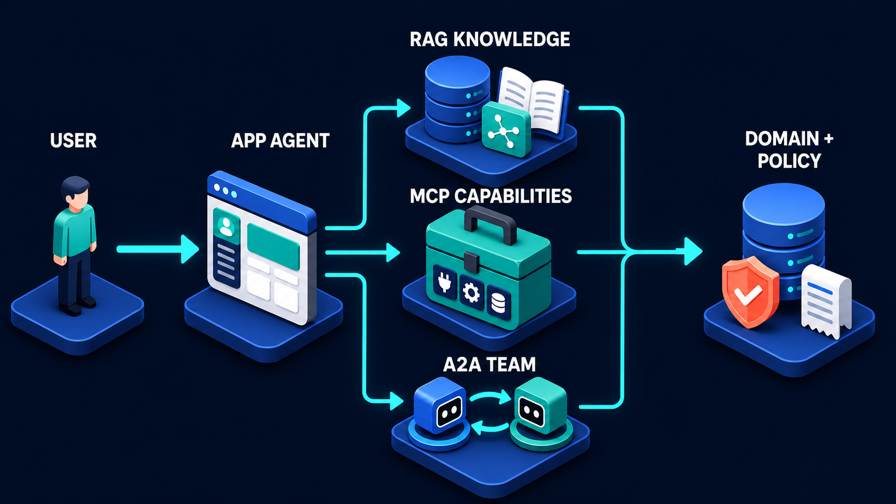
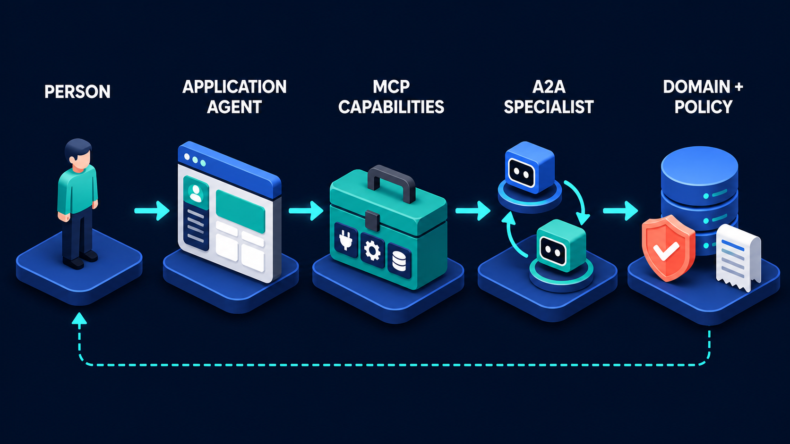

# Diagram 03 — Modern Agent System Map

**Module:** 1 — See the whole system
**Role in the course:** showing how all the acronyms fit together
**Layout:** fan-out into three parallel lanes, then fan-in to a single policy stage

---

## At a glance

Three lanes, one router, one gate. The agent branches into knowledge, capabilities, and other agents — and all three reconverge on a single policy platform before anything reaches the system of record.

This is the diagram to use the moment someone asks what the difference is between RAG, MCP and A2A, because the answer is in the geometry rather than the labels. They are siblings. They sit at the same distance from the agent, in identically sized panels, with identically weighted arrows. None of them is a stage in the others.

---

## What the diagram teaches

### 1. Three lanes answer three different questions

The lanes are not three implementations of the same idea. They exist because an agent that needs help needs one of three genuinely different things.

**RAG KNOWLEDGE answers "what is true?"** It reaches into a body of text that already exists — documents, policies, manuals, past tickets — and returns passages. The knowledge is static between ingestion runs. Nothing changes when you retrieve; you are reading a snapshot someone prepared earlier.

**MCP CAPABILITIES answers "what can I do?"** It reaches into live systems and either reads their current state or changes it. The results are fresh, the schema is contractual, and the call may have consequences. This is where the agent's hands are.

**A2A TEAM answers "who else can do this?"** It hands a bounded piece of work to another actor that has judgement of its own. You are not retrieving and not calling — you are delegating.

The failure mode this prevents is real and common: teams build a RAG index over data that changes hourly, then wonder why answers are stale. Live state belongs in the middle lane, not the top one. The reverse error also happens — wrapping a forty-thousand-page policy corpus in a tool call and blowing the context window, when it belonged in the top lane all along.

A useful test for any piece of information the agent needs: **does it change on a timescale shorter than your ingestion cycle?** If yes, it is a capability. If no, it can be knowledge.

### 2. The agent is the only thing that fans out

Trace the lines. Exactly one component touches all three lanes: the app agent. Everything downstream of it is specialised and narrow.

This is a statement about where complexity is allowed to live. The routing decision — knowledge, capability, or delegate — is made in one place. That gives you one place to instrument, one place to log the decision, one place to change the policy about what gets routed where, and one place where a bad routing decision can be caught.

Systems that let routing decisions spread — where the retrieval layer sometimes calls tools, where a tool sometimes delegates, where a specialist reaches back into your index — lose this property immediately. You can no longer answer "why did the system do that" from a single trace.

The corollary is that the agent carries the hardest engineering problem in the picture, and it is not a prompt. It is a routing function whose inputs are ambiguous natural language and whose outputs commit the system to a path.

### 3. Convergence on policy is the structural claim

All three lanes turn and merge into one arrow before reaching DOMAIN + POLICY. Not three arrows arriving in parallel — one merged arrow.

The claim is that **your security model is a property of your system, not of your integration style**. You do not get one set of rules for things you retrieved, another for things you called, and a third for things a specialist did on your behalf. Whatever reaches the system of record passes the same gate.

This is harder than it sounds, because the three lanes arrive with very different evidence attached. A retrieval result comes with source documents. A capability call comes with a structured response and a status code. A specialist artifact comes with whatever the specialist chose to include, produced by reasoning you cannot inspect. A single policy gate has to be able to evaluate all three.

In practice that pushes you toward a specific design: the gate evaluates the **proposed change**, not the provenance. It asks "is this modification permitted, given who is asking and what state the record is in" — a question that can be answered identically regardless of which lane produced the proposal. Gates that try to reason about provenance ("trust results from lane A but not lane C") become unmaintainable within a quarter.

### 4. What the diagram deliberately leaves out

Two absences are worth naming out loud, because learners notice them and draw the wrong conclusion.

**There is no return path.** Diagram 01 has a prominent dashed audit line; this one has none. That is a focus decision, not an architectural claim. This diagram is making a point about branch and merge structure, and adding four more lines would bury it. The audit obligation from diagram 01 still applies to every lane here.

**The lanes do not talk to each other.** In reality they compose constantly: retrieve a policy, then call a system to check the current state against it, then delegate the judgement call. The parallel drawing shows that the agent *chooses among* them, not that a single request uses exactly one. The end-to-end use cases later in the course show all three firing in sequence for one request.

### 5. It is a map, not a sequence — and that matters for staffing

Because the three lanes are independent, they can be built independently, by different people, on different timelines. That is not a minor implementation detail; it is usually what determines whether the project ships.

Each lane has a different centre of gravity. The knowledge lane is a data engineering problem — sources, cleaning, chunking, embedding, index maintenance. The capability lane is an API and platform problem — contracts, auth, rate limits, schemas. The specialist lane is an integration and trust problem — discovery, allowlisting, task design, artifact validation.

Teams that treat the whole thing as one undifferentiated "AI project" staff it with one squad and discover halfway through that they needed a data engineer, a platform engineer and a security reviewer at different times. The map tells you that in advance.

---

## Case study — Ravensbourne University, internal IT support

Ravensbourne is a university with about nineteen thousand students and four thousand staff. Their IT service desk handles roughly six hundred tickets a week: password resets, VPN problems, software licensing, printing, lab access, and a long tail of odd requests. Two thirds of the volume is repetitive; the remaining third is genuinely varied.

They built an assistant to sit in front of the service desk. It is a clean example of the three lanes because each one arrived with a different owner and a different set of problems.

### The routing decision

A student messages: *"I can't get into the statistics lab machines and my dissertation is due Friday."*

The assistant has to work out which lane, or lanes, this needs. In this case it needs all three, and the order matters.

### Lane 1 — RAG Knowledge

Ravensbourne's knowledge lane indexes material that changes on a scale of weeks: the IT policy handbook, several hundred how-to articles, lab access rules per department, software licensing terms, and three years of resolved tickets with their resolutions.

The assistant retrieves the lab access policy for the statistics department and finds that access is granted per-module, expires at the end of each term, and requires the student to be enrolled on a module that uses the lab.

This is exactly the right lane for this information. The policy changes once or twice a year. Indexing it is cheap, and retrieving it costs nothing but a search.

**What went wrong first.** The initial build also indexed the *account status* documentation, and the assistant started reasoning about whether accounts were active based on how account status was documented rather than what any given account's status actually was. Live state had leaked into the knowledge lane. It was caught when the assistant confidently told a student their account was fine because the documentation described a working account correctly.

### Lane 2 — MCP Capabilities

The platform team exposed a capability server covering the live systems:

- `get_enrolment(student_id)` — current module enrolments from the student record system.
- `get_lab_access(student_id, lab_id)` — current access grants and expiry.
- `get_account_status(student_id)` — whether the account is active, locked, or expired.
- `get_ticket_history(student_id)` — prior tickets.
- `grant_lab_access(student_id, lab_id, until)` — the only write in the set.

The assistant calls the first three and establishes the facts: the student is enrolled on STAT-340, which does use the lab; their account is active; their lab access expired eleven days ago at the end of the previous term, and nobody renewed it because the renewal job only runs for students flagged as continuing.

Note the shape of this. The knowledge lane told the assistant **what the rule is**. The capability lane told it **what is actually the case**. Neither could have done the other's job.

### Lane 3 — A2A Team

Granting lab access is a write, and it touches a system owned by a different department. Ravensbourne's identity and access team runs its own agent that adjudicates access requests against their rules — separation of duties, exam-period freezes, and a set of restrictions around labs holding licensed software.

The assistant creates a task: *assess whether student S-88421 should be granted access to lab STAT-L2 until end of term, given enrolment on STAT-340, prior access that expired on the 11th, and no disciplinary flags.* Evidence attached.

The access agent returns an artifact: **approved, grant until 21 June, note that the renewal job's continuing-student filter appears to have a gap and should be reviewed.**

That last part is the kind of thing a specialist produces and a tool call never would. The access team's agent knows about the renewal job because it lives in their domain; the IT assistant does not and should not.

### Convergence — Domain + Policy

Now the write. `grant_lab_access` is called, and it hits the university's policy gate, which checks the things that are true regardless of which lane proposed the change: is the caller permitted to grant lab access, is the target account in a state that can receive grants, is the requested expiry within the permitted maximum, and is there an active freeze on this lab.

All four pass. Access is granted, a receipt is written linking the grant to the adjudication task and the evidence, and the student is told.

### Why the three-lane split earned its keep

Eight months in, three separate things happened that the architecture absorbed cleanly.

**The lab access rules changed.** A department restructure changed which modules mapped to which labs. This was a change to *knowledge* — new policy documents, re-indexed. No code changed in any other lane.

**The student record system was replaced.** A multi-year migration swapped the underlying system. This was a change to *capabilities* — the same five tool contracts, new implementations behind them. The assistant did not change at all, because it had never known what was behind the toolbox.

**The access team tightened their rules during exam period.** A change entirely inside the *specialist*. The IT assistant kept sending the same tasks and started getting more refusals back, with reasons attached. Nobody on the IT side had to be told the rules had changed.

Three changes, three lanes, three teams, zero cross-lane rework. That is the return on drawing the picture this way rather than as a single chain.

### The one thing that stayed hard

Routing. The assistant still occasionally reaches for the wrong lane — most often trying to retrieve something that is live state, because the knowledge index is fast and always answers. Ravensbourne's mitigation was blunt and effective: they removed anything describing per-account state from the index entirely, so the wrong lane has nothing to offer. When the only place to learn whether an account is locked is the capability that reads it, the routing decision makes itself.

---

## Composition

The frame reads left to right in three movements.

**Left:** **USER**, a standing figure on a blue platform, with a solid cyan arrow into **APP AGENT**, a 3D application window with a blue title bar, avatar sidebar, and teal and white content blocks.

**Middle:** cyan lines split from the agent into three orthogonal routes — one rising, one straight, one descending — each ending in an arrowhead at a stacked platform: **RAG KNOWLEDGE** (top), **MCP CAPABILITIES** (middle), **A2A TEAM** (bottom).

**Right:** cyan lines leave all three lanes, turn, and merge into a single arrow entering **DOMAIN + POLICY**.

The routing uses clean right-angle turns rather than curves, making the split-and-rejoin structure unmistakable at a glance.

## Element by element

**USER**
A neutral standing figure — no desk, no device. Origin of intent only.

**APP AGENT**
A 3D application window, the only component in the picture that touches all three lanes.

**RAG KNOWLEDGE**
A stacked blue database, a white open book with text on both pages, and a green tile showing a connected node graph. Book for documents, database for storage, node graph for embedded relationships.

**MCP CAPABILITIES**
The green toolbox with plug, gear and database tiles.

**A2A TEAM**
A blue cube robot and a teal cube robot on adjacent glowing discs, with two curved cyan arrows running between them in opposite directions.

**DOMAIN + POLICY**
A blue stacked database, a coral shield with a white check, and a white receipt, sharing one platform at the convergence point.

## Colour and flow semantics

- All routing is **cyan** — this diagram is entirely about forward work, which keeps attention on the branch and merge structure.
- **Coral** appears only on the policy shield.
- The three lanes are given identical platform size, label treatment and arrow weight. None is presented as the default or the advanced option.

## How to present it

**Show diagram 01 first and ask what changed.** Put the two side by side. The answer — the middle stages went from a chain to a fan — needs to be said out loud, because learners who see only the linear version come away believing there is a required call order.

**Run the sorting exercise.** This is the highest-value use of the diagram. Ask the room to name ten pieces of information their own system needs, then sort each into a lane. Use the timescale test: does it change faster than your ingestion cycle? Arguments will break out over two or three of the ten, and those arguments are the lesson. The ones that are genuinely contested are usually things that should be capabilities and are currently indexed.

**Cover the policy platform and ask what is missing.** Three independent lanes reaching the system of record with no shared gate is a recognisable and bad architecture. Most rooms will have seen it.

**Push on the merge.** Ask how a single gate can evaluate evidence from all three lanes when the evidence is so different. Steer toward the answer: it evaluates the proposed change, not the provenance. This is a genuinely useful design constraint and it is not obvious.

**Use the staffing angle if you have architects in the room.** Ask who would build each lane. The three different answers — data engineer, platform engineer, security reviewer — reframe the diagram as a project plan, which lands differently with people who own delivery.

**Anticipate the objection.** "Real requests use more than one lane." Correct, and the case study above uses all three for a single ticket. The diagram shows what the agent *chooses among*, not what a request consumes. The end-to-end use cases later in the course show all three firing in one request.

**Timing.** Ten minutes as a comparison against diagram 01. Thirty-five if you run the sorting exercise, which is the better use.

---

## Lab and checkpoint

**Lab:** List ten information sources or actions your own system uses. Sort each into one of the three lanes — RAG knowledge, MCP capabilities, or A2A specialists — using the timescale test: does it change faster than your ingestion cycle? For any item that the room cannot agree on, write the rule that would decide its lane and the policy check that would apply when it reaches the domain layer.

**Checkpoint:** Why does the diagram show a fan-out to three lanes instead of a single chain?

**Answer:** Because a modern agent does not always choose the same kind of source or helper for every question. It selects among RAG knowledge, MCP capabilities, and A2A specialists, each with different timescales and contracts, and then converges on a single policy gate before any change lands.

## Glossary

- **A2A specialist** — an autonomous agent that accepts a task, works on it, and returns an artifact.
- **Convergence** — the point where all three lanes meet the domain and policy layer before any state change.
- **Domain + Policy** — the final boundary where evidence from all lanes is evaluated against rules before a change is allowed.
- **Fan-out** — the agent choosing among multiple lanes rather than following a single path.
- **MCP capability** — a tool that performs a structured, quick, and often synchronous action.
- **RAG knowledge** — retrieved, indexed information used to answer questions without changing state.
- **Timescale test** — the rule that decides whether something belongs in RAG: if it changes faster than the ingestion cycle, it is not stable enough to be knowledge.

## Sources

- MCP 2026-07-28 protocol and capability model
- A2A task and specialist agent documentation
- Retrieval-Augmented-Generation (RAG) and knowledge-base design patterns
