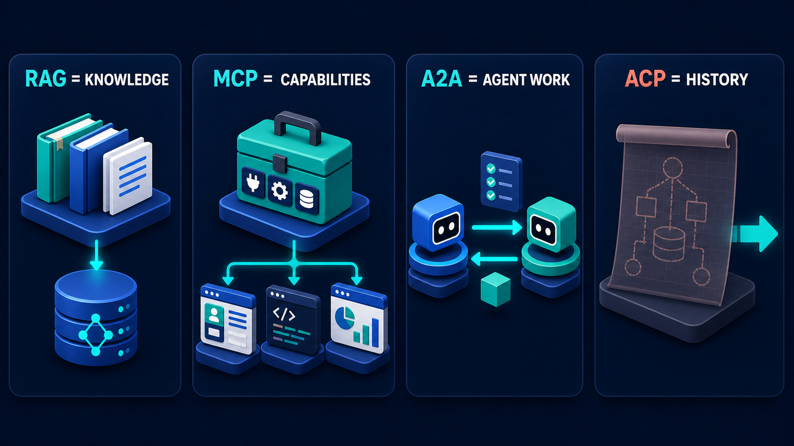

# Diagram 04 — Choose the Boundary

**Module:** 1 — See the whole system
**Role in the course:** protocol-selection decision tree
**Layout:** one question at top, four branches, one mandatory floor underneath

---

## At a glance

One question, four answers, one floor. **WHAT OWNS THE WORK?** branches into the four places a piece of work can live, and every branch is then routed back down into a policy check that no branch can avoid.

This is the most directly actionable image in the library. An architect can hold it up in a design review and point at a box, and the conversation becomes concrete immediately. It is also the diagram most likely to be misused, because the four options look like a menu of technologies when the question at the top is deliberately not about technology at all.

---

## What the diagram teaches

### 1. The question is about ownership, and the wording is doing work

The signpost does not ask "which protocol should I use." It does not ask "where does the data live." It asks **who owns the work**.

Ownership means three things bundled together: who holds the logic, who handles it when it fails, and who is accountable for the outcome. Those three travel together, and the moment they separate you have a design problem regardless of which technology you picked.

This reframing kills a whole class of bad decisions. Teams that start from "we should expose this over MCP" are choosing a transport before they have decided who is responsible. Teams that start from "let's have an agent do it" are choosing an actor before deciding what the work even is. The signpost forces the prior question, and once it is answered the technology usually follows without argument.

A practical way to ask it: **when this breaks at 3am, whose pager goes off, and do they have the ability to fix it?** If the answer is "ours, and yes" — it is a local function. If the answer is "theirs" — you are delegating, and you need the delegation machinery. If the answer is "ours, but we cannot fix it because the logic is in a model's head" — you have found a problem.

### 2. Local function is listed first, and that is an argument

The leftmost panel is a plain application window with a gear. No robots, no glow, no protocol. It is the most boring object in the diagram and it occupies the position your eye reaches first.

That placement is editorial. A large share of what gets built as a tool call, a retrieval, or a delegated agent is a function that somebody wrote in an afternoon and then wrapped in three hundred lines of protocol because agents were on the roadmap.

The test for this branch is simple: **is the work deterministic, bounded, and yours?** Calculating a proration. Validating an address format. Applying a discount table. Deciding whether a date falls inside a fiscal quarter. None of these need a model, a retrieval, or another agent. Putting them behind a protocol boundary buys you latency, failure modes, and a schema to maintain, in exchange for nothing.

The corollary is uncomfortable for people whose mandate is to build agent systems: the correct answer to a great many questions on this diagram is "none of the three interesting boxes."

### 3. The four branches are exclusive per unit of work

A system uses all four. A given piece of work uses one.

This distinction is where most confusion about the diagram comes from. Someone objects that their feature does retrieval *and* calls a tool *and* delegates — and they are right, but that feature is not one unit of work. It is three, chained. Each link in that chain has exactly one owner.

Getting this right in practice means decomposing until each piece has a single answer. "Investigate the late shipment and recommend a credit" has no single owner. Break it down: *fetch the carrier events* (MCP — the carrier owns that data, we call for it), *find the applicable SLA clause* (RAG — it is in our contract corpus, static), *compute the dwell time against the standard* (local function — deterministic arithmetic on data we now hold), *adjudicate the credit* (A2A — finance owns the rules).

Four units, four owners, four different boxes on this diagram. The decomposition is the design work; the protocol choices fall out of it.

### 4. The folder in the A2A panel is the tell

Look at what distinguishes the fourth panel from the third. The MCP panel shows a toolbox — instruments, sitting there, waiting to be picked up. The A2A panel shows two robots with a **yellow-orange folder passing between them**.

That folder is the only place in the diagram where a discrete unit of work is drawn as a physical object changing hands. It is the visual definition of delegation: the work itself moves, along with responsibility for doing it.

When you call a tool, nothing changes hands. You keep the work; the tool performs a step of it and returns. When you delegate, you hand over the folder and wait. The specialist decides how to do it, may take time, may come back with something you did not anticipate, and may refuse.

If you are choosing between the third and fourth boxes, ask what is in the envelope. If you can specify exactly what you want done, in arguments, and you know what will come back — you are calling. If the best you can do is describe an outcome and attach evidence — you are delegating.

### 5. Policy is not a fifth branch

The four options route *down and inward* into the coral shield. The direction reversal matters: they fan out from the question and then converge on the gate. The gate is the floor of the diagram, not another choice on it.

The banner spells out **DOMAIN + POLICY ALWAYS** rather than leaving it implied, and the word "always" is the load-bearing one. There is no branch on this diagram whose selection exempts you.

This is worth dwelling on because each branch tempts you differently:

- **Local function** tempts you because it is your own code, so surely you can trust it. But your own code is exactly where an agent-supplied argument does damage.
- **RAG** tempts you because retrieval is read-only, so what could go wrong. Retrieved content becomes context, and context steers actions. A poisoned document is an attack path.
- **MCP** tempts you because the capability server already has auth. That authenticates the *caller*, not the *intent*.
- **A2A** tempts you because the specialist has its own policy. It does — theirs, not yours, and it applies to their domain, not your system of record.

Four different rationalisations, one answer.

---

## Case study — Harborline Insurance, claims triage rebuild

Harborline handles about twelve hundred motor claims a week. Their claims triage process was a mixture of manual work and an ageing rules engine, and they set out to rebuild it with an agent in the middle. Six months in, the project was struggling — not because anything was broken, but because it was slow, expensive to run, and nobody could explain its behaviour.

An architecture review put this diagram on the wall and re-sorted every piece of work in the system. Here is what they found.

### The eight units of work

Triaging a claim turned out to be eight distinct things:

1. Validate the claim submission is complete and well-formed.
2. Determine the policy in force on the date of loss.
3. Calculate the excess and any applicable no-claims adjustment.
4. Find the policy wording clauses relevant to the loss type.
5. Retrieve the vehicle's repair history.
6. Check for fraud indicators against the industry database.
7. Assess whether the claim is likely to exceed the write-off threshold.
8. Assign a triage category and route the claim.

The original build had made almost all of these into either a model call or a tool call, largely by default.

### What the re-sort changed

**Items 1 and 3 moved to LOCAL FUNCTION.** Validating a submission is a schema check. Calculating excess and no-claims adjustment is arithmetic against a table. Both had been implemented as prompts against a model, because they were "part of what the agent does." Both were occasionally wrong in ways that were hard to detect, and both cost a model call each.

Moving them to code removed two model calls per claim, made the results deterministic and unit-testable, and eliminated an entire class of bug where the model got the arithmetic subtly wrong on edge cases like mid-term policy adjustments. This alone accounted for most of the latency improvement.

**Item 2 moved to MCP.** Policy-in-force on a date is live state held in the policy administration system. It had been implemented as retrieval over a nightly export, which meant claims submitted for a loss date after a mid-term change got the wrong policy about once a fortnight. Live state belongs behind a capability, not in an index.

**Item 4 stayed as RAG, correctly.** Policy wordings are documents. They change when products change, which is a few times a year. There are several thousand pages across the product range. This is the textbook case for the retrieval lane and it had been right all along.

**Item 5 moved to MCP.** Repair history lives in a third-party vehicle data service. Called, not indexed.

**Item 6 stayed as MCP.** The industry fraud database is an external system with a query API. Correct as built.

**Item 7 moved to A2A.** This was the significant one. Assessing write-off likelihood requires judgement about repair costs, vehicle valuation, and salvage — and Harborline's engineering team owns that expertise, with their own models and their own rules that change as parts prices move. It had been implemented as a prompt inside the triage agent, with a copy of the engineering team's thresholds pasted into it.

That copy was four months stale. Nobody had noticed because the numbers looked plausible. Moving it to a task delegated to the engineering team's own agent meant the thresholds lived in one place, owned by the people who maintain them, and the triage agent received a determination and a reasoning trace instead of guessing.

**Item 8 stayed with the agent.** Deciding the triage category, given everything above, is genuinely the agent's job — it is the synthesis step, ambiguous by nature, and it is what the agent is for.

### The floor

All eight units feed a routing decision that assigns the claim and, for some categories, reserves funds against it. Reserving funds is a write.

Before the review, that write happened wherever the flow happened to end up, with authorization inherited from whichever service made the call. After, it goes through one gate that checks the reserve amount against the triager's authority, the claim's category, and whether the policy is in a state that permits reserving. Same gate regardless of whether the path went through the function, the index, the capability or the specialist.

### The numbers

Per-claim model calls went from eleven to four. Median triage latency went from thirty-one seconds to nine. The monthly inference bill dropped by roughly sixty percent. And — the finding that mattered most to the review board — the four remaining model calls are all at points where judgement is genuinely required, so when the system does something surprising there are only four places to look.

### The finding they did not expect

The review's most useful output was not the re-sort. It was the discovery that **nobody had previously written down who owned item 7**. The threshold numbers had been copied from a spreadsheet by a contractor who had since left. The engineering team did not know the triage system was using their thresholds. There was no process for updating them.

The diagram surfaced this because its question — who owns this work — has no valid answer of "nobody, it was copied once." Asking it eight times found the one place where the honest answer was embarrassing.

---

## Composition

Three tiers, top to bottom.

**Top:** a large arrow-shaped signpost, blue with a glowing cyan outline, mounted on a vertical post on a blue base, reading **WHAT OWNS THE WORK?** in white uppercase across two lines. The road-sign shape is what makes it read as a decision point rather than a title.

**Middle:** four cyan arrows drop from the signpost's base into four equally sized dark panels headed **LOCAL FUNCTION · RAG · MCP · A2A**.

**Bottom:** from beneath each panel, a cyan line descends, turns inward, and converges with an arrowhead on a large coral shield with a white check on a blue pedestal. Below it, a rounded banner reads **DOMAIN + POLICY ALWAYS** in teal capitals. The inbound arrows arrive from both sides, making the shield visibly the floor rather than a fifth option.

## Element by element

**The signpost — WHAT OWNS THE WORK?**
Phrased as ownership rather than technology. Ownership bundles the logic, the failure handling, and the accountability.

**LOCAL FUNCTION**
A white and teal application window with a large gear overlapping its lower-right corner. Plain and unglamorous, listed first.

**RAG**
A dark bookshelf holding upright volumes and a document, beside a blue database stack and a cluster of green cubes — source material, storage, and the chunked form of it.

**MCP**
The green toolbox with plug, gear and database tiles.

**A2A**
A blue robot and a teal robot with a yellow-orange folder held between them, and a small cyan arrow underneath showing direction of transfer.

**The coral shield and banner**
The largest single object in the frame, fed by all four branches, with **ALWAYS** spelled out.

## Colour and flow semantics

- **Cyan** flows downward from the question into the options, then inward from the options into the shield. The reversal of direction is what makes the shield read as convergence rather than continuation.
- **Coral** is used once, at maximum size, for the thing that cannot be branched around.
- The four options have identical panel size and heading weight — the diagram declines to recommend one.

## How to present it

**Do not walk the four boxes.** This is the single most common way to waste the diagram. Explaining what RAG, MCP and A2A are, in front of a picture whose entire content is a question, converts a decision tool into a glossary.

**Bring their own backlog instead.** Ask for four to six real features from the room's current work, written on the board before you show the diagram. Then reveal it and place each feature under a branch, out loud, with the room arguing. The disagreements are the lesson. Two features will place instantly, one will split the room, and that contested one is where the actual learning happens.

**Force the decomposition when a feature will not place.** If a feature seems to belong in two boxes, it is more than one unit of work. Break it down live. The Harborline decomposition — eight units from what looked like one process — is the shape this usually takes, and doing it in front of people is far more convincing than describing it.

**Ask the 3am question.** For each placement: when this breaks at 3am, whose pager goes off, and can they fix it? This exposes the placements that are wrong. Anything where the honest answer is "ours, but the logic is in a model" or "nobody, we copied it once" needs to move.

**Then challenge the interesting boxes.** Go back through the placements and ask, for each one that landed in RAG, MCP or A2A: could this be a local function? Roughly a third of the time the answer is yes and the room has just talked itself out of a protocol boundary. That is the highest-value outcome the diagram produces.

**Cover the shield and ask what breaks.** Four independent paths to the system of record with no shared gate. Then uncover it and walk the four rationalisations — my own code so I trust it, read-only so it is safe, already authenticated, they have their own policy — and let the room recognise which one they have used.

**Follow it with the system map** if the room needs the runtime picture rather than the design-time one:

Diagram 04 is the decision you make once, at design time. Diagram 03 is what the system looks like afterwards. They are the same four ideas viewed from either side of the build.

**Timing.** This does not work as a ten-minute slide. Budget forty-five minutes and run it as a working session with real features on the board. If you only have ten minutes, show diagram 06 instead — it is the compressed version.

---

## Lab and checkpoint

**Lab:** Take five real features from a system you know — a lookup, a tool, a handoff to another service, a long-running task, a read-only query. Place each on the boundary map: local function, RAG, MCP, or A2A. For each placement, answer the 3am pager question: when it breaks, whose pager goes off and can they fix it? For any placement the room cannot agree on, write the rule that would decide it.

**Checkpoint:** When should something stay a local function instead of becoming an MCP capability?

**Answer:** When it lives in your codebase, changes with your code, and does not need a published contract or a cross-process boundary. The 3am test helps: if it breaks, can the on-call engineer fix it in your own code? If yes, it is likely a local function.

## Glossary

- **A2A specialist** — an autonomous agent that works on a task and returns an artifact.
- **Boundary choice** — the design-time decision about which lane a feature belongs in.
- **Local function** — code that lives inside the agent's own process and does not cross a protocol boundary.
- **MCP capability** — a published tool that the agent discovers and calls through a structured contract.
- **Policy shield** — the shared domain + policy gate that all lanes must pass before changing state.
- **RAG knowledge** — information that is stable enough to index and retrieve as an answer.
- **Three-am test** — the question of who gets paged and whether they can fix a boundary decision when it fails.

## Sources

- MCP 2026-07-28 primitives and capability model
- A2A task and specialist agent design patterns
- Retrieval-Augmented Generation and knowledge-base boundary guidance
