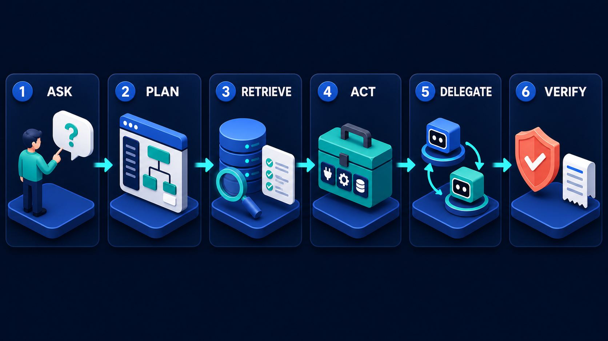

# Diagram 05 — Request Journey

**Module:** 1 — See the whole system
**Role in the course:** end-to-end request review
**Layout:** six numbered panels in a single row

---

## At a glance

The same architecture as diagram 01, re-told as six verbs. Where the architecture diagram names *components*, this one names *actions* — and in doing so it adds two stages that the component view has no box for: planning at the front, and verification at the end.

Those two additions are the reason this diagram exists. Every component in an agent system has an owner, a dashboard, and someone who gets paged when it breaks. Planning and verification have none of those things, and they are where most real failures live.

---

## What the diagram teaches

### 1. Two of the six stages have no component

Map the six panels onto the five platforms of diagram 01 and four of them land cleanly. **RETRIEVE** is the knowledge lane. **ACT** is the capability toolbox. **DELEGATE** is the specialist pair. **VERIFY** is the policy shield and receipt. **ASK** is the person.

**PLAN** has nowhere to go.

That is not an oversight in either diagram; it is the finding. Planning happens inside the agent, produces no artifact by default, is invisible in most traces, and has no team that owns it. When an agent does something inexplicable, the explanation is usually that stage 2 went wrong — it decomposed the request incorrectly, or it decided a step was unnecessary, or it invented a step that made no sense.

The practical consequence: **make the plan an artifact**. Have the agent emit its decomposition before executing it. Log it. Show it to the user when the request is expensive or consequential. A plan you can read is a plan you can debug; a plan that exists only as an intermediate activation is a plan you can only infer from its wreckage.

### 2. Retrieve comes before act, and the ordering is a commitment

Stage 3 is RETRIEVE. Stage 4 is ACT. That ordering encodes evidence-first behaviour: establish what is true, then change something.

The reverse ordering is a recognisable failure. An agent that acts first and retrieves afterwards is an agent that has decided what to do before checking whether it should. In practice this looks like: calling a tool to fetch a record, deciding from the record's shape what the user must have wanted, and then retrieving policy documents to justify the decision already taken. The retrieval becomes rationalisation.

The ordering also has a cost, and it is worth naming. Retrieving before acting is slower and sometimes wasteful — you fetch evidence for a decision that turns out to be trivial. That cost is real and it is the price of the property. Teams under latency pressure tend to erode this ordering first, and it erodes quietly.

### 3. Delegate sits after act, not instead of it

Stage 5 comes after stage 4. The implication is that you exhaust your own capabilities before handing work outside your boundary.

This is a defensible default for three reasons. Delegation is slower — a task has a lifecycle, a specialist takes time, and you are waiting on someone else's queue. Delegation is less inspectable — you cannot see how the specialist reasoned. And delegation widens your trust surface — you are now depending on another party's availability, correctness and security posture.

None of that means delegation is bad. It means it should be the answer to "this work is genuinely not mine," not the answer to "this is hard." An agent that delegates because a task is difficult, when the task is squarely inside its own domain, has outsourced a problem rather than solved it.

The check: could you have done this with the capabilities you already have? If yes, and you delegated anyway, you bought latency and opacity for nothing.

### 4. Verify is a stage, not a feeling

The sixth panel contains a coral shield and a printed receipt — the same two objects that made up the policy platform in diagram 01, minus the database.

The omission of the database is deliberate. At this stage the question is not where the data lives; it is whether the outcome was checked and whether it was recorded. Two separate obligations sharing one panel:

- **Checked** — did the thing that happened match the thing that was supposed to happen? This is not the same as "did the call return 200." A tool can succeed and still have done the wrong thing, because the agent passed it the wrong arguments.
- **Recorded** — is there something durable that a person can read later to establish what occurred?

Systems routinely do neither and report success. The request completed, the agent said it was done, and nobody compared the outcome against the intent.

### 5. The six stages are drawn straight and are not

There are no loops in this picture. Real requests iterate constantly: plan, retrieve, discover the plan was wrong, re-plan, retrieve again, act, find the action failed, retrieve more, delegate.

The straight line is a teaching device — six ideas introduced in order. Where it becomes actively misleading is in capacity planning and in error handling. An agent that budgets for one retrieval per request will thrash. An agent whose error handling assumes forward-only motion will get stuck at stage 4 with no path back to stage 2.

The cyclical view arrives later in the course, most explicitly in the evaluation loop, which takes the measurement stages and closes them into a circle that never terminates:

Teach the line, then say plainly that it is a line for legibility and a loop in production.

### 6. It is a post-mortem template, not an introduction

The highest-value use of this diagram is after something has gone wrong. Six numbered stages give you six places to look, and most incidents localise cleanly to one:

| Stage | What failure looks like |
| --- | --- |
| **1 ASK** | The request was ambiguous and nobody noticed; the agent resolved the ambiguity silently and wrongly. |
| **2 PLAN** | Decomposition was wrong — a step missing, a step invented, or the wrong order. |
| **3 RETRIEVE** | The evidence was absent, stale, or the wrong evidence retrieved confidently. |
| **4 ACT** | The right tool called with the wrong arguments, or the wrong tool called. |
| **5 DELEGATE** | The task was under-specified, the artifact came back unusable, or the specialist was trusted without validation. |
| **6 VERIFY** | Everything above worked and nobody checked; or it did not work and nobody noticed. |

Asking "which number?" in an incident review is faster than asking "what happened," because it forces a specific claim that can then be checked against the trace.

---

## Case study — Tessellate, the report that was confidently wrong

Tessellate sells a B2B analytics product to retail chains. Their assistant answers questions about store performance and can generate scheduled reports. It is used by about four hundred regional managers.

In March, a regional manager asked the assistant to produce a quarterly performance summary for their region and circulate it to their district leads. The report went out to eleven people. It was wrong in a way that took nine days to discover: it reported like-for-like sales growth of 4.1% for a region that had actually declined by 0.8%.

The incident review used the six stages.

### Stage 1 — ASK

The request was: *"Put together the Q1 performance summary for the North region and send it to my district leads."*

Ambiguity present and unflagged: **which Q1?** Tessellate's customers use two different fiscal calendars, and this chain's fiscal Q1 ends in April, not March. The manager meant fiscal Q1, partially complete. The assistant assumed calendar Q1.

The review's finding was not that the assistant guessed wrong — a guess was required. It was that the guess was **silent**. Nothing in the output said "calendar Q1, 1 Jan – 31 Mar." Had it, the manager would have caught it in seconds.

**Fix:** resolved ambiguities are surfaced in the output, not buried. Any date range, entity resolution or scope decision the agent made on the user's behalf appears in the header of what it produces.

### Stage 2 — PLAN

The assistant's plan was: fetch sales by store for the period, fetch prior-year comparatives, compute like-for-like, generate the summary, send it.

The missing step: **exclude stores that were not trading in both periods.** Like-for-like sales are only meaningful across stores open in both comparison windows. The North region had opened four stores and closed one during the year. Including all of them inflated the growth figure by about five points.

This is a plan defect, not a data defect. Every number the assistant fetched was correct. The decomposition simply lacked a step that the domain requires.

The review found something worse: **the plan was not logged**. There was no record of what the assistant had decided to do, only of the tool calls it made. Reconstructing the plan took two days of reading traces backwards.

**Fix:** the plan is emitted as a structured artifact before execution and stored with the output. For report generation it is also shown to the user, collapsed, with an expand option.

### Stage 3 — RETRIEVE

Retrieval worked correctly. The assistant pulled the like-for-like methodology document from the knowledge index and it stated the store-eligibility rule clearly.

The document was retrieved and then not acted on. The rule was in context and the plan did not include a step to apply it.

This is the failure mode that makes stage 2 and stage 3 worth separating. Evidence being present is not the same as evidence being used. A retrieval-quality metric would have scored this request as a success.

### Stage 4 — ACT

All tool calls were correct: right tools, right arguments, right results. Nothing to find here.

Worth noting because it is the stage teams instrument most heavily. Tessellate had good tool-call observability and it showed a clean run.

### Stage 5 — DELEGATE

Not used. Report generation is entirely within the assistant's own capabilities.

The review asked whether it should have been. Tessellate has a separate analytics validation service that checks derived metrics against a rules library, including the like-for-like eligibility rule. It existed, and the assistant did not use it, because report generation had never been routed through it.

**Fix:** derived financial metrics in circulated outputs are now delegated to the validation service before the report is finalised. It returns an artifact listing each metric, whether it validated, and against which rule.

### Stage 6 — VERIFY

The report was generated and sent in a single step with no verification gate.

Two things were missing. Nothing compared the output against the intent — no check that the period in the report matched a period the user would recognise. And **nothing gated the send**. Eleven people received it before any human had looked at it.

**Fix:** circulation to more than one recipient now requires confirmation, with the report rendered for review and the resolved assumptions shown at the top. The manager sees "Calendar Q1 (1 Jan – 31 Mar)" and either accepts it or corrects it.

### What the six-stage frame produced

The review's conclusion was that this was a **stage 2 failure with a stage 6 amplifier**. The plan was missing a domain step; the absence of verification turned a wrong number into eleven wrong emails.

That framing mattered for what got fixed. The team's first instinct had been to blame retrieval and propose a better index — which would have changed nothing, because the document had been retrieved successfully. The stage-by-stage walk showed that retrieval was fine and moved the work to plan logging and the verification gate, both of which were cheaper and both of which addressed the actual defect.

Nine days to discover became, in the new design, a confirmation screen the manager would have failed in about four seconds.

---

## Composition

Six tall dark rounded panels sit in an even row, each headed by a blue circle containing its number and a white uppercase label:

**1 ASK · 2 PLAN · 3 RETRIEVE · 4 ACT · 5 DELEGATE · 6 VERIFY**

Small solid cyan arrows sit between consecutive panels at mid-height. The panels are noticeably taller than their contents, leaving generous space below each object — an airy composition that suits a slide meant to be walked slowly.

## Element by element

**1 ASK**
A standing person beside a large white speech bubble containing a teal question mark. The request enters as a question, not a command.

**2 PLAN**
An application window showing a small node-and-connector tree — one parent block with lines down to two teal child blocks and a white one. The only panel depicting the agent thinking rather than doing.

**3 RETRIEVE**
A blue database stack, a teal magnifying glass angled across it, and a white checklist showing three rows each marked with a green check. Retrieval returns several checked items, not one answer.

**4 ACT**
The green MCP toolbox with plug, gear and database tiles.

**5 DELEGATE**
The two-robot pair — blue above, teal below — with curved cyan arrows circulating between them.

**6 VERIFY**
A coral shield with a white check beside a white printed receipt with blue text lines.

## Colour and flow semantics

- Uniform **cyan** arrows throughout. No return path, no rejection, no branch — this is a clean happy-path narrative by design.
- **Coral** appears only in the final panel, on the verification shield.
- Every icon is reused verbatim from diagram 01, so the two read as the same system described twice.

## How to present it

**Do not open the course with this.** It looks like an introduction and works badly as one, because six abstract verbs in a row are forgettable. It works when the room already has a system in mind.

**Open with an incident instead.** Ask the room for something their system got wrong recently — ideally something embarrassing. Then put the diagram up and ask which number it failed at. The room will argue, and the argument is the teaching. Most incidents that people describe as "the AI hallucinated" turn out to be stage 2 or stage 6.

**Show it against diagram 01 and hunt the orphans.** Ask the room to match each verb to a component:

Four map cleanly. **PLAN** and **VERIFY** do not, and that gap is the centrepiece of the session. Ask who owns planning in their organisation. The silence is the point.

**Run the instrumentation audit.** For each of the six stages, ask: if this stage failed right now, how would you know? Most teams have excellent coverage of stage 4, partial coverage of 3 and 5, and nothing at all for 2 and 6. Writing that table on the board next to the diagram gives people a concrete backlog to take away.

**Ask about the ordering, twice.** First: why is retrieve before act? Then: why is delegate after act? The second question is the better one, because the answer — you exhaust your own capabilities first — is a default many teams have never articulated and several have unknowingly inverted.

**Close by breaking the line.** State plainly that this is a loop in production, and that the straight rendering is for legibility. Ask where the loops actually are. The two answers — back from 3 to 2 when the evidence changes the plan, and back from 6 to 2 when verification fails — are the two most important control flows in the system and neither is drawn.

**Timing.** Thirty minutes as an incident-review frame, which is its best use. Fifteen if you are only using it to surface the PLAN and VERIFY orphans.

---

## Lab and checkpoint

**Lab:** Pick a recent incident or a completed user request from your own system. Walk it through the six stages — ask, plan, retrieve, act, delegate, verify — and identify which stage was missing, skipped, or under-resourced. For the missing stage, write the one question or artifact that would have made it visible before the failure.

**Checkpoint:** Why are PLAN and VERIFY drawn as empty stages?

**Answer:** Because they are not components; they are commitments to do thinking and verification as named stages, not as afterthoughts. The empty space forces the viewer to ask what planning and verification look like for their own system.

## Glossary

- **Act** — the stage where the agent invokes a capability or tool.
- **Ask** — the original user request, usually ambiguous and under-specified.
- **Delegate** — the stage where work is handed to another agent or specialist.
- **Orphan stage** — a planning or verification step that is not treated as a first-class stage.
- **Plan** — the stage where the agent decides what it needs before acting.
- **Post-mortem template** — a structure for reviewing what happened in an incident.
- **Retrieve** — the stage where the agent gathers evidence from knowledge or tools.
- **Verify** — the stage where the agent checks that the result satisfies the original ask.

## Sources

- Request lifecycle and incident-review frameworks
- Agent planning and verification design patterns
- A2A task delegation and MCP capability invocation models
