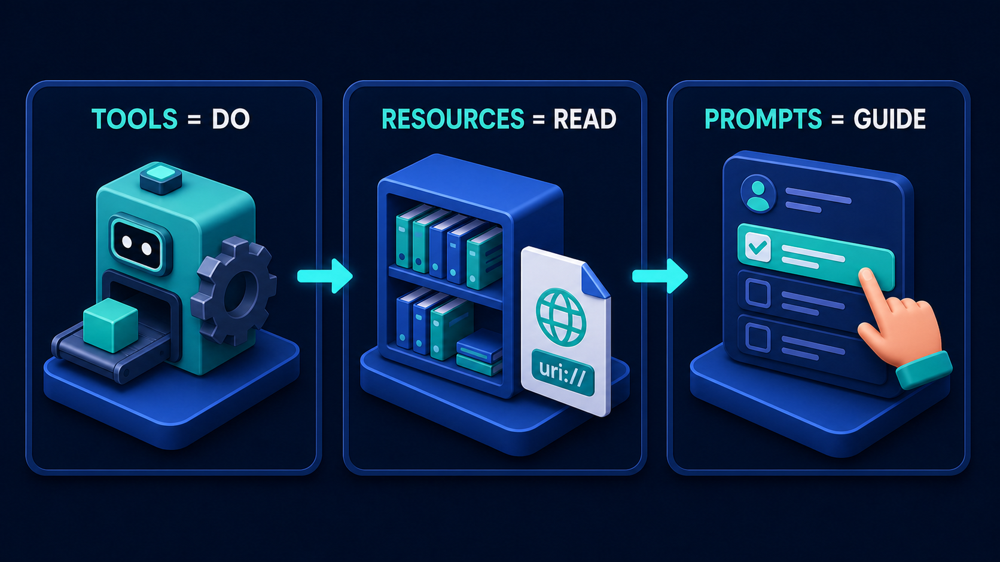
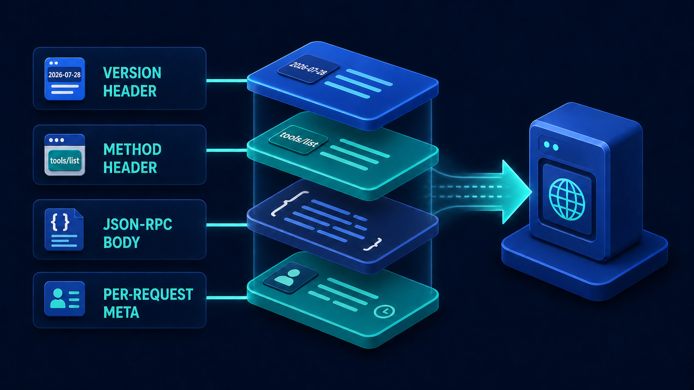

# Diagram 07 — MCP Capability Discovery

**Module:** 2 — MCP capabilities
**Role in the course:** capability discovery lesson
**Layout:** four numbered stages left to right, with a return route carrying the catalogue back

---

## At a glance

Four stages: a client, a server that announces what it has, a catalogue of capabilities, and a call. Underneath, a bright cyan line carries the catalogue itself back from the far end to the client.

The single idea is that **you ask what exists before you call anything**. That sounds trivial until you notice how many systems skip it — hard-coding a list of tools they believe the server has, and discovering at runtime that the belief was out of date.

---

## What the diagram teaches

### 1. Discovery is a step, and it produces an object

The catalogue is drawn twice. Once as stage 3, a large window listing four capabilities. And again on the return path, as a floating card carrying the same four rows back to the client.

Drawing it twice makes a specific claim: **the catalogue is a thing you receive and hold**, not a fact you assume. After discovery, the client possesses a concrete list. Before discovery, it possesses nothing.

This matters because the alternative is so tempting. It is easy to write a client that knows there is a tool called `get_shipment` because you wrote both sides. It works, it is fast, and it has no discovery step at all. It also breaks silently the day the server renames the tool, adds a required argument, or stops offering it in one environment.

A client built around discovery treats the tool list as data. A client built around assumption treats it as code. The first adapts; the second needs a deploy.

### 2. The server announces; the client does not guess

Stage 2 shows a robot head emerging from a stack of server cylinders, emitting **concentric broadcast arcs**. The server is doing the announcing. The client is not scanning, probing, or inferring.

That direction of initiative has consequences worth being explicit about. The server is the authority on what it offers. It knows which tools are enabled in this environment, which ones this caller is permitted to see, and which ones are temporarily disabled. None of that is knowable from the client side, and all of it can change without the client being redeployed.

The corollary is a design obligation on the server: **the catalogue must be honest**. A server that advertises a capability it cannot currently serve has broken the contract more seriously than one that omits it, because the client will build a plan around it.

### 3. Every row in the catalogue carries a check

Look closely at stage 3. Each of the four rows — plug, gear, database, lightning bolt — has a **green check** beside it. So does every row on the returning card.

Those checks are easy to read as decoration. They are not. They indicate that each capability in the catalogue has been confirmed as *available to this caller, right now*. A catalogue is not a menu of everything the server could theoretically do; it is a statement about what this client can actually invoke at this moment.

This is why discovery cannot be cached indefinitely. The set of things you are permitted to call changes when permissions change, when features are flagged on or off, when a downstream dependency is unhealthy. A catalogue fetched at process start and held for a week is a stale set of assumptions wearing the costume of a discovery step.

### 4. The call is the last stage, not the first

Stage 4 shows a glowing robot head connected by a beam down onto the toolbox. It is the smallest, simplest panel in the diagram, and it comes last.

The proportions are the argument. Three stages of establishing what is possible, then one stage of doing it. Most engineering attention goes to the fourth panel — argument construction, error handling, retries — and most integration failures originate in the first three.

Note also what the beam connects to: the **toolbox as a whole**, not a specific tile. The agent has selected a capability from a catalogue it now holds. It is not reaching blindly into a box.

### 5. Discovery is what makes the same client work everywhere

The property that falls out of this loop is portability. A client that discovers can be pointed at a different server — a staging environment, a different tenant, a different customer's deployment — and will work with whatever that server offers.

A client that assumes cannot. It carries a hard-coded model of one particular server, which makes every environment difference a code difference. This is the single largest practical payoff of the discovery pattern, and it is invisible until you have more than one environment.

---

## Case study — Foundry, one assistant across four environments

Foundry is the internal developer platform team at a company of about nine hundred engineers. They built an assistant that helps engineers with deployments, incident triage, and service configuration. It runs against four environments — local development, staging, production, and a locked-down environment used for regulated workloads.

The first version had no discovery step. The tool list was a constant in the client.

### What that cost

**Environment drift.** Production had a `rollback_deployment` tool. Staging did not, because staging rollbacks were handled differently. The client offered rollback everywhere. In staging it produced a tool-not-found error that the assistant interpreted as a transient failure and retried four times before giving up, which took ninety seconds and left the engineer with no useful message.

**The regulated environment was worse.** It exposed a deliberately reduced set — no direct database access, no log export, no configuration writes. The client did not know that, so the assistant would confidently plan a five-step remediation, execute two steps, and fail on the third. Partial execution in a regulated environment is exactly the outcome the restrictions existed to prevent.

**Permission blindness.** Junior engineers had a narrower tool set than platform engineers. The client showed everyone everything. Juniors would be told the assistant could do something, ask it to, and receive a permission error — a bad experience that also leaked the existence of capabilities they were not meant to know about.

**Deployment coupling.** Adding a tool to the server meant a matching client release. The two repos had to ship together, which meant tool additions were batched into fortnightly releases, which meant nobody added tools.

### What discovery changed

They rebuilt the client around the four stages.

**Stage 1 — Client.** The assistant, running in an engineer's terminal or in the platform web console. It knows its own identity and which environment it is pointed at. It knows nothing about what tools exist.

**Stage 2 — Server / Discover.** On session start, the client asks the capability server what is available. The server evaluates three things before answering: which environment it is running in, who the caller is, and which capabilities are currently healthy. A tool whose downstream dependency is failing its health check is omitted from the catalogue rather than advertised and then erroring.

**Stage 3 — Capability catalogue.** The server returns a list. In production for a platform engineer it is thirty-one tools. In staging for the same person it is twenty-six. In the regulated environment it is nine. For a junior engineer in production it is fourteen.

Each entry carries its name, description, argument schema, and whether it has side effects. That last flag drives the assistant's confirmation behaviour — anything marked as mutating triggers a confirmation prompt, and the client does not need to maintain its own list of which tools are dangerous.

**Stage 4 — Call.** The assistant plans using only what is in the catalogue it holds. A rollback that does not exist in staging is not planned, so it cannot fail. The regulated environment's reduced set means the assistant proposes a three-step manual runbook instead of a five-step automation, because it can see that the automation is not available.

### The catalogue as the return path

The diagram's bottom line — the catalogue travelling back to the client — turned out to be the most useful part of the design.

Foundry's assistant surfaces the catalogue to the user. An engineer can ask "what can you do here?" and get the actual list for their identity in their environment. Before discovery, that question had no honest answer; the assistant would list what it thought it could do, which in the regulated environment was a work of fiction.

They also expose it as a diagnostic. When an engineer says "the assistant won't do X," the first question is now "what does your catalogue say?" Roughly half the time the answer is that X is not in it, for a reason the catalogue explains — wrong environment, insufficient permission, or a dependency currently unhealthy. That converts a vague complaint into a specific fact in about ten seconds.

### Freshness

They cache the catalogue for the duration of a session, with two invalidations: any tool call returning a not-found or not-permitted error triggers a re-discovery before retrying, and long-running sessions re-discover every fifteen minutes.

This came from an incident. During a partial outage, a downstream service went unhealthy and the capability server correctly began omitting three tools. Clients holding a session from before the outage kept planning with those tools for as long as their session lasted — in one case over two hours. The invalidation rules were the fix.

### What it enabled

The result Foundry cared about was not any of the bug fixes. It was that **tool additions stopped requiring client releases**. A platform engineer can add a capability to the server, and every assistant session started after that point discovers it and can use it, with no client change and no coordination.

In the eighteen months before discovery, they added nine tools. In the twelve months after, they added forty-seven. The discovery step removed the deployment coupling that had been quietly suppressing the whole programme.

---

## Composition

Four dark rounded panels in a row, each headed by a blue numbered circle:

**1 CLIENT → 2 SERVER/DISCOVER → 3 CAPABILITY CATALOG → 4 CALL**

Small teal arrows connect the panels. Along the bottom, a bright cyan line runs from beneath stage 4 all the way back to stage 1, turning up into the client panel. Midway along that line sits a floating card repeating the catalogue's four rows.

## Element by element

**1 CLIENT**
A person seated at a desktop workstation, seen from behind, with the monitor showing an avatar tile and content blocks. Ordinary software with a user in front of it.

**2 SERVER/DISCOVER**
A blue robot head emerging from a stack of three server cylinders, emitting concentric teal arcs to its upper right — the server announcing what it has.

**3 CAPABILITY CATALOG**
A large application window with a blue title bar, listing four rows. Each row has an icon tile on the left — a **plug**, a **gear**, a **database**, and a **lightning bolt** — text lines in the middle, and a **green check** on the right.

**4 CALL**
A glowing teal robot head connected by a vertical beam down onto the green toolbox with its plug, gear and database tiles. The beam meets the toolbox as a whole rather than one tile.

**The return card**
A floating rounded card on the bottom cyan line, showing the same four icon rows with the same four green checks — the catalogue in transit back to the client.

## Colour and flow semantics

- **Teal arrows** move the process forward between stages.
- The **bright cyan return line** is solid and thick — this is not an audit trail like diagram 01's dashed line, it is the actual catalogue object being delivered.
- **Green checks** appear at row level, marking each capability as confirmed available to this caller now.
- **Broadcast arcs** in stage 2 indicate the server as the initiator of the announcement.

## How to present it

**Ask how their client knows what tools exist.** Before showing the diagram. Most rooms will answer "it's in the config" or "we defined them in the client." Let that sit, then show the picture and point at the bottom line.

**Trace the loop backwards.** Start at stage 4 and walk left: to call, you need a selection; to select, you need a catalogue; to have a catalogue, you must have asked. Working backwards makes the necessity of each stage obvious in a way that walking forwards does not.

**Point at the green checks and ask what they mean.** This is the detail everyone skips. The answer — each capability is confirmed available *to this caller, right now* — leads directly to the caching question, which is where the real design content is. Ask how long they would cache the catalogue, and then ask what breaks at that duration.

**Run the environment thought experiment.** Ask: if you pointed your client at a staging server with a different tool set, what would happen? Teams with discovery say "it would adapt." Teams without say "it would break," and then usually add "actually we'd have to change the client." That is the portability argument landing without you making it.

**Connect it to what the catalogue contains.** Discovery returns a list of *what kinds of things*. The primitives diagram defines those kinds:

A catalogue is not just tools. It contains all three primitives, and a client that only discovers tools is discovering a third of what is on offer.

**Then show what a call actually looks like on the wire**, if the room is technical:

The method header in that diagram reads `tools/list` — which is literally stage 2 of this one. Showing them together connects the conceptual loop to the actual request.

**Timing.** Fifteen minutes. Twenty-five if you run the caching and freshness discussion, which is the part most teams get wrong in production.

---

## Lab and checkpoint

**Lab:** Set up two capability servers for the same client — one with a full tool set and one with a reduced tool set. Run discovery from the same client against both. Record the catalogue each time, then attempt a task that uses a capability present in the full server but missing in the reduced one. Observe how the client should behave when the plan includes a missing capability, and write the re-discovery rule you would add after a `not_found` or `not_permitted` error.

**Checkpoint:** Why can the catalogue not be cached indefinitely?

**Answer:** Because the set of capabilities a caller is permitted to invoke changes with identity, environment health, feature flags, and permissions. A catalogue held for too long becomes a stale set of assumptions pretending to be a discovery step.

## Glossary

- **Broadcast arcs** — concentric arcs emitted by the server, showing it is the source of the capability announcement.
- **Capability catalogue** — the concrete list of capabilities a server returns to a specific caller at a specific moment.
- **Client** — the caller that asks for the catalogue before making any calls.
- **Discovery** — the step where a client asks a server what capabilities are available to it.
- **Green check** — the row-level marker that a capability is confirmed available to this caller, right now.
- **Return path** — the cyan line carrying the catalogue object from the server back to the client.
- **Server/Discover** — the server endpoint that evaluates environment, caller, and health before announcing capabilities.
- **Tool** — a capability that does something; one of the three MCP primitives.
- **Toolbox** — the set of capabilities from which the agent selects a call.

## Sources

- MCP 2026-07-28 protocol specification: `tools/list` and capability discovery
- MCP primitives documentation: tools, resources, and prompts
- JSON-RPC 2.0 request/response model
