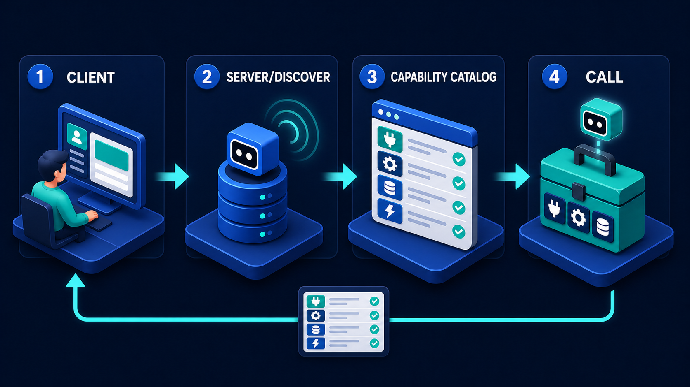

# Diagram 08 — MCP Primitives

**Module:** 2 — MCP capabilities
**Role in the course:** server-catalogue design
**Layout:** three equal definition panels

---

## At a glance

Three primitives, three verbs. **TOOLS = DO. RESOURCES = READ. PROMPTS = GUIDE.**

This is the diagram you use when designing what a capability server actually exposes. The three-way split looks obvious once stated and is routinely collapsed in practice — most first-draft servers are all tools, with resources implemented as tools that read things and prompts not implemented at all. That collapse costs you specific, predictable things.

---

## What the diagram teaches

### 1. Three primitives exist because three different things are being asked for

The distinction is not stylistic. Each primitive answers a different question and has different properties.

**A tool is invoked.** It takes arguments, does something, and returns a result. It may have side effects. It is the only one of the three that can change the world. The panel shows a machine with a conveyor belt producing a cube — input goes in, work happens, something comes out.

**A resource is read.** It has an address, it has content, and fetching it does not change anything. It is idempotent by nature, cacheable, and safe to fetch speculatively. The panel shows a bookshelf and a document whose badge reads **uri://** — the address is the defining feature.

**A prompt is offered.** It is a pre-built way of asking for something, supplied by the server because the server knows its own domain better than the client does. The panel shows a hand tapping a highlighted row in a list — a selection being made from options presented.

### 2. The uri:// badge is the whole definition of a resource

The single most useful detail in this diagram is the small badge on the document in the middle panel. It reads **uri://**.

A resource is *addressable*. You can name it, hold the name, pass the name around, and fetch it later. That property is what separates a resource from a tool that happens to return data.

Consider the difference in practice. A tool called `get_policy_document(policy_id)` and a resource at `policy://handbook/section-4` can return the same text. But:

- The resource can be **referenced** in a conversation, an artifact, or an audit record. "This decision cited `policy://handbook/section-4`" is a durable statement. "This decision called get_policy_document with argument 4" is an implementation detail.
- The resource can be **cached** by address, safely, because fetching it has no effects.
- The resource can be **listed and browsed**. A client can show a user what is available without invoking anything.
- The resource can be **subscribed to** — clients can be told when the content at an address changes.

None of those follow from a tool. Modelling readable content as tools discards all four properties in exchange for nothing.

### 3. The conveyor belt is the tool's tell

The left panel shows a machine that takes something in and emits a **green cube** onto a conveyor. Not a screen displaying data — an object being produced.

That is the mental model for a tool: it *does* something and there is a consequence. The consequence might be a returned value, but it might also be a record created, a message sent, or money moved.

This is why the side-effect question is the first thing to ask about any tool you are designing. A capability server that does not distinguish reading tools from mutating tools forces every client to maintain its own list of which is which — and clients get that list wrong. Marking side effects in the catalogue lets the client apply confirmation behaviour uniformly, which is exactly what the safe side-effect pipeline requires:

The confirm stage in that pipeline has to be triggered by something. In a well-designed catalogue, it is triggered by a flag on the tool, not by a hard-coded list in the client.

### 4. Prompts are the primitive everybody skips, and the one that carries domain knowledge

The third panel is the least implemented and the most interesting. A prompt is the server saying: *here is a good way to ask for what you probably want.*

The value is that the server's authors know things the client's authors do not. They know that the useful question about a shipment is rarely "get the shipment" but "explain why this shipment is late, considering carrier events and the SLA." They know which arguments matter, which combinations are meaningless, and what a good query looks like in their domain.

Without prompts, that knowledge lives in whichever client team happens to have talked to the server team, in a system prompt nobody else can see, going stale. With prompts, it lives with the server, versioned alongside the capabilities it describes, and every client gets it.

The hand tapping a highlighted row is the correct visual: a prompt is an **offer**, presented for selection. It is not an instruction the server forces on the client, and it is not something the client has to use.

### 5. Getting the split wrong has three specific failure modes

**Everything as tools.** The most common. Resources become `get_*` tools, so nothing is addressable, nothing is cacheable, nothing can be listed, and audit records reference call parameters instead of content addresses. Prompts do not exist, so domain knowledge lives in client prompts and drifts.

**Resources used for live state.** A resource that is expected to be stable at its address, serving something that changes every few seconds, makes caching a correctness bug. Live state that changes on invocation timescales belongs behind a tool.

**Prompts as instructions rather than offers.** A server that ships prompts intended to control client behaviour — rather than to help with the server's own domain — has mistaken a capability catalogue for a policy mechanism. The client decides what to do; the prompt is a suggestion about how to ask.

---

## Case study — Corwin & Blake, designing a legal research server

Corwin & Blake is a mid-sized commercial law firm, roughly two hundred fee earners. They built an internal assistant to help with matter research, document review, and precedent lookup. The capability server behind it went through two designs.

### Version one — everything is a tool

The first server exposed nineteen tools:

`search_precedents`, `get_precedent`, `get_matter`, `list_matter_documents`, `get_document`, `get_document_section`, `search_clauses`, `get_clause_library_entry`, `get_client`, `list_client_matters`, `create_research_note`, `update_research_note`, `get_billing_codes`, `log_time`, `search_statutes`, `get_statute`, `get_statute_section`, `search_internal_memos`, `get_memo`.

It worked. It also had four problems that took a year to fully surface.

**Citations were unreferenceable.** When the assistant produced a research note citing a precedent, the note recorded that `get_precedent` had been called with a particular ID. A partner reviewing the note eight months later, in a different system, could not resolve that into a document. The citation was an implementation detail, not an address.

This was the problem that mattered most, because in legal work the citation *is* the product. A research note whose sources cannot be independently resolved is not a research note.

**Nothing could be cached.** The statute corpus changes rarely — some sections are unamended for decades. Every reference to a statute section was a fresh tool call, because tools are not safely cacheable in general and the server offered no way to say which ones were.

**Documents could not be browsed.** A fee earner wanting to see what was in a matter had to have the assistant call `list_matter_documents` and read the result back to them. There was no way to present the matter's contents as a navigable thing, because there was no addressable structure — only calls returning lists.

**Query quality varied enormously by user.** Experienced users asked good research questions. New joiners asked bad ones and got poor results, then concluded the tool was weak. The knowledge of what a good query looked like existed in the heads of about six people.

### Version two — split across three primitives

They re-sorted the nineteen tools.

**Resources (eleven of them).** Everything stable and addressable moved:

- `precedent://` — case reports, addressed by neutral citation.
- `statute://` — statute sections, addressed by act and section.
- `matter://` — matter files, with document lists exposed as nested resources.
- `clause://` — the firm's clause library.
- `memo://` — internal research memos.

Now a research note cites `statute://companies-act-2006/s172`, which is an address that resolves in any client, appears verbatim in the audit record, and means the same thing in eight months. The citation problem disappeared entirely.

Caching became straightforward: statute resources are cached aggressively, matter resources briefly, with the server signalling change so clients can invalidate.

Browsing became possible: the assistant can present a matter as a navigable structure because the matter *has* an address and its documents are addressable underneath it.

**Tools (six of them).** Only things that act:

- `search_precedents(query, filters)` — search, which is genuinely a computation rather than a fetch.
- `search_clauses`, `search_statutes`, `search_memos` — same reasoning.
- `create_research_note(...)` — mutating, flagged as such.
- `log_time(...)` — mutating, flagged as such.

The two mutating tools are marked with a side-effect flag, which drives confirmation in every client automatically. Before, each client had its own list of which of the nineteen were dangerous, and one client's list was missing `log_time`, which meant time entries were being created without confirmation.

**Prompts (five of them).** This is where the firm's actual expertise went:

- *Research a point of law* — structured around the question, the jurisdiction, the date range, and whether the user wants authority for or against a position.
- *Review a clause against the library* — which comparisons matter and in what order.
- *Summarise a matter's position* — the sections a partner expects and the order they expect them in.
- *Find precedent for a fact pattern* — how to describe facts so that the search works, which is genuinely non-obvious.
- *Check a citation chain* — how to verify that authority relied on has not been overturned.

These were written by two senior associates and a knowledge lawyer over about three weeks. They encode the thing the firm actually knows that a general model does not: how a commercial litigator asks a research question.

### What changed

The measurable result was in the new-joiner cohort. Before prompts, research output quality correlated strongly with seniority — new joiners produced notes that needed substantial rework. After, the gap narrowed sharply, because the prompt was doing the work of shaping the question that previously required experience.

The result the partners cared about was different: research notes became **auditable**. Every citation in every note is an address that resolves. When a client queried a piece of advice fourteen months later, resolving the sources took minutes rather than being effectively impossible.

### The mistake they made in between

Their first attempt at the resource split modelled *matter status* as a resource — `matter://12847/status`. Matter status changes constantly as work progresses, deadlines pass, and documents are filed.

Clients cached it, as clients do with resources. The assistant began telling fee earners that matters were at stages they had moved past, in one case reporting a deadline as upcoming after it had passed.

Live state at a stable address is a trap, and it is an easy one to fall into because the address looks so natural. Status moved back to a tool. The rule they wrote down afterwards: *if fetching it twice a minute apart should be able to give different answers, it is a tool.*

---

## Composition

Three equal outlined panels sit side by side, separated by small teal arrows. Each has a heading pairing the primitive in cyan with its verb in white:

**TOOLS = DO** · **RESOURCES = READ** · **PROMPTS = GUIDE**

Each panel holds a single 3D scene on a blue platform, with generous empty space below.

## Element by element

**TOOLS = DO**
A teal machine with a robot face on its front, a large dark gear mounted on its right side, and a conveyor belt running out of its base carrying a green cube. A small teal button sits on top. Input, mechanism, and a produced object.

**RESOURCES = READ**
A blue two-shelf bookcase holding rows of teal and blue volumes, with one book lying flat. Beside it, a large white document page with a folded corner, showing a teal globe icon and a badge reading **uri://**.

**PROMPTS = GUIDE**
A dark settings panel showing an avatar row at the top and three list rows below. The first row is highlighted in teal with a checked box. A cartoon hand with an extended index finger is tapping that highlighted row.

## Colour and flow semantics

- **Teal** for the primitive names in the headings and for the produced cube, the resource volumes, and the selected row — teal marks the substance of each primitive.
- The arrows between panels are **directional but not sequential**. These are three categories, not three stages; the arrows carry the eye left to right rather than describing a flow.
- Each panel has one dominant object and a lot of empty space, which keeps the three-way comparison clean when projected.

## How to present it

**Ask the room to count their tools, then ask how many are actually reads.** In most first-draft servers the answer is more than half. That number is the diagnosis, and it lands better coming from them than from you.

**Point at the uri:// badge and stop.** This is the highest-value thirty seconds in the session. Ask what it means that a resource has an address and a tool does not. Steer toward the four properties — referenceable, cacheable, listable, subscribable — and ask which of those they currently have. Usually none.

**Use the citation test.** Ask: eight months from now, in a different system, can someone resolve what your agent cited? If the audit record says "called `get_document` with id 4471," the answer is no. This test is concrete and it converts the resource/tool distinction from a taxonomy question into a compliance one.

**Then ask about the third panel.** Almost nobody implements prompts. Ask why not, and the honest answer is usually that nobody knew what they were for. Then ask where the knowledge of *how to ask a good question* about their domain currently lives. The answer — in one client's system prompt, written by one person, going stale — is the argument for the primitive.

**Run the sorting drill.** Take a real server's tool list and sort it live into the three columns. Two rules resolve most cases:

- *If fetching it twice a minute apart should be able to give different answers, it is a tool.*
- *If it changes something, it is a tool, and it must be flagged.*

Everything else is a resource. The arguments will be about search — which feels like a read but is a computation over a query, and therefore a tool.

**Connect it back to discovery.** A client discovers all three primitives, not just tools:

A client that only asks for the tool list is discovering a third of what the server offers. Point at the catalogue panel in that diagram and ask what else should be in it.

**Timing.** Twenty minutes. Thirty-five if you run the sorting drill on a real tool list, which is the version worth doing.

---

## Lab and checkpoint

**Lab:** Take the tool list from one real server in your system and sort every entry into tools, resources, and prompts. Use the two rules: if fetching it twice a minute apart can give different answers because the underlying data changed, it is a resource; if it does something or computes, it is a tool; if it captures how to ask a good question, it is a prompt. For any that land on the border, write the rule that would decide them.

**Checkpoint:** What is the difference between a tool and a resource?

**Answer:** A tool does something or computes; a resource is addressable, cacheable, listable, and subscribable. If fetching it twice can return different answers because the underlying data changed, it is a resource. A prompt is neither; it is reusable knowledge about how to ask a good question in a domain.

## Glossary

- **Capability** — a primitive a server advertises and a client can discover.
- **Client** — the caller that discovers and uses MCP primitives.
- **Primitive** — a fundamental kind of thing a server can offer: tool, resource, or prompt.
- **Prompt** — reusable guidance on how to ask a good question or structure a request.
- **Resource** — an addressable, cacheable, listable, and subscribable data object.
- **Server** — the MCP provider that advertises tools, resources, and prompts.
- **Side effect** — a state change caused by a tool call.
- **Tool** — an action or computation that the agent discovers and invokes.
- **URI** — the address badge that makes a resource referenceable and resolvable.

## Sources

- MCP 2026-07-28 specification: tools, resources, and prompts
- MCP primitives documentation and discovery model
- Resource-oriented design and cacheable address patterns
