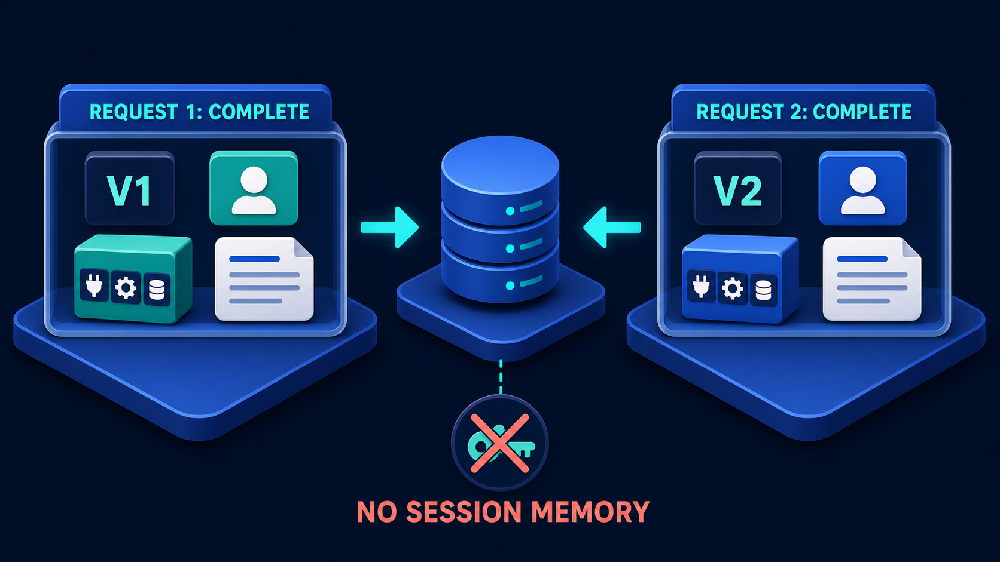
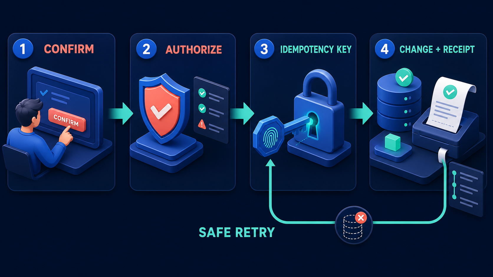

# Diagram 11 — Durable MCP Task

**Module:** 2 — MCP capabilities
**Role in the course:** long-running MCP work
**Layout:** four numbered stages with a dashed timeline and a return loop

---

## At a glance

Four stages: start the work, receive an identifier, check on it, collect the result. Underneath, a dashed timeline with glowing nodes, and from the node under the progress stage a route back up to the identifier.

The diagram exists to separate two things that a simple request/response model fuses: **the call returning** and **the work finishing**. When those are the same event, everything is easy. When they are not — and for anything that takes more than a few seconds they are not — you need the object in panel 2.

---

## What the diagram teaches

### 1. The ticket in panel 2 is the entire pattern

Look at what stage 2 actually shows: a large teal **ticket or token** stamped **ID**, with a row of placeholder character boxes beneath it.

The ticket metaphor is exact. You hand in your work, you receive a stub, and the stub is how you refer to the work from then on. You do not stand at the counter. You do not hold the connection open. You hold a claim.

Everything else in the diagram follows from that object existing:

- Stage 3 is only possible because you have something to ask about.
- The return loop is only possible because the same identifier can be presented repeatedly.
- Stage 4 is only collectable because the result is associated with the claim rather than with your connection.

A system without the ticket has to keep the caller attached for the duration of the work, which fails as soon as the work outlasts a timeout, a deploy, or a laptop lid closing.

### 2. Task identity is not session state

This is the distinction that makes durable tasks compatible with a stateless protocol, and it is worth being precise about because it looks like a contradiction.

That diagram says the server remembers nothing between requests. This one says the server remembers a task for minutes or hours. Both are true, because they are remembering different things.

**Session state is the server remembering *you*** — an implicit association between a connection and some accumulated context, which any given server instance may or may not have, and which vanishes on restart.

**A task is the server remembering *the work*** — an explicit, durable, addressable object with an identifier that the client holds and presents. Any instance can look it up. A restart does not lose it, because it is persisted rather than held in a connection's memory.

The status check in stage 3 is itself a complete, self-contained request: it carries its own version, its own identity, and the task ID. It could be the first request that server has ever seen.

### 3. The progress gauge is showing you something you must design

Stage 3 shows a ring gauge reading **68%** and a horizontal progress bar. Both are specific, and specificity here is a design obligation rather than a rendering detail.

Progress reporting is easy to hand-wave and hard to do honestly. Three failure modes are common:

- **Fake progress.** A bar that advances on a timer rather than on work completed. Users learn to distrust it within a week.
- **Meaningless progress.** "Step 3 of 7" where step 4 takes forty times as long as steps 1 to 3 combined.
- **No progress.** A task that is either pending or done, with nothing in between, which is honest but leaves the caller unable to distinguish slow from stuck.

The diagram commits to a percentage, which means committing to a decomposition of the work into measurable units. If you cannot produce a meaningful percentage, say so and report a phase name instead — "extracting", "scoring", "assembling" — which at least tells the caller that something is moving.

### 4. The return loop is a poll, and polls have a cost

The dashed timeline beneath the panels carries three glowing nodes. From the node under stage 3, the dashed line routes back up into stage 2.

This is the client re-presenting the ticket. Not resubmitting the work — **checking on it**. Re-reading that loop as a retry is the most common misinterpretation and it is worth heading off, because a client that resubmits instead of checking creates duplicate work.

Polling is the simplest way to learn about progress and it is not free. Each check is a request: authenticated, evaluated, served. A thousand clients polling a two-minute task every second is 120,000 requests to deliver a thousand results.

The design questions the loop raises — how often, for how long, with what backoff, and what happens if the client stops asking — are covered properly in the interaction modes diagram, which puts polling alongside its three alternatives:

Polling is drawn there as four repeated requests, which is the honest depiction of its cost.

### 5. The result is collected, not returned

Stage 4 shows a document with a green check and a **teal download cube**. The download glyph is the tell: the result is fetched, not pushed back down the original call.

This decouples the result's availability from the caller's presence. The client that started the task need not be the client that collects it. The collection can happen after a restart, from a different process, or by a different user with the right permissions.

It also raises questions the diagram does not answer and you should: how long is the result retained, who may collect it, and what happens on collection — does it persist for re-collection, or is it consumed?

### 6. Four states, and one of them is missing from the picture

The diagram shows a happy path: started, identified, progressing, done. Real task lifecycles have at least one more state, and it is the one that matters operationally — **failed**.

A task that fails needs to be discoverable through the same mechanism. The client presents the ticket and learns not "68%" but "failed, at this stage, for this reason." The interaction-modes diagram includes it explicitly, with a coral **FAILED** among the poll responses. This diagram does not, and when teaching it you should say so out loud rather than letting the clean four-stage line imply that tasks only succeed.

---

## Case study — Solstice Energy, the twenty-minute simulation

Solstice operates grid balancing services. Their analysts run network simulations that model how a regional grid responds to generation and demand scenarios. A simulation takes between four and forty minutes depending on the network size and scenario complexity.

They built an assistant to let analysts describe scenarios in natural language and run them. The first version treated a simulation as a tool call.

### What broke

**Timeouts everywhere.** Their capability gateway had a sixty-second timeout. Their load balancer had a hundred and twenty. The HTTP client had its own. A simulation exceeding any of these produced an error to the caller while the simulation itself continued running to completion on the compute cluster, consuming resources for a result nobody would collect.

**Duplicate work.** Analysts, seeing a timeout, ran the simulation again. Sometimes three times. The cluster ended up running the same forty-minute job concurrently in triplicate, which made everything slower, which caused more timeouts, which caused more retries. During one busy afternoon roughly forty percent of cluster capacity was executing duplicate work.

**No visibility.** An analyst who started a simulation had no way to know whether it was progressing, stuck, or dead. The only signal was eventual success or a timeout. Analysts developed the habit of starting a simulation and then messaging the platform team to ask whether it was running.

**Deploys killed work.** Any deploy dropped in-flight simulations. The platform team stopped deploying during working hours, which meant fixes waited until evening.

### The rebuild as a durable task

**Stage 1 — Start task.** The assistant resolves the analyst's description into a scenario definition and submits it. The submission returns in about two hundred milliseconds. It does not wait.

Note what this changed about the confirmation step: because submission is fast, the assistant can show the analyst the resolved scenario — network, time window, generation assumptions, demand profile — and get confirmation *before* committing forty minutes of cluster time. Under the old design, confirmation and execution were the same event, so a misunderstood scenario was only discoverable after the wait.

**Stage 2 — Task ID.** The analyst receives an identifier. The assistant shows it, keeps it, and — importantly — writes it to the analyst's session history so it survives the assistant being closed.

**Stage 3 — Progress.** The simulation reports genuine progress. Solstice's solver works through the network in discrete time steps, so percentage complete is a real number rather than an animation: steps solved over steps total. It also reports a phase name, because the final assembly stage takes a fixed few minutes during which the step counter does not move, and analysts were reading that stall as a hang.

The assistant polls with backoff: every two seconds for the first thirty, every ten seconds thereafter, and every thirty seconds after five minutes. For a forty-minute simulation this is about a hundred checks rather than the twelve hundred a fixed one-second interval would produce.

**Stage 4 — Result.** The simulation output — a set of time series and a summary — is retained for seven days and collected by ID. An analyst can start a simulation on Friday afternoon, close their laptop, and collect it on Monday.

### The states they had to add

The clean four-stage picture did not survive contact with production. They ended up with six task states:

- **queued** — submitted, waiting for cluster capacity. Analysts needed this distinguished from running, because a twenty-minute queue during peak periods was otherwise indistinguishable from a slow simulation.
- **running** — with percentage and phase.
- **succeeded** — result collectable.
- **failed** — with a reason and the stage it failed at. Roughly four percent of simulations fail, usually on non-convergence for a badly specified scenario, and the analyst needs to know that specifically so they can fix the scenario rather than resubmit it unchanged.
- **cancelled** — analysts can stop a simulation they realise is wrong, which reclaims cluster time.
- **expired** — result retention elapsed.

The two that the diagram omits — queued and failed — turned out to carry most of the operational value. **Failed** in particular: under the old design a failure and a timeout looked identical to the analyst, so nobody could tell a badly specified scenario from an infrastructure problem.

### Idempotency, still required

A durable task does not remove the need for the safe-write machinery. Submitting a simulation costs real money in compute, so the submission itself is a side effect worth protecting:

Submissions carry a key derived from the scenario definition hash and the analyst's identity. A resubmission of an identical scenario within the retention window returns the **existing task ID** rather than starting a second run. This is what finally killed the duplicate-work problem — an analyst who resubmits out of impatience now receives the ticket for the run already in progress.

### What it returned

Cluster utilisation on duplicate work went from around forty percent at peak to effectively zero. Deploys moved back into working hours. The platform team stopped fielding "is my job running" messages, because the answer became self-serve.

The change analysts noticed was the confirmation step. Being shown the resolved scenario before committing forty minutes caught misunderstandings that had previously cost a full simulation cycle to discover. About one submission in twelve gets corrected at that screen.

---

## Composition

Four panels sit in a row, each headed by a blue numbered circle and a white uppercase label:

**1 START TASK → 2 TASK ID → 3 PROGRESS → 4 RESULT**

Small cyan arrows connect the panels at mid-height. Beneath the row runs a **dashed cyan timeline** carrying three glowing circular nodes. From the node positioned under stage 3, the dashed line drops, runs left, and turns upward into stage 2.

## Element by element

**1 START TASK**
A person seated in a dark chair, seen from behind, reaching toward an application window and pressing a large **teal play button**. The window shows sidebar text lines behind it. Initiation is an explicit action.

**2 TASK ID**
A large teal **ticket** graphic — rendered with notched sides like a cloakroom stub — stamped **ID** in white. Below it sits a row of six dark placeholder character boxes representing the identifier's value. The claim you hold.

**3 PROGRESS**
An application window containing a **teal ring gauge reading 68%** and, below it, a horizontal progress bar partly filled in teal. Text lines sit to the right of the gauge. A real number, not an animation.

**4 RESULT**
A white document with a folded corner, carrying a **green check badge** and text lines, beside a **teal cube stamped with a download arrow**. The result is collected rather than returned.

**The dashed timeline**
Three glowing cyan nodes on a dashed horizontal line beneath the panels. The middle node — under PROGRESS — has a branch that routes back up into TASK ID, depicting a repeated status check rather than a resubmission.

## Colour and flow semantics

- **Solid cyan arrows** move the lifecycle forward between stages.
- The **dashed timeline** represents elapsed time rather than data flow — the nodes are moments, not messages.
- The **return branch is dashed**, matching the timeline, because it is a check occurring at a point in time rather than the work itself moving backwards.
- **Teal** marks everything belonging to the task itself: the play button, the ticket, the gauge, the download cube.
- There is no coral anywhere in this diagram, which is itself notable — no failure state is depicted.

## How to present it

**Start with the timeout story.** Ask the room what happens when a tool call takes longer than the gateway timeout. The honest answer — the caller errors and the work keeps running — is a good place to begin, because it establishes that the problem is real before the pattern is offered.

**Point at the ticket and let the metaphor do the work.** Cloakroom stub, dry cleaning ticket, order number. You hand in work, you get a claim, you come back with the claim. Nobody needs this explained twice.

**Draw the session-versus-task line explicitly.** This is the conceptual centre of the session. Put diagram 09 beside it and give them the sentence: *session state is the server remembering you; a task is the server remembering the work.* Then ask why the status check in stage 3 does not violate statelessness. The answer — it is a complete request carrying its own identity plus the ID — is worth extracting from the room rather than stating.

**Ask what the loop is.** Someone will say retry. Correct it immediately: the loop is a **check**, not a resubmission. A client that resubmits generates duplicate work, which is the exact failure Solstice had. This misreading is common enough to be worth pre-empting.

**Interrogate the 68%.** Ask what a percentage would mean for their own long-running work, and whether they could produce an honest one. Many cannot, and the useful outcome is deciding to report a phase name instead of inventing a number. Then ask what their users currently do when a job appears stuck.

**Name the missing states.** Say plainly that this diagram shows only the happy path, and ask what is missing. **Failed** and **queued** are the two that matter. Failed is the important one — a task that can fail must expose *why* and *where* through the same ticket, or the caller cannot distinguish a bad request from a broken system.

**Cost the poll.** Ask how often they would check, then multiply: clients × frequency × duration. A room that has not done this arithmetic is usually surprised. That sets up the interaction-modes diagram, where polling appears as one of four options with its cost drawn honestly.

**Timing.** Twenty minutes. Thirty if you run the progress-honesty discussion, which tends to be the part people take back to their own work.

---

## Lab and checkpoint

**Lab:** Design a durable task for one long-running operation in your system. Draw the request, task ID, progress, result, and poll loop. Identify where the state lives, what the task ID looks like, how progress is reported honestly, and what happens when the client stops polling. Then write the failure state that must be exposed through the same task ID.

**Checkpoint:** Why is the loop a check and not a resubmission?

**Answer:** Because resubmitting the same request creates duplicate work. The loop polls the task ID to check status, which is safe to repeat. The task ID gives the work an identity that outlives any single request or server.

## Glossary

- **Durable** — a task that survives server restarts and outlives individual requests.
- **Long-running work** — a computation or process that cannot complete within a single request window.
- **Poll loop** — the client repeatedly checking the task status until it reaches a terminal state.
- **Progress** — an honest report of how much of a task is done, usually as a phase or percentage.
- **Result** — the final artifact or outcome returned when a task completes.
- **Task ID** — the persistent identifier that lets a client track one piece of work across many requests.

## Sources

- MCP 2026-07-28 durable task and progress model
- A2A task lifecycle and artifact documentation
- Long-running job and polling pattern design
