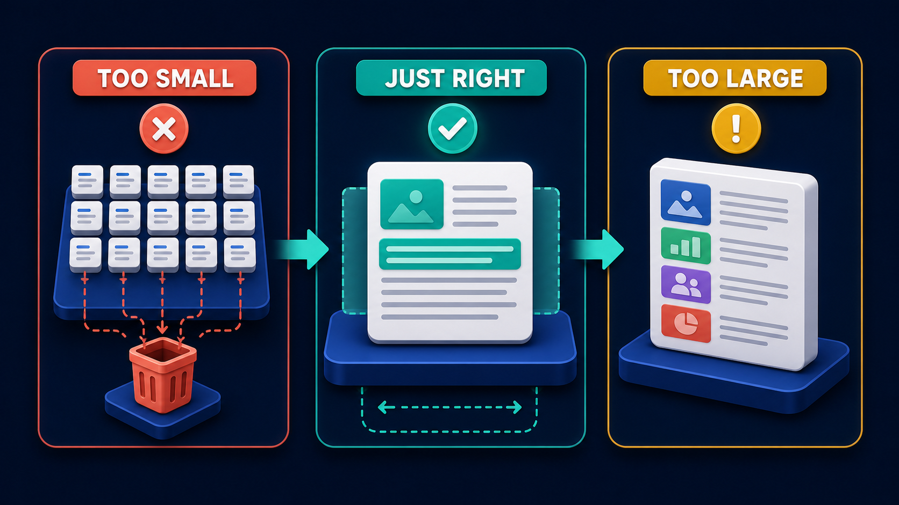

# Diagram 13 — RAG Ingestion Pipeline

**Module:** 3 — RAG evidence
**Role in the course:** knowledge-pipeline planning
**Layout:** five numbered stages, left to right

---

## At a glance

Five stages that turn a pile of documents into something searchable: **SOURCES → CLEAN → CHUNK → EMBED → INDEX**.

This is the half of RAG that happens before anyone asks a question, and it is where most of the quality of the eventual answers is determined. The stage that gets the least attention — CLEAN — is usually the one that decides whether the rest works.

---

## What the diagram teaches

### 1. Sources are heterogeneous, and the picture insists on it

The first panel does not show a folder. It shows six different things: a plain document, a red **PDF**, a green spreadsheet, a code snippet tile, a **globe**, and a web page.

That heterogeneity is the first real problem of any ingestion project, and it is almost always underestimated. Each format fails differently:

- **PDFs** are the worst case. Text may be selectable, or it may be an image requiring OCR. Multi-column layouts extract in the wrong reading order. Tables become soup. Headers and footers repeat on every page and pollute every chunk.
- **Spreadsheets** have meaning in their structure that vanishes when flattened to text. A cell reading "4.2" means nothing without its row and column headers.
- **Web pages** carry navigation, cookie banners, footers and boilerplate that will otherwise be indexed as if it were content.
- **Code** has structure that generic chunking destroys — splitting a function in half produces two useless fragments.

The lesson is that ingestion is not one pipeline. It is a set of format-specific extractors feeding a common pipeline, and the extractor is where most of the engineering effort actually goes.

### 2. Clean is the stage everyone skips and the one that decides quality

The second panel shows a broom and sparkles. It is the simplest image in the diagram and it represents the most consequential stage.

What cleaning actually removes:

- **Boilerplate.** Page headers, footers, navigation, copyright notices. If every page of a four-hundred-page manual carries the same footer, every chunk contains it, and the embedding of every chunk is pulled slightly toward that shared text.
- **Extraction artefacts.** Ligature errors, broken hyphenation across line breaks, column bleed, page numbers embedded mid-sentence.
- **Duplicates.** The same policy document existing in four places with three slightly different dates.
- **Structure that should be preserved rather than flattened.** Headings, lists and tables carry meaning; naive extraction turns them into undifferentiated prose.

The failure mode when cleaning is skipped is insidious: retrieval does not obviously break, it just gets worse in ways that look like a model problem. Answers become vaguer, citations point at pages rather than passages, and the team starts trying different embedding models to fix a problem that lives two stages upstream.

### 3. Chunk is where you decide what a retrievable unit is

The third panel shows a document with a **dashed teal selection box** over part of it, and three arrows leading down to three smaller cards.

The dashed box is the important detail. It marks a *selected region* — a deliberate decision about where the boundaries fall — rather than an arbitrary cut. Chunking is not slicing at a fixed character count; it is deciding what constitutes one coherent retrievable idea.

Because this stage has more consequence per decision than any other, it gets its own diagram:

The short version: a chunk should contain one idea, with enough surrounding context to be interpretable on its own, plus deliberate overlap so that ideas spanning a boundary are not lost.

### 4. The embedding panel shows real numbers, and that is the point

The fourth panel displays an actual matrix — `0.21 -0.47 0.13 …`, `-0.11 0.32 -0.78 …`, `0.64 0.09 -0.22 …` — feeding down into a blue cube dotted with glowing points.

Showing literal floats rather than an abstract "AI magic" glyph is a deliberate teaching choice. An embedding is a list of numbers. Similar text produces similar numbers. Search is arithmetic over those numbers. There is nothing else in the box.

Three practical facts follow from that plainness:

- **The model that produced the numbers matters and cannot be changed casually.** Vectors from different models are not comparable. Changing your embedding model means re-embedding everything.
- **The numbers are meaningless alone.** They only have value relative to other vectors produced by the same model.
- **Embedding is deterministic and cheap to redo per chunk** — which means the expensive thing to change is your chunking, not your embedding.

### 5. Index is a structure with maintenance obligations

The fifth panel shows a database stack, a **magnifying glass**, and a cluster of **green cubes**. Storage, search, and the chunks themselves.

The magnifying glass appearing at this stage rather than in a later diagram makes a quiet claim: the index exists to be searched, and its structure is determined by how it will be queried. An index is not a place you put things; it is a structure optimised for a retrieval pattern.

The obligations that come with it, and that ingestion diagrams typically omit:

- **Freshness.** When a source document changes, its chunks must be re-ingested and the old ones removed. Orphaned chunks from deleted documents are a common and hard-to-notice bug.
- **Deletion.** When a document is withdrawn — a superseded policy, a document under legal hold — its chunks must actually disappear. If your pipeline is append-only, you cannot honour that.
- **Provenance.** Every chunk must retain enough to resolve back to its source document, page, and section. Without it, citations are impossible, which makes the whole grounding chain unbuildable.

### 6. The pipeline runs repeatedly, not once

The diagram is drawn as a straight left-to-right flow with no loop, which reads as a one-time build. It is not. Ingestion is a recurring job, and the interesting engineering is in the *re-run*:

- Which documents changed since last time?
- Which chunks does a changed document invalidate?
- How do you re-embed a subset without re-embedding everything?
- How do you do all of that without the index being inconsistent while it runs?

Teach the five stages as drawn, then say plainly that the arrow from INDEX loops back to SOURCES on a schedule.

---

## Case study — Arclight Manufacturing, forty years of manuals

Arclight builds industrial pumps and compressors. Equipment stays in service for decades, which means their field service engineers need documentation going back to the 1980s. That documentation is roughly 90,000 pages across about 4,000 documents, in every format the last forty years produced.

Field engineers were spending an average of eleven minutes per job looking for the right procedure. Some documents existed only as scans. The project was to make all of it searchable from a tablet in the field.

### Stage 1 — Sources

The inventory was worse than expected:

- **1,900 born-digital PDFs** — manuals from 2005 onward, mostly clean text.
- **1,400 scanned PDFs** — pre-2005, image-only, no text layer.
- **380 Word documents** — service bulletins, various vintages.
- **240 spreadsheets** — parts compatibility matrices and torque specifications.
- **90 HTML pages** — an internal wiki of accumulated field knowledge.
- **Several hundred loose images** — wiring diagrams and exploded views, embedded in and referenced from the above.

The scanned PDFs needed OCR. Arclight ran it and found a 4% character error rate overall, which sounds acceptable and was not — errors clustered in exactly the content that mattered most. Part numbers and torque values are alphanumeric strings with no linguistic redundancy, so OCR errors in them are unrecoverable and undetectable. `M8×1.25` became `M8x125`, `MB×1.25`, and `M8*1.25` across different scans.

**What they did.** OCR output for part numbers and specification tables was validated against the parts master database. Anything that did not resolve to a known part was flagged for human review. About 3,000 flagged items were corrected by two technical writers over six weeks. Tedious, and it was the difference between a system engineers trusted and one they did not.

### Stage 2 — Clean

Four categories of problem, in order of impact:

**Repeating boilerplate.** Every page of every manual carried a header with the document number and a footer with a copyright notice and page number. Across 90,000 pages that is 90,000 copies of near-identical text. Before removal, chunks retrieved for unrelated queries were being drawn together by their shared footer.

**Multi-column reading order.** The 1990s manuals were two-column. Naive extraction interleaved the columns, producing sentences that alternated between two unrelated paragraphs. This affected about 600 documents and was invisible until someone read a chunk.

**Tables.** Torque specification tables were the single most-consulted content in the corpus and extracted as unstructured runs of numbers. A row reading "M8 | 25 Nm | 18 lb-ft" became "M8 25 18". Detached from headers, meaningless and actively dangerous — a wrong torque value damages equipment.

**What they did.** Tables were extracted structurally and rendered into text that carried their headers inline: "Bolt size M8: torque 25 Nm (18 lb-ft)". This converted the corpus's most important content from noise into its best-performing retrieval.

**Duplicates and supersession.** Service bulletins are revised. The corpus contained up to six versions of the same bulletin with no consistent marker of which was current. A superseded procedure retrieved confidently is worse than no answer.

**What they did.** Superseded documents were not deleted — engineers sometimes need to know what an older procedure said for equipment never brought up to current spec. They were tagged with status and supersession date, and retrieval filters to current by default while allowing historical search explicitly.

### Stage 3 — Chunk

Uniform chunking failed immediately. Procedures are step sequences where splitting mid-sequence produces a fragment that reads like a complete instruction and is not — a genuine safety problem when the omitted step is "isolate and lock out the power supply."

**What they did.** Three format-aware strategies. Procedures chunk on procedure boundaries, never mid-sequence, with the procedure title and any safety warnings prepended to every chunk. Specification tables chunk one logical group per chunk with headers preserved. Narrative text chunks on section boundaries with roughly 15% overlap.

The safety-warning prepending was mandated by their safety review and turned out to improve retrieval quality independently, because warnings contain domain vocabulary that helps a chunk match relevant queries.

### Stage 4 — Embed

Comparatively uneventful, which is the normal outcome. Two decisions mattered.

They embedded the **cleaned, structurally-rendered text**, not the raw extraction — so the torque table chunks embedded as readable sentences rather than number runs.

They kept the raw extracted text alongside the embedding, which proved essential later when they added keyword search over exact part numbers. Vector search is poor at exact alphanumeric matching, and having the literal text retained let them add that lane without re-ingesting:

### Stage 5 — Index

Every chunk carries: source document ID, revision, page range, section heading, equipment models it applies to, document status, and the raw extracted text.

The equipment-model tag is the one that made the system usable. A field engineer working on a specific compressor does not want procedures for a different model, and pre-filtering by model before ranking cut irrelevant results dramatically.

**Maintenance.** The pipeline runs nightly against a change feed. A revised bulletin invalidates its chunks, re-ingests, and marks the prior revision superseded in one transaction. This was harder than the initial build and is the part they would resource differently if starting again.

### Outcome

Median time-to-find went from eleven minutes to under ninety seconds. Adoption reached about 80% of field engineers within four months.

The number that mattered to their safety team: zero retrievals of superseded procedures presented as current, over the first year, versus a pre-existing paper-based process where it had happened twice in the preceding decade with equipment damage both times.

### What they underestimated

Cleaning took 60% of the project. The team had budgeted it at about 15%. Everyone's attention had gone to embedding and retrieval, which together took under three weeks.

Their retrospective line, worth repeating to any team starting an ingestion project: *we thought we were building a search system and we were actually building a document extraction system with search on the end.*

---

## Composition

Five tall dark rounded panels sit in an even row, each headed by a blue numbered circle and a white uppercase label:

**1 SOURCES → 2 CLEAN → 3 CHUNK → 4 EMBED → 5 INDEX**

Teal arrows connect the panels at mid-height, giving a single unambiguous left-to-right flow.

## Element by element

**1 SOURCES**
A cluster of six format icons arranged loosely on and above a blue platform: a white document, a red **PDF** file, a green spreadsheet, a dark code tile showing `</>`, a white **globe**, and a web page window with a teal content block. Deliberately heterogeneous.

**2 CLEAN**
A single large white document page, upright, with a **dark-handled teal broom** sweeping across it and small teal sparkle marks around the swept area. The simplest panel, representing the most consequential stage.

**3 CHUNK**
A white document with a **dashed teal selection box** drawn over part of its text, with three curved arrows leading down to three smaller white cards arranged in a row beneath. A selected region, not an arbitrary cut.

**4 EMBED**
A dark panel displaying a matrix of actual float values in teal — `[ 0.21  -0.47  0.13 … ]`, `[ -0.11  0.32  -0.78 … ]`, `[ 0.64  0.09  -0.22 … ]` — with five dashed arrows descending into a **blue cube studded with glowing teal points**.

**5 INDEX**
A stacked blue database cylinder with teal indicator lights, a **teal magnifying glass** at its right, and a cluster of **green cubes** at its base representing the stored chunks.

## Colour and flow semantics

- **Teal arrows** carry the pipeline forward; the flow is strictly one-directional with no branches.
- **Dashed teal** appears twice, both times marking a *decision boundary*: the chunk selection box and the arrows from the embedding matrix into the vector store.
- **Green cubes** represent chunks and recur in the final panel, tying the chunking stage to the indexed result.
- No coral appears anywhere — this diagram depicts a build process with no rejection path, which is itself worth noting when teaching, since real pipelines reject plenty.

## How to present it

**Ask what is in their corpus before showing the diagram.** Get an actual inventory: how many documents, how many formats, how many are scans. Rooms consistently underestimate their own heterogeneity, and the first panel lands much harder once they have said a number out loud that they are about to revise upward.

**Spend most of the session on stage 2.** It is the smallest panel and deserves the most time. Ask what their documents carry on every page. Headers, footers, navigation, cookie banners. Then ask what happens to retrieval when 90,000 chunks share a footer. The answer — everything is slightly similar to everything — is the clearest way to explain why cleaning is not cosmetic.

**Use the table example.** Ask what "M8 25 18" means. Then show it as "Bolt size M8: torque 25 Nm (18 lb-ft)". Same source, same embedder, completely different retrieval behaviour. This one comparison teaches more about ingestion quality than an hour of theory.

**Point at the actual numbers in panel 4.** Ask what an embedding is. Then point at the matrix and say: that. A list of numbers. It demystifies the stage that people are most inclined to treat as magic, and it sets up the practical constraint — change the model, re-embed everything.

**Ask about deletion.** "A document is withdrawn under legal hold. What do you do?" Append-only pipelines cannot answer this. It is a genuinely common obligation and it is rarely designed for up front.

**Ask about the re-run.** The diagram has no loop. Ask what happens tomorrow when forty documents change. Which chunks are invalid, how do you find them, and is your index consistent while the job runs? Arclight found this harder than the initial build, and most teams have not thought about it at all.

**Set the expectation on effort.** Tell them cleaning will be the majority of the work. Arclight budgeted 15% and spent 60%. Teams that hear this in advance staff the project differently, and that is the most valuable thing this diagram can produce.

**Timing.** Twenty-five minutes. Forty if you inventory the room's own corpus, which is the better version.

---

## Lab and checkpoint

**Lab:** Take three pages from one real document in your corpus and trace them through the ingestion pipeline. For each page, identify what should be removed (headers, footers, navigation, boilerplate), how it should be chunked, what metadata should be attached, and how the embedding should be stored. Then write the deletion and re-run rules: what happens when one of those pages is withdrawn or updated?

**Checkpoint:** Why is cleaning not a cosmetic step in the ingestion pipeline?

**Answer:** Because headers, footers, and navigation chunks appear across thousands of documents, making everything slightly similar to everything. That noise degrades retrieval and produces wrong results from the same content that would work if it were cleaned.

## Glossary

- **Chunk** — a small unit of text produced from a document and stored in the index.
- **Cleaning** — the step that removes structural noise such as headers, footers, and navigation from documents.
- **Corpus** — the full collection of documents being ingested.
- **Embedding** — a vector of numbers representing the meaning of a chunk.
- **Heterogeneity** — the variety of formats, layouts, and structures across documents.
- **Index** — the searchable vector or hybrid store that holds chunks and embeddings.
- **Ingestion pipeline** — the sequence of steps that turns raw documents into retrievable chunks.
- **Metadata** — structured tags attached to a chunk to support filtering and attribution.
- **Re-run** — the process of updating the index when documents change.

## Sources

- RAG ingestion and chunking best practices
- Embedding model selection and re-embedding guidance
- Document parsing and layout-aware extraction patterns
