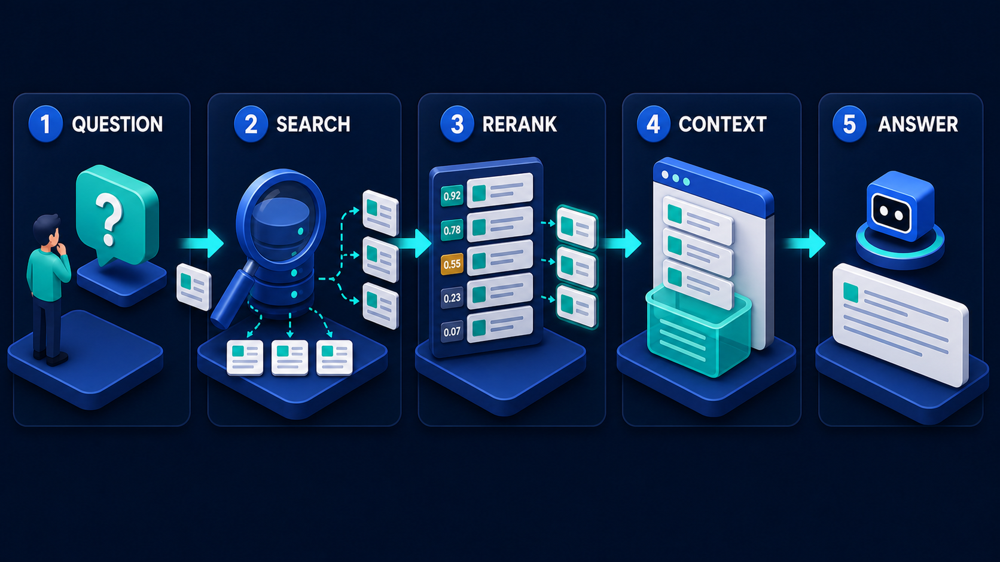

# Diagram 16 — Hybrid Search

**Module:** 3 — RAG evidence
**Role in the course:** retrieval-quality explanation
**Layout:** two parallel lanes merging into one, then ordering

---

## At a glance

Two retrieval methods run **in parallel**, their results are combined, and then the combined set is put in order. Keyword and vector search are not alternatives to choose between — they are complementary, and the diagram's geometry says so by giving them equal panels feeding a single merge.

The reason this matters is that each method fails at exactly what the other is good at, and those failures are predictable enough to plan around.

---

## What the diagram teaches

### 1. The two lanes fail in opposite directions

**Keyword search** matches literal strings. It is exact, explainable, and has no notion of meaning. It finds `M8×1.25` and `INV-88213` and `Regulation 14(3)(b)` perfectly, and it finds nothing at all when the user says "bolt torque spec" and the document says "fastener tightening values."

**Vector search** matches meaning. It finds "fastener tightening values" from a query about "bolt torque spec" without difficulty, and it is unreliable on exact identifiers, because a part number carries almost no semantic content. `M8×1.25` and `M6×1.00` embed to nearly the same place. So do `INV-88213` and `INV-88214`.

The failure modes are complementary, which is why the answer is both rather than either:

| | Keyword | Vector |
| --- | --- | --- |
| Exact identifiers, codes, part numbers | Excellent | Poor |
| Synonyms and paraphrase | Fails | Excellent |
| Rare terms and proper nouns | Excellent | Mediocre |
| Conceptual or descriptive questions | Poor | Excellent |
| Explainability | You can see why it matched | Hard to explain |
| Behaviour on typos | Fails | Tolerant |

Running only one lane means accepting an entire column of failures. Most teams start with vector search alone and then spend months confused about why exact lookups do not work.

### 2. Parallel, not sequential — and that is a design commitment

Both source panels feed the merge simultaneously. Neither filters the other.

The alternative — keyword first, then vector over the survivors, or vice versa — sounds efficient and destroys the property you built the second lane for. If keyword search runs first and finds nothing because the user paraphrased, there is nothing left for vector search to rank. The failure of one lane becomes the failure of the whole system.

Parallel means each lane gets a clean shot at the corpus, and a document that either method finds is in the candidate pool. It costs two searches instead of one, which is generally cheap relative to everything else in the pipeline.

### 3. The merge is not a union, and the interleaving shows it

The MERGE panel shows four cards **interleaving under curved arrows arriving from both sides**. Cards from both lanes, woven together rather than stacked in two groups.

The problem the merge has to solve is that the two lanes produce **incomparable scores**. A keyword relevance score of 8.4 and a cosine similarity of 0.82 are not on the same scale and cannot be sorted against each other. You cannot simply concatenate and sort.

The standard resolution is to combine on **rank** rather than score — a document's position in each list, rather than its raw number. A document ranked second by keyword and fifth by vector gets a combined position derived from those ranks. Documents found by both lanes rise, because appearing in two independent lists is stronger evidence than a high score in one.

That last property is the merge's real value: **agreement between methods is signal**. The interleaving in the panel is depicting exactly that — a combined list where the ordering reflects both sources.

### 4. Rerank is a third, different judgement

The final panel shows cards carrying **gold, silver and bronze numbered medals** — 1, 2, 3 — with grey unranked rows beneath, beside a robot and a coral shield.

Three distinct stages of judgement have now occurred, each cheaper and wider than the next is expensive and narrower:

1. **Retrieval** (both lanes) — cheap, runs over the whole corpus, optimised for recall.
2. **Merge** — free, combines two orderings into one.
3. **Rerank** — expensive, runs over a few dozen candidates, optimised for precision.

The reranker typically reads the question and each passage together, which is far more accurate than comparing pre-computed vectors and far too costly to run over millions of chunks. The medals make the point that this stage produces an *ordering with a podium*, not just a filtered set.

### 5. The robot and the shield mark where quality is enforced

The presence of a **coral shield** in the rerank panel is worth noticing, because coral means policy throughout this library.

Reranking is where retrieval quality controls apply. It is the last point where you can decide what does and does not reach the model, and the natural place for rules that are not about similarity at all:

- **Recency** — prefer the current revision over superseded ones.
- **Authority** — prefer the official policy over a wiki page describing it.
- **Permissions** — remove documents this user may not see.
- **Status** — exclude drafts, withdrawn documents, anything under legal hold.
- **Thresholds** — drop candidates below a minimum relevance regardless of rank.

None of these are similarity questions. All of them belong here, because this is the last stage that sees a list rather than a blob of assembled context.

### 6. It feeds the answer pipeline's third stage

This diagram is a zoom into the middle of the answer pipeline. Its two lanes and merge are the SEARCH stage; its rerank panel is the RERANK stage:

Reading the two together makes the relationship clear: hybrid search is *how* the wide net in stage 2 is cast, and the scored list in stage 3 is what the merge produces after ordering.

---

## Case study — Fenwick Industrial, the part number problem

Fenwick distributes industrial components — bearings, seals, fasteners, hydraulics — around 180,000 line items. Their customers are maintenance engineers who call, email, or use a web portal, and who ask in two completely different ways depending on what they know.

They built an assistant over their product catalogue, technical datasheets, and cross-reference tables. It launched with vector search only.

### The two kinds of question

Analysis of eight weeks of queries showed a clean split.

**About 55% were identifier queries.** "Do you stock SKF 6205-2RS?" "What's the equivalent for Parker 2M-B4LJ-SS?" "I need a replacement for part 44-8821-B." The engineer knows exactly what they want and is asking about availability or equivalence.

**About 40% were descriptive queries.** "I need a bearing for a 25mm shaft that'll handle a wash-down environment." "What seal do you have for hydraulic fluid at 180 bar?" The engineer knows the requirement and not the part.

The remaining 5% were mixed — an identifier plus a constraint.

### What vector-only did

**Descriptive queries worked well.** Around 84% of them surfaced a suitable product in the top five. The embedding captured requirements like "wash-down environment" mapping to stainless and sealed variants, which was genuinely useful and was why the team had been pleased with the launch.

**Identifier queries were bad.** 31% top-five accuracy.

The failures were consistent and instructive. A query for `6205-2RS` would return `6205-2Z`, `6206-2RS`, `6005-2RS` and `6205` — every near neighbour, because these strings are nearly identical as text and the differences that matter to an engineer are single characters carrying enormous meaning.

`-2RS` means rubber sealed on both sides. `-2Z` means metal shielded. Different products for different applications. The embedder saw two strings differing by two characters.

Worse, the assistant was confident. It would return `6205-2Z` for a `6205-2RS` query with no indication that it had substituted a different product. Two customers received the wrong part before anyone noticed the pattern.

### Adding the keyword lane

They added keyword search over the exact catalogue fields — part number, manufacturer code, cross-reference numbers, and the raw datasheet text.

**Identifier queries went from 31% to 97% top-five.** The remaining 3% were genuine catalogue gaps or obsolete numbering.

**Descriptive queries stayed at 84%**, unchanged, because keyword contributes nothing there and the merge does not let it interfere.

The overall number moved from about 55% to about 90%, driven entirely by rescuing the majority-share query type that vector search structurally cannot do.

### What the merge had to handle

Combining the two lists was the fiddly part.

**Incomparable scores.** Their keyword engine returned BM25 scores in the range 0–40; the vector lane returned cosine similarities in 0–1. Early attempts to normalise and blend the raw numbers produced unstable rankings that shifted with query length. They moved to rank-based fusion and the instability disappeared.

**Agreement as signal.** Documents surfaced by both lanes were promoted. For mixed queries — "6205-2RS but I need it food-grade" — this worked well: the keyword lane found the exact family, the vector lane found the food-grade variants, and products satisfying both rose to the top without any special-case logic.

**Lane dominance.** Their first merge weighted the lanes equally, which meant a purely descriptive query wasted half its candidate slots on weak keyword matches — documents that happened to share common words. They introduced a lightweight query classifier: queries containing a token matching the shape of a part number weight keyword higher; queries that are purely natural language weight vector higher. Both lanes always run; only the fusion weighting changes.

### What went into rerank

The rerank stage became where Fenwick's commercial and safety rules live, and none of them are similarity questions:

- **Stock status.** In-stock items outrank items on six-week lead times, unless the query specifies an exact part.
- **Obsolescence.** Superseded parts are demoted and annotated with their replacement rather than hidden, because engineers maintaining old equipment genuinely need them.
- **Certification filters.** A customer whose account is flagged for food-grade or ATEX requirements has non-compliant products removed entirely at this stage. This is a safety control, and it sits in rerank because that is the last point where a list still exists.
- **Exact match dominance.** If the query contains an exact part number that matched a catalogue entry, that entry is pinned to position one. No amount of semantic similarity outranks an exact identifier match.

That last rule was added after a case where a strongly-matching descriptive alternative ranked above the exact part the customer had named. Technically a better product for their application. Not what they asked for.

### What they would tell another team

Their retrospective made two points.

**Vector search alone is a trap in catalogue domains**, because it works well enough on the queries you demo with and fails on the queries that constitute most of your volume. The demo queries are descriptive; the real queries are identifiers.

**The merge is where the engineering is.** Both lanes are commodity. Fusion strategy, weighting, and the rules in rerank took three times as long as standing up the second search lane, and that is where the quality actually came from.

---

## Composition

The frame reads left to right in three movements.

**Left:** two stacked source panels, **KEYWORD SEARCH** above and **VECTOR SEARCH** below, each producing three white result cards.

**Centre:** both lanes' outputs converge into a single thick cyan line that turns and feeds one arrow into the **MERGE** panel, where four result cards interleave beneath curved arrows arriving from both sides.

**Right:** a single arrow leads to **RERANK**, where result cards carry numbered medal badges, accompanied by a robot and a coral shield.

## Element by element

**KEYWORD SEARCH**
A browser window with a blue title bar containing a white **search bar with a teal magnifier button**, and a large blue **magnifying glass** in front of it. Three white result cards float to the right, each with a teal or grey line.

**VECTOR SEARCH**
A **glowing translucent teal cube** on a lit disc, containing a connected **node graph** of white points and edges. Three white result cards float to the right, each with a small teal square marker.

**MERGE**
Four white result cards arranged in an overlapping, interleaved stack, with **curved cyan arrows arriving from both the left and the right** and looping around the stack. Cards carry a mixture of blue and teal markers, showing both origins present in one list.

**RERANK**
Five stacked cards. The top three carry **circular medal badges — gold 1, silver 2, bronze 3** — while the lower two are plain grey. To the right, a blue cube robot on a disc and a **coral shield with a white check**.

## Colour and flow semantics

- The **thick cyan line** joining both lanes is drawn as a single channel rather than two arrows arriving separately, emphasising that the merge produces one list.
- **Curved arrows from both sides** in the merge panel depict interleaving rather than concatenation.
- **Medal colours** — gold, silver, bronze — mark an ordered podium rather than a filtered set.
- The **coral shield** in the rerank panel marks it as the point where policy applies, consistent with coral's meaning throughout the library.
- Both source panels are given identical size and weight; neither is primary.

## How to present it

**Ask which one they use.** Nearly every room answers "vector." Then ask how their system handles an exact part number, invoice number, or regulation reference. The pause is the lesson.

**Build the failure table with them.** Put the two columns on the board and ask for examples in each cell. The room will produce the complementary pattern themselves, which is far more convincing than being shown it.

**Give them the near-miss example.** `6205-2RS` versus `6205-2Z`. Two characters, entirely different products, indistinguishable to an embedder. Ask what their equivalent is — every domain has one. Invoice numbers, case citations, drug codes, flight numbers.

**Ask why the lanes are parallel rather than chained.** Push until someone articulates it: if the first lane finds nothing, a chained second lane has nothing to work with. Parallel means either lane can rescue the query.

**Spend real time on the merge.** Ask how to combine a BM25 score of 8.4 with a cosine similarity of 0.82. Let the room attempt normalisation and discover it is unstable. Then introduce rank-based fusion and the agreement-as-signal property. This is the part teams get wrong and it is the part that produces the quality.

**Ask what belongs in rerank.** Prompt with permissions, recency, status, certification. The realisation that rerank is the last stage where a *list* exists — and therefore the last place these rules can be applied — is the diagram's most practically useful takeaway.

**Connect it upward.** This is a zoom into stages 2 and 3 of the answer pipeline. Showing the two together prevents the room from treating hybrid search as a separate topic rather than as how one stage of an existing pipeline is built.

**Timing.** Twenty minutes. Thirty if you work through fusion strategy properly, which is worth it for anyone actually building this.

---

## Lab and checkpoint

**Lab:** Pick three query types from your domain: one that is best found by exact match (a part number, citation, or ID), one that is best found by semantic meaning (a description or concept), and one that mixes both. Run each query through a keyword search and a vector search, then merge the results with a rank-based fusion rule. Compare the top five results from each single lane against the merged list and note where one lane rescues the other.

**Checkpoint:** Why are the keyword and vector lanes parallel rather than chained?

**Answer:** Because if the first lane finds nothing and only then runs the second, a query that the first lane cannot answer has nothing to pass forward. Parallel means either lane can rescue the query and the merge can combine their signals.

## Glossary

- **BM25** — a keyword scoring function that ranks by term frequency and rarity.
- **Dense retrieval** — the vector-similarity search that finds semantically related chunks.
- **Hybrid search** — the combination of keyword and vector retrieval to cover both exact and semantic queries.
- **Keyword search** — exact or term-matching retrieval, strong on identifiers and rare words.
- **Merge** — the stage that interleaves results from the two search lanes.
- **Rank-based fusion** — a method for combining ranked lists without unstable score normalisation.
- **Rerank** — the final stage that reorders the merged candidates using a more accurate model or policy.
- **Vector search** — semantic retrieval using embeddings and similarity.

## Sources

- BM25 and sparse retrieval scoring
- Dense passage retrieval and vector search
- Rank-based fusion and hybrid search design
