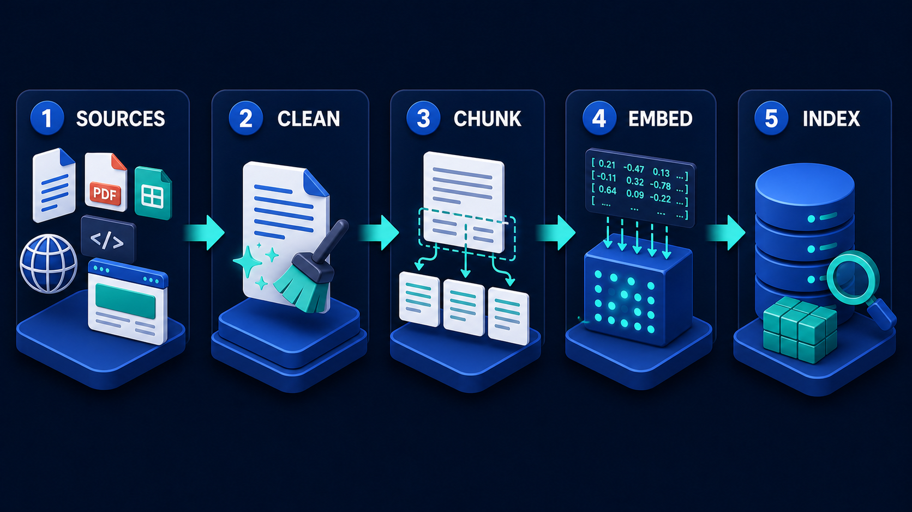
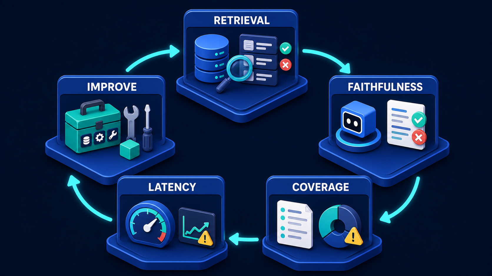

# Diagram 17 — Grounded Citations

![Four panels on dark navy. EVIDENCE shows a database and magnifier with four numbered source cards coloured teal, blue, purple and amber. ANSWER shows a white document whose four bullet lines are tinted in the same four colours, with matching connector wires running back to the evidence. CITATIONS shows four numbered chips in the same colours, each fed by an arrow of its own colour. VERIFY shows a person holding a magnifying glass to a checklist repeating all four numbered items with green ticks. A dashed teal path runs along the bottom from VERIFY back to EVIDENCE through an amber warning shield.](../diagrams/17-grounded-citations.png)

**Module:** 3 — RAG evidence
**Role in the course:** evidence and citation review
**Layout:** four panels with colour-threaded claim tracing and a return path

---

## At a glance

Four stages — **EVIDENCE → ANSWER → CITATIONS → VERIFY** — with a colour assigned to each source and carried unbroken through every stage.

The colour threading is the diagram's whole method and it is unusually well executed. Source 1 is teal at the evidence stage, its claim is teal in the answer, its citation chip is teal, and it appears as a teal row in the verification checklist. You can trace any single claim back to its origin with your eye, without reading a word.

That traceability is the definition of grounding. An answer is grounded not because it was produced from retrieved documents, but because **each specific claim can be resolved to a specific source**.

---

## What the diagram teaches

### 1. Grounding is per-claim, not per-answer

The most common misunderstanding of RAG is that grounding is a property of the whole answer: we retrieved documents, we generated from them, therefore the answer is grounded.

This diagram refuses that. Look at the ANSWER panel — it does not have one colour. It has **four differently-coloured bullet lines**, each wired back to a different source. The unit of grounding is the claim, not the response.

The distinction has teeth. An answer containing four claims, three of which are supported by retrieved evidence and one of which the model produced from its own parameters, is not 75% grounded. It contains one ungrounded assertion, and unless claims are tracked individually, nobody can tell which one.

Per-claim grounding also exposes the case that per-answer grounding hides: a claim that is *partially* supported. The source says something adjacent but not quite what the answer asserts. Only claim-level tracing surfaces that.

### 2. The four source types are deliberately different

The evidence panel shows four numbered cards with different content icons: an **image**, a **bar chart**, a **document**, and a **table**.

Evidence is heterogeneous. A claim may rest on prose, on a number in a table, on a figure, or on a chart. Each is citable, and each needs a different treatment when you assemble and verify it.

The table case is the awkward one worth naming. Citing "the table on page 14" is not sufficient if the claim depends on one cell of it. Grounding a numeric claim means resolving to the specific row and column, which requires that your ingestion preserved table structure — a requirement that reaches back into the pipeline:

If tables were flattened to text at ingestion, cell-level citation is impossible at answer time. Citation quality is decided upstream.

### 3. Citations are objects, not decorations

The third panel gives citations their own stage and draws each one as a **solid numbered chip on its own platform**. Not superscript marks appended to text — discrete objects with identity.

Treating a citation as an object rather than a formatting flourish implies four things it must do:

- **Resolve.** Clicking, or looking up, citation 3 must produce the actual source passage. Not the document — the passage.
- **Persist.** The citation must still resolve months later, from a different system, after the answer has been copied into a report. This is the argument for content addresses rather than call parameters.
- **Carry provenance.** Document identity, revision, section, and date. "The policy handbook" is not a citation; "policy handbook v14, §4.2, effective March" is.
- **Be verifiable independently.** Someone who did not run the query must be able to check the claim against the source.

### 4. Verify is a human stage, and the diagram is explicit about it

The fourth panel shows a **person holding a magnifying glass up to a checklist**. Not an automated validator. A person, physically inspecting.

The checklist repeats all four numbered items with green ticks — the same numbers, the same colours. What is being checked is the correspondence between each claim and its cited source.

Placing a human here is a deliberate claim about where automated grounding checks stop. Automation can confirm that a citation resolves, that the cited passage was in context, and that the claim is textually similar to the source. It cannot reliably confirm that the source *actually supports* the claim — that the inference from passage to assertion is sound. In a domain where being wrong has consequences, that judgement is human.

### 5. The return path carries an amber shield, and that is the failure route

Along the bottom, a dashed teal path runs from VERIFY back to EVIDENCE, passing through an **amber warning shield**.

This is what happens when verification fails. A claim that does not check out sends the process back to the evidence stage — retrieve differently, retrieve more, or conclude that the evidence does not exist and the claim must be withdrawn.

The amber shield in the middle is the signal that something did not pass. Its position on the path, rather than at either end, marks it as the *reason* for the return rather than a stage in its own right.

The important design consequence: **the loop must be cheap enough to run**. A verification process that discovers a problem and has no affordable way to act on it will be quietly skipped. Reviewers need to be able to reject a claim and get a corrected answer without restarting the entire task.

### 6. Ungrounded claims are the failure this prevents

The diagram shows four claims and four sources. Every claim has a wire.

The failure it exists to prevent is the fifth claim — the one with no wire. In practice these appear because the model is a competent writer and competent writing includes connective assertions. The retrieved evidence supports three points; the model produces a fourth as a synthesis, a summary, or a bridging statement. It is fluent, plausible, often correct, and unsupported.

Enforcing the structure — every claim gets a colour, a wire, and a chip — makes the unsupported one visible, because it is the one that cannot be assigned a number.

---

## Case study — Ridgeway Health, clinical guidance

Ridgeway is a hospital group running an assistant that answers clinical policy questions for staff: medication protocols, escalation criteria, infection control procedures, consent requirements. It does not make clinical decisions. It answers questions about what the guidance says.

The distinction is critical and it is why citation quality was the project's central requirement rather than a feature.

### Why per-answer grounding failed the review

The first build retrieved relevant guidance and generated an answer, listing the source documents at the bottom.

Their clinical governance committee rejected it before it left pilot. The objection was precise: **a list of documents at the bottom of an answer does not tell a clinician which document supports which statement.**

The example that ended the discussion was a four-sentence answer about a medication protocol. Three sentences came from the current protocol document. The fourth — a statement about monitoring frequency after the first dose — did not appear in any retrieved source. It was correct, as it happened, matching general practice. It was also unsupported by anything Ridgeway had approved.

A clinician reading that answer, seeing the current protocol cited at the bottom, would reasonably conclude that all four statements came from it. Three did.

The committee's position was that the system was producing a document that *looked* like it carried institutional authority for statements that did not.

### The rebuild

**Evidence, numbered and typed.** Every retrieved passage is assigned a number and carries its type: protocol document, formulary entry, national guideline, local variation. The type matters clinically — a local variation supersedes a national guideline within Ridgeway, and a clinician needs to see which they are being told.

**Claims, individually attributed.** The answer is generated as a set of discrete claims, each carrying the number of the evidence that supports it. Any claim that cannot be attributed is not emitted. The assistant produces a shorter answer rather than an unsupported one.

This changed the output's character. Answers became less fluent and more list-like. Several clinicians said they preferred it — a numbered set of attributed statements reads more like the guidance documents they are used to than flowing prose does.

**Citations that resolve to passages.** Each citation resolves to the specific paragraph, not the document. A clinician can expand any claim and see the exact source text, with the document identity, version and effective date.

The version and date turned out to be the most-used elements. Protocols change, and the first question a senior clinician asks about a surprising statement is "which version is that from?"

**Verification, with two levels.** Automated checks run on every answer: does every claim carry a citation, does every citation resolve, was the cited passage actually in the context, and is the cited document current rather than superseded.

Human verification applies to a sample and to anything flagged. The clinical governance team reviews a weekly sample of answers, checking not that citations resolve — automation covers that — but that the cited passage genuinely supports the claim.

That is the check automation cannot do, and it catches a specific failure: a claim that is a *reasonable inference* from the source rather than a statement of it. About one answer in forty in early sampling. The source says a monitoring interval applies to one patient group; the answer states it generally.

### The return loop in practice

When a reviewer rejects a claim, the loop matters. Ridgeway made rejection cheap: a reviewer marks the claim, selects a reason from a short list — not supported, partially supported, wrong source, superseded — and the question is re-run with that evidence excluded and the reason recorded.

Rejections feed a weekly report. Patterns in it have surfaced three real problems: a protocol document that had been superseded without its replacement being ingested, a section of guidance whose formatting broke chunking so it retrieved poorly, and a category of question the corpus simply did not cover, where the correct output is "this is not addressed in Ridgeway guidance."

That last one produced the most valuable change. The assistant now says when the corpus does not answer a question, rather than assembling something adjacent. Coverage gaps became visible instead of being papered over — a distinction the evaluation loop tracks explicitly:

### What it cost

Answers are about 40% longer in rendered form, because attribution takes space. Generation is slower, because claims are produced and attributed rather than written freely. And the assistant declines to answer roughly 12% of questions it would previously have answered, because the evidence does not support a claim.

The governance committee considered all three of those improvements.

### The measure that mattered

Twelve months in, the number they report is the proportion of sampled answers containing an unsupported claim: **under 0.5%**, against a pre-rebuild baseline of roughly 8% found in the pilot review.

The residual cases are almost entirely the inference problem — claims that are defensible extensions of the source rather than statements of it. That is a judgement boundary, not a bug, and it is why the human stage remains.

---

## Composition

Four panels sit in a row, headed **EVIDENCE**, **ANSWER**, **CITATIONS** and **VERIFY**. A colour is assigned to each of four sources and carried across all four panels.

Along the bottom, a dashed teal path runs from beneath VERIFY, leftward across the full frame, through an **amber warning shield** on a small platform at centre, and turns upward into EVIDENCE.

## Element by element

**EVIDENCE**
A blue database stack with a magnifying glass, and four numbered source cards stacked diagonally. Card **1** is teal and shows an image icon; **2** is blue and shows a bar chart; **3** is purple and shows a document; **4** is amber and shows a table. Four sources, four media types.

**ANSWER**
A large white document in an application window. Its four content lines are tinted **teal, blue, purple and amber** respectively, each with a matching square marker. **Coloured connector wires** run from the left edge of each line back to its corresponding evidence card.

**CITATIONS**
Four numbered chips on individual platforms, arranged vertically: **1** teal, **2** blue, **3** purple, **4** amber. Each is fed by an arrow **in its own colour** leaving the corresponding line in the answer.

**VERIFY**
A person standing on a platform, holding a **magnifying glass** up to a large checklist panel. The checklist repeats all four numbered items in their original colours, each with a **green tick** on the right.

**The return path**
A dashed teal line running the width of the frame from VERIFY back to EVIDENCE, passing through an **amber shield with a white exclamation mark**.

## Colour and flow semantics

- **Four distinct source colours** — teal, blue, purple, amber — carried unbroken through all four stages. This is the diagram's primary device.
- **Solid coloured arrows** carry claims to their citations; each arrow matches its claim's colour.
- **Cyan dashed arrows** carry the verified items into the final checklist, distinguishing the verification flow from the claim flow.
- **Amber** on the return path marks failure. Its mid-path position identifies it as the reason for the return rather than a stage.
- **Green ticks** appear only in the verification panel, marking individually checked items.

## How to present it

**Show it and ask them to trace one claim.** Before explaining anything. Pick the purple line and ask the room where it came from and where it goes. They will trace it in a couple of seconds. That immediacy *is* the argument — grounding means a human can follow a claim to its source without effort.

**Then ask what a fifth, uncoloured line would mean.** This is the best question in the session. An unsupported claim. Ask how they would spot one in their own system's output. Most cannot, because their citations sit at the answer level.

**Draw the per-claim versus per-answer distinction hard.** Ask whether an answer with four claims and three supporting sources is grounded. The instinct is to say mostly. The correct answer is that one claim is unsupported and nobody can say which. Ridgeway's medication example is worth telling, because the unsupported claim was *correct* — which is what makes it dangerous rather than obviously broken.

**Interrogate what a citation must do.** Push past "shows the source." Resolve to a passage, persist beyond the session, carry version and date, be checkable by someone who did not run the query. Then ask whether their current citations do all four. The version-and-date requirement is usually the gap.

**Point at the table icon.** Ask how you cite a number in a table. This reaches back into ingestion — cell-level citation is impossible if tables were flattened during extraction. It is a good illustration that citation quality is decided at build time, not answer time.

**Ask why the verify stage has a person in it.** Then draw the line between what automation can check — does the citation resolve, was the passage in context, is the document current — and what it cannot: does the source actually support the claim. The inference gap is where human review earns its cost.

**Make the return loop concrete.** Ask what happens when a reviewer says "that's not what the source says." If the answer is "we file a bug," the loop does not exist. Ridgeway's four-reason rejection and re-run is a cheap model worth describing.

**Close on the trade.** Attribution makes answers longer, slower, and more likely to decline. Ask whether that is a cost or a feature in their domain. In regulated and professional contexts the honest answer is usually that declining to answer is the product working correctly.

**Timing.** Twenty-five minutes. Thirty-five if you run the fifth-claim discussion properly, which is the part that changes how people build.

---

## Lab and checkpoint

**Lab:** Take one answer your system has produced and break it into individual claims. For each claim, identify the source type, the citation object, and whether a human could verify it from the provided evidence. For any claim with no source or no verifiable citation, rewrite the answer to decline, qualify, or cite properly.

**Checkpoint:** Why is grounding per-claim and not per-answer?

**Answer:** Because an answer can contain one well-supported claim and one unsupported claim. If the entire answer is marked as grounded because one part has a source, the unsupported claim is smuggled through. Per-claim grounding forces every statement to carry its own evidence.

## Glossary

- **Citation object** — a structured record that links a claim to a specific source and passage.
- **Claim** — a single assertion in the answer that needs its own evidence.
- **Grounding** — the requirement that each claim is tied to a source the user can verify.
- **Source** — the document or passage that supports a claim.
- **Ungrounded claim** — an assertion with no source, or with a source that does not verify it.
- **Verify** — the human stage that checks each claim against its citation.

## Sources

- Grounded generation and attribution in RAG systems
- Citation extraction and per-claim verification patterns
- Regulated-domain answer design and decline-to-answer controls
