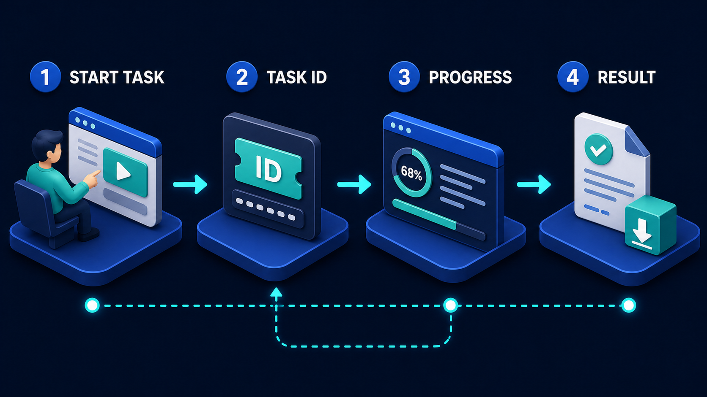

# Diagram 20 — A2A Task Lifecycle

![Five numbered panels on dark navy — MESSAGE showing a person at a composer window with a teal send button; TASK showing a teal clipboard card reading TASK ID a2a_7f3c9b2d with calendar and clock rows; WORKING showing a robot inside a teal progress ring at 65% with gear and database status chips; ARTIFACT showing a white document badged with a teal cube; and COMPLETED showing a large teal check disc above a printer issuing a receipt. A bright cyan rail runs beneath all five panels with arrows pointing up into every stage.](../diagrams/20-a2a-task-lifecycle.png)

**Module:** 4 — A2A collaboration
**Role in the course:** core A2A object model
**Layout:** five numbered stages with an observability rail beneath

---

## At a glance

Five stages: a message arrives, becomes a task, the task works, produces an artifact, and completes. Beneath them, a bright cyan rail with **arrows pointing up into every single stage**.

The diagram is defining an object model rather than describing a flow. Its content is that **message, task and artifact are three different things** — a distinction that sounds pedantic and turns out to be the difference between a system you can operate and one you cannot.

---

## What the diagram teaches

### 1. A message is not a task

Stage 1 is a person composing something and pressing send. Stage 2 is a clipboard with an identifier on it. Two panels, because two objects.

**A message is a communication.** It arrives, it is read, it is understood. It has a sender and content. It is transient — its job is finished once it has been interpreted.

**A task is a commitment.** It has an identity, a state, a lifespan, and an owner. It exists independently of the conversation that created it. It can be looked up, reported on, cancelled, and audited.

Systems that conflate these end up unable to answer basic operational questions. "How many pieces of work are in flight?" has no answer if work is represented by messages, because a message is not a thing that persists. "What is the status of the request Priya made this morning?" requires the work to have an identity.

The transformation at stage 2 is where a request becomes a managed object. Everything after depends on it having happened.

### 2. The task ID is drawn as literal text, and that is deliberate

Stage 2 shows a dark inset panel reading **TASK ID / a2a_7f3c9b2d**. Not a placeholder, not an abstract token symbol — a value you could type.

Making it concrete asserts that the identifier is the interface. It is what the caller holds, what status checks present, what artifacts are associated with, what audit records reference, and what a human quotes when asking about a piece of work.

The clipboard also carries **calendar and clock rows**, which is a second claim: a task has temporal properties. When it was created, when it is expected, when it expires. Work that takes time needs to be reasoned about in time.

### 3. Working is a state, not a gap

Stage 3 shows a robot inside a **teal progress ring reading 65%**, with two status chips below — a gear and a database.

The ring says the task exposes progress. The chips say it exposes *what it is currently doing*. Both matter, and the second is often more useful than the first: "65%" tells you it is moving; "querying the database" tells you whether it is stuck on the thing you would expect.

This shares its shape with durable MCP work, and the resemblance is not accidental:

The difference is what is on the other side. There, a capability server executes deterministic work you specified. Here, another **agent** is exercising judgement on work you described. The lifecycle looks similar; the uncertainty about what comes back is much higher, which is why stage 4 gets its own panel.

### 4. An artifact is not a message either

Stage 4 shows a white document carrying a **teal cube badge**. A produced object with substance, not a reply.

The distinction from a message is the same one as at the front of the pipeline, mirrored. A reply is conversational — it responds to what you said. An **artifact** is a deliverable: it has a type, a schema, content that stands on its own, and an existence independent of the exchange that produced it.

Three properties follow:

- **It can be validated.** An artifact has a declared shape you can check against. A conversational reply cannot be validated, only read.
- **It can be stored and referenced.** It outlives the task. An audit record can point at it.
- **It can be rejected.** Because it has a shape and content that can be evaluated, you can decide it is unacceptable — which is the entire basis of the validation gate in the delegation security pipeline.

An agent that returns prose has not returned an artifact, and everything downstream that depends on validation becomes impossible.

### 5. Completed is a distinct state from artifact produced

Stages 4 and 5 are separate. The artifact exists; then the task completes.

That separation allows things that a merged stage does not. A task may produce **several** artifacts before completing. A task may produce an artifact and then fail during finalisation. A task may complete with no artifact — legitimately, if the answer is "no action required."

Stage 5's iconography reinforces it: a large teal check **and** a printer issuing a receipt. Two things — the state transition, and the durable record of it. Completion is not just a flag flipping; it produces evidence.

### 6. The rail underneath is the diagram's most important element

A bright cyan rail runs beneath all five panels with **arrows pointing up into each one**.

This is observability, and drawing it as arrows *into* every stage rather than a line beneath them makes a specific claim: **the task's state is inspectable at every point**, not only at the end.

The practical consequence is that a caller is never in the dark. At any moment, presenting the task ID answers: what state is this in, how far along, what is it doing, has anything been produced, has it finished.

Compare this to the alternative that teams build by default — fire a request, wait, get a response or a timeout. Under that model the entire middle of the process is opaque, and a task that is slow is indistinguishable from a task that is dead.

The rail is also what makes the four interaction modes possible. Wait, stream, poll and push are four different ways of consuming the information this rail exposes:

Without observable state, only the first of those four is available.

### 7. The states shown are the happy path

Five stages, all successful. Real task lifecycles include at least **failed**, **rejected** (the specialist declined the task), **cancelled**, and often **input-required** (the specialist needs clarification before proceeding).

The last one is distinctive to agent delegation and worth naming when teaching. A capability call cannot ask you a question. An agent can — and a lifecycle with no state for "waiting on the caller" forces that interaction into either a failure or a guess.

---

## Case study — Polyglot, localisation for a games studio

Wolfsbane Studios ships a game in fourteen languages. Localisation is continuous: new quest text, item descriptions, UI strings and dialogue land weekly, and each batch needs translation, cultural review, and length-checking against UI constraints.

They use Polyglot, a localisation vendor whose agent accepts translation work. Wolfsbane's content pipeline agent delegates to it.

### Why it could not be a tool call

The first integration modelled translation as a capability call: `translate(strings, target_locale)`.

It failed for reasons that are all visible in this diagram.

**It took too long.** A batch of two thousand strings with cultural review takes between forty minutes and six hours depending on volume and whether human reviewers are involved. No request/response model survives that.

**It came back with things they had not asked for.** Polyglot's agent flags strings it cannot translate faithfully — idioms with no target equivalent, text exceeding UI length limits after translation, terms conflicting with the established glossary. A function signature returning `string[]` has nowhere to put that.

**It sometimes needed to ask.** About one batch in five contained ambiguity requiring a decision: is this a proper noun or a common one, is this the same "Fire" as the spell or a different one. The tool call had no way to ask, so it guessed, and the guesses shipped.

### The lifecycle as built

**Stage 1 — Message.** Wolfsbane's pipeline agent sends a message describing what it needs: this string batch, these locales, this glossary version, these UI length constraints, this content rating context.

The message is not the work. It is the request for work, and Polyglot's agent reads it and decides whether it can accept.

**Stage 2 — Task.** Polyglot creates a task and returns its ID. Wolfsbane stores it against the content batch in their own build system.

That storage is what makes the rest operable. A build engineer looking at a pending batch sees the task ID, and can ask about it without needing the conversation that created it. When a build is blocked on localisation, the question "which task, and where is it?" has an answer.

The task carries a deadline. Wolfsbane's build cadence means a batch not returned within eighteen hours needs to be handled differently, and encoding that in the task rather than in a timeout means Polyglot's agent can see the constraint and prioritise.

**Stage 3 — Working.** Polyglot's agent exposes both progress and phase. Phase turned out to be the more useful signal: `machine_translation`, `glossary_check`, `human_review`, `length_validation`, `finalising`.

A task sitting in `human_review` for four hours is normal — a human is reading it. A task sitting in `glossary_check` for four hours is stuck. Percentage alone cannot distinguish those.

**Stage 4 — Artifact.** Polyglot returns a structured artifact per locale, containing translated strings keyed to source IDs, per-string confidence, flagged items with reasons, glossary matches applied, and length-validation results.

This is where the artifact-versus-reply distinction pays off. Wolfsbane validates the artifact before accepting it: every source key present, no string exceeding its declared length limit, glossary version matching what was requested, flagged-item count within threshold.

Artifacts failing validation are rejected back to Polyglot with the specific failure. This happens for around 3% of tasks, usually length violations where the target language ran long.

**Stage 5 — Completed.** Task closes with a receipt recording what was delivered, when, against which glossary version, with which flags outstanding. This feeds Wolfsbane's localisation audit trail, which matters for age-rating certification in several territories.

### The state they had to add

**input-required.** The one-in-five ambiguity case.

Polyglot's agent moves the task to `input_required` with a structured question: this string, this ambiguity, these options. Wolfsbane's pipeline agent surfaces it to a content designer, who answers, and the task resumes.

Before this state existed, the ambiguity was resolved by guessing. The guesses shipped, and were found later by players — including one where a character's name was translated as a common noun across an entire language, which required a patch.

The state costs latency: a task can sit waiting on a human for hours. Wolfsbane considers that trade obviously correct, because the alternative was shipping wrong text.

### What the rail gave them

Wolfsbane's build dashboard shows every in-flight localisation task with its state, phase, elapsed time and deadline. A build engineer can see that four batches are in human review, one is blocked awaiting a designer's answer, and one has been in glossary check for longer than usual.

None of this required Polyglot to build anything bespoke. It falls out of the task having an ID and an inspectable state.

The number they cite: **time-to-diagnose a stalled batch went from around ninety minutes to under two.** Previously, a batch that had not come back meant emailing the vendor. Now it means looking at a phase.

### The distinction they teach internally

Wolfsbane's engineering onboarding uses three sentences that map exactly onto this diagram:

- *A message is what you say.*
- *A task is what you own.*
- *An artifact is what you get.*

New engineers who hold that distinction do not build the `translate()` function that fails four different ways.

---

## Composition

Five dark rounded panels sit in a row, each headed by a blue numbered circle and a white uppercase label:

**1 MESSAGE → 2 TASK → 3 WORKING → 4 ARTIFACT → 5 COMPLETED**

Cyan arrows connect the panels. Beneath the row runs a **bright cyan rail** that turns upward into each of the five panels with an arrowhead, giving five vertical connections rather than a single horizontal line.

## Element by element

**1 MESSAGE**
A person seen from behind at a white composer window showing an avatar tile, text lines and a **teal send button** with a paper-plane glyph. A communication being sent.

**2 TASK**
A **teal clipboard card** with a metal clip at the top, carrying a dark inset panel reading **TASK ID** and, beneath it in cyan, **a2a_7f3c9b2d**. Below that, two rows with a **calendar icon** and a **clock icon**. An owned object with identity and temporal properties.

**3 WORKING**
A blue cube robot on a disc, encircled by a **teal progress ring reading 65%**. Below, two dark status chips carrying a **gear** and a **database** icon. Progress and current activity.

**4 ARTIFACT**
A white document with a folded corner, carrying a **teal cube badge** and text lines. A produced deliverable with a type.

**5 COMPLETED**
A large **teal check disc** above a blue printer issuing a white receipt that carries its own **green check** and text lines. State transition plus durable record.

**The observability rail**
A bright cyan horizontal line beneath all five panels, with five vertical branches turning upward and terminating in arrowheads inside each panel.

## Colour and flow semantics

- **Cyan arrows** move the lifecycle forward between stages.
- The **rail's arrows point up into the panels**, not along beneath them — state is read *from* each stage, at any time.
- **Teal** marks everything belonging to the task itself: the send button, the clipboard, the progress ring, the artifact badge, the completion check.
- No coral appears. This diagram shows only successful states, which should be stated when teaching, since failed, rejected, cancelled and input-required all exist.

## How to present it

**Ask for the difference between a message, a task and an artifact.** Before showing anything. Most rooms treat all three as "the request" and "the response." The three-way split is the session.

**Point at the literal task ID.** `a2a_7f3c9b2d`. Ask what a caller does with it. Then ask what they currently hold after firing a request at another system. Usually nothing — which means they cannot ask about it, cancel it, or audit it.

**Ask why artifact and completed are separate panels.** Push until the room produces the cases: multiple artifacts, artifact then failure, completion with no artifact. Each is a real scenario that a merged stage cannot represent.

**Then ask what makes an artifact different from a reply.** Validatable, storable, rejectable. The third is the one that matters — you cannot reject prose in any structured way, and rejection is the basis of the artifact-validation gate later in the module.

**Spend real time on the rail.** Ask what it means that arrows point *into* every stage. Then ask what their current visibility is into work they have delegated. The honest answer for most is: none until it returns or times out. The follow-up — how do you distinguish slow from dead — has no good answer without this.

**Name the missing states out loud.** Failed, rejected, cancelled, and especially **input-required**. Ask what happens today when a specialist needs a clarification. The answer is usually that it guesses, and Wolfsbane's translated character name is a good illustration of what that costs.

**Contrast with the durable MCP task.** Show the two together and ask what is different. Same lifecycle shape; the other side is deterministic in one and exercising judgement in the other. That difference is why artifact validation matters here and does not there.

**Leave them the three sentences.** A message is what you say. A task is what you own. An artifact is what you get. It is the most portable thing in this diagram.

**Timing.** Twenty minutes. Thirty if you work through the missing states, which is where teams find the gap in their own design.

---

## Lab and checkpoint

**Lab:** Model one delegated workflow in your system as an A2A task lifecycle. Define the message, the task ID, the working state, the artifact, and the completed state. Then add the four missing states — input-required, rejected, cancelled, and failed — and write what the caller and the specialist each do when one of them occurs.

**Checkpoint:** Why is an artifact different from a plain reply?

**Answer:** Because an artifact is a typed, validatable, storable, and rejectable deliverable. A plain reply is prose that cannot be validated or rejected in a structured way. The artifact's structure is what makes the artifact-validation gate possible later.

## Glossary

- **Artifact** — a produced deliverable with a declared type and schema.
- **Cancelled** — a terminal state where the caller withdrew the task.
- **Completed** — the terminal state where the task is finished and a receipt is produced.
- **Failed** — a terminal state where the task could not be completed.
- **Input-required** — a state where the specialist needs clarification before continuing.
- **Message** — what the caller sends to initiate or continue a task.
- **Rejected** — a state where the specialist declines to accept the task.
- **Task** — the managed work with an identity and lifecycle.
- **Task ID** — the persistent identifier for a task.
- **Working** — the state where the specialist is actively doing the work.

## Sources

- A2A task lifecycle and artifact model
- Durable task and polling patterns
- Message, task, and artifact distinction in agent protocols
