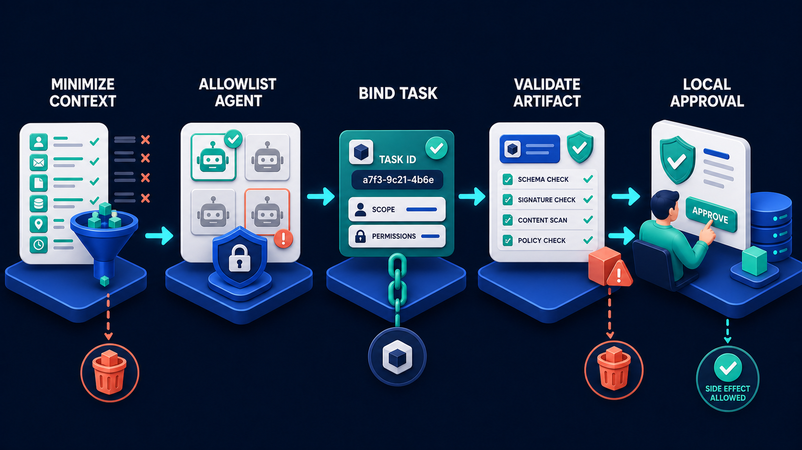

# Diagram 21 — A2A Delegation

![A horizontal delegation on dark navy. CALLER AGENT, a blue robot on a disc, connects to TASK, a white card with a teal target icon and a checklist of two ticks and one empty dashed box. The task crosses a glowing blue bridge flanked by two code-bracket pylons to SPECIALIST AGENT, a teal robot, which produces ARTIFACT, a teal parcel with a white receipt attached. Bottom left, a separate platform labelled DOMAIN + POLICY holds a database, coral shield and receipt, with a dashed arrow rising only into the caller. A teal return line runs along the bottom from the artifact back through the specialist to the task.](../diagrams/21-a2a-delegation.png)

**Module:** 4 — A2A collaboration
**Role in the course:** bounded delegation design
**Layout:** horizontal flow across a boundary, with policy anchored locally

---

## At a glance

A caller creates a task, sends it across a bridge to a specialist, and receives an artifact back. Meanwhile, on a separate platform in the bottom-left corner, **DOMAIN + POLICY** connects upward into the caller only — and never crosses the bridge.

That corner platform is the diagram's argument. Delegation moves *work*. It does not move *authority*, and it must not move your policy.

---

## What the diagram teaches

### 1. The bridge is drawn as architecture because it is a boundary

The centre of the frame is a **glowing blue bridge flanked by two pylons marked with code brackets** `<>`. It is the only structural object in the diagram — everything else is a robot, a document, or a platform.

Drawing the crossing as built architecture makes the point that a boundary has to be constructed. It is not a network hop. It is a place where two systems with different owners, different security postures, different failure modes and different release cycles meet, and where a protocol has to be agreed.

The bracket pylons are what makes the bridge passable: a shared schema. Without an agreed shape for tasks and artifacts, there is nothing to cross on.

### 2. The task card shows incomplete work, and that is the whole design

Look closely at the **TASK** card. It has a teal target icon and a checklist with **two ticked items and one empty dashed box**.

The empty box is the most carefully placed detail in the diagram. The task is not a completed thing being transmitted — it is a **specification of an outcome, with the outcome not yet achieved**. Two things are settled; one is open, and that open item is what the specialist is being asked to close.

This distinguishes delegation from every other kind of call. When you call a function you send inputs. When you delegate you send a **partially completed object** and ask someone to finish it.

The target icon reinforces it: a task has a goal. Not a set of parameters — an intended end state.

### 3. Bounded means the boundaries are in the task

The course guide calls this "bounded delegation," and the boundaries are properties of the task object rather than of the relationship.

A well-formed task carries:

- **The outcome sought** — the target.
- **The evidence needed to achieve it** — and nothing beyond that.
- **The constraints** — what the specialist may and may not do, how long it has, what it may spend.
- **The shape of an acceptable answer** — the artifact schema.

The last one is easy to overlook and it is what makes validation possible on return. If you did not say what an acceptable artifact looks like, you cannot reject an unacceptable one on any principled basis.

What a task must *not* carry is everything you happen to have. The context sent across the bridge is the specialist's entire view of the world, and every additional item is data you have exported to another party. That is the first gate of the delegation security pipeline:

### 4. The policy platform is deliberately in the corner and deliberately unconnected

**DOMAIN + POLICY** — a database, a coral shield and a receipt — sits on its own platform at the bottom left, separated from the main flow. A **dashed cyan arrow rises from it into the caller agent**, and nothing else.

Three claims in that placement.

**Policy is local.** It belongs to the caller. It is not sent, not shared, not made available to the specialist.

**Policy governs the caller's actions, not the specialist's.** The arrow points into the caller because that is whose behaviour it constrains. The specialist has its own rules for its own domain; yours apply to what *you* do with what comes back.

**The specialist cannot reach it.** There is no path from the bridge to that platform. Whatever the specialist returns, it does not get to influence your policy — it produces an artifact, and your policy then evaluates it.

This is the structural defence against a specific attack: an artifact whose content attempts to alter the caller's behaviour. If policy lives locally and evaluates artifacts as data, a persuasive artifact is just a rejected artifact.

### 5. The artifact is a parcel with a receipt attached

Stage 4 shows a **teal parcel** — a sealed box, not a document — with a **white receipt attached to its side**.

The parcel says the artifact is a delivered object with contents you have not yet inspected. It arrives closed. You open it, and what is inside may not be what you expected.

The attached receipt says the delivery came with evidence: what was produced, by whom, against which task, when. That pairing — content plus provenance — is what makes an artifact auditable rather than merely useful.

### 6. The return line touches three stages, not one

Along the bottom, a **teal line runs from the artifact back leftward**, with branches rising into the specialist and into the task.

Not a single arrow from artifact to caller. The return path re-associates the artifact with the specialist that produced it and the task that requested it.

That three-way linkage is what makes the delegation auditable after the fact. Given an artifact you can find its task; given a task you can find its artifact and the agent that produced it. An audit record that says only "we received this document" cannot answer who produced it or what they were asked.

### 7. Delegation is not a way to make hard things easy

Worth stating because it is the most common misuse. The correct reason to delegate is that **the work genuinely belongs to someone else** — they own the rules, the data, the expertise, or the accountability.

The incorrect reason is that the work is difficult. Delegating a hard problem you own does not solve it; it makes it someone else's slow, opaque version of your problem, and you still have to validate the answer without the expertise to judge it.

The boundary test from the decision tree applies directly here:

If the answer to "who owns this work" is you, no amount of difficulty makes it a delegation.

---

## Case study — Ashgrove Partners, delegating a tax determination

Ashgrove is an accountancy practice, about 140 staff, serving owner-managed businesses. They built an assistant that helps accountants prepare year-end filings: gathering figures, checking completeness, flagging issues.

One step in that process is determining whether specific expenditure qualifies for a particular capital allowance. It is a judgement call with a lot of case law behind it, and getting it wrong has consequences for the client and for the firm's insurance.

### Why it is a delegation

Ashgrove's tax technical team — four specialists — owns capital allowance determinations. They maintain the firm's position on borderline categories, track case law, and are the people who sign off when a determination is challenged.

The general accountant's assistant should not make that determination. Not because it is hard, but because **the tax technical team owns it**, and they are accountable for it in a way the assistant's authors are not.

So the tax technical team built their own agent, and the general assistant delegates to it.

### What crosses the bridge

The task carries:

- The expenditure items in question — description, amount, date, asset category.
- The client's trade classification.
- The accounting period.
- Whether the client has claimed similar allowances previously.
- The artifact schema for a determination.

The task does **not** carry: the client's name, the rest of their accounts, other matters the accountant is working on, the accountant's conversation with the assistant, or any personal data about the client's directors.

The tax agent receives an anonymised, bounded set of facts sufficient to make the determination, and nothing else. This was a requirement from the firm's data protection review and it turned out to make the delegation cleaner — a task with only relevant facts is easier to reason about and easier to log.

### The open checkbox

Ashgrove's task object literally has the diagram's structure. Two things are settled by the caller: the facts, and the question. One thing is open: the determination.

The tax agent's job is to close that box. It returns:

- **Qualifies / does not qualify / requires human review**, per item.
- The reasoning, with citations to the firm's technical guidance and to legislation.
- A confidence indication.
- Any flags — for instance, that this expenditure type has been challenged before.

The third outcome — **requires human review** — is one they had to add. About 12% of determinations land there, and those go to a human specialist. Before that outcome existed, the agent was forced into a binary answer on genuinely marginal cases.

### Where policy stayed

Ashgrove's policy about *what to do with a determination* never crossed the bridge.

The tax agent says whether expenditure qualifies. Ashgrove's own rules say what happens next, and those rules live entirely on the caller's side:

- A determination above a value threshold requires a partner's sign-off regardless of confidence.
- A determination on a client under HMRC enquiry requires human review regardless of the outcome.
- A "does not qualify" determination on an item the client had expected to qualify triggers a client conversation before the filing is amended.
- No determination is applied to a filing without a named accountant accepting it.

None of these are tax questions. They are firm-governance questions, and the tax agent has no business knowing them or applying them.

The team's own framing: *the specialist tells us what is true; we decide what to do about it.*

### Validating the artifact

Artifacts are checked before they are accepted:

- **Schema** — every submitted item has a determination, no items invented.
- **Citation resolution** — every cited guidance reference resolves to a real document at a current version.
- **Internal consistency** — confidence and outcome are compatible; a low-confidence "qualifies" is routed to review.
- **Scope** — the artifact makes claims only about the items sent, and does not include advice on anything else.

That last check exists because of a real incident. Early in the pilot, the tax agent returned a determination that also included a suggestion about the client's VAT treatment — an area outside the task's scope, based on an inference from the expenditure descriptions.

The suggestion was not unreasonable. It was also unrequested, unvalidated, and would have been passed to an accountant as if it carried the tax team's authority. The scope check now rejects artifacts that make claims beyond the task's boundary.

This is precisely why the policy platform does not connect to the bridge. An artifact that arrives with extra content does not get to expand its own remit; it gets evaluated against what was asked, and rejected if it exceeds it.

### The audit chain

Every determination in a filing links to: the artifact, the task, the tax agent version that produced it, the facts sent, and the accountant who accepted it.

When a determination was queried by HMRC eleven months after filing, reconstructing the basis took about ten minutes. The firm's previous process — an email to the tax team, a reply, both filed somewhere — had taken days and sometimes failed entirely.

### What changed operationally

Determination turnaround went from an average of two days (an accountant emails the tax team, waits) to about ninety seconds for the 88% the agent handles, with the remaining 12% going to a specialist with the facts already assembled.

The tax technical team's own view was the one that mattered for adoption: **they still own the determination**. The rules are theirs, the agent is theirs, and the boundary means the general assistant cannot drift into making tax calls. Before this, accountants had been making borderline determinations themselves and only escalating when unsure, which is exactly the wrong selection criterion.

---

## Composition

The frame reads left to right along a single horizontal axis, with a separate platform anchored at the bottom left.

**CALLER AGENT → TASK → [bridge] → SPECIALIST AGENT → ARTIFACT**

Cyan arrows connect the stages. At the centre, a glowing blue bridge spans a gap, flanked by two pylons. Bottom left, an unconnected platform labelled **DOMAIN + POLICY** sends a single dashed cyan arrow upward into the caller agent.

Along the bottom of the main flow, a **teal return line** runs leftward from the artifact, with branches rising into the specialist agent and into the task.

## Element by element

**CALLER AGENT**
A blue cube robot on a glowing blue disc. The initiating party, and the only object the policy platform connects to.

**TASK**
A large white card with a rounded square **teal target icon** at its top left and text lines beside it. Below, a checklist: two rows with **teal check boxes**, and one row with an **empty dashed box**. Work specified but not complete.

**The bridge**
A glowing blue arc spanning a gap, flanked left and right by dark blue pylons each carrying a `<>` code-bracket glyph. The constructed boundary, passable because a schema is agreed.

**SPECIALIST AGENT**
A teal cube robot on a glowing teal disc, on the far side of the bridge. Different colour from the caller, marking it as a different party.

**ARTIFACT**
A **teal parcel** — a sealed box with a dark band across its top — with a **white receipt** bearing a teal check attached to its front. Delivered contents plus provenance.

**DOMAIN + POLICY**
A separate blue platform bottom left, holding a stacked blue database, a **coral shield with a white check**, and a white receipt. A dashed cyan arrow rises from it into the caller agent, and connects to nothing else.

**The return line**
A teal line running along the bottom of the main flow from the artifact leftward, with two upward branches into the specialist agent and the task.

## Colour and flow semantics

- **Blue** for the caller, **teal** for the specialist — different parties, visually distinct.
- **Cyan solid arrows** carry work forward across the bridge.
- The **teal return line** carries the result and re-links it to both the producing agent and the originating task.
- The **dashed cyan arrow** from policy is the only dashed connection in the diagram, marking it as a governing relationship rather than a flow of work.
- **Coral** appears once, on the policy shield, on a platform that connects only to the caller.
- The **bridge** is the only architectural structure, marking the boundary as something built rather than assumed.

## How to present it

**Point at the corner platform first.** Before walking the flow. Ask what it is connected to, and let the room notice it touches only the caller. Then ask what it would mean if a line ran from it across the bridge. The answers — you would be exporting your rules, or worse, letting the specialist apply them — are the session's core.

**Ask what the empty dashed checkbox means.** This is the best small detail in the library. The task is incomplete by design; the open item is the delegation. Contrast with a function call, where you send complete inputs.

**Ask what belongs in a task.** Build the list: outcome, evidence, constraints, artifact shape. Then ask which of the four their current integrations specify. The artifact shape is usually missing, and its absence is why they cannot validate returns.

**Ask why the bridge is drawn as a structure.** Different owner, different release cycle, different failure modes, agreed schema. It is not a network call. Teams that treat it as one discover the difference during the other party's incident.

**Interrogate the parcel.** Ask why the artifact is a sealed box rather than an open document. It arrives closed; you do not know what is in it until you look. That framing leads naturally to validation, and to the Ashgrove case where an artifact arrived with unrequested VAT advice attached.

**Draw the delegation test.** Ask for a piece of work they might delegate, then ask who owns it. If the answer is "us, but it's hard," it is not a delegation. Ashgrove's framing is portable: *the specialist tells us what is true; we decide what to do about it.*

**Follow the return line with your finger.** Artifact → specialist → task. Ask what an audit record needs to contain to answer "who determined this and what were they asked." Most teams record only the result.

**Timing.** Twenty minutes. Thirty if you work through what a task object should contain for one of their own integrations, which usually reveals a missing artifact schema.

---

## Lab and checkpoint

**Lab:** Pick one cross-team or cross-vendor handoff in your system. Write the delegation task as an A2A task object: outcome, evidence, constraints, and artifact shape. Then write the artifact schema the caller would use to validate the return, and the audit record that would answer "who determined this and what were they asked."

**Checkpoint:** Why does the policy platform connect only to the caller, not across the bridge?

**Answer:** Because the caller owns the policy decision. The specialist provides information and artifacts, but the caller decides what to do with them. Exporting the policy platform across the bridge would mean either forcing your rules on another party or letting them make decisions in your domain.

## Glossary

- **Artifact schema** — the declared shape and type that a delegated task's output must match.
- **Bridge** — the agreed boundary between the caller and the specialist, defined by a shared schema.
- **Caller agent** — the party that initiates a task and owns the policy decision.
- **Delegation** — handing work to another agent while retaining ownership of the outcome.
- **Domain + Policy** — the caller's rules that govern how the specialist's result is used.
- **Sealed artifact** — a delivered artifact that must be opened and validated by the caller.
- **Specialist agent** — the party that receives the task and works on it.
- **Task object** — the structured description of the work to be delegated.

## Sources

- A2A delegation and task object model
- Cross-agent boundary and schema contract patterns
- Artifact validation and policy ownership in multi-agent systems
