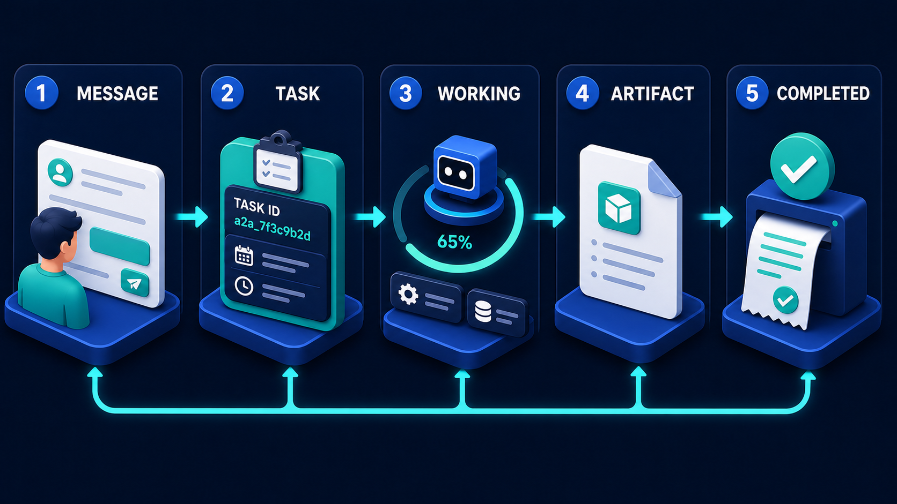

# Diagram 22 — A2A Interaction Modes

![Four side-by-side panels on dark navy. WAIT shows a request window and an arrow to a completed answer document. STREAM shows a request fanning out to EVENT 1, EVENT 2, EVENT 3, an ellipsis and EVENT N, each with a progress bar, labelled LIVE SEQUENCE OF PROGRESS EVENTS. POLL shows a CLIENT (BY TASK ID) window issuing four repeated GET STATUS TASK_ID requests with dashed returns, against responses RUNNING with a clock, IN PROGRESS in amber, FAILED in red, and SUCCEEDED in teal. PUSH shows a SERVICE (REGISTERS WEBHOOK) with a REGISTER WEBHOOK arrow to a database carrying a coral bell, and a dashed path through a teal check cube marked COMPLETION NOTIFICATION (PUSH).](../diagrams/22-a2a-interaction-modes.png)

**Module:** 4 — A2A collaboration
**Role in the course:** client-progress design
**Layout:** four independent comparison panels

---

## At a glance

Four ways for a client to find out that delegated work has progressed: **WAIT, STREAM, POLL, PUSH**.

This is the densest image in the library, and it is a genuine comparison rather than a sequence. The four panels are alternatives, and the choice between them is one of the most consequential design decisions in an agent integration — it determines your latency profile, your infrastructure cost, and what your user sees while they are waiting.

---

## What the diagram teaches

### 1. All four consume the same underlying thing

None of these modes exist without an observable task. They are four ways of reading the state that the task lifecycle exposes:

That rail is what all four panels here are drinking from. If the task has no ID and no inspectable state, only the first mode is available — and that is why teams without a proper task object end up stuck with blocking calls and timeouts.

### 2. WAIT is not wrong, it is bounded

The first panel is the simplest: a request, an arrow, a completed answer. One exchange, no intermediate state.

It gets a full panel at equal weight because it is the correct choice for a large share of work. If the specialist responds in under a couple of seconds, everything the other three modes offer is overhead — infrastructure to report on work that is already finished.

The constraint is that **the client is blocked**. Every layer in between — the client's HTTP timeout, the gateway, the load balancer, the user's patience — is holding a connection open. The mode fails not gradually but at a threshold, and the threshold is set by whichever component gives up first.

The design question is not "is waiting bad" but "what is the longest this can take, and is that inside every timeout in the path."

### 3. STREAM gives the user something to watch

The second panel shows a request fanning out to **EVENT 1, EVENT 2, EVENT 3, an ellipsis, EVENT N**, each with its own progress bar, under the label **LIVE SEQUENCE OF PROGRESS EVENTS**.

Two properties distinguish streaming from the others.

**It is ordered.** The events are numbered, and the numbering is meaningful — event 3 happened after event 2. That ordering lets a client render a narrative rather than a status.

**It is pushed over an open channel.** The connection stays up, and the specialist sends as it goes. No polling cost, no registration step.

The cost is the open connection. Streaming has the same fragility as waiting — an interrupted connection loses the stream — with the added complication that a client reconnecting must decide whether to replay from the start, resume from the last event, or give up. That resumption logic is where most streaming implementations get complicated.

The right use is work of moderate duration where the *experience of progress* matters. A user watching a research task assemble sources tolerates thirty seconds far better than a user watching a spinner.

### 4. POLL is drawn honestly, including its cost and its failure state

The third panel is the most detailed, and deliberately so. A **CLIENT (BY TASK ID)** window issues **four separate GET STATUS TASK_ID requests**, each with its own dashed return arrow, against a column of responses headed **TASK STATUS (RESPONSE)**:

- A blue clock — **RUNNING**
- An amber refresh icon — **IN PROGRESS**
- A red exclamation — **FAILED**
- A teal check — **SUCCEEDED**

Two things are being taught that the other panels do not attempt.

**The repetition is drawn.** Four request arrows and four return arrows for one result. This is the honest depiction of polling's cost, and it is the reason the panel looks busier than the others. Multiply it: a thousand clients checking a two-minute task every second is 120,000 requests to deliver a thousand answers.

**FAILED is included.** This is the only place in the library where a failure state appears in a lifecycle diagram, and its presence here is important. Polling is the mode where failure is naturally discoverable — you ask, and the answer is "it failed." Under WAIT a failure looks like an error response. Under STREAM it looks like a stream that stopped. Under PUSH it looks like a notification that never came, which is indistinguishable from a slow task.

The virtue of polling is robustness. Nothing is held open, the client can stop and resume, a restart loses nothing, and every check is a complete stateless request. It is the mode that survives the most.

### 5. PUSH has two phases, and the registration is the interesting one

The fourth panel shows a **SERVICE (REGISTERS WEBHOOK)** on the left with a **REGISTER WEBHOOK** arrow to a database carrying a coral bell, then a dashed path curving below through a teal check cube marked **COMPLETION NOTIFICATION (PUSH)**.

Registration happens first, delivery happens later, and they are separated in time — potentially by hours. That separation is what makes push efficient and what makes it complicated.

The efficiency is obvious: zero traffic while waiting, notification exactly when there is something to say. For long work at scale it is the only mode that does not waste enormous resources.

The complications are all consequences of the gap between the two phases:

- **The client must be reachable.** A publicly addressable, authenticated endpoint that stays up. This excludes a lot of clients immediately.
- **Delivery can fail.** The notification is a network call to you, and it can be lost. Push needs retry semantics and, realistically, a polling fallback for the case where a notification never arrives.
- **The endpoint is attack surface.** Something on the internet that accepts messages claiming work is complete. It must authenticate the sender and verify that the notification corresponds to a task you actually created.
- **Notifications can arrive out of order or twice.** The handler must be idempotent.

The **coral bell** is a good detail — coral marks risk in this library, and a webhook endpoint is genuinely the riskiest element in the four panels.

### 6. Choosing is a per-interaction decision, not a per-system one

The strongest practical lesson is that these are not architectural styles you adopt. A single product will correctly use all four for different interactions, chosen by duration, scale, client capability and what the user is doing while they wait.

A rough decision path:

- **Under ~2 seconds** → WAIT. Anything else is overhead.
- **2–60 seconds, user is watching** → STREAM. The experience of progress is the value.
- **Minutes to hours, or the client cannot hold connections** → POLL. Robust, simple, survives everything.
- **Long work at scale, client is a reachable service** → PUSH, with a poll fallback.

---

## Case study — Cartwright, four modes in one product

Cartwright makes contract lifecycle software for mid-market legal teams. Their assistant does four quite different things, and the team's initial instinct was to pick one interaction pattern and use it everywhere. They chose streaming, because it demoed well.

Six months later they were running all four, and the reasons are instructive.

### Feature 1 — Clause lookup → WAIT

*"What's our standard indemnity wording?"*

Retrieval against the clause library, no delegation, no long-running work. Median response 700 milliseconds, p95 1.4 seconds.

They had built this as a stream, which meant a WebSocket connection, an event protocol, and reconnection handling — for an interaction that finishes before a user could perceive progress. The streaming infrastructure was doing nothing except adding a connection setup that was itself a meaningful fraction of the response time.

Converting it to a plain request/response removed about 200ms of median latency and deleted a substantial amount of code.

**The lesson they wrote down:** if the work finishes faster than a progress indicator can render, progress reporting is not a feature.

### Feature 2 — Contract review → STREAM

*"Review this supply agreement against our playbook."*

Delegated to their risk-review agent. Takes 20–90 seconds depending on contract length, and produces findings incrementally — it works through clauses in order and identifies issues as it goes.

This is the case streaming exists for. The user is a lawyer with the contract open, watching findings appear. Each event is a finding: the clause, the issue, the playbook rule it violates, a suggested change.

The value is not that it feels faster. It is that **the lawyer can start acting on early findings while later ones are still arriving**. By the time the review completes they have already dealt with the first several issues. Under a wait model they would have stared at a spinner for a minute and then received everything at once.

Their reconnection design: events carry sequence numbers, and the client stores the last one received. A reconnecting client sends it and receives everything after. This took longer to build than the streaming itself.

### Feature 3 — Portfolio analysis → POLL

*"Which of our active contracts have auto-renewal clauses expiring in the next quarter, and what's our exposure?"*

Runs across thousands of contracts. Takes between four and forty minutes.

Streaming was untenable — no user watches for forty minutes, and holding a connection that long through their infrastructure was unreliable. They moved to a durable task with polling.

The client backs off: every 2 seconds for the first 30, every 15 seconds thereafter, every 60 seconds after 5 minutes. A forty-minute analysis costs about 60 status checks rather than the 2,400 a fixed 1-second interval would produce.

The property that mattered most was **resumability**. A lawyer can start an analysis, close their laptop, and open the result the next morning. The task ID is stored against their account, and the client picks up wherever it is.

The **FAILED** state earned its place here. Portfolio analyses fail occasionally — a malformed contract, a timeout against the document store. Under the previous design a failure looked identical to a slow analysis, and users waited for results that were never coming. Now a poll returns failed with a reason.

### Feature 4 — Renewal monitoring → PUSH

Not user-initiated. A background service watches contract renewal dates and needs to know when the analysis agent has produced an updated risk assessment — which happens on a schedule, potentially hours after the request.

Nobody is waiting. The client is a service, not a person. Polling would mean a service checking on hundreds of long-lived tasks continuously for hours.

Their webhook implementation carries the four things the mode requires:

- **Authentication.** Notifications are signed; unsigned or badly-signed notifications are discarded and logged.
- **Task correlation.** The notification references a task ID, and the handler verifies that Cartwright actually created that task. This rejects notifications about tasks they never requested.
- **Idempotency.** Notification handling is keyed on task ID plus state, so a duplicate delivery is a no-op.
- **A polling fallback.** Any task with no notification after 150% of its expected duration is polled directly. This fires for around 0.3% of tasks — mostly transient delivery failures, and twice for genuinely lost notifications.

That fallback is the part they consider non-negotiable. Push without a fallback means an undelivered notification is a task that silently never completes.

### The framework they adopted

After the rework, every new interaction goes through four questions:

1. **How long does this take at p95?** Under two seconds means wait.
2. **Is a person watching?** If yes and it takes tens of seconds, stream — but only if partial results are useful before completion.
3. **Can the client hold a connection for the duration?** If no, poll.
4. **Is the client a reachable service and the work long?** Push, with a poll fallback.

Their summary: *the mode is a property of the interaction, not of the product.*

---

## Composition

Four tall panels sit side by side, each headed by a large white uppercase label — **WAIT**, **STREAM**, **POLL**, **PUSH** — with sub-labels in smaller white and coloured text throughout. This is the most annotation-heavy image in the library.

## Element by element

**WAIT**
An application window labelled **REQUEST**, with a teal arrow to a white document labelled **COMPLETED ANSWER** carrying a teal check. Below each, a dashed arrow rises from a small standing person figure. One exchange, one reply.

**STREAM**
An application window labelled **REQUEST** with a person below it. Teal arrows fan rightward to a vertical column of four items headed **LIVE SEQUENCE OF PROGRESS EVENTS**: **EVENT 1**, **EVENT 2** (both teal robot tiles), **EVENT 3** (a gear tile), a vertical ellipsis, and **EVENT N** (a bar-chart tile). Each carries its own progress bar, partially filled.

**POLL**
An application window labelled **CLIENT (BY TASK ID)** with a person below. Four solid teal arrows labelled **GET STATUS TASK_ID** run rightward, each paired with a **dashed return arrow**. On the right, under the heading **TASK STATUS (RESPONSE)**, four icons with coloured captions: a blue clock — **RUNNING**; an amber refresh symbol — **IN PROGRESS**; a red exclamation — **FAILED**; a teal check — **SUCCEEDED**. A vertical ellipsis sits between the third and fourth.

**PUSH**
A green toolbox labelled **SERVICE (REGISTERS WEBHOOK)**, with a teal arrow labelled **REGISTER WEBHOOK** pointing to a blue database stack carrying a **coral bell**, under the heading **WEBHOOK (RECEIVES COMPLETION NOTIFICATION)**. Below, a dashed path curves from the service through a **teal check cube** labelled **COMPLETION NOTIFICATION (PUSH)** and up into the database.

## Colour and flow semantics

- **Solid teal arrows** carry requests and forward work; **dashed arrows** carry returns and later-in-time deliveries.
- The **POLL panel's four request/return pairs** are the only place in the library where repetition is drawn literally, and it is drawn to show cost.
- **Status colours in POLL** follow the library's convention: blue for neutral, amber for in-progress degradation, **red for failure**, teal for success.
- The **coral bell** on the webhook database marks it as the risk-carrying element — an endpoint exposed to receive external messages.
- All four panels are equal size, refusing to present any mode as the default.

## How to present it

**Say up front that this is a comparison, not a progression.** Four alternatives, side by side. Without that framing, a left-to-right reading suggests push is the most advanced, which is wrong.

**Start by defending WAIT.** Ask when a plain blocking call is correct. Rooms tend to treat it as primitive. Cartwright's clause lookup — streaming infrastructure wrapped around a 700ms operation — is the corrective, and it is a mistake most teams recognise.

**Count the arrows in the POLL panel.** Four requests and four returns for one result. Then do the arithmetic out loud: clients × frequency × duration. This is the fastest way to make polling's cost concrete, and it leads naturally to backoff strategy.

**Point out that FAILED only appears in POLL.** Ask what a failure looks like in the other three. Under wait, an error. Under stream, a stream that stops — which is indistinguishable from a network drop. Under push, a notification that never arrives — indistinguishable from slow. This is polling's underrated virtue.

**Interrogate the webhook.** Ask what could go wrong with an endpoint on the internet that accepts "your work is done" messages. Build the list: authentication, task correlation, idempotency, delivery failure. Then ask what happens when a notification is lost, and push until someone says "you'd need to poll anyway." That realisation — **push needs a poll fallback** — is the session's most practical output.

**Ask about streaming reconnection.** What happens when the connection drops at event 40 of 60? Replay, resume, or fail? Most teams have not designed this, and Cartwright found it took longer than the streaming itself.

**Run the sorting exercise.** Take four real interactions from the room's own product and place each one. Use the four questions: p95 duration, is a person watching, can the client hold a connection, is the client a service. Disagreements are usually about the second question — whether partial results are actually useful before completion, which is the real test for streaming.

**Leave them the sentence.** *The mode is a property of the interaction, not of the product.* Teams that adopt one mode globally have made three of their four interactions worse.

**Timing.** Thirty minutes — this needs more than the others because of its density. Forty-five with the sorting exercise. Do not project it at the back of a large room; it works as a handout or on a screen people can lean into.

---

## Lab and checkpoint

**Lab:** Choose four real interactions in your product — one short request/response, one with partial progress a person watches, one long-running background job, and one triggered by an external completion. Place each into one of the four modes: wait, stream, poll, push. For each placement, write the p95 duration, whether a person is watching, whether the client can hold a connection, and whether the client is a service. For any that do not fit cleanly, write the fallback mode you would use.

**Checkpoint:** Why does push still need a poll fallback?

**Answer:** Because a notification can be lost, delayed, or spoofed, and the client may not be able to hold the webhook endpoint. If the push never arrives, the client still needs a way to ask the server for the current status. Push makes the common case fast; poll makes the failure case recoverable.

## Glossary

- **Mode** — a pattern for how the client and the server interact over a task's lifetime.
- **Poll** — the client repeatedly asking for task status by task ID.
- **Push** — the server sending a completion notification to a client-registered webhook.
- **Stream** — the server sending a live sequence of progress events over a held connection.
- **Wait** — a simple blocking call that returns when the work is done.
- **Webhook** — an endpoint exposed to receive external notifications.

## Sources

- A2A interaction modes and task communication patterns
- Streaming, polling, and webhook design patterns
- Network reliability and push-notification fallback strategies
