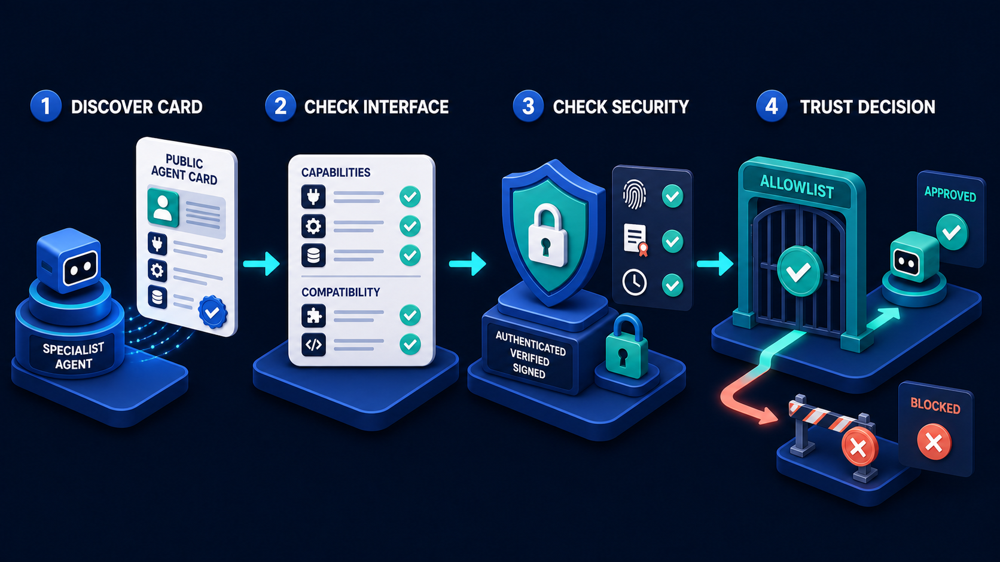

# Diagram 23 — A2A Security Gates

![Five stages across dark navy. MINIMIZE CONTEXT shows a white list with green ticks and coral crosses funnelling through a blue funnel, with a coral dashed arrow to a bin. ALLOWLIST AGENT shows a grid of robot tiles, one green-checked, two greyed, one outlined coral with a warning, above a blue shield with a padlock. BIND TASK shows a teal card reading TASK ID a7f3-9c21-4b6e with SCOPE and PERMISSIONS rows, with a teal chain descending to a locked cube. VALIDATE ARTIFACT shows a checklist of SCHEMA CHECK, SIGNATURE CHECK, CONTENT SCAN and POLICY CHECK, with a coral warning cube dropping to a bin. LOCAL APPROVAL shows a person pressing a teal APPROVE button beside a teal badge reading SIDE EFFECT ALLOWED.](../diagrams/23-a2a-security-gates.png)

**Module:** 4 — A2A collaboration
**Role in the course:** least-privilege delegation review
**Layout:** five sequential gates, four with visible reject paths

---

## At a glance

Five gates that a delegation passes through: **MINIMIZE CONTEXT → ALLOWLIST AGENT → BIND TASK → VALIDATE ARTIFACT → LOCAL APPROVAL**.

The distinguishing feature is that **four of the five have a visible reject path**, and two of them drop rejected material into coral bins. At every gate, something is meant to be thrown away. A delegation pipeline that never discards anything is not enforcing anything.

---

## What the diagram teaches

### 1. Context minimisation comes first, and the funnel says why

The first gate shows a white list where **six rows are green-ticked and four carry coral ✗**, everything passing through a **blue funnel** that emits only a few green cubes. A coral dashed arrow drops the rest into a bin.

It is first because it is the only gate that operates on what you *send*. Every other gate governs who you send to, what you ask for, what comes back, or what happens next. This one governs how much of your world leaves your boundary.

The principle: **the context you send is the specialist's entire view, and everything in it is data you have exported.** Not shared — exported. It is on their infrastructure, in their logs, potentially in their training data, subject to their retention policy and their breach exposure.

The failure mode is convenience. It is easier to send the whole conversation, the whole record, the whole customer object, than to construct a minimal payload. Every field sent by default is a field you have decided to disclose without deciding to.

This is only possible because the protocol does not accumulate state on the far side — you control exactly what each request carries:

### 2. Allowlisting is one gate of five, not the whole story

The second gate shows a **2×2 grid of robot tiles**: one green-checked and highlighted, two greyed out, one outlined in coral with a warning badge. Below, a blue shield with a padlock.

The entire discovery and trust process — four stages of card verification, interface checks, security checks and a human decision — compresses into this single panel:

The compression is the point. Teams that have done the discovery work often believe they have solved A2A security. They have built gate two. Four others are missing, and three of them govern things discovery cannot touch: what you send, what you ask for, and what you accept back.

Note the grid: four candidate agents, one approved. Default-deny, drawn as a selection rather than a check.

### 3. Binding is what stops a task becoming general authority

The third gate shows a teal card reading **TASK ID / a7f3-9c21-4b6e** with **SCOPE** and **PERMISSIONS** rows beneath, and a **teal chain descending to a locked cube**.

The chain is the metaphor that matters. Permissions are *chained* to a specific task identifier. They are not granted to the agent, not granted to the relationship, not granted for a session. They exist for one task and expire with it.

The failure this prevents is privilege accumulation. An agent granted access to fulfil one task retains it for the next one, and the next, until it holds a standing grant nobody ever decided to give. Binding makes the grant temporary by construction.

The two rows are separate for a reason. **Scope** is what the task is about — which records, which accounts, which period. **Permissions** are what may be done — read, propose, but not commit. An agent can have correct scope and excessive permissions, or the reverse.

### 4. Validate artifact is the gate teams forget, and the coral bin says what happens

The fourth gate shows a white checklist with four ticked rows — **SCHEMA CHECK**, **SIGNATURE CHECK**, **CONTENT SCAN**, **POLICY CHECK** — a green shield, and a **coral warning cube dropping into a bin**.

The four checks are four distinct questions:

- **Schema** — is this the shape we asked for? Fields present, types correct, nothing extra.
- **Signature** — did it come from the agent we sent the task to? An artifact arriving from elsewhere, or tampered with in transit, fails here.
- **Content scan** — is there anything in the content that should not be acted on? This is where instruction-injection in returned content is caught: an artifact whose text attempts to direct the caller's behaviour.
- **Policy check** — does what it proposes comply with our rules, independent of whether the specialist thinks it should?

The bin means an artifact can be **rejected**. This is the gate most often missing in practice, because a returned artifact feels like an answer, and answers feel like things you use rather than things you check.

The structural defence against a persuasive artifact is that policy lives on the caller's side and evaluates the artifact as data:

### 5. Local approval is the last gate and it is human

The fifth gate shows a person pressing a **teal APPROVE button**, with a green shield and a database, above a teal badge reading **SIDE EFFECT ALLOWED**.

Two claims.

**Approval is local.** It happens on the caller's side, by the caller's people, under the caller's rules. The specialist's recommendation is input to that decision, not a substitute for it.

**Nothing takes effect before it.** The badge reads *side effect allowed* — permission granted at this moment, for this outcome. Everything upstream produced a proposal.

This is the safe side-effect pipeline appearing at the end of a delegation chain:

No amount of agent machinery removes the human at the commit boundary. Four gates of delegation security end where diagram 02 begins.

### 6. The bins are the diagram's signature

Two coral bins, at gates one and four. Plus a coral-outlined rejected agent at gate two and, implicitly, tasks that fail to bind at gate three.

A pipeline where nothing is ever discarded is a pipeline where every gate is passing everything. The bins are the visual assertion that these gates have teeth — that a real delegation flow throws away context, refuses agents, rejects artifacts, and declines to approve.

---

## Case study — Halewood Health, delegating clinical coding review

Halewood runs eleven hospitals. Clinical coding — translating a patient record into diagnosis and procedure codes for reporting and reimbursement — is specialist work, and Halewood delegates audit of a sample of coded records to an external coding assurance provider whose agent reviews them.

Patient data is involved, which made this the most scrutinised integration the organisation had built.

### Gate 1 — Minimise context

The first design sent the full discharge summary. It was simplest, and the coding auditor "needs the clinical picture."

Their information governance review stopped it. The question they asked: **which fields does the auditor need to check whether a code is correct, and which are we sending because they happen to be in the record?**

The answer was uncomfortable. Checking a code requires the documented diagnoses, procedures, comorbidities, length of stay and discharge destination. It does not require the patient's name, address, NHS number, next of kin, GP practice, the free-text social circumstances notes, or the ward round narrative.

The task now carries a constructed payload: coded clinical facts, a pseudonymised case reference, and the codes under review. Direct identifiers never leave.

The funnel is literal in their implementation — an allowlist of fields, with everything not explicitly permitted dropped and the drop logged. Their governance team audits the drop log, and it has twice caught a change that would have widened the payload.

**What this cost.** About 4% of audits come back as *insufficient information*, where the auditor genuinely needs context the minimal payload excluded. Those escalate to a human process. Governance considered a 4% escalation rate a good trade for not exporting identifiers.

### Gate 2 — Allowlist agent

One approved provider, with contractual data-processing terms, an annual security review, and certificate-based identity. The agent's card is re-verified daily, and a material change suspends the allowlist entry pending review.

Two other providers were assessed and not approved — one for interface incompatibility, one because their data residency could not be established. Both are visible in Halewood's register as assessed-and-declined, which is exactly the greyed-out tile in the panel.

### Gate 3 — Bind task

Every audit task carries an ID, and permissions are chained to it:

- **Scope** — the specific case references in this batch, and no others.
- **Permissions** — read the supplied facts, produce a determination. Nothing else. The agent cannot request additional records, cannot query Halewood's systems, and has no standing credential.
- **Expiry** — 72 hours. A task not completed in that window closes and the batch is re-issued.

The expiry followed an internal finding. An early design granted the provider a service credential with ongoing read access, which meant a compromised provider would have had continuous access to coded records. Chaining permissions to a task with an expiry removed the standing grant entirely — there is no credential to compromise between tasks.

### Gate 4 — Validate artifact

All four checks are implemented, and each has caught something.

**Schema.** Determination per case, matching the submitted references, using the current code set version. Rejects around 1% — usually a code set version mismatch after an update.

**Signature.** Artifacts signed by the provider's key. Two rejections in eighteen months, both traced to a provider-side certificate rotation done without notice.

**Content scan.** This one caught the incident that justified the gate. An artifact contained a free-text auditor note that read, in effect, as an instruction: that a particular category of finding should be applied automatically to similar cases without review.

The note was almost certainly a human auditor's shorthand for a process suggestion. Halewood's assistant, had it not been scanned, would have received text that read as direction. The scan flags free-text content containing imperative constructions directed at the receiving system, and routes those artifacts to human review rather than parsing them.

**Policy check.** Determinations proposing a code change that would alter the reimbursement band by more than a threshold are flagged, regardless of the auditor's confidence. This is Halewood's rule about their own finances and the auditor has no visibility of it — correctly, since it is not a coding question.

### Gate 5 — Local approval

No coding change is applied to a record on an external auditor's determination alone. A Halewood clinical coder reviews each proposed change, sees the auditor's reasoning and the original coding, and approves or declines.

For agreed determinations — the auditor confirms the existing code — approval is bulk, since nothing changes. For proposed changes, it is per-record.

Approval rate runs at about 91%. The 9% declined are cases where the Halewood coder has context the auditor did not — precisely the information excluded at gate one. The team regards that as the system working: the auditor's determination is expert input, and the local coder makes the call.

### What the five gates produced

Their information governance sign-off cited the structure directly. The argument that carried it was not that any single control was strong, but that **five independent controls each discard something**, and a failure would have to pass all five.

The number they report to their board: **zero patient identifiers transmitted to the provider** across around 40,000 audited records, verified by the drop log rather than asserted.

---

## Composition

Five stages run left to right, each with a white uppercase heading and a scene on a blue platform, connected by cyan arrows. Four of the five have a secondary route descending below the platform.

**MINIMIZE CONTEXT → ALLOWLIST AGENT → BIND TASK → VALIDATE ARTIFACT → LOCAL APPROVAL**

## Element by element

**MINIMIZE CONTEXT**
A tall white list with six rows carrying icons — person, envelope, document, database, location pin, clock — each with a **green tick**, alongside four dark rows each with a **coral ✗**. Below, a blue **funnel** receives the list and emits **teal cubes**. A **coral dashed arrow** descends to a circular badge containing a **coral waste bin**.

**ALLOWLIST AGENT**
A 2×2 grid of white tiles each containing a robot face: **top-left is teal with a green check badge and a highlighted border**; top-right and bottom-left are **greyed out**; bottom-right is **outlined in coral with a coral warning badge**. Below, a **blue shield bearing a white padlock**.

**BIND TASK**
A teal card carrying a dark cube icon and the label **TASK ID**, with **a7f3-9c21-4b6e** beneath it in a dark inset. Below that, two rows: a person icon with **SCOPE** and a padlock icon with **PERMISSIONS**, each with a blue bar. A **teal chain** descends from the platform to a dark circular badge containing a **locked white cube**.

**VALIDATE ARTIFACT**
A white card with a blue header row and four checklist rows, each with a teal checkbox and a green tick: **SCHEMA CHECK**, **SIGNATURE CHECK**, **CONTENT SCAN**, **POLICY CHECK**. A **green shield** sits at the top right. A **coral cube with a warning triangle** drops via a coral dashed arrow to a second **coral waste bin**.

**LOCAL APPROVAL**
A person seated at a screen, reaching out to press a **teal APPROVE button**. A green shield and text lines appear on the screen; a blue database and a teal cube sit to the right. Below, a **teal dashed arrow** descends to a circular badge reading **SIDE EFFECT ALLOWED** with a teal check.

## Colour and flow semantics

- **Cyan arrows** carry the delegation forward through the five gates.
- **Coral** marks every reject path: the crossed rows, the dashed discard arrows, both bins, and the refused agent tile.
- **Teal** marks what survives: the filtered cubes, the bound task, the approve button, the final permission badge.
- **Green** operates at row level for individual passed checks.
- The **two waste bins** are the diagram's signature — explicit depictions of material being discarded.
- The **chain** at gate three is the only physical restraint drawn in the library.

## How to present it

**Ask what their A2A security model is.** Most teams describe discovery and allowlisting. Then show the diagram and point at gate two. One of five. That reframing is the session's opening and it lands hard.

**Ask what they currently send in a delegated task.** Push for specifics. The usual answer is "the relevant context," and the usual reality is a whole object because that was easiest. Then reframe: everything you send is **exported**, not shared. Ask which fields they would be comfortable seeing in the other party's breach notification.

**Point at the chain.** Ask what it means that permissions attach to a task ID rather than to the agent. Then ask what their integration grants today — usually a standing credential. Halewood's finding, that removing the standing grant meant there was nothing to compromise between tasks, is the clearest version of the argument.

**Ask what happens to an artifact they do not like.** Most teams have no answer, because the return path is a success path. Walk the four checks and ask which they perform. Signature and schema are common; content scan and policy check are rare.

**Tell the content-scan story.** Halewood's auditor note that read as an instruction. Ask what their system would do with returned content containing directives. This is the concrete version of a threat people find abstract, and it is why policy must live on the caller's side and treat artifacts as data.

**Count the bins.** Two visible, four reject paths. Ask how often their pipeline discards anything. A pipeline that has never rejected an artifact, refused an agent, or dropped a context field is not enforcing five gates — it has five stages that pass everything.

**End at the human.** Gate five is a person pressing a button, and it is where diagram 02 picks up. Ask whether anything in their delegation flow currently takes effect without a human. Then ask what would happen if the specialist were wrong.

**Timing.** Thirty minutes. Forty-five if you audit their own delegation against all five gates, which is the version that produces a backlog.

---

## Lab and checkpoint

**Lab:** Audit one real cross-agent or cross-vendor integration against the five gates: minimize context, allowlist agent, bind task, validate artifact, and local approval. For each gate, write what your system currently does, what it checks, and what would happen if an attacker controlled the other party. For any gate missing, write the smallest control that would add it and the test that would prove it works.

**Checkpoint:** Why must policy live on the caller's side and treat artifacts as data?

**Answer:** Because the specialist owns its own code and may be compromised or wrong. If the caller lets the specialist's artifact become an instruction, the specialist can direct the caller's system. The caller must validate the artifact against its own policy and only then decide what to do.

## Glossary

- **Agent allowlist** — the list of approved agents that may receive delegated tasks.
- **Artifact validation** — the gate that checks the returned artifact for signature, schema, content, and policy.
- **Bind task** — the gate that scopes a task to an exact identity, purpose, and time.
- **Context minimization** — the gate that removes unnecessary data before sending it outside the caller.
- **Local approval** — the final human or policy confirmation before a side effect is allowed.
- **Policy shield** — the caller-side rules that decide what to do with a returned artifact.
- **Standing credential** — a long-lived credential that grants ongoing access, as opposed to a task-bound grant.

## Sources

- A2A delegation security and artifact validation
- Zero-trust and least-privilege agent integration patterns
- Content scanning and artifact policy enforcement in agent systems
