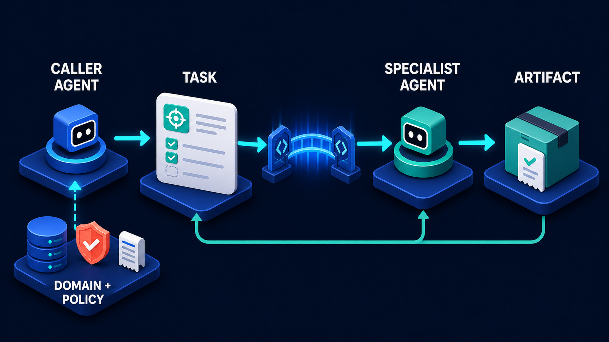

# Diagram 24 — Incident Response Team

![A hub-and-spoke layout on dark navy. At centre, a wide platform labelled INCIDENT TASK HUB holds a coral alert card, a database stack and a green-ticked checklist. Four agents surround it, each linked by a cyan arrow annotated TASK — TRIAGE AGENT upper left with a report carrying a coral warning, LOG AGENT upper right with a bar chart and magnifier, SECURITY AGENT mid left with a green shield document, and REMEDIATION AGENT mid right with a settings panel and teal cube. Below sits HUMAN COMMANDER, a person at a REVIEW & APPROVE screen with a coral APPROVE button, receiving dashed teal lines labelled EVIDENCE and FINDINGS from the left and ACTIONS TAKEN and ARTIFACTS from the right.](../diagrams/24-incident-response-team.png)

**Module:** 4 — A2A collaboration
**Role in the course:** multi-agent orchestration example
**Layout:** hub and spoke with four agents, converging on one human below

---

## At a glance

Four specialist agents arranged around a shared **INCIDENT TASK HUB**, all working the same incident in parallel, with everything they produce converging on a single **HUMAN COMMANDER** below.

This is the only genuine multi-agent diagram in the library, and it is careful about two things that multi-agent architectures usually get wrong: the agents coordinate through a **shared task object** rather than by talking to each other, and there is exactly **one human** with authority.

---

## What the diagram teaches

### 1. The hub is a shared object, not a message bus

At the centre sits a platform holding three things: a **coral alert card**, a **database stack**, and a **green-ticked checklist**. Four cyan arrows connect it to the four agents, each annotated **TASK**.

Critically, **there are no arrows between the agents**. The triage agent does not message the log agent. The security agent does not call remediation. Everything goes through the centre.

This is coordination through shared state rather than through conversation, and the difference is enormous in practice.

**With a hub:** the incident has one canonical representation. Any agent can read the current state. What each agent contributes is visible to all. The whole thing can be reconstructed afterwards from one object. Adding a fifth agent requires no changes to the other four.

**With agent-to-agent messaging:** state is distributed across conversations. Reconstructing what happened means correlating message logs. Agents develop implicit dependencies on each other's timing. Adding an agent means teaching it who to talk to and teaching others about it.

The three objects on the hub say what it holds: the **alert** (what happened), the **database** (accumulated state and evidence), and the **checklist** (what has been done and what remains).

### 2. Four agents, four domains, no overlap

Each agent has a distinct specialism, visible in its iconography.

**TRIAGE AGENT** — a report card with a **coral warning triangle**. Establishes what is happening, how severe it is, and what is affected. First to act; its output shapes everyone else's work.

**LOG AGENT** — a bar chart with a **magnifier**. Searches, correlates and summarises telemetry. Answers "when did this start, what changed, what does the data show."

**SECURITY AGENT** — a **green shield document**. Assesses whether this is an attack, whether data was exposed, whether there are indicators of compromise. Distinct from triage because the question is different.

**REMEDIATION AGENT** — a **settings panel and teal cube**, and notably drawn in **dark grey rather than blue or teal**. It is the only agent whose work changes things, and its distinct colouring reads as a marker of that.

The separation is not arbitrary. Each domain has different data sources, different expertise, and — in most organisations — a different owning team. The multi-agent structure mirrors an organisational structure that already exists.

### 3. Parallelism is the reason to do this at all

Four agents work the same incident simultaneously. That is the entire performance argument.

Sequentially, an incident investigation is: triage, then logs, then security assessment, then remediation planning. Each waits for the last. In parallel, the log agent starts pulling telemetry while triage is still classifying, and the security agent runs indicator checks concurrently.

The hub is what makes this safe. Because all four read and write one shared object, an agent that starts before another has finished can see partial state and act on what is available, rather than operating on stale assumptions from a message it received earlier.

### 4. Every arrow into the human is dashed, and they are labelled

Below the hub sits the **HUMAN COMMANDER** — a person at a screen headed **REVIEW & APPROVE**, showing four green-ticked rows, a shield, and a **coral APPROVE button**.

Four dashed teal lines converge on them, labelled: **EVIDENCE** and **FINDINGS** from the left, **ACTIONS TAKEN** and **ARTIFACTS** from the right.

Two things about this.

**They are dashed.** Dashed lines throughout this library carry evidence rather than work. What reaches the commander is not tasks to perform — it is material to judge.

**They are labelled with four distinct things.** Evidence (raw material), findings (interpretation), actions taken (what has already happened), artifacts (produced deliverables). A commander needs all four and they are not interchangeable. Being told "the security agent found indicators of compromise" is a finding; being shown the indicators is evidence. Command decisions need both.

### 5. One human, and the position matters

There is exactly one person in the diagram, positioned **below and central**, receiving from all sides.

The singularity is deliberate. Incident response with distributed authority is how incidents get worse — two people taking contradictory remediation actions, or everyone assuming someone else has made the call. The commander is a single point of decision.

The position matters too. Not upstream directing the agents, not beside them as a peer. **Downstream**, receiving what they produce and deciding. The agents work; the human judges.

A **dashed arrow runs from the commander back up into the hub**, which is the authority closing the loop — an approved action returns to the shared object and becomes something the remediation agent can execute.

### 6. Remediation is gated, and the coral APPROVE button is the gate

The remediation agent can propose. It cannot act until the commander approves.

The coral APPROVE button is the same object as the confirmation stage of the safe side-effect pipeline, and the same object as local approval in the delegation security gates:

Under incident pressure this is where the temptation to automate is strongest — the whole point is speed, and a human in the loop is slow. The diagram declines. Remediation actions during an incident are exactly the actions most likely to cause a second incident, and they are taken under time pressure with incomplete information.

### 7. This is composition, not a new pattern

Nothing here is novel relative to the rest of the module. Four instances of bounded delegation, sharing a task object, reporting to one approver.

Each spoke is that diagram. The hub-and-spoke arrangement is what you get when one caller delegates four bounded tasks concurrently against shared state. Teaching it as composition rather than as a distinct architecture stops people treating "multi-agent" as a separate discipline.

---

## Case study — Vantage Payments, the settlement outage

Vantage processes card payments for around eight thousand merchants. On a Tuesday afternoon, settlement files stopped being generated. Merchants would not be paid on schedule. The clock to their banking cut-off was about four hours.

Vantage had built an incident response system on this pattern eight months earlier. This was its most serious test.

### The first ninety seconds

The alert fired from settlement monitoring: expected file count zero, ninety minutes past the generation window.

An incident task was created in the hub containing the alert, the affected service, and the time window. Four agents began work simultaneously.

**Triage** established scope: settlement generation only. Payment authorisation, capture and refunds were all healthy. This narrowed the investigation enormously in the first minute — the outage was in one pipeline stage, not the platform.

**Log** pulled telemetry for the settlement service across the window and correlated against deployments, config changes and infrastructure events. It surfaced two candidates: a config change nineteen hours earlier, and a database failover forty minutes before the first missed window.

**Security** ran indicator checks: authentication anomalies, unusual access patterns, integrity checks on the settlement code path and its configuration. Returned no indicators of compromise within about four minutes — which mattered, because it let the commander stop considering an attack scenario early rather than carrying it as an open possibility.

**Remediation** did not act. It began assembling options against what the others were finding, producing candidate actions with prerequisites and risks attached.

### What the hub held

By minute six the shared task contained: the alert, triage's scope determination, log's two candidate causes with supporting telemetry, security's negative finding, and remediation's three draft options.

This is the property that mattered most in the review afterwards. **One object, readable by everyone, human included.** The commander did not assemble a picture from four conversations; they read the current state of one thing.

### The finding

Log correlated further and identified the cause. The database failover had promoted a replica whose connection pool configuration differed from the primary's — a drift introduced by the config change nineteen hours earlier that had been applied to the primary only.

The settlement job opened more connections than the promoted replica permitted, failed on pool exhaustion, and — the reason nobody noticed for ninety minutes — its retry logic swallowed the error and rescheduled silently. The job had failed eleven times without alerting.

### The decision

Remediation proposed three options with the hub's accumulated evidence attached:

1. **Apply the config to the replica and re-run.** Fastest, roughly twenty minutes to settlement. Risk: the config had not been validated against a replica under load.
2. **Fail back to the original primary and re-run.** Known-good configuration. Risk: the primary had failed over for a reason not yet established, and failing back might reproduce it.
3. **Run settlement manually against a read replica with elevated pool limits.** Slowest, around ninety minutes. Lowest risk to the platform, highest risk of missing the banking cut-off.

The commander — the on-call platform lead — chose option 1, with a condition: apply the config, run settlement for a single merchant batch first, verify output, then run the full set.

That condition is the thing a human added. None of the three proposed options included a canary step. The commander's judgement, under time pressure, was that a twenty-minute path with a two-minute verification was better than either alternative.

### The outcome

Settlement completed forty-one minutes after the decision, inside the banking cut-off. No merchant payment was delayed.

The security agent's early negative finding had a second effect nobody anticipated: because compromise had been ruled out within minutes and recorded in the hub, the commander did not have to invoke the security incident process in parallel — which would have pulled in three more people and slowed the technical response.

### What the review found

Two changes came out of it.

**The remediation agent now always proposes a verification step.** The commander's canary condition was added as a standing requirement — no remediation option is presented without a way to check it worked before committing fully.

**The hub retains the full incident object permanently.** Their post-incident review took under an hour, because the entire investigation was one readable object with timestamps. Their previous process — reconstructing from chat logs, terminal history and memory — had routinely taken days.

### What they explicitly did not automate

The review considered whether option 1 could have been applied automatically, given that all four agents agreed and the evidence was strong. They decided against it, on a specific argument: **the agents agreed because they were looking at the same evidence, and agreement between agents reading one source is not independent confirmation.**

The commander's value was not knowing more than the agents. It was being outside the shared frame — able to notice that none of the three options included a verification step, which none of the agents noticed because they were all reasoning from the same hub.

---

## Composition

A radial layout. At centre sits a wide hexagonal platform labelled **INCIDENT TASK HUB**, holding three objects. Four agents are positioned around it — two upper, two mid-level, left and right — each connected by a **cyan arrow annotated TASK**. Below the hub sits the **HUMAN COMMANDER**, receiving four **dashed teal lines** from left and right, with a dashed arrow returning upward into the hub.

## Element by element

**INCIDENT TASK HUB**
A wide platform holding a **coral alert card** with a warning triangle on the left, a **blue database stack** at centre, and a **green-ticked checklist** on the right. What happened, accumulated state, and progress.

**TRIAGE AGENT** *(upper left)*
A blue cube robot on a disc, beside a white report card with a teal header and a **coral warning triangle**.

**LOG AGENT** *(upper right)*
A teal cube robot, beside a white panel showing a **green bar chart with a magnifying glass**.

**SECURITY AGENT** *(mid left)*
A teal cube robot, beside a white document carrying a **green shield with a check**.

**REMEDIATION AGENT** *(mid right)*
A **dark grey** cube robot — distinct from the others — beside a white settings panel with a gear icon and a **teal cube**.

**HUMAN COMMANDER**
A person seated at a screen headed **REVIEW & APPROVE**, showing four green-ticked rows, a shield with a check, and a **coral APPROVE button** they are reaching toward. Four labelled dashed lines converge: **EVIDENCE** (with a teal shield folder) and **FINDINGS** (with a coral-warning document) from the left; **ACTIONS TAKEN** (with a green-checked document) and **ARTIFACTS** (with a database stack) from the right.

## Colour and flow semantics

- **Solid cyan arrows** carry tasks outward from the hub to the agents; each is labelled **TASK**.
- **Dashed teal lines** carry evidence and results inward to the commander — dashed because they are material to judge, not work to do.
- **Coral** appears three times: the incident alert, the triage warning, and the **APPROVE button** — the alert that started it and the decision that ends it.
- **The remediation agent's grey colouring** distinguishes the only agent whose work changes things.
- **No arrows run between agents.** All coordination passes through the hub.

## How to present it

**Ask what is missing between the agents.** Put it up and let the room notice there are no agent-to-agent arrows. Then ask what would change if there were. Build both lists — shared state versus distributed conversation — and land on reconstructability: with a hub, the incident is one object; without, it is a correlation exercise across four message logs.

**Ask why four agents rather than one.** The answer is parallelism plus domain ownership. Then ask who in their organisation owns each of the four domains. The mapping onto an existing org structure is usually exact, which is the argument for the decomposition.

**Point at the four labels into the commander.** Evidence, findings, actions taken, artifacts. Ask why they are four things and not one. A finding without evidence is an assertion; actions taken without artifacts cannot be verified. Command decisions need all four.

**Ask why the human is below rather than above.** Downstream, receiving and judging — not upstream directing. This distinction matters for how people design the interface: the commander's screen is a review surface, not a control panel.

**Push hard on the APPROVE button.** Ask whether remediation should be automatic when all four agents agree and the clock is running. Let the room argue. Then give them Vantage's answer: agreement between agents reading the same evidence is not independent confirmation, and the commander's value was being outside the shared frame. The canary step nobody proposed is the concrete illustration.

**Decompose it.** Show the bounded delegation diagram and point out that each spoke is one instance of it. This is composition, not a new architecture. It stops "multi-agent" being treated as a separate discipline requiring separate patterns.

**Ask about the post-incident review.** How long does theirs take, and where does the material come from? Vantage went from days to under an hour because the incident was one retained object. That is an operational benefit of the hub that has nothing to do with response speed, and it often lands better with management than the parallelism argument.

**Timing.** Twenty-five minutes. Thirty-five if you run the automation debate, which tends to be the most engaged part of the whole module.

---

## Lab and checkpoint

**Lab:** Design an incident-response hub for one type of incident your organisation handles. Name the commander role, the four specialist agents, what each sends back, and what the commander needs before pressing the approve button. Then write the retained incident object that would make a post-incident review take under an hour instead of days.

**Checkpoint:** Why is the human commander below the agents rather than above them?

**Answer:** Because the commander is downstream, receiving evidence and findings and judging them, not upstream directing the agents. This keeps the commander as a review and approval surface rather than a control panel, which is what makes independent confirmation possible.

## Glossary

- **Commander** — the person who receives evidence, findings, actions, and artifacts and decides whether to approve remediation.
- **Evidence** — raw material from the incident that supports findings.
- **Finding** — an agent's analysis of evidence.
- **Hub** — the central coordination point through which all task and evidence flows pass.
- **Incident object** — the retained record that makes the entire response reconstructable.
- **Remediation agent** — the agent whose work changes state and must be approved before it runs.
- **Specialist agent** — an agent with domain ownership over one part of the incident.
- **Task** — work delegated from the hub to a specialist agent.

## Sources

- Multi-agent incident response and coordination patterns
- Human-in-the-loop approval and remediation controls
- Retained incident records and post-incident review practices
