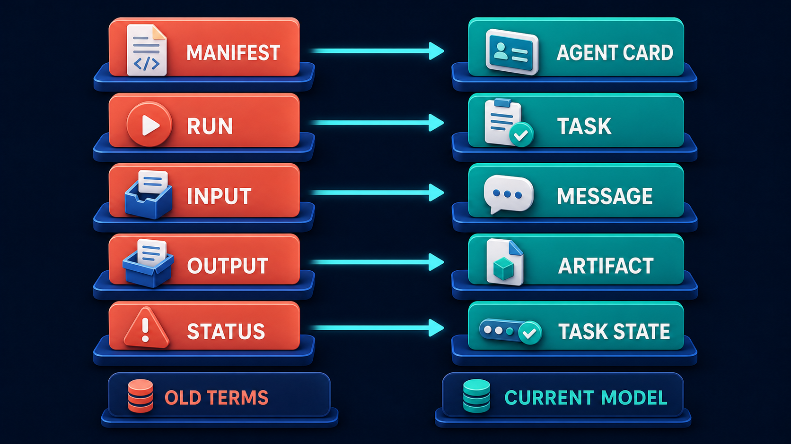

# Diagram 25 — ACP to A2A Timeline

**Module:** 5 — ACP migration
**Role in the course:** correcting an older ACP-first course
**Layout:** a flowing river timeline in four beats

---

## At a glance

A river that starts coral, merges into blue, passes a version marker, and arrives at a teal construction site labelled **BUILD HERE**.

The colour narrative carries the entire argument without a word of explanation. Coral means retired throughout this library; teal means built and current. Watching the coral river flow into the blue one and terminate at a teal building site tells you what happened to ACP before you have read any of the four labels.

---

## What the diagram teaches

### 1. The river merges — it does not dead-end

The single most important compositional choice is that the coral river **flows into** the blue river at a visible, glowing confluence. It does not stop at a wall. It does not run into sand. It becomes the other river.

That is a specific historical claim: **ACP's ideas were absorbed, not discarded.** The problems it was trying to solve were real problems, the concepts it developed were largely sound, and they were carried forward into A2A rather than being abandoned as a wrong turn.

This matters for how you treat someone arriving with ACP knowledge. Their mental model is not wrong. Agents that describe themselves, work that has an identity and a lifecycle, structured inputs and outputs, observable status — all of that survived. What changed is names and some shapes, which is a translation problem rather than a re-learning problem.

Contrast with what the diagram could have shown: a coral river ending at a barrier, with a separate blue river starting elsewhere. That would say "throw it away and start again," and it would be both discouraging and inaccurate.

### 2. The first panel is ideas, not infrastructure

The **ACP IDEAS** slab carries **glowing light bulbs, a notepad with a sketch, puzzle pieces and a gear**. Not servers, not code, not deployed systems.

Everything in that panel is a thinking object. Light bulbs for insight, a notepad for design, puzzle pieces for the parts of a problem being fitted together, a gear for mechanism.

The characterisation is fair and it is generous. ACP was an exploration of what agent interoperability would need to look like. It produced a vocabulary and a set of structural commitments. It did not produce the thing you should build on today, and the diagram says so by giving it sketches rather than structures.

### 3. The middle panel is where the actual claim lives

**MERGED INTO A2A** shows the confluence: coral water becoming blue, with the transition glowing where the two meet, and an **A2A roadsign** planted on the bank.

Two details worth noticing.

The transition is **gradual and lit**, not a hard boundary. Ideas moved across over time rather than in a single cutover event.

The **roadsign** is a signpost, not a monument. It marks a direction to travel, which is consistent with the fourth panel being a construction site rather than a finished building. A2A is where you go, and what you do when you get there is build.

### 4. The version marker is small and it is doing precise work

**A2A 1.0** is a blue hexagonal badge with a **teal verified check**. It is the smallest element in the diagram.

Its smallness is appropriate — it is a fact, not an argument. But the fact matters, because it is the answer to the question the first three panels raise: if ACP was ideas and they merged, what is the thing that is actually stable enough to build against?

The version number and the verified check together say: there is a specified target, it has a version, and it is real. That is what distinguishes the fourth panel from the first.

### 5. Build here means build, and the site is unfinished

The final panel is a **teal construction site**: a crane lifting a block, cubes being assembled into a partial structure, a code panel, loose blocks on the ground.

It is deliberately **mid-construction** rather than a completed building. That is an honest picture of where A2A is — a specified protocol with implementations being built on it, not a mature ecosystem you plug into.

The crane and the loose blocks say there is work to do. The code panel says the work is engineering. The teal says this is where the current, committed, buildable material is.

### 6. What to do when older material appears

The operational purpose of this diagram is triage. Someone arrives with ACP-shaped knowledge, a design document specifying a manifest, or a course written before the merge. This picture tells you how to respond:

- **Do not discard their understanding.** The river merged. Their concepts are mostly right.
- **Do not build on the old names.** The construction site is at the teal end.
- **Translate rather than re-teach.** Which is a mechanical exercise, and it has its own diagram:

This diagram establishes *that* the migration happened and why it is not a loss. That one tells you *what* to rename.

---

## Case study — Thornbury Systems, the design document from last year

Thornbury builds workflow automation for insurance brokers. In early planning for an agent interoperability feature, a senior engineer produced a design document specifying how their platform would expose agent capabilities to partner systems.

It was a good document. It was also written against ACP, because that is what the engineer had learned from — a well-regarded course they had taken eighteen months earlier and a set of blog posts from around the same time.

### What the document specified

The design was internally coherent. It proposed:

- Each agent publishes a **manifest** at a well-known path describing its identity and capabilities.
- Callers initiate a **run** by posting to a run endpoint.
- A run accepts an **input** object and eventually produces an **output** object.
- A **status** field, pollable, reports whether the run is pending, active, complete or errored.

Anyone who has worked with A2A will recognise every one of those. They are the right five concerns. The engineer had understood the problem correctly.

### How it was caught

Not by review. The document passed two design reviews, because everyone reviewing it was assessing whether the design solved the problem, and it did.

It was caught during integration planning with a partner. Thornbury's engineer described their manifest endpoint; the partner's engineer asked whether they meant the agent card. Ten minutes of confusion followed, in which each party believed the other was using a proprietary term.

### The triage conversation

The team lead's instinct was that the design needed to be rewritten. The engineer's instinct — reasonable, and defensive — was that the design worked and the partner could adapt.

Putting this diagram on the screen resolved it in about five minutes, and the resolution was not the one either had expected.

**The river merged.** The engineer's mental model was not wrong. Every concept in the document had a direct current equivalent. Nothing about the design's structure needed reconsidering.

**But the construction site is at the teal end.** Building on the old vocabulary meant every partner integration would require a translation conversation, and every partner's tooling would need adaptation. The cost was not in the design; it was in being the only party speaking a private dialect of a public protocol.

The engineer's response, once the diagram made the distinction clear, was that if it was a rename they would do it that afternoon.

### What the migration actually cost

Two days, not the rewrite the team lead had feared.

- **Renaming** across the design document and the partially-built implementation: manifest to agent card, run to task, input to message, output to artifact, status to task state.
- **Two shape changes** that were more than renames. Their `output` was a single object; artifacts are a collection, because a task can produce several. And their `status` was a flat string; task state carries additional structure, including the input-required state they had not modelled at all.
- **One genuine gap.** Their design had no equivalent of the agent card's security section — no attestation, no signing, no expiry. ACP-era material had less to say about this, and their document reflected that. This was the only part that required new design rather than translation.

That last item is worth separating out. Four of the five concepts were renames. The security posture was a real gap, and it was the part that mattered most for a partner integration involving broker data.

### The wider find

The exercise prompted a check of what else in the organisation had been built on pre-merge material. They found two more instances:

- A prototype from a hackathon, using manifest/run vocabulary. Never shipped, deleted.
- A section of internal onboarding documentation describing agent interoperability, written by the same engineer, teaching the old model to new joiners.

The documentation was the more serious of the two, because it was actively propagating. Three engineers had read it. It was rewritten, and Thornbury added a check to their internal docs review: material describing external protocols carries a "last verified against" date.

### What the engineer said afterwards

Their summary, recorded in the retrospective, is the reason this diagram exists: *I didn't learn the wrong thing, I learned it at the wrong time, and nobody told me the vocabulary had moved.*

The course they had taken was accurate when it was written. It had not been updated. The engineer had no way to know that the terms they were confidently using had been superseded, because nothing in their material carried a date or a warning.

---

## Composition

A landscape scene reading left to right in four beats, with a continuous river running through it. Teal arrows sit between the beats at the upper level, while the river itself provides the visual continuity below.

**ACP IDEAS → MERGED INTO A2A → A2A 1.0 → BUILD HERE**

## Element by element

**ACP IDEAS**
A **coral terrain slab** carrying a glowing coral **light bulb**, a **notepad** with a sketched idea on it, coral **puzzle pieces**, and a coral **gear**. A second, smaller light bulb sits on a lower coral platform. The coral river begins here and flows rightward, with more puzzle pieces and a gear embedded in its banks. Everything is a thinking object; nothing is built.

**MERGED INTO A2A**
The **coral river visibly becomes a blue river**, with a glowing white-orange confluence at the transition point. A dark blue **roadsign reading A2A** is planted on the bank above. Small tufts of grass and scattered rocks give the landscape a sense of settled terrain.

**A2A 1.0**
A blue **hexagonal badge** reading **A2A** with **1.0** beneath it, sitting on a dark blue platform, with a **teal circular verified check** attached at its lower right. The blue river passes beneath and continues.

**BUILD HERE**
A **teal construction site** on a gridded platform: a teal **crane** with a block suspended from its hook, an assembly of teal **cubes** forming a partial structure, a **code panel** showing `</>`, and a loose teal cube on a separate small platform below. Mid-construction, deliberately unfinished.

## Colour and flow semantics

- **Coral** for the origin — consistent with coral meaning retired throughout the library.
- **Blue** for the merged, current channel.
- **Teal** for the construction site — the built, committed present.
- The **confluence glow** marks the transition as gradual and significant rather than abrupt.
- The **river runs continuously** from first panel to last, which is the diagram's structural argument: this is one lineage, not two separate things.
- Small **teal arrows** above the river mark the four beats without competing with the river's own continuity.

## How to present it

**Show it before saying anything and ask what happened to ACP.** The room will answer correctly from the colours alone. That immediate legibility is the point — this diagram is designed to settle a question fast, usually in a moment when someone has arrived with older material.

**Ask why the river merges instead of stopping.** This is the question that carries the lesson. Push until someone says the ideas were absorbed. Then ask what the alternative rendering would have implied — a dead end, a wasted effort, start over — and why that would have been both discouraging and untrue.

**Point at the first panel's contents.** Light bulbs, a sketch, puzzle pieces. Ask what is *not* in that panel. No servers, no deployed systems, no built structures. ACP was a design exploration, and the panel is characterising it fairly rather than dismissively.

**Ask why the construction site is unfinished.** Crane still lifting, blocks still loose. This is an honest picture of a specified protocol with implementations being built, rather than a mature ecosystem. Teams expecting turnkey interoperability need that expectation set.

**Use it as a triage tool, which is its real job.** When someone brings ACP-shaped material — a design doc, a course, a prototype — put this up and give the two-part answer: your understanding is sound, and your vocabulary has moved. That framing is what makes the migration a two-day rename rather than a defensive argument about whether the design was wrong.

**Then hand them the translation table.** This diagram establishes that migration is warranted and cheap. The concept map tells them exactly what to change.

**Ask what else in their organisation was built on pre-merge material.** Thornbury found a prototype and, more seriously, internal onboarding documentation that was actively teaching the old model to new joiners. Documentation propagates; a prototype does not. Ask specifically about training material.

**Close with the dating problem.** Thornbury's engineer had no way to know their course was stale. Ask whether their own internal material describing external protocols carries a "last verified against" date. Almost never, and it is a cheap fix.

**Timing.** Ten minutes. It is a corrective, not a lesson, and it works best deployed at the moment older material surfaces rather than taught in sequence.

---

## Lab and checkpoint

**Lab:** Pick a design document or training slide in your organisation that predates a recent protocol change. Draw a four-stage river timeline for it: where it started as ideas, where the old and new models merged, where the current stable version is marked, and where the buildable work begins. For each stage, annotate whether the content needs renaming, re-shaping, replacement, or only a date stamp.

**Checkpoint:** Why is the construction site in the fourth panel deliberately unfinished?

**Answer:** Because A2A 1.0 is a specified, versioned protocol, not a mature ecosystem. The unfinished construction site sets the correct expectation that there is buildable work to do and that current engineering effort belongs at the teal end of the river, not at the coral idea end.

## Glossary

- **ACP** — the earlier Agent Communication Protocol that explored the concepts later merged into A2A.
- **A2A 1.0** — the first versioned, stable specification of the current agent-to-agent protocol.
- **Agent card** — a discoverable identity record that describes an agent and its capabilities.
- **Artifact** — a typed, persistent, rejectable deliverable produced by a task.
- **Confluence** — the visual merge point where the old ACP ideas flow into the new A2A model.
- **Manifest** — an older ACP term for a listing of agent capabilities.
- **Message** — a communication between agents, supporting conversational exchange.
- **Run** — an older ACP term for a single execution.
- **Status** — an older ACP string flag describing a current condition.
- **Task** — a unit of work with a defined lifecycle and owner.
- **Task state** — a position in a defined state-machine lifecycle.
- **Verified check** — the teal badge indicating a versioned, specified target.

## Sources

- ACP (Agent Communication Protocol) early concept documents
- Google A2A 1.0 specification and discovery model
- A2A Agent Card and task/artifact vocabulary drafts
