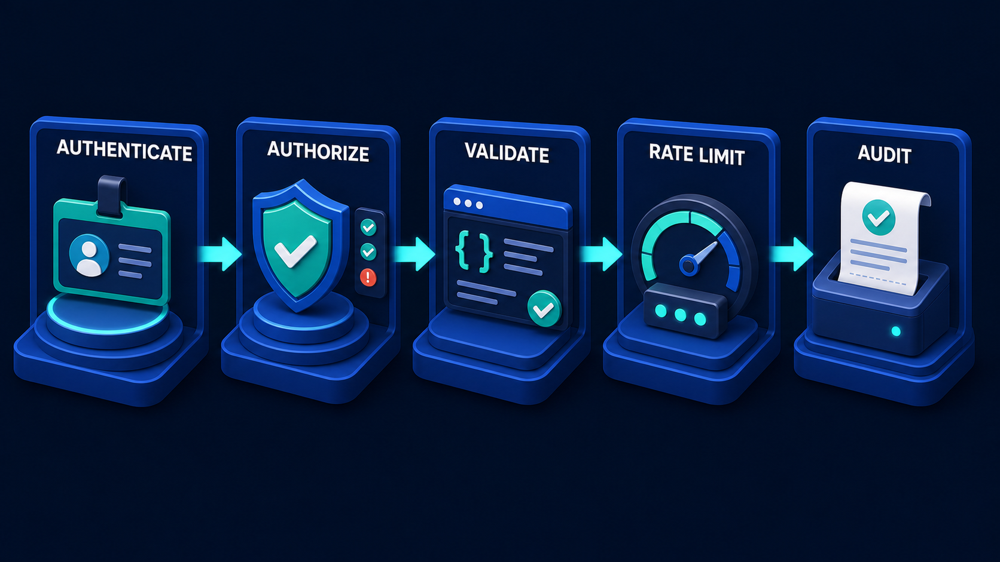

# Diagram 27 — Customer Support

![Five stages across dark navy. CUSTOMER shows a person at a laptop with a teal question bubble. RAG POLICY shows a database with a green-ticked document and magnifier above a sub-platform labelled KNOWLEDGE INDEX. MCP TICKETS shows a toolbox plaqued MCP TOOL GATEWAY with an arrow down to a TICKETS window. A2A SPECIALIST shows two circulating robots above a card headed ESCALATION TASK listing BOUNDARY CHECK, CONTEXT PACKED and LIMITED ACTIONS. A coral shield captioned APPROVAL GATE sits above a card reading REQUIRED FOR: REFUND, ACCOUNT CHANGE. SAFE RESOLUTION shows a database and a green-checked receipt. A dashed cyan line returns along the bottom to the customer.](../diagrams/27-customer-support.png)

**Module:** 6 — End-to-end use cases
**Role in the course:** support-agent architecture
**Layout:** five stages with an approval gate before the outcome, and a return path

---

## At a glance

A complete support architecture: **CUSTOMER → RAG POLICY → MCP TICKETS → A2A SPECIALIST → [APPROVAL GATE] → SAFE RESOLUTION**, with a dashed return path to the customer.

The detail that makes it worth teaching is the small card under the coral shield. It reads **REQUIRED FOR: REFUND, ACCOUNT CHANGE** — two named actions, spelled out, that cannot be automated. Most architecture diagrams gesture at "human oversight." This one names the two things.

---

## What the diagram teaches

### 1. All three lanes appear, in the order the work needs them

This is the system map with a specific job attached:

There the three lanes are parallel alternatives. Here they are used in sequence, and the sequence is not arbitrary.

**RAG first.** Establish what the policy says. Before touching any live system, find out what is permitted, what the terms are, what the process is. Evidence before action.

**MCP second.** Establish and change the facts. Read the ticket, the account, the order history. This is where live state lives.

**A2A third.** Escalate what is genuinely someone else's judgement. Only after the policy is known and the facts are established, because a specialist with neither is being asked to guess.

That ordering is the six-verb journey applied to a domain — retrieve, act, delegate — and it is worth pointing out that the order falls out of dependency rather than preference. You cannot pack a useful escalation task before you know the facts.

### 2. The knowledge index is drawn as a sub-platform, and that is a claim about scope

Under RAG POLICY sits a separate small platform holding a book and a document, labelled **KNOWLEDGE INDEX**.

Drawing it as a distinct sub-platform rather than as part of the main stage says that the index is its own asset with its own lifecycle. It is built, maintained, versioned and evaluated independently of the assistant that queries it.

The contents matter for a support system: policy documents, terms of service, process guides, product documentation, and — usually the highest-value source — resolved tickets. Past resolutions are the closest thing to ground truth about what actually gets done, as opposed to what the policy says should be done.

The dark card beside the database showing **two green ticks and one coral warning** is the retrieval result: some policy checks pass, one flags. Policy retrieval is not a lookup that returns permission; it returns a set of findings, some of which are problems.

### 3. The MCP stage is plaqued as a gateway, and the word is deliberate

The toolbox carries a plaque reading **MCP TOOL GATEWAY**, with an arrow descending to a **TICKETS** window showing rows with teal and coral status dots.

**Gateway** rather than "tools" or "API." A gateway is a chokepoint — one place where everything passes through, and therefore one place where the five security gates apply:

For a support system this matters more than usual, because support agents are a large, high-turnover population with broad but bounded access to customer data. The gateway is where "this agent may read this customer's tickets" gets enforced, uniformly, rather than being scattered across integrations.

The coral dots in the tickets window are worth noticing — some tickets are in a problem state. The tool returns reality, including the bad parts.

### 4. The escalation task card is the best summary of bounded delegation in the library

Under the A2A stage sits a dark card headed **ESCALATION TASK** with three rows:

- ✓ **BOUNDARY CHECK**
- ✓ **CONTEXT PACKED**
- 🔒 **LIMITED ACTIONS**

Three of the five delegation security gates, compressed onto one card and stated in operational language.

**Boundary check** — is this genuinely the specialist's work, or are we escalating because it is hard? The allowlist and ownership question.

**Context packed** — a deliberately assembled payload, not the whole conversation. Context minimisation.

**Limited actions** — the padlock icon. The specialist can determine and recommend; it cannot execute. Task binding with constrained permissions.

### 5. The approval gate names two actions, and the naming is the design

A **coral shield** with the caption **APPROVAL GATE** in coral, above a card reading **REQUIRED FOR:** with two entries — a **$ REFUND** and an **ACCOUNT CHANGE**.

Naming them is what makes this a design rather than an aspiration. "Human oversight for sensitive actions" is unimplementable, because nobody agrees what sensitive means and the boundary drifts. "Refunds and account changes require approval" is a rule you can write into a gateway.

Two properties follow from being specific:

**It is checkable.** You can audit whether every refund had an approval. You cannot audit whether every sensitive action had appropriate oversight.

**It is arguable.** A specific list can be challenged, extended, or reduced by people who understand the business. A vague principle cannot be improved because it cannot be disagreed with precisely.

The gate's position also matters — after the specialist, before the resolution. The specialist's recommendation is input to the approval, not a substitute for it.

### 6. The dashed return path is the customer's receipt

A dashed cyan line runs from SAFE RESOLUTION along the bottom of the frame back to the CUSTOMER.

For a support system this is the most user-visible element in the diagram, and it is the one most often skipped. The customer needs to know what was done, on what basis, and what happens next — not merely that their ticket was closed.

The resolution stage itself shows a database and a **receipt with a green check**: state changed, and a record produced. Both, in one stage, because a resolution without a record is a support interaction nobody can reconstruct when the customer calls back.

---

## Case study — Ardent Telecom, support at scale

Ardent is a mobile and broadband provider with about 2.1 million consumer customers. Their support operation handles roughly 40,000 contacts a week across chat, phone and email, with about 900 agents.

They deployed an assistant to work alongside agents — not to replace them. The architecture is exactly this diagram, and each stage was built for a specific reason.

### The problem they started with

Three things were expensive.

**Policy inconsistency.** Whether a customer got a goodwill credit for an outage depended heavily on which agent they reached. Ardent's policy was clear; agents' knowledge of it was not, and the policy document was 180 pages.

**Handling time.** Average handling time was 11 minutes, of which internal analysis suggested 4 to 5 were spent looking things up — account state, outage history, contract terms, what the policy said.

**Escalation quality.** Escalations to the retentions and technical specialist teams arrived with insufficient context about 40% of the time, requiring a round trip that added days.

### Stage 1 — Customer

A customer contacts support: *"My broadband's been down since Sunday and I've been told three times someone would call. I want compensation and I'm thinking about leaving."*

Four things in one message: a fault, a service failure, a compensation request, and a churn signal. This is representative — support contacts are rarely one thing.

### Stage 2 — RAG Policy

The assistant retrieves against the knowledge index: the outage compensation policy, the terms covering service-level failures, the process for missed callbacks, and — the highest-value source — resolved tickets with similar fact patterns.

Their index holds four categories:

- **Policy documents** — the 180-page handbook, chunked on clause boundaries.
- **Terms and contracts** — by product and vintage, because terms differ by when the customer signed.
- **Process guides** — what an agent is supposed to do, step by step.
- **Resolved tickets** — around 400,000, filtered to those with a confirmed satisfactory resolution.

The resolved tickets were the surprise. They encode what actually gets done, including the informal norms that never made it into the handbook. Retrieval quality on "what would we normally do here" questions was substantially better from tickets than from policy.

The retrieval returns findings, not a verdict: outage compensation applies, the missed-callback failure attracts a separate goodwill provision, and — the coral warning — this customer is within their minimum term, which affects what a retention offer may include.

### Stage 3 — MCP Tickets

The gateway exposes reads and a small number of writes:

- `get_account(customer_id)`
- `get_service_status(line_id)`
- `get_outage_history(area, window)`
- `get_contact_history(customer_id)`
- `get_contract(customer_id)`
- `update_ticket(ticket_id, ...)` — write, flagged
- `create_callback(customer_id, window)` — write, flagged

Notably absent: anything that issues a credit or changes the account. Those exist behind the approval gate, not in the general toolbox.

The assistant establishes the facts: a confirmed area outage lasting 61 hours, three logged callback commitments with none completed, the customer 14 months into a 24-month term, and a strong payment history.

### Stage 4 — A2A Specialist

The compensation amount and any retention offer are not the assistant's call. Ardent's retentions team owns offer policy, which changes weekly based on commercial targets, competitor activity and churn modelling.

The assistant creates an escalation task with exactly the three properties on the diagram's card:

**Boundary check.** Is this genuinely retentions' work? The rule: any offer with a commercial value, or any interaction with an active churn signal, belongs to retentions. This one has both.

**Context packed.** The task carries the outage facts, the service failure record, the contract position, the payment history, and the churn signal. It does not carry the full chat transcript, the customer's name, or unrelated account history. A constructed payload.

**Limited actions.** The retentions agent determines eligibility and recommends. It cannot apply anything. It returns an artifact: outage compensation £42 per policy, additional goodwill credit £25 for the callback failures, and a recommended retention offer of a tariff upgrade at current price for the remaining term.

### Stage 5 — Approval gate

The coral shield, and Ardent's list is longer than the diagram's two but built the same way. Approval is required for:

- Any refund or credit above £20.
- Any account change — tariff, term, or product.
- Any retention offer.
- Any cancellation or downgrade.
- Any change to a customer's contract term.

Everything else — a callback, a ticket update, a diagnostic reset, a note — the assistant does directly.

The £20 threshold was argued over for three weeks. It was eventually set by analysis of the credit distribution: 70% of credits are under £20 and are routine outage adjustments where per-item approval added delay without adding judgement. Above that, a human looks.

In this case the total is £67 plus a tariff change. Both cross the line. The human support agent reviews the recommendation, the evidence, and the policy findings, and approves — or does not.

The agent approved the credits and declined the tariff offer, because the customer had mentioned moving house, which the retentions agent could not see and which materially changed whether a term-extending offer was appropriate. That is the approval gate doing exactly what it exists for.

### Stage 6 — Safe resolution and the return path

The credits are applied through the write path with the full safe-side-effect machinery:

Idempotency keys matter here at volume. Ardent issues around 3,000 credits a week, and their billing platform has occasional timeouts. Before keys, duplicate credits ran at roughly 15 a month.

The customer receives a written summary: what was found, what was credited, on what basis, and what happens next about the fault. That summary is the dashed return line, and it reduced repeat contacts on the same issue by about a fifth — because the previous behaviour was closing tickets with a resolution code and no explanation.

### The results

- **Handling time** 11 minutes to 7.5.
- **Policy consistency** — variance in compensation outcomes for equivalent fault patterns fell substantially; their internal measure of dispersion narrowed by about 60%.
- **Escalation quality** — round trips for insufficient context fell from about 40% to about 8%, because the escalation task has a required shape.
- **Duplicate credits** — from ~15 a month to zero.

### What they got wrong first

The initial build had no approval gate. The assistant could issue credits up to £50 on the retentions agent's recommendation.

It ran for nine days. In that period it issued 340 credits, of which a subsequent review found 31 that a human would not have approved — mostly cases where context outside the packed task changed the picture, exactly like the house-move in the example above.

None were large. Collectively about £900. The reason it was stopped was not the money; it was that Ardent could not explain, for any given credit, who had decided it. The retentions agent recommended, the assistant applied, and no person was in the chain.

Their director of customer operations put it in a sentence that became the project's rule: *if a customer asks why we did something, a person has to be able to answer.*

---

## Composition

Five stages run left to right, each headed by a white uppercase label, connected by cyan arrows. Two stages have sub-platforms hanging below them. Between the fourth stage and the fifth sits the coral approval gate. A dashed cyan line runs along the bottom of the frame from the final stage back to the first.

**CUSTOMER → RAG POLICY → MCP TICKETS → A2A SPECIALIST → [APPROVAL GATE] → SAFE RESOLUTION**

## Element by element

**CUSTOMER**
A person seated at a dark laptop, seen from behind and to the side, with a **teal speech bubble containing a white question mark** above them.

**RAG POLICY**
A blue database stack with a white **green-ticked document** and a **teal magnifying glass** in front of it, plus a dark card showing two green ticks and one **coral warning triangle**. Below, a sub-platform holds a **teal book and a white document**, captioned **KNOWLEDGE INDEX**.

**MCP TICKETS**
The green toolbox with plug, gear and database tiles, carrying a dark plaque reading **MCP TOOL GATEWAY**. A cyan arrow descends to a sub-platform holding an application window labelled **TICKETS**, listing rows with **teal and coral status dots**.

**A2A SPECIALIST**
A blue cube robot above and a teal cube robot below, with curved cyan arrows circulating between them. Beneath, a dark card headed **ESCALATION TASK** in teal, with three rows: a green tick and **BOUNDARY CHECK**, a green tick and **CONTEXT PACKED**, and a **coral padlock** and **LIMITED ACTIONS**.

**APPROVAL GATE**
A **coral shield with a white check** on a platform, captioned **APPROVAL GATE** in coral above it. Below, a dark card reading **REQUIRED FOR:** with two rows — a coral **$** icon and **REFUND**, and a coral person icon and **ACCOUNT CHANGE**.

**SAFE RESOLUTION**
A blue database stack beside a white **receipt with a green check** and a teal header band.

**The return path**
A dashed cyan line running from beneath the resolution stage, along the full width of the frame, turning up into the customer.

## Colour and flow semantics

- **Cyan arrows** carry the work forward and also descend into the two sub-platforms.
- **Coral** appears four times and each time marks something that can refuse or must be handled: the policy warning, the ticket problem states, the **LIMITED ACTIONS** padlock, and the approval gate with its two named actions.
- **Teal** marks the knowledge index, the escalation task heading, and the resolution receipt.
- The **dashed return line** carries evidence to the customer, distinct from the solid forward flow.
- The two **sub-platforms** hanging below their stages mark assets with their own lifecycle rather than parts of the flow.

## How to present it

**Point at the two named actions first.** Refund and account change. Ask why the diagram names them rather than saying "sensitive actions." The answer — specific rules are checkable and arguable, vague ones are neither — is the most transferable idea in this diagram.

**Then ask the room for their own list.** Which specific actions in their system require a human? If nobody can produce a list, that is the finding. Ardent's five-item list with a £20 threshold is a good model, including the fact that the threshold came from looking at the distribution rather than from intuition.

**Walk the three lanes and ask why that order.** Policy, then facts, then escalation. Push until someone says you cannot pack a useful escalation task before you know the facts. The ordering is a dependency, not a preference.

**Read the escalation task card aloud.** Boundary check, context packed, limited actions. Three of the five delegation gates, in operational language. Ask which of the three their own escalations satisfy — "context packed" is usually the failure, because most escalations forward the whole conversation.

**Ask about the knowledge index contents.** Then mention resolved tickets. Most teams index policy and forget that resolved cases encode what actually gets done. Ardent found ticket retrieval outperformed policy retrieval on "what would we normally do" questions, which is the question support agents actually ask.

**Tell the nine-day story.** No approval gate, 340 credits, 31 a human would have declined, stopped not for the money but because nobody could say who decided. Then give them the sentence: *if a customer asks why we did something, a person has to be able to answer.*

**Trace the return line and ask what the customer sees.** Most support systems close a ticket with a resolution code. Ardent's written summary cut repeat contacts by a fifth. That is a business case for the dashed line that does not depend on compliance arguments.

**Timing.** Thirty minutes. Forty-five if you build the room's own approval list, which is the exercise worth doing.

---

## Lab and checkpoint

**Lab:** Build an approval list for one customer-facing workflow in your system. Name the specific actions that require a human, the threshold that triggers the approval gate, and what the approver must see before they can answer "why did we do this?" Then write the summary the customer receives and the record the system retains.

**Checkpoint:** Why is "specific actions" better than "sensitive actions" in an approval gate?

**Answer:** Because specific actions can be checked in code and argued about in a review. A vague category like "sensitive actions" has no clear boundary, so it is either over-applied or ignored, and nobody can say who decided.

## Glossary

- **Approval gate** — the point where a human confirms a consequential action before it takes effect.
- **Customer support** — the end-to-end workflow from customer question to safe resolution.
- **Escalation task** — a delegated task with a boundary check, packed context, and limited actions.
- **Knowledge index** — the indexed policy and resolved cases the agent can retrieve.
- **Limited actions** — the reduced set of capabilities the specialist is allowed to use.
- **MCP tickets** — the capability gateway that reads and updates ticket records.
- **Refund and account change** — examples of named actions that trigger human approval.
- **Safe resolution** — the final state where the customer gets a summary and the system keeps a receipt.

## Sources

- Customer-support automation and human-in-the-loop approval
- A2A escalation and delegation security patterns
- Knowledge indexing and case-based retrieval in support systems
