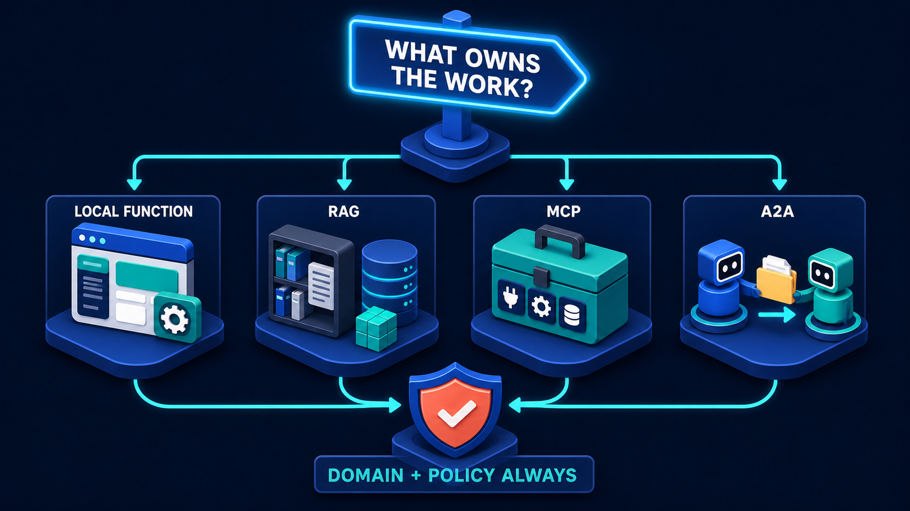

# Diagram 28 — Research Analyst

![Five stages across dark navy. QUESTION shows a thinking person at a screen reading "What are the key factors driving EV adoption in Europe?" RAG EVIDENCE shows three numbered source cards tagged PDF, DOCX and WEB with a magnifier, over a badge reading SOURCES RETRIEVED. MCP DATA shows a toolbox plaqued MCP CAPABILITY GATEWAY with dashed lines to MARKET DATA, REGULATIONS and COMPANIES tiles over a badge reading LIVE STRUCTURED DATA. A2A REVIEWER shows two circulating robots around a clipboard listing CLAIMS VERIFIED, SOURCES VALID and a coral GAPS FLAGGED. CITED REPORT shows a report with charts and citation markers [1] [2] [3] beside a coral shield. A dashed path runs along the bottom through a shield badge reading VERIFY & REFINE back to the question.](../diagrams/28-research-analyst.png)

**Module:** 6 — End-to-end use cases
**Role in the course:** evidence-first research architecture
**Layout:** five stages with a verification loop returning to the question

---

## At a glance

A research pipeline: **QUESTION → RAG EVIDENCE → MCP DATA → A2A REVIEWER → CITED REPORT**, with a **VERIFY & REFINE** loop running back to the start.

Two things distinguish it from the other use cases. It carries a **real question** on the screen — "What are the key factors driving EV adoption in Europe?" — rather than a placeholder. And its reviewer stage is permitted to return **GAPS FLAGGED** in coral, which means the architecture treats "we could not establish this" as a legitimate output rather than a failure.

---

## What the diagram teaches

### 1. Retrieved documents and live data are different things, and the diagram separates them

Stages 2 and 3 are both "getting information," and they are drawn as completely different objects with different badges.

**RAG EVIDENCE** shows three numbered source cards tagged by format — **1 PDF**, **2 DOCX**, **3 WEB** — with a badge reading **SOURCES RETRIEVED**. Documents. Text somebody wrote. Indexed, chunked, searched semantically.

**MCP DATA** shows a toolbox plaqued **MCP CAPABILITY GATEWAY**, with dashed lines to three tiles — **MARKET DATA**, **REGULATIONS**, **COMPANIES** — over a badge reading **LIVE STRUCTURED DATA**. Systems. Numbers that change. Queried, not retrieved.

The separation is the boundary lesson applied to research specifically:

For a research system this distinction is not academic. An analyst asking about EV adoption needs both an industry report's argument about charging infrastructure (a document) and current registration figures (live data). Indexing the registration figures would make them stale; treating the report as a queryable system would make it unusable.

The badges spell out the difference in case the icons do not: **retrieved** versus **live**.

### 2. The three data tiles are named, and naming them changes the design

**MARKET DATA**, **REGULATIONS**, **COMPANIES**. Three specific systems rather than a generic "data source."

Each has different properties an analyst cares about: market data has a vintage and a provider, regulations have jurisdictions and effective dates, company data has filing periods. A research assistant that treats them as interchangeable produces reports that mix a 2024 regulation with 2026 registration figures without noticing.

Naming them in the architecture forces the question of what each contributes and how current it is — which is the first thing a reviewer will ask about any number in the report.

### 3. The reviewer is permitted to flag gaps, and the coral makes it explicit

The A2A stage shows two circulating robots around a clipboard with three rows:

- ✓ **CLAIMS VERIFIED**
- ✓ **SOURCES VALID**
- ⚠ **GAPS FLAGGED** *(coral)*

Two green, one coral. The reviewer's job is not to approve. It is to assess, and one of its available assessments is that something could not be established.

This is what makes the architecture evidence-first rather than confirmation-shaped. A reviewer that can only pass or fail is a rubber stamp with extra latency. A reviewer that can say "claims 1 through 4 are supported, claim 5 has no source, and the question also asked about X which nothing addresses" is doing analytical work.

Three distinct things it checks:

**Claims verified** — does each assertion trace to something retrieved or queried? Per-claim grounding:

**Sources valid** — are the cited sources real, current, and do they say what the claim says they say?

**Gaps flagged** — what did the question ask that the evidence does not answer? This is coverage, and it is the check that distinguishes an honest report from a confident one.

### 4. The citation markers are visible in the output

The final stage shows a report page with charts, a bar chart with a trend line, a pie chart, a coral shield — and **[1] [2] [3] citation markers down the right margin**.

Drawing the markers into the deliverable makes a claim about what a research output *is*. Not prose that happens to be based on sources — a document where each assertion carries a resolvable reference.

For a research use case this is the entire product. An analyst's report without citations is an opinion. With them, it is a piece of work someone else can check, build on, or disagree with specifically.

### 5. The loop returns to the question, not to the evidence

Along the bottom, a dashed path runs from the report through a shield badge reading **VERIFY & REFINE** and back to the **QUESTION** stage.

Note the destination. Not back to retrieval, not back to the reviewer — back to the beginning.

That is a specific claim about research. When verification finds a gap, the correct response is often not "retrieve more" but "the question needs refining." A gap may mean the evidence does not exist, the question was too broad, or the question contained an assumption the evidence contradicts.

Compare with the grounded-citations loop, which returns to the evidence stage — appropriate for a question-answering system where the question is fixed. Research is iterative in a stronger sense: the question itself is a work product that improves as evidence accumulates.

### 6. Two coral elements, doing different jobs

Coral appears twice, and the two uses are worth distinguishing.

**GAPS FLAGGED** in the reviewer — a finding. Something the process discovered and is reporting honestly.

**The shield beside the report** — policy. Whatever governs what may be published, circulated, or relied upon.

A research output can be complete, well-cited, and still fail a policy check — because it draws on a source the organisation may not redistribute, or because it makes a forward-looking claim that requires a disclaimer, or because it is about a company the firm is restricted on.

---

## Case study — Calloway Research, the equity desk

Calloway is an independent research house producing sector analysis for institutional investors. About forty analysts covering energy, industrials, and mobility. Their output is written reports, and their reputation is entirely a function of whether those reports hold up.

They built an assistant to support the drafting process. The rule set at the outset by the head of research: **the assistant may assemble evidence and draft; it may not be the reason a claim appears in a published report.**

### Stage 1 — Question

An analyst covering European mobility is preparing a sector note and asks, more or less exactly the question on the diagram: *what are the key factors driving EV adoption in Europe?*

Deliberately broad. The analyst is scoping, not seeking a single fact. This matters for how the pipeline behaves — a broad question should produce a structured evidence map with visible gaps, not a confident essay.

### Stage 2 — RAG Evidence

Calloway's index holds around 90,000 documents:

- **Industry reports** — purchased and public, PDF, going back eight years.
- **Regulatory publications** — EU and member-state, in several languages.
- **Company filings and transcripts** — annual reports, quarterly calls, capital markets days.
- **Their own prior research** — every note Calloway has published, which is both a source and a consistency check.
- **Trade press** — a curated set, tagged by reliability tier.

That last tag matters. Not all sources carry equal weight, and the assistant surfaces the tier alongside each retrieval so an analyst can see whether a claim rests on a regulator's publication or a trade blog.

For this question, retrieval returns material on charging infrastructure, purchase incentives, total cost of ownership, model availability, and consumer sentiment — with format tags exactly as the diagram shows, because an analyst treats a PDF industry report differently from a web source.

### Stage 3 — MCP Data

The three named tiles correspond closely to Calloway's actual gateway:

- **Market data** — vehicle registrations by country, month and powertrain, from a licensed provider. Also charging point counts, electricity prices, and fuel prices.
- **Regulations** — a structured feed of emissions targets, incentive schemes and their expiry dates, by jurisdiction.
- **Companies** — financial data, production figures, and capacity announcements.

Everything here is live and changes. Registration data updates monthly. Incentive schemes change with national budgets. Putting any of it in the document index would guarantee staleness, and staleness in a published research note is a reputational event.

The gateway also enforces licensing. Several data sources permit internal analysis but restrict redistribution, and the gateway tags every result with its redistribution status — which the policy shield at the final stage then checks.

### Stage 4 — A2A Reviewer

Calloway's research standards team maintains a review agent. It is separate from the drafting assistant deliberately: the thing that checks a draft should not be the thing that wrote it.

For this draft it returned:

**Claims verified — 22 of 26.** Each traced to a retrieved source or a queried dataset.

**Sources valid — with two exceptions.** One cited industry report was superseded by a newer edition with revised figures. One regulatory citation referred to a proposed measure that had not been adopted, cited as though it were in force.

That second one is the kind of error that damages a research house. The proposal was real, widely discussed, and had not passed. A reader relying on it would have been reasoning from a regulation that did not exist.

**Gaps flagged — four.**

1. Four claims had no traceable source.
2. Charging infrastructure claims relied on data with national coverage but no urban/rural split, which the question's framing implied mattered.
3. Nothing addressed second-hand market dynamics, which several analysts consider a leading indicator of adoption.
4. Registration figures used were two months old because the provider's latest release had not yet been ingested.

None of these are failures of the assistant. They are an accurate description of what the evidence did and did not support.

### Stage 5 — Cited report and the policy shield

The draft carries inline citation markers resolving to specific passages and specific dataset queries with their as-of dates. An analyst can click any figure and see which query produced it and when.

The policy shield checks three things before anything circulates:

- **Redistribution rights** — no figure whose licence forbids external use appears in a client-facing document.
- **Restricted list** — companies Calloway is restricted on are flagged.
- **Forward-looking statements** — projections carry required disclaimers.

### The loop, which is where the value turned out to be

The **VERIFY & REFINE** path back to the question is the part Calloway did not anticipate mattering.

Gap 3 — nothing on second-hand market dynamics — sent the analyst back to the question rather than back to retrieval. They had not asked about it. Once added to the scope, retrieval found substantial material, and it became one of the note's more differentiated sections.

Gap 2 — no urban/rural split — was a genuine evidence limitation. The data does not exist at that granularity from their providers. The published note states that explicitly rather than reasoning around it.

Their head of research described this as the assistant's most valuable behaviour: **it makes the shape of the missing evidence visible early**, when the question can still be adjusted, rather than late when the note is drafted.

### What did not change

Analysts still write the notes. The assistant assembles evidence, drafts sections, and flags problems. Every claim in a published Calloway note is there because an analyst decided it should be.

The head of research's rule held: the assistant may not be the reason a claim appears. When asked whether that was over-cautious, their answer was that Calloway sells judgement, and a research house whose claims originate from an unaudited process has nothing to sell.

### Measured effects

- **Time from question to first structured draft**: about three days to under a day.
- **Factual corrections at editorial review**: down roughly 70%, driven mainly by the superseded-source and unadopted-regulation classes of error, which the reviewer catches reliably.
- **Citations per note**: up about 2.5×. Not because there is more evidence, but because assembling and formatting citations was previously manual and analysts economised on it.

That last number is the one they consider most important. Cheaper citation means more citation, and more citation means claims that can be checked.

---

## Composition

Five stages run left to right, headed by white uppercase labels and connected by cyan arrows. Two stages carry badge captions beneath them. A dashed cyan path runs along the bottom of the frame from the final stage, through a central shield badge, back to the first.

**QUESTION → RAG EVIDENCE → MCP DATA → A2A REVIEWER → CITED REPORT**

## Element by element

**QUESTION**
A person seated at a desk in a thinking pose, hand to chin, facing a white screen. A teal question-mark bubble sits at the screen's left, and the screen carries the text **"What are the key factors driving EV adoption in Europe?"**

**RAG EVIDENCE**
Three stacked white source cards, numbered **1**, **2** and **3** with coloured badges, each tagged at its right edge — **PDF** in red, **DOCX** in blue, **WEB** in teal. A teal database stack sits behind them and a blue **magnifying glass** in front. Below, a dark badge with a green check reads **SOURCES RETRIEVED**.

**MCP DATA**
The green toolbox with plug, gear and database tiles, carrying a dark plaque reading **MCP CAPABILITY GATEWAY**. Three **dashed cyan lines** descend to three dark tiles: a bar-chart icon labelled **MARKET DATA**, a **$** icon labelled **REGULATIONS**, and a people icon labelled **COMPANIES**. Below, a badge with a green check reads **LIVE STRUCTURED DATA**.

**A2A REVIEWER**
A blue cube robot above and a teal cube robot below, with curved cyan arrows circulating between them around a white clipboard card. The card lists three rows: a green check and **CLAIMS VERIFIED**, a green check and **SOURCES VALID**, and a **coral warning triangle** with **GAPS FLAGGED**.

**CITED REPORT**
A white report page showing a **bar chart with a rising trend line** at the top, body text lines, a **pie chart** at the lower right, and **[1]**, **[2]**, **[3]** citation markers down the right margin in red, teal and blue. A **coral shield with a white check** stands at the page's left.

**The verify loop**
A dashed cyan line running from beneath the report, leftward along the base of the frame, through a circular badge containing a **teal shield with a white check** captioned **VERIFY & REFINE**, and up into the question stage.

## Colour and flow semantics

- **Cyan arrows** carry the pipeline forward; **dashed cyan** descends to the three data tiles and carries the verification loop.
- **Coral** appears twice with different meanings: **GAPS FLAGGED** is a finding; the shield beside the report is policy.
- **Green check badges** mark the two evidence stages as having completed successfully — retrieved, and live.
- The **format tags** (PDF, DOCX, WEB) and the **named data tiles** are both instances of the diagram refusing to be generic about sources.
- The loop returning to **QUESTION** rather than to evidence is the diagram's most distinctive structural choice.

## How to present it

**Read the question off the screen.** It is a real question, and it is worth pointing out that the diagram committed to one. Then ask what kinds of information answering it requires. The room will name both documents and figures, which sets up the stage 2 / stage 3 split without you making the argument.

**Ask why retrieved and live are two stages.** Then apply the timescale test from the boundary lesson: does it change faster than your ingestion cycle. Registration figures do; an industry report does not. Ask what would happen if you indexed the registration data — the answer is a research note with stale numbers, which in this domain is a reputational event.

**Point at GAPS FLAGGED and ask what it means that it is coral.** The reviewer is allowed to say something could not be established. Then ask what a reviewer that could only pass or fail would be worth. This is the difference between a review step and a rubber stamp.

**Ask where the loop goes.** Most people expect it to return to evidence. It returns to the question. Ask why that would be right for research specifically, and steer to the answer: a gap sometimes means the question was wrong, and the question is itself a work product.

**Use Calloway's gap 3.** Nothing on second-hand market dynamics — because nobody had asked. Refining the question produced the note's most differentiated section. This is the clearest illustration of what a return-to-question loop is for.

**Ask about source tiering.** Calloway tags trade press by reliability. Most teams index everything at equal weight. Ask whether their system distinguishes a regulator's publication from a blog post, and whether the analyst can see which they are relying on.

**Point at the citation markers and ask what a research output is.** Prose based on sources, or a document where each claim carries a resolvable reference. Then give them the number: Calloway's citations per note went up 2.5× because citing got cheaper. Cheaper citation means more of it, which means more checkable claims.

**Close on the rule.** *The assistant may assemble evidence and draft; it may not be the reason a claim appears in a published report.* Ask what the equivalent rule is in their domain, and whether anyone has written it down.

**Timing.** Thirty minutes. Forty if you work through what their own reviewer stage would be permitted to say.

---

## Lab and checkpoint

**Lab:** Produce a one-page research note on a topic in your domain using the five-stage research architecture. For each claim, attach a resolvable citation to one of three source tiers: regulator or primary source, reputable trade publication, or analyst note. Then run a reviewer stage that is allowed to flag gaps rather than only pass or fail, and refine the question based on one gap.

**Checkpoint:** Why does the dashed verification loop return to the question, not the evidence?

**Answer:** Because a gap sometimes means the question itself was wrong or incomplete. In research, refining the question can be more valuable than gathering more evidence. Returning to the question makes the question a work product, not just an input.

## Glossary

- **A2A reviewer** — an autonomous specialist that checks claims and can flag gaps.
- **Citation marker** — a resolvable reference that supports a specific claim in the output.
- **Gaps flagged** — the coral marker that the reviewer could not establish a claim.
- **Knowledge index** — retrieved, stable information used to answer the research question.
- **Live structured data** — real-time data accessed through MCP capabilities.
- **MCP capability gateway** — the tool gateway that connects the agent to live data sources.
- **Research note** — a cited, verified document whose claims are tied to evidence.
- **Source tiering** — the practice of distinguishing sources by reliability and weight.

## Sources

- Research automation, RAG evidence, and citation design
- A2A reviewer and multi-source analysis patterns
- Source-tiering and reliability-weighted retrieval practices
