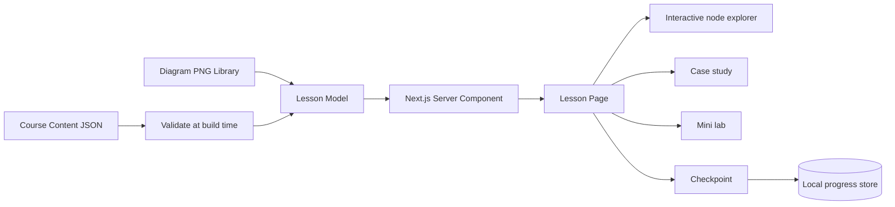

# Visual Agent Academy — Website Roadmap

## The next logical step

Volume 1 built the big mental model: RAG supplies evidence, MCP supplies capabilities, A2A delegates separately owned work, and domain policy controls consequences. The correct next step for a beginner is **the implementation bridge**: learn the ordinary web and application machinery underneath those protocols, then follow one request through an agent runtime, failure handling, observability, and deployment.

That is why Volume 2 follows this order:

1. Browser → HTTP → JSON → schema validation.
2. Frontend → backend → domain → storage → identity.
3. Agent loop → MCP tool → RAG verification → A2A task.
4. Error recovery → tracing → deployment → capstone build order.

Skipping directly to SDK syntax would teach button pressing. This sequence teaches what the buttons actually do.

## The website promise

Every lesson should let a visual learner answer four questions without leaving the page:

- What am I looking at?
- What happens next, and why?
- How would this appear in Next.js and Python?
- What breaks in a realistic case study?

## Recommended information architecture

```text
Visual Agent Academy
├── Start Here
│   ├── Course map
│   ├── Visual legend
│   └── Pick a learning path
├── Foundations
│   ├── Web requests
│   ├── Application boundaries
│   └── Identity and storage
├── Protocols and Patterns
│   ├── MCP
│   ├── RAG
│   ├── A2A
│   └── ACP history and migration
├── Runtime and Reliability
│   ├── Agent loops
│   ├── Errors and retries
│   ├── Observability
│   └── Deployment
├── Case Studies
│   ├── Support desk
│   ├── Research assistant
│   ├── Order operations
│   └── Compliance review
├── Build Labs
│   ├── Next.js / React
│   └── Python / FastAPI
└── Reference
    ├── Glossary
    ├── Protocol baselines
    ├── Diagram library
    └── Source register
```

## One lesson page

```text
┌──────────────────────────────────────────────────────────────────┐
│ Breadcrumb              Lesson 40 of 46            Progress 87%  │
├──────────────────────────────────────────────────────────────────┤
│ The complete MCP-style tool call lifecycle                       │
│ You will be able to: explain every responsibility around a call  │
├──────────────────────────────────────────────────────────────────┤
│                                                                  │
│                    LARGE 16:9 DIAGRAM                            │
│                                                                  │
├───────────────────────────────┬──────────────────────────────────┤
│ TRACE THE VISUAL              │ PRESS A NODE                     │
│ 1 Model proposes              │ MODEL PROPOSES                   │
│ 2 Client validates            │ Definition + why it exists       │
│ 3 Server authorizes           │ Next.js file + Python function   │
│ 4 Domain executes             │ Common failure                   │
│ 5 Result + receipt            │                                  │
├───────────────────────────────┴──────────────────────────────────┤
│ CASE STUDY: Maya closes a ticket                                 │
│ Situation → walkthrough → result → danger → takeaway             │
├──────────────────────────────────────────────────────────────────┤
│ MINI LAB                CHECKPOINT                SHOW ANSWER     │
├──────────────────────────────────────────────────────────────────┤
│ Related lessons · Glossary · Official source · Previous / Next   │
└──────────────────────────────────────────────────────────────────┘
```

## Data flow for the future Next.js site



The included `Volume 2 Course Content.json` is already shaped for this model. A future site should validate it at build time, generate one route per `slug`, and keep the diagram as the stable visual anchor.

## Suggested Next.js structure

```text
visual-agent-academy/
├── app/
│   ├── page.tsx
│   ├── learn/[slug]/page.tsx
│   ├── case-studies/[slug]/page.tsx
│   ├── glossary/page.tsx
│   └── api/progress/route.ts
├── components/
│   ├── diagram-viewer.tsx
│   ├── visual-stepper.tsx
│   ├── case-study.tsx
│   ├── checkpoint.tsx
│   ├── code-map-tabs.tsx
│   └── lesson-navigation.tsx
├── content/
│   └── course-data.json
├── public/
│   └── diagrams/
├── lib/
│   ├── course-schema.ts
│   ├── course-data.ts
│   └── progress.ts
└── tests/
    ├── course-data.test.ts
    └── lesson-flow.spec.ts
```

## Interaction ideas that help learning

- **Trace mode:** highlight one arrow and explanation at a time.
- **Node explorer:** press MODEL, MCP, A2A, RAG, RECEIPT, or POLICY to open a plain-English card.
- **Before-and-after toggle:** compare an unsafe design with the corrected design.
- **Failure switch:** change a happy path into bad input, denied access, retry, or input-required.
- **Stack tabs:** keep the same concept visible while switching between Next.js and Python.
- **Teach-back recorder:** ask the learner to explain the picture in 20 seconds, then compare with the model sentence.
- **Checkpoint reveal:** show the answer only after the learner commits to a choice.
- **Capstone map:** mark a diagram complete only after its happy and failure path labs pass.

## Accessibility rules

- Every diagram needs meaningful alt text and a complete text explanation; never make the image the only source of information.
- Do not communicate state using color alone. Keep the labels STOP, DENIED, FAILED, and COMPLETED visible.
- Make every interactive node reachable by keyboard with a visible focus state.
- Respect reduced-motion settings; trace animation must have a static alternative.
- Keep body text large, black on white, and comfortably spaced.
- Provide a downloadable document and diagram library for offline study.

## Content quality rules

- Define jargon the first time it appears.
- Keep protocol facts separate from SDK syntax that can change faster.
- Date every protocol baseline and link to official specifications.
- Treat ACP as historical lineage into A2A, not a new implementation target.
- For MCP `2026-07-28`, do not teach the retired `initialize` / `initialized` exchange or `Mcp-Session-Id` as the modern core.
- Put security, idempotency, receipts, error paths, and observability into the lesson itself—not in an optional advanced appendix.
- Never claim sample timing, accuracy, savings, or reliability metrics are measured production results.

## Case-study template

Every scenario should contain:

1. **Situation:** a person with a concrete goal.
2. **System boundary:** who owns the UI, evidence, capability, delegated work, and final policy.
3. **Walkthrough:** numbered steps matching the diagram arrows.
4. **Result:** the observable answer, artifact, task, or receipt.
5. **Danger:** the most likely beginner mistake.
6. **Recovery:** what the system does when that mistake or failure occurs.
7. **Takeaway:** one sentence the learner can repeat.
8. **Build map:** the Next.js files and Python functions involved.

## Suggested production phases

### Phase 1 — Static learning site

- Render the JSON and PNG diagrams.
- Generate lesson, glossary, and case-study routes.
- Add next/previous navigation, searchable titles, and local progress.
- Deploy to a Vercel preview and run accessibility checks.

### Phase 2 — Interactive diagrams

- Add invisible, accessible hotspots over diagram nodes.
- Add trace mode and failure toggles.
- Preserve the full text explanation beneath every visual.

### Phase 3 — Executable labs

- Connect lessons to the existing Next.js and Python projects.
- Embed safe request/response examples and test fixtures.
- Let learners run deterministic simulations before any live model or external service.

### Phase 4 — Capstone and assessment

- Add a seven-layer capstone checklist based on Diagram 46.
- Require one happy-path and one failure-path test at every layer.
- Generate a learner-owned architecture summary rather than a vague completion badge.

## Current-spec source register

- MCP `2026-07-28`: <https://blog.modelcontextprotocol.io/posts/2026-07-28/>
- MCP TypeScript SDK migration guidance: <https://ts.sdk.modelcontextprotocol.io/v2/migration/support-2026-07-28>
- A2A latest specification: <https://a2a-protocol.org/latest/specification/>
- A2A release history: <https://github.com/a2aproject/A2A/releases>

Checked on 2026-08-24. Recheck these sources before a future production build because specifications and SDKs continue to evolve.

