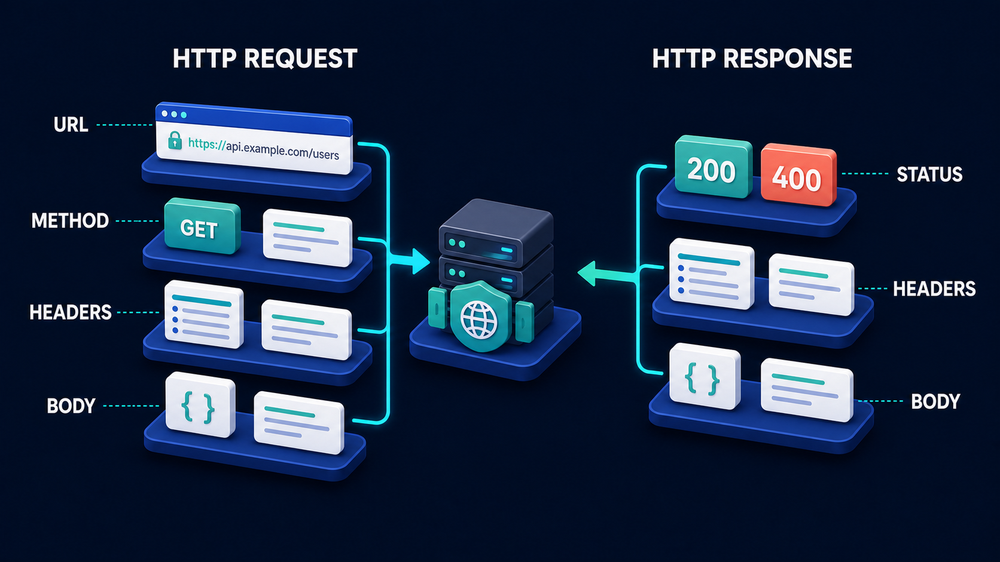

# Diagram 31 — Browser Request Journey

**Module:** Web foundations
**Role in the course:** the first diagram — what actually happens when you open a website
**Layout:** six numbered stages with explanation cards and a return path

---

## At a glance

Six stages between typing an address and seeing a page: **PERSON → BROWSER → DNS → HTTPS → WEB SERVER → PAGE + DATA**.

This is the opening diagram of the course and it is doing something none of the later ones do — it carries a written explanation card under every stage. That is deliberate for a first diagram. Everything after this assumes you have this journey in your head.

The detail that makes it more than a beginner's illustration is the final stage: the page comes back **with a JSON badge attached**. From the very first picture, the course is establishing that a modern web response is a page *and* data, which is the thread that leads to everything about APIs later.

---

## What the diagram teaches

### 1. Six stages, and three of them are invisible

A person typing an address experiences two things: they type, and the page appears. The diagram inserts four stages between those two events, and three of them — DNS, HTTPS, and the server's processing — leave no trace a user would notice.

That invisibility is exactly why the diagram exists. When something goes wrong, the symptom is always the same: "the site doesn't work." The cause is in one of six places, and you cannot diagnose it without knowing the six places exist.

This is the same reasoning behind the request-journey diagram in Volume 1 — a numbered sequence is a debugging map, not just a narrative. Six numbered stages give you six questions to ask.

### 2. DNS is a lookup, and the diagram shows the actual translation

Stage 3 shows something concrete: **example.com** with an arrow pointing down to **93.184.216.34**.

A name goes in, a number comes out. That is the entire function.

Beginners often think of a domain name as *being* the website. It is not — it is a label that has to be translated into an address before anything can be sent anywhere. The stack of database cylinders behind the translation says this lookup happens against a system somebody else operates, which is why it can be slow, cached, stale, or wrong independently of whether your server is healthy.

The practical consequence is the most common false alarm in web operations: **a site can be completely healthy and completely unreachable** because the translation is broken. Nothing about the server is wrong. Stage 5 never gets a chance to run.

### 3. HTTPS is a stage, not a setting

Stage 4 shows a large teal padlock labelled **HTTPS** with a coral shield carrying a check.

Placing it as its own numbered stage — between finding the address and reaching the server — says something beginners routinely get wrong. HTTPS is not a property of the site. It is a **negotiation that happens on every connection**, before any request content is sent.

The order matters. The secure channel is established first, and then the request travels inside it. That is why a certificate problem stops everything: there is no channel for the request to travel through, so the server never hears from you at all.

The coral shield is the diagram's only coral element. In this library coral marks risk and gates, and the security handshake is both — it can refuse.

### 4. The server receives a specific request, and you can see it

Stage 5 shows a server rack with a white card in front of it reading **GET /**.

Two characters of real content, and they carry a lot. `GET` is the method — what kind of operation this is. `/` is the path — which resource is being asked for. Together they are the complete statement of what the browser wants.

Showing it here rather than describing it abstractly sets up the next diagram, which pulls a request apart into its four parts:

A learner who has seen `GET /` on this picture already knows that a request has a method and a target before anyone tells them.

### 5. The response carries a page and data, and the JSON badge is the bridge

Stage 6 shows a rendered web page with a dark tile attached to its corner reading **{ } JSON**.

This is the most forward-looking detail in the diagram. The old mental model — a server sends a page, the browser displays it — is incomplete for anything built in the last decade. Modern applications receive **markup for structure and JSON for data**, often in separate requests.

By putting the JSON badge in the first diagram of the course, the picture establishes that data is a first-class part of the response. Everything in the course about APIs, tool calls, and agent responses is about that badge.

### 6. The dashed return line is the whole point of the journey

A dashed teal line runs along the bottom of the frame, with arrows rising into every explanation card, and terminates pointing back at the person.

Two readings, both correct.

**The result comes back.** A request is a round trip. The forward journey is only half of it, and the person who asked is where it ends.

**Every stage is on the return path too.** The arrows rise into all six cards, which means the response passes back through the same infrastructure. A slow return is as much a problem as a slow request, and it can fail at stages that succeeded on the way out.

---

## Case study — Marlow Studio, the morning the site "went down"

Marlow is a twelve-person design agency. Their site is their shopfront — portfolio, contact form, the thing clients look at before calling.

On a Tuesday morning the founder could not load it. Neither could two staff. The site was, as far as anyone could tell, gone.

### What they did first, and why it wasted two hours

The developer on retainer did the obvious thing: checked the server.

The server was fine. It was up, responding, serving pages correctly to anyone who asked it directly by IP address. Logs showed normal traffic overnight and then, at about 06:40, nothing.

Two hours went into the server. Restarting it. Checking disk. Checking the web server config. Checking whether a deploy had gone out. Nothing was wrong, and nothing they did changed anything, because the server was never the problem.

### Walking the six stages

Someone suggested going through the journey in order rather than guessing. It took eleven minutes.

**Stage 1 — Person.** Multiple people, multiple devices, multiple networks. Not a local problem, which rules out browser cache and one machine's configuration. Worth confirming rather than assuming; a surprising share of "the site is down" reports are one person's browser.

**Stage 2 — Browser.** The address bar showed the right domain. No typo, no autocomplete to an old address. The browser was producing a correct request.

**Stage 3 — DNS.** This is where it stopped.

Looking up `marlowstudio.com` returned nothing. No address. The translation from name to number was failing, which meant the browser had nowhere to send anything.

**Stages 4, 5 and 6** were never reached. There was no connection to secure, no server to ask, and no page to return. Every hour spent on the server had been spent on a stage the request never got to.

### The cause

The domain registration had lapsed.

Renewal was on a card that had expired in December. The registrar had sent reminders to an email address belonging to a designer who had left the studio fourteen months earlier and whose mailbox had been deleted. Nobody received a single warning.

The domain entered a grace period, and at 06:40 the DNS records were withdrawn.

### The fix and the real lesson

Renewal took ten minutes. Propagation took about four hours, during which the site was intermittently reachable for some people and not others — which is itself a signature of a DNS problem rather than a server problem, and which they now recognise.

The founder's summary, which is the reason this diagram opens the course: *we spent two hours fixing something that wasn't broken, because we only knew about one of the six stages.*

### What they changed

**Domain and certificate renewal moved to a shared account** with three people receiving notices, and calendar reminders sixty days out.

**They wrote down a checking order.** When the site appears down, check in stage order rather than starting with the server:

1. Can more than one person on more than one network reproduce it?
2. Is the address correct?
3. Does the name resolve to an address?
4. Does the secure connection establish?
5. Does the server respond when asked directly?
6. Does the page render and the data load?

**They learned to read the failure signature.** Each stage fails differently, and the browser usually tells you which one:

- *Name not resolved / server address could not be found* → stage 3.
- *Certificate warning, connection not private* → stage 4.
- *Connection timed out / refused* → stage 5.
- *Page loads but is empty or broken* → stage 6, and the data half of the response.

That last one is the most valuable and the least obvious. A page that renders with no content is not a down site; it is a working stage 5 and a failing stage 6, and the two need completely different investigations.

---

## Composition

Six stages run left to right across the upper two-thirds of the frame, each on a blue platform with a large numeral and a white uppercase label above it. Short cyan arrows connect the stages.

Beneath each stage sits a **white rounded explanation card** carrying a teal circular icon and two or three lines of plain-language text. Small cyan arrows rise from a dashed line into each card.

Along the bottom, a **dashed teal line** runs the full width of the frame and turns upward at the left, pointing back toward the person.

## Element by element

**1 PERSON**
A person seated at a desk, seen from behind, typing on a laptop. The laptop screen shows an address bar containing **example.com** with a teal arrow button. *Card: "Person enters a web address in the browser."*

**2 BROWSER**
A 3D browser window with a blue title bar, an address bar reading **example.com** with a teal go-arrow, and a teal content block below. *Card: "Browser prepares and sends a request to visit the website."*

**3 DNS**
A stack of teal database cylinders beside a dark panel showing **example.com**, a teal globe icon, a downward arrow, and **93.184.216.34**. *Card: "DNS looks up the domain and returns the IP address of the web server."*

**4 HTTPS**
A large teal **padlock** labelled **HTTPS**, with a **coral shield carrying a white check** at its lower right. *Card: "Browser creates an encrypted HTTPS connection to the server."*

**5 WEB SERVER**
A blue server rack with indicator lights, and a white card in front of it reading **GET /** in teal. *Card: "Web server receives the request and processes it."*

**6 PAGE + DATA**
A rendered web page with a blue title bar and teal content blocks, with a dark tile attached at its lower right showing **{ }** and the word **JSON**. *Card: "Server sends back the web page and data (JSON). Browser displays the content."*

## Colour and flow semantics

- **Cyan arrows** carry the request forward between stages.
- **Teal** marks the working infrastructure — the DNS cylinders, the padlock, the go-arrows.
- **Coral** appears exactly once, on the HTTPS shield, marking the one stage that can refuse the connection.
- The **dashed teal line** along the bottom carries the result back to the person and connects every explanation card.
- The **white explanation cards** are unique to this diagram in the volume — a first-diagram affordance that later diagrams drop.

## How to present it

**Ask the room what happens when you type an address and press enter.** Most people can describe two stages. Then reveal six and point out that three of them are invisible in normal use, which is exactly why they are hard to debug.

**Point at the DNS translation.** `example.com` becomes `93.184.216.34`. Ask what a domain name actually *is*. The answer — a label that must be translated before anything can be sent — is the single most useful correction in this diagram for beginners.

**Then ask the Marlow question.** If your server is completely healthy and your domain does not resolve, what does the user see? A site that is down. Ask where they would have looked first. Almost everyone says the server, and almost everyone would have lost the two hours.

**Ask why HTTPS is a numbered stage rather than a setting.** Push toward the answer: it is negotiated per connection, before the request content travels, which is why a certificate problem stops everything before the server ever hears from you.

**Read `GET /` off the server card.** Ask what those two characters mean. Method and target. This is the bridge to the next diagram, and pulling it out here means the HTTP anatomy lands as a zoom-in rather than as new material.

**Point at the JSON badge and make it a promise.** Say plainly that the data half of that response is what the rest of the course is about. Beginners who understand from diagram one that a response is page *and* data have a much easier time with APIs, tool calls and agent responses later.

**Build the failure-signature table with the room.** For each stage, what does the user actually see? Name not resolved, certificate warning, connection timed out, blank page. Turning six stages into four recognisable symptoms is the most portable thing they can take away.

**Trace the return line last.** Ask what it means that arrows rise into every card. The response comes back through the same six stages — so a slow or broken return is as real a failure as a request that never arrives.

**Timing.** Fifteen minutes as an opener. Twenty-five if you build the failure-signature table, which is worth it for anyone who will ever be asked why a site is down.

---

## Lab and checkpoint

**Lab:** Pick one real "site is down" incident from your experience. Walk it through the six stages: browser, network, DNS, HTTPS, connection, server, response. For each stage, write the symptom the user saw and the check you would run first. Identify the stage that took longest to diagnose and the failure-signature that would have pointed to it faster.

**Checkpoint:** Why is HTTPS a numbered stage rather than a setting?

**Answer:** Because HTTPS is negotiated per connection, before any request content travels. A certificate or TLS problem stops the request before the server hears anything, so it is a stage with its own failure signature, not just a configuration option.

## Glossary

- **Browser** — the client that initiates the request and renders the response.
- **Certificate** — the cryptographic credential that proves the server's identity during HTTPS.
- **Connection** — the established network link between client and server.
- **DNS** — the service that resolves a domain name to an address.
- **HTTPS** — the encrypted layer negotiated before the request is sent.
- **Network** — the path between the browser and the server.
- **Request** — the message the browser sends, such as `GET /`.
- **Response** — the message the server sends back, including page and data.
- **Server** — the service that receives the request and produces the response.

## Sources

- HTTP/1.1 and HTTP/2 request lifecycle
- DNS resolution and TLS/HTTPS handshake
- Browser networking and failure-signature debugging
