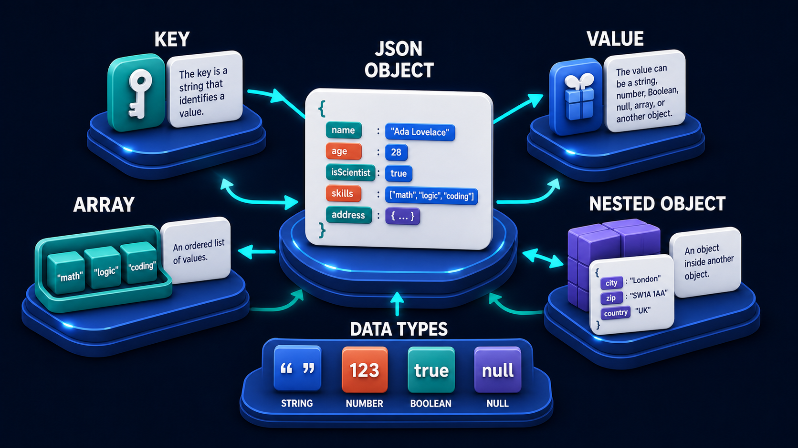

# Diagram 32 — HTTP Conversation


**Module:** Web foundations
**Role in the course:** reading a request and a response
**Layout:** mirrored request and response wings around a central server

---

## At a glance

A request has four parts. A response has three. A server sits between them.

The composition is symmetrical on purpose: **URL, METHOD, HEADERS, BODY** on the left travelling in; **STATUS, HEADERS, BODY** on the right travelling out. Once you can name those seven things, you can read almost any web interaction, debug most integration problems, and understand what a tool call actually is when you meet one later in the course.

The one asymmetry is the whole lesson about what a response adds: **status**.

---

## What the diagram teaches

### 1. Four parts going out, and each answers a different question

**URL — where?** The panel shows a real address: `https://api.example.com/users`, with a padlock. Protocol, host, path. It identifies the resource being addressed.

**METHOD — what kind of operation?** A teal tile reading **GET**. Not what you want done in detail — what *category* of thing this is. Reading, creating, replacing, removing.

**HEADERS — under what circumstances?** White list cards. Who you are, what format you can accept, what you are carrying. Metadata about the request rather than the request's content.

**BODY — with what content?** A card showing `{ }`. The payload. Note that the diagram gives GET a body panel anyway, which is honest about the *structure* even though a GET typically carries nothing there.

The separation matters because these four fail independently and produce different errors. A wrong URL gives you a 404. A wrong method gives you a 405. A missing header gives you a 401. A malformed body gives you a 400. Knowing which of the four is wrong is most of debugging.

### 2. The response adds status, and status is the part beginners skip

The right wing has three parts where the left has four, and the one that changed is the addition of **STATUS**.

The panel shows two tiles side by side: a **teal 200** and a **coral 400**. Both are drawn, at equal size.

That pairing is the diagram's sharpest detail. A response is not "the data you asked for." A response is **a verdict plus, sometimes, data**. The verdict comes first, and it determines whether the body means anything at all.

The failure mode this prevents is one of the most common beginner bugs: code that reads the response body without checking the status. A 400 response has a body too — it just contains an error explanation rather than the data. Parsing it as though it were the data produces confusing failures far away from the actual cause.

The colour coding is the library's convention doing real work: teal for the outcome you wanted, coral for the one that refused you.

### 3. Headers appear on both sides, and that symmetry is informative

Headers are the only part that appears in both wings.

Going out, they carry who you are and what you can handle. Coming back, they carry what the server is sending and how to treat it — content type, caching instructions, rate limit information.

For beginners the practical version is: **when something is behaving strangely and the body looks fine, read the headers.** Authentication problems, content-type mismatches, caching surprises and rate limiting all live there, and none of them are visible in the body.

### 4. The body is the same shape in both directions

Both body panels show `{ }` — curly braces, the JSON marker from the previous diagram.

That repetition establishes something structurally important: **JSON travels in both directions**. It is not a server-response format. It is the shared data language of the conversation, which is why the next diagram spends a whole picture on its anatomy:



### 5. The server is drawn small, and that is deliberate

The centre of the frame is a modest dark server unit with a teal shield and globe. It is smaller than either wing.

The proportions say the conversation is the subject, not the machine. What matters for a learner is the *shape* of what goes in and what comes out. The thing in the middle can be anything — a web server, an API, a capability server, another agent — and the seven parts stay the same.

This is what makes HTTP worth a full diagram this early. Every later interaction in the course rides on this shape.

### 6. The two arrows are different colours, and the convention holds all course long

The request arrow into the server is **cyan**. The response arrow out is **teal**.

Forward work in cyan, results in teal — the same grammar used in every diagram in both volumes. Establishing it here on the simplest possible example means that when a learner reaches the tool-call lifecycle or the task state machine, the arrow colours are already carrying meaning without explanation.

---

## Case study — Halberd Books, the integration that returned nothing

Halberd is an independent bookshop chain with nine stores. They were connecting their point-of-sale system to a wholesaler's stock API so that staff could check availability without phoning.

Their developer — one person, part-time, competent but new to API work — spent three days on an integration that returned nothing. No data, no obvious error, just an empty result every time.

### What "nothing" actually was

The code fetched the endpoint, parsed the response as JSON, read the `items` field, and got `undefined`. Then it rendered an empty list.

Every time. Consistently. Which felt like a data problem — as though the wholesaler simply had no stock records for the queried ISBNs.

The developer emailed the wholesaler twice asking whether the catalogue was populated. It was.

### Walking the seven parts

The breakthrough came from printing the entire request and the entire response rather than just the parsed data. Seven parts, checked one at a time.

**URL.** `https://api.wholesaler.example/v2/stock` — correct, taken from the documentation.

**Method.** `GET`. The documentation's stock lookup was a `GET`. Correct.

**Headers.** Here was the first finding. The request carried `Authorization` with an API key, and `Accept: */*`. The documentation specified `Accept: application/json`. Not obviously fatal, and it turned out to matter.

**Body.** Empty, correct for a GET.

**Status.** `403`.

That was the whole mystery, sitting in a field nobody had looked at. The request was being **refused**, not returned empty.

**Response headers.** `Content-Type: text/html`. The server was returning an HTML error page, not JSON — which is why `Accept: */*` mattered. The server, told the client would accept anything, sent a human-readable error page.

**Response body.** An HTML document saying the API key was not valid for this endpoint.

### The actual cause

The key was valid — for the sandbox environment. The developer had been issued a sandbox key during evaluation and a production key at contract signing, and had never swapped the value in the configuration file.

The wholesaler's production endpoint saw a sandbox key and refused it.

### Why three days

The developer's code did exactly what a lot of first-integration code does:

```
fetch(url) → parse as JSON → read .items → render
```

Four steps, and the failure was invisible at every one of them. The fetch succeeded — a 403 is a successful HTTP exchange, just an unsuccessful outcome. The parse succeeded, sort of, because the error page happened to parse without throwing in their setup. Reading `.items` from an object that did not have it returned `undefined` rather than raising. Rendering `undefined` produced an empty list.

**Nothing anywhere in that chain checked the status.** The verdict — the single most important part of the response — was discarded before it was read.

### What they changed

**Status is checked first, always.** Before parsing, before reading fields. A non-2xx response raises with the status code and the response body included in the message.

**Content-type is checked before parsing.** If the server says it is sending HTML, do not attempt to read it as JSON. This alone turns a confusing `undefined` into a clear "expected JSON, got text/html."

**Accept is set explicitly.** `Accept: application/json`, so a server producing an error produces a *machine-readable* error rather than a web page.

**Errors are logged with all seven parts.** When an integration call fails, the log contains the URL, the method, the headers with the key redacted, the body, and the full response status, headers and body. Their next integration problem took eleven minutes.

### The line the developer wrote in the README

*A 403 is not an empty result. Read the status before you read anything else.*

Three days, and the information needed to solve it was present in the very first response the code ever received.

---

## Composition

A symmetrical layout with a server at centre.

**Left wing — HTTP REQUEST:** four blue platforms stacked vertically, each carrying its content and labelled to its left with a dashed leader line: **URL**, **METHOD**, **HEADERS**, **BODY**. Thin cyan lines gather from all four into a single **cyan arrow** entering the server.

**Centre:** a dark server unit with two teal indicator dots, flanked by teal side panels, with a **teal shield bearing a globe** on its front, on a blue platform.

**Right wing — HTTP RESPONSE:** three blue platforms stacked vertically, labelled to their right: **STATUS**, **HEADERS**, **BODY**. Thin cyan lines gather from all three into a single **teal arrow** leaving the server toward them.

## Element by element

**URL**
A browser-style bar with a blue title strip, showing a green padlock and the address **https://api.example.com/users**.

**METHOD**
A teal rounded tile reading **GET**, beside a white card with teal and grey text lines.

**HEADERS** *(request)*
Two white cards showing bulleted rows — blue dots with text lines. Metadata, not content.

**BODY** *(request)*
A white card showing large teal **`{ }`** braces, beside a second white card with text lines.

**The server**
A dark two-tier unit with teal accents, a teal shield with a white globe on its face, and teal side panels.

**STATUS**
Two rounded tiles side by side: a **teal 200** and a **coral 400**, drawn at equal size on one platform.

**HEADERS** *(response)*
Two white cards with bulleted rows, mirroring the request headers.

**BODY** *(response)*
A white card showing teal **`{ }`** braces, beside a card with text lines — mirroring the request body.

## Colour and flow semantics

- **Cyan** carries the request inward; **teal** carries the response outward. The colour change at the server is the library's core arrow grammar.
- **Teal 200 and coral 400** side by side make success and refusal equally visible, refusing to treat the error case as an exception.
- **Dashed leader lines** connect labels to their platforms without implying flow.
- The **mirrored composition** is the teaching device: the response is the request's counterpart, with one part added.

## How to present it

**Count the parts out loud.** Four going out, three coming back. Ask what the extra one is. Status. Then ask why the response needs it and the request does not — because a response is a verdict, and a request is only a proposal.

**Point at 200 and 400 sitting side by side.** Ask what a 400 response's body contains. Most beginners assume it is empty. It is not — it contains an error explanation, in the same field where the data would have been. Code that reads the body without checking the status parses an explanation as though it were data.

**Ask what their code does with the status.** In a room of newer developers, a significant fraction will realise they do not check it. That realisation is the diagram's main output.

**Tell the Halberd story in the right order.** Do not reveal the 403 straight away. Walk the seven parts as the developer did — URL fine, method fine, headers slightly off, body fine, and then the status. The three days collapse into one field, and the room feels it.

**Ask what `Accept: */*` costs.** It is a header nobody thinks about, and it is why the error came back as HTML. Setting it explicitly turns an unreadable error page into a parseable error object. Small change, large effect on debuggability.

**Point out that headers appear on both sides.** Then give the rule: when the body looks fine and the behaviour is strange, read the headers. Auth, content type, caching and rate limiting all live there and none are visible in the body.

**Note that the body is `{ }` in both directions.** JSON is the conversation's shared language, not a server output format. This is the handoff to the next diagram.

**Ask them to name the four request failures.** Wrong URL, wrong method, missing header, malformed body — and the four different status codes they produce. Mapping symptom to part is what turns this from a diagram into a debugging tool.

**Timing.** Twenty minutes. Thirty if you have the room print a real request and response and identify all seven parts, which is the exercise that makes it stick.

---

## Lab and checkpoint

**Lab:** Capture one real HTTP request and response from a system you work on. Label all seven parts: method, URL, request headers, request body, status, response headers, response body. Identify one header that explains a behaviour that the body does not, and write the status-check rule your code should follow before it reads the response body.

**Checkpoint:** Why does a response have a status but a request does not?

**Answer:** Because a request is a proposal; it does not need a verdict. A response is the server's verdict on that proposal, and the status is the verdict. Code that reads the body without checking the status may parse an error explanation as if it were data.

## Glossary

- **Body** — the data payload of a request or response, often JSON.
- **Headers** — metadata attached to a request or response, such as auth, content type, caching, and rate limits.
- **HTTP** — the request/response protocol that carries the conversation.
- **Method** — the action the request is asking the server to perform, such as GET or POST.
- **Request** — the message the client sends to the server.
- **Response** — — the message the server sends back, including a status and a body.
- **Status code** — the three-digit verdict, such as 200 for success or 400 for a client error.
- **URL** — the address the request is sent to.

## Sources

- HTTP/1.1 and HTTP/2 request/response semantics
- RFC 7231 status code definitions
- REST API design and status-code handling
