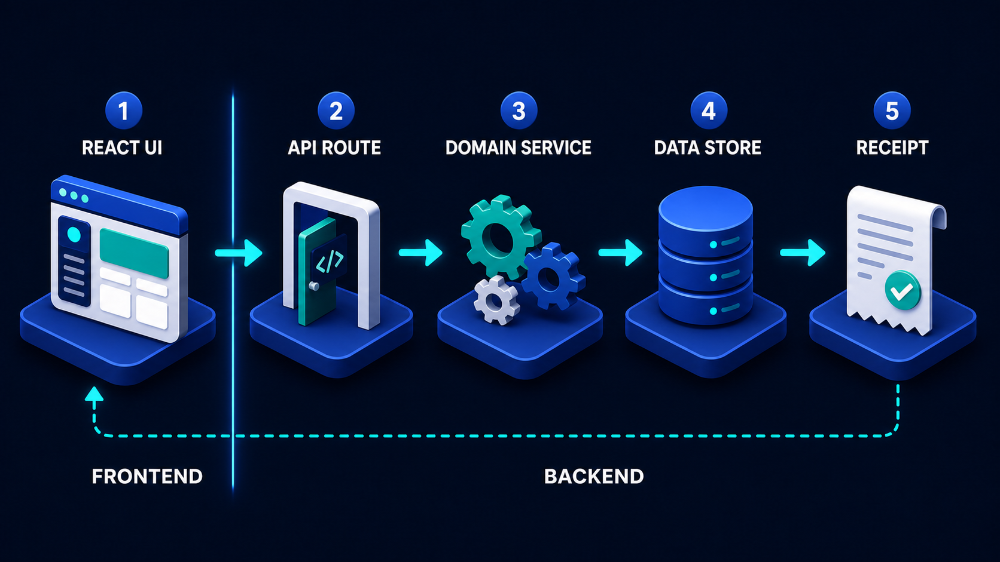

# Diagram 36 — Server Request Pipeline

**Module:** Building the system
**Role in the course:** what happens inside the door, in order
**Layout:** six sequential gates with three coral stop exits and a response return

---

## At a glance

Six stages inside your backend: **ROUTE → VALIDATE → AUTHENTICATE → AUTHORIZE → EXECUTE → RESPOND**, with **three coral STOP exits** hanging beneath stages 2, 3 and 4.

This is the zoom-in on the doorway from the previous diagram. The content is not the list of stages — most developers can name them. It is the **order**, and the fact that three of the six can refuse the request before any of your actual work runs.

---

## What the diagram teaches

### 1. Three stages can stop, and they are consecutive

Stages 2, 3 and 4 each have a coral arrow dropping to a red **STOP** tile. Stages 1, 5 and 6 do not.

That pattern says something structural. The pipeline has a **refusal zone** in the middle: after you have worked out where the request is going, and before you do anything that matters. Every reason to decline a request lives in those three stages.

- **Route** cannot refuse — it finds the handler. A request to a path that does not exist is a 404, but that is the absence of a route rather than a refusal by one.
- **Execute** must not refuse. By the time you reach it, all refusing is done. Business logic that has to re-check permissions is a sign a gate is missing upstream.
- **Respond** cannot refuse. The work is done.

The practical version: **all your "no" belongs in three consecutive places**, which means there are three consecutive places to look when something is wrongly rejected, and three places to audit when something wrongly gets through.

### 2. Validate before authenticate is the ordering that surprises people

The most common instinct is to identify the caller first and then check what they sent. This diagram does the opposite: **validate, then authenticate**.

The reasoning is that validation is cheap and structural. It asks whether the request is *well-formed* — does it have the fields, are they the right types, are they within limits. That question does not depend on who is asking, and answering it first means malformed garbage is discarded before you spend anything on identity lookups, token verification, or database queries.

This is a genuine trade-off and worth being honest about. Validating first means an unauthenticated caller can probe your schema by sending malformed requests and reading the error messages. For an internal service that is usually acceptable; for a public API it may not be, and some teams deliberately authenticate first for exactly that reason.

The version worth teaching a beginner: **know which order you have chosen and why**, because both orders are defensible and neither is safe by accident.

### 3. Authenticate and authorize are different questions

Two stages, two icons, two words that beginners routinely conflate.

**AUTHENTICATE — who are you?** The panel shows a padlock beside an ID card with an avatar. Establishing identity. The answer is a principal or a failure.

**AUTHORIZE — may you do this?** The panel shows a teal shield with a person and a check. Taking a known identity and a specific requested action, and deciding whether the combination is permitted.

The distinction has consequences that are easy to state and easy to get wrong:

- A valid token proves *who*. It does not prove *may*.
- A user can be perfectly authenticated and entirely unauthorised.
- Authentication is about the caller; authorisation is about the caller **and** the specific thing they are asking to do, and often the specific record they are asking to touch.

The most common beginner bug in this area is treating a successful authentication as an authorisation — checking that someone is logged in and then serving them whatever they asked for, including other people's data.

### 4. Execute is one stage and it is the smallest idea in the diagram

Stage 5 shows a server stack with a gear. It is where the actual work happens, and it gets no more visual weight than any other stage.

The proportions carry a message. Four stages of establishing that this request is real, well-formed, from a known party, and permitted — then one stage of doing the thing.

For beginners this reframes what backend code is. Most of what a route does is not the work; it is establishing the conditions under which the work is safe to do.

### 5. Respond is separate from execute, and that separation is useful

Stage 6 shows a document with a green check. It is not folded into execute.

Two reasons.

**What you did and what you say are different.** The work may produce internal state, database rows, and side effects. The response is a deliberately shaped subset of that — the outcome, in the form the caller needs. This is the same claim the frontend boundary makes about what crosses back.

**Every path arrives here.** A request that stopped at authorisation still needs a response. Drawing respond as its own stage means the STOP exits are not the end of the story — they still produce something the caller receives, with a status and a reason.

### 6. The dashed line returns to the caller, not to route

The dashed teal line runs from stage 6 along the base of the frame and turns up into stage 1.

Stage 1 is where the request entered, so returning there means returning to the caller. The pipeline is a round trip, and the response travels back out through the same door it came in.

Worth pointing out because beginners sometimes imagine the response as a separate outbound message. It is the other half of one exchange — the HTTP conversation from earlier in the volume, seen from inside the server.

---

## Case study — Pellow & Co, the API that leaked other people's invoices

Pellow is an accountancy practice, about thirty staff, with a client portal where businesses view and download their invoices. It was built by a two-person development team.

The portal worked correctly for eighteen months. The bug was found during a routine penetration test commissioned for a new client's supplier assessment.

### The finding

The portal's invoice endpoint was `GET /api/invoices/:id`.

The route authenticated the caller — a valid session was required, and requests without one were rejected. Then it fetched the invoice with that ID and returned it.

The tester logged in as a legitimate client, noted their invoice ID, and incremented it. They received another client's invoice: company name, amounts, bank details, line items.

They enumerated 400 invoices across at least forty different client businesses in about ninety seconds.

### What was and was not wrong

Authentication was working perfectly. Every request the tester made was properly authenticated as themselves. At no point did they impersonate anyone or forge anything.

**Authorization did not exist.** The code checked that *somebody* was logged in. It never checked that *this* somebody was entitled to *this* invoice.

Mapped onto the diagram: stage 3 was present and correct. Stage 4 was missing entirely, and the pipeline ran straight from authenticate to execute.

### Why it survived eighteen months

Two reasons, both instructive.

**The UI never generated a wrong request.** The portal only ever rendered links to the logged-in client's own invoices. Following the interface, you could not reach another client's invoice. The frontend was, in effect, doing the authorisation — which the previous diagram's boundary lesson says is not a control.

**"Authenticated" felt like enough.** The developers' mental model had one security stage: are they logged in. Once that passed, the request was treated as legitimate. The word "authorisation" was in their vocabulary but not in their pipeline.

### The rebuild

They restructured every route around the six stages, and made two of them non-optional.

**Authorization became a required stage.** Every route now answers a specific question before executing: may *this principal* perform *this action* on *this resource*. For the invoice endpoint that is: does this invoice belong to a client this user is associated with.

The check runs at the gate, before the invoice is fetched — not after. Fetching and then discarding still means the record was read, which matters for audit and for any logging that fires on read.

**Validation moved ahead of authentication.** Previously their middleware authenticated first, then parsed the body. Moving validation earlier removed a small class of expensive failure — badly-formed requests were triggering token verification and a session lookup before being discarded.

They also chose deliberately, having read both sides. Their API is behind a login and used by a known set of clients, so schema probing by unauthenticated callers was not a concern they weighted heavily.

**Every stop produces a specific response.** Previously a failure at any point produced a generic 500. Now:

- Validation failure → **400** with the field and the reason.
- Authentication failure → **401**.
- Authorization failure → **403**.

That distinction matters operationally as well as for callers. Their monitoring now alerts on a rise in 403s from a single session, which is the signature of exactly the enumeration the tester performed.

### What they check for now

The team added one question to their code review checklist, and it is the whole lesson in a sentence:

*Does this route check that the caller may access this specific record, or only that they are logged in?*

Applying it across the codebase found four more endpoints with the same shape — a document download, a user profile view, a report export, and a payment history endpoint. None had been exploited. All had been reachable for over a year.

### The measured aftermath

- **Four additional endpoints** fixed within a week.
- **403 monitoring** added, which fired legitimately twice in the following year — both times a misconfigured client integration rather than an attack, and both diagnosed within an hour.
- **The client whose supplier assessment triggered the test** stayed, specifically because Pellow disclosed the finding and the fix rather than quietly patching it.

---

## Composition

Six stages run left to right, each on a blue platform with a numbered teal disc and a white uppercase label above it. Cyan arrows connect them.

**Coral arrows** drop vertically from beneath stages 2, 3 and 4 into three **red rounded STOP tiles**, each carrying a white raised-hand glyph and the word **STOP**.

A **dashed teal line** runs from beneath stage 6, along the base of the frame, and turns upward into stage 1.

## Element by element

**1 ROUTE**
A browser window with a blue title bar and text lines, with a **teal wireframe globe** overlapping its lower right. Working out where the request is going.

**2 VALIDATE**
A white checklist card with three **green tick circles** and text lines, with a **teal magnifying glass** in front. Structural checking. *Coral exit to STOP.*

**3 AUTHENTICATE**
A dark **padlock** beside a dark ID panel showing an avatar and a row of dots. Establishing identity. *Coral exit to STOP.*

**4 AUTHORIZE**
A **teal shield** containing a white person icon, with a **teal check disc** at its lower right. Deciding whether this identity may do this thing. *Coral exit to STOP.*

**5 EXECUTE**
A stacked blue server unit with teal indicator lights and a **white gear** overlapping its lower right. The actual work.

**6 RESPOND**
A white document card with a blue header bar and a large **teal check disc**. The shaped outcome.

**The three STOP tiles**
Identical red rounded squares, each with a white open-palm glyph above the word **STOP**, hanging below the refusal zone.

**The return path**
A dashed teal line from stage 6 back to stage 1, closing the round trip.

## Colour and flow semantics

- **Cyan arrows** carry the allowed path forward through all six stages.
- **Coral arrows** carry refusals downward and out, visually leaving the pipeline rather than continuing along it.
- The three **STOP tiles are identical**, but the responses they produce should not be — 400, 401 and 403 are different answers.
- **Teal** marks the working and passing elements: the globe, the ticks, the shield, the checks.
- The **dashed teal return** closes the loop to the caller.
- Stages 1, 5 and 6 have **no downward exit**, which is the diagram's structural claim about where refusal belongs.

## How to present it

**Ask which stages can say no.** Before pointing at the coral. The room will usually name authenticate and authorize and forget validate. Then reveal three exits and ask why execute has none — because by then all refusing is done, and business logic re-checking permissions means a gate is missing.

**Do the authenticate/authorize drill.** Ask for the difference in one sentence each. Who you are; whether you may. Then ask the Pellow question directly: *does your code check that the caller may see this specific record, or only that they are logged in?* In a beginner room this lands hard, and someone usually goes quiet.

**Tell the invoice enumeration story with the ID increment.** It is the most vivid possible illustration because it requires no skill — change a number in a URL. Then point out that authentication was working perfectly the entire time. The absence of stage 4 is the whole bug.

**Ask why the UI never triggered it.** Because the frontend only rendered your own invoices. Then connect back to the boundary diagram — the frontend was doing the authorisation, which means it was not being done.

**Run the ordering argument.** Validate before authenticate: cheap structural checks first, discard garbage before spending on identity. Then give the counter-argument honestly — an unauthenticated caller can probe your schema. Ask which order their API uses and whether anyone chose it. Usually nobody did.

**Ask what each STOP returns.** Three identical tiles, three different correct answers: 400, 401, 403. Then ask what monitoring you could build on that distinction. A rise in 403s from one session is an enumeration signature, and it is only visible if the codes are distinguished.

**Point at execute being one small stage.** Four stages of establishing safety, one of doing the work. For beginners this reframes backend code entirely.

**Connect it backwards.** This is the inside of the door from the previous diagram:

Stage 2 there is this entire diagram. Showing them as a zoom rather than two topics is worth thirty seconds, and it also makes the Pellow point land — the frontend was doing the authorisation, on the wrong side of that line.

**Timing.** Twenty-five minutes. Thirty-five with the "does this check the specific record" audit against their own code, which is the highest-value exercise in this part of the volume.

---

## Lab and checkpoint

**Lab:** Draw the six stages of the server request pipeline for one real endpoint in your system. Label the three places where it can stop and the exact status it should return: 400 for validation, 401 for authentication, 403 for authorisation. Then audit the endpoint: does it check the specific record, or only that the caller is logged in? If the latter, write the enumeration or data-leak test that would fail today.

**Checkpoint:** Why does execute have no downward exit?

**Answer:** Because by the time the request reaches execute, all safety checks should already be done. If business logic has to re-check permissions, a gate is missing earlier in the pipeline. Execute is the one stage that does the work, not another place to refuse.

## Glossary

- **Authenticate** — the stage that proves who the caller is.
- **Authorise** — the stage that decides whether the caller may act on this specific resource.
- **Domain service** — the stage that applies business rules to the validated, authenticated, and authorised request.
- **Execute** — the stage that actually performs the work.
- **Pipeline** — the ordered set of stages a server request passes through.
- **Respond** — the stage that returns the outcome to the caller.
- **STOP tile** — the visual marker that a request is refused at that stage.
- **Validate** — the stage that checks the request shape against the expected schema.

## Sources

- HTTP status code semantics: 400, 401, 403
- Authentication and authorisation separation
- API request pipeline and schema-first validation
