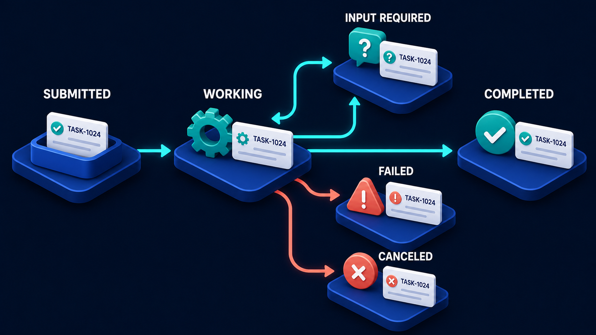

# Diagram 37 — Storage Map

**Module:** Building the system
**Role in the course:** four kinds of storage and what each one owns
**Layout:** central application with four bidirectional stores

---

## At a glance

Four stores around one application, and each carries a one-word tag saying what it **owns**: **FACTS, MEANING, PROGRESS, EVIDENCE**.

The tags are the diagram. Without them this is a picture of four databases, which teaches nothing. With them it is a claim about responsibility — each store answers a different question, and putting the wrong thing in the wrong store is the source of a specific and predictable set of problems.

---

## What the diagram teaches

### 1. Four stores because four different questions

**RELATIONAL DB — FACTS.** What is true right now. Customers, orders, prices, accounts, states. Structured, queryable by exact criteria, consistent. This is the system of record; if the relational store and anything else disagree, this one is right.

**VECTOR INDEX — MEANING.** What things are *about*. Text turned into numbers so that similar content can be found by similarity rather than by exact match. It does not hold truth — it holds a searchable representation of content whose truth lives elsewhere.

**TASK STORE — PROGRESS.** What is happening and how far along it is. Work that outlives a single request: submitted, running, waiting, completed. This is the store that makes long-running operations possible at all.

**AUDIT LOG — EVIDENCE.** What happened and who caused it. Append-only, retained, readable by a person later. Not for debugging — for answering questions about the past.

### 2. The tags prevent four specific mistakes

Each mis-assignment has a characteristic failure, and naming them is more useful than naming the stores.

**Live state in the vector index.** The most common. Something that changes hourly gets embedded and indexed, and the system starts answering from a snapshot. The symptom is confident, stale answers with no error anywhere.

**Documents in the relational store as text blobs.** Searchable only by exact match, which means a user has to know the words in the document to find it. The symptom is a search that only works when you already know the answer.

**Task state in the relational store's main tables.** Workable, and it usually goes wrong on lifecycle: no expiry, no cleanup, no defined states, and a `status` column that accumulates values nobody documented. The symptom is a table full of rows stuck in states nobody remembers creating.

**Audit as application logs.** Sampled, rotated, retained for two weeks, missing the resource identifiers. The symptom appears exactly once, when someone asks who accessed a record four months ago and the honest answer is that nobody can tell.

### 3. Every arrow is bidirectional, and the audit log is the interesting exception

All four stores are connected by a **cyan arrow out** and a **teal arrow back**. Requests go, results return.

Three of those four are genuinely two-way in normal operation. The audit log is drawn the same way, and it is worth pausing on: the write direction is constant, and the read direction is rare and important. You write evidence continuously; you read it when something has gone wrong or someone has asked a question.

That asymmetry has a design implication beginners miss. **An audit log is written for a reader who does not exist yet.** The person reading it will not have your context, will not know the code, and may be reading it years later. Which means it must contain identifiers, not variable names; outcomes, not internal states; and enough to reconstruct without asking you.

### 4. The application is at the centre, and nothing talks to anything else

Four stores, and no connections between them. Everything goes through the application.

That is a deliberate architectural claim. The application is where the decision about *which store answers which question* lives. It is one place to instrument, one place to change, and one place where the mapping between question and store can be understood.

The alternative — stores that sync to each other, triggers writing across boundaries, a vector index that pulls from the database on its own schedule — produces a system where nobody can say why a particular value is what it is.

### 5. Not every system needs four

Worth stating plainly for a beginner course, because a diagram with four boxes reads as a requirement.

Almost everything needs **facts**. Anything with retrieval needs **meaning**. Anything with work that outlives a request needs **progress**. Anything that changes something a person might later ask about needs **evidence**.

A simple application might have one store. The diagram is not saying build four; it is saying know which of the four kinds of question you have, because the failures come from serving one kind of question from the wrong kind of store.

### 6. This is where the volume's later diagrams keep their state

Each store is the home of something taught elsewhere:

- The **relational DB** holds what the domain service in the frontend/backend diagram reads and writes.
- The **vector index** is what the RAG reliability loop retrieves from.
- The **task store** is what makes the A2A task state machine possible — a task with an ID that survives across requests.
- The **audit log** is where the receipt at the end of the request pipeline lands, and where the observability trace's audit copy goes.

The task store's dependency is the clearest of the four:

That card carrying the same identifier through five states is only possible because something durable is holding it. That something is the task store.

---

## Case study — Merrow Health, four questions and one database

Merrow provides occupational health services to about 200 employer clients. They built an internal assistant to help their coordinators: look up an employee's appointment history, find the relevant policy for a referral type, track long-running assessment cases, and record what was done.

They built it on one PostgreSQL database, which was the right decision at the start and became four problems.

### Problem 1 — searching policy documents

Coordinators needed to find guidance: what the process is for a night-shift worker referral, what the requirements are for a display-screen assessment.

The documents were stored as text columns and searched with `LIKE '%...%'`.

It worked when the coordinator used the document's exact wording and failed otherwise. A search for "screen assessment" missed documents titled "display screen equipment evaluation." Coordinators learned which phrases worked and taught each other, which meant the system was only usable by people who had already used it.

**Diagnosis:** this is a *meaning* question being asked of a *facts* store. Exact-match search over prose cannot answer "what is this about."

**Fix:** the policy corpus moved to a vector index. The relational store kept the document metadata — which policy, which version, effective dates — because those are facts. Search quality improved immediately, and the fix took about a week.

### Problem 2 — the assessment cases table

A workplace assessment takes weeks: referral received, appointment scheduled, assessment conducted, report drafted, report reviewed, report issued. Coordinators track progress.

This lived in an `assessments` table with a `status` text column. Over three years the column accumulated nineteen distinct values, several of which meant the same thing with different spellings, and two of which nobody could explain.

There were 340 rows in states that no current code path could produce or advance. Cases from years earlier, stuck, invisible to any report because the queries filtered on the statuses people remembered.

**Diagnosis:** *progress* being kept without a lifecycle. A status column is not a state machine — it has no defined values, no permitted transitions, no terminal states, and no expiry.

**Fix:** a proper task store with an explicit set of states and defined transitions. Writing down the transitions is what surfaced the 340 orphans, because every one of them was in a state with no outgoing edge. Twelve were live cases that had been forgotten and needed contacting; the rest were genuinely dead and were closed.

That is the finding worth carrying: **defining the state machine is what makes stuck work visible.** The rows had been there for years, in plain sight, in a table people queried daily.

### Problem 3 — the audit question

An employer client queried a report and asked who at Merrow had accessed a particular employee's occupational health record, and when.

Merrow could not answer. Access was recorded in application logs, sampled at 20%, retained for thirty days, and the log lines recorded that a lookup had occurred without recording *which record*.

For a business handling health data, this was a serious finding — and it was the one that got the whole storage review funded.

**Diagnosis:** *evidence* being kept as application logs. Logs are for the team, sampled and rotated. Audit is for a third party, complete and retained.

**Fix:** a separate append-only audit store. Every access to an employee record writes: who, which record, what action, when, from where, and the outcome. No sampling. Seven-year retention, matching their data policy.

Their compliance lead's framing stuck: **logs are for us, audit is for them.** The two have different readers and therefore different requirements, and using one for the other fails in only one direction — silently, until it matters.

### Problem 4 — the one they got right by accident

Employee records, appointments, employer contracts and referral details stayed in PostgreSQL throughout.

These are facts: structured, queried by exact criteria, requiring consistency. The relational store was always the right home. Nobody had thought about it, and it happened to be correct.

Worth including because it makes the point that the diagram is not an argument for adding stores. Three of Merrow's four problems were things that should have moved. The fourth was a thing that should have stayed, and moving it would have been just as wrong.

### What the review produced

Four stores, and a one-line rule per store written into their architecture notes:

- **Facts** — if it must be consistent and queried exactly, it is relational.
- **Meaning** — if the question is "what is this about," it is the vector index.
- **Progress** — if the work outlives the request, it is a task with a state machine.
- **Evidence** — if someone outside the team might ask about it later, it is audit, not logs.

Their assistant did not change. The questions it asked did not change. Only where each question was sent changed, and three of the four had been going to the wrong place.

---

## Composition

A radial layout with a large central platform and four satellite stores, each connected by a pair of horizontal arrows.

**Centre:** **APPLICATION** — a 3D browser window with a blue title bar, a dark sidebar with a teal avatar, a large teal content block and four white cards, on a wide blue platform.

**Upper left:** **RELATIONAL DB**, tagged **FACTS**. **Upper right:** **VECTOR INDEX**, tagged **MEANING**. **Lower left:** **TASK STORE**, tagged **PROGRESS**. **Lower right:** **AUDIT LOG**, tagged **EVIDENCE**.

Each store connects to the application with a **cyan arrow pointing inward** and a **teal arrow pointing outward**, stacked as a pair.

## Element by element

**RELATIONAL DB — FACTS**
A stacked blue database cylinder with a **white and teal table grid** in front of it — rows and columns. Structure and exact query.

**VECTOR INDEX — MEANING**
A **teal rounded cube** with a grid of white and teal dots on its face. Content turned into positions.

**TASK STORE — PROGRESS**
A **green case** with a dark handle, in front of two white cards, the front one carrying a **teal check disc**. Work in flight.

**AUDIT LOG — EVIDENCE**
A dark bound **ledger** with a **coral shield** on its cover, in front of a white **receipt** slip with a torn edge. A record kept, protected.

**The tags**
Four dark rounded chips beneath their stores, each carrying one teal word: **FACTS**, **MEANING**, **PROGRESS**, **EVIDENCE**.

## Colour and flow semantics

- **Cyan arrows inward, teal arrows outward** — the library's request/result grammar, applied to every store.
- **Coral** appears once, on the audit log's shield, marking it as the store with a protective obligation.
- **Teal** dominates the vector index and the task store, marking them as the two active, working stores.
- **No connections between stores** — every relationship runs through the application at the centre.
- The **tags** are the only text besides the store names, and they carry the diagram's entire argument.

## How to present it

**Cover the tags and show the four stores.** Ask what the diagram teaches. The answer is nothing — four databases. Then reveal the tags. The difference between those two states is the point, and showing it as a reveal makes it stick.

**Ask for the four questions.** What is true, what is this about, how far along is it, what happened. Then ask which of the four their current system answers, and from where. In a beginner room, most systems answer two of these from one store.

**Walk the four mis-assignments.** For each, give the symptom rather than the rule:
- Confident stale answers with no error → live state in the vector index.
- Search that only works if you know the answer → documents in a relational store.
- A table full of rows in states nobody remembers → progress with no lifecycle.
- Nobody can say who accessed a record → audit as logs.

Symptoms are more memorable than principles, and people recognise their own.

**Tell the 340 orphan rows.** Writing down the state machine is what made them visible — every one was in a state with no outgoing edge. This is the most practically useful story in the document, because it shows that defining a lifecycle is a *diagnostic*, not just a design tidy-up.

**Give them "logs are for us, audit is for them."** Then ask the Merrow question: a client asks who accessed a record four months ago. Can you answer? Sampling rate, retention, and whether the record identifier is captured. Most teams fail on at least one.

**Say plainly that four stores is not a requirement.** A beginner reading this diagram may conclude they need four databases. They need to know which of the four *kinds of question* they have. Merrow's fourth problem — the thing that correctly stayed put — is the counterweight.

**Point at the missing connections.** No store talks to another. Ask what happens when they do: syncs, triggers, background jobs, and a system where nobody can explain why a value is what it is.

**Connect it forward.** Each store is where a later diagram keeps its state — the vector index for the RAG loop, the task store for the state machine, the audit log for the observability trace. This diagram is the map for the rest of the volume.

**Timing.** Twenty minutes. Thirty if you sort the room's own data into the four tags, which usually finds at least one thing in the wrong place.

---

## Lab and checkpoint

**Lab:** Inventory the data in one of your systems and sort it into the four storage categories: live state, searchable documents, task lifecycles, and audit. For each category, write the one question it answers, the store you currently use, and one symptom that appears when data is in the wrong place. If any category is missing or shared, write the smallest change that would separate it.

**Checkpoint:** Why is an audit log different from an application log?

**Answer:** Because an audit log is for answering "who did what to which record, when, and why?" Application logs are for the system operator. Audit must capture record identifiers, retention, non-repudiation, and be answerable to an external question. Most systems fail on at least one of these.

## Glossary

- **Application log** — system-oriented telemetry used for debugging and operations.
- **Audit log** — a durable, attributable record of who accessed or changed what.
- **Document store** — the store that answers "what is this about?" through search.
- **Live state** — current, mutable facts that change as the system operates.
- **Relational store** — the store that answers "what is true?" with structured, consistent data.
- **Task store** — the store that answers "how far along is it?" with lifecycle state.
- **Vector index** — the store that answers "what is this about?" by semantic search.

## Sources

- Data store separation and polyglot persistence
- Audit logging and non-repudiation patterns
- State-machine and lifecycle design for tasks
