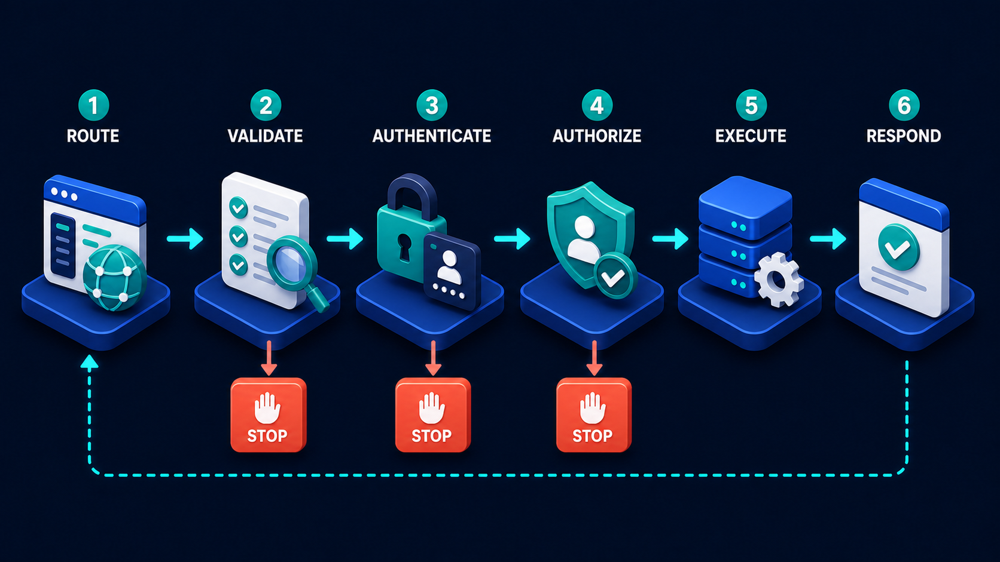

# Diagram 38 — Identity Boundary

**Module:** Building the system
**Role in the course:** who someone is, what they may do, and how little to give them
**Layout:** five stages with the last three enclosed in a shield, plus a coral denial branch

---

## At a glance

Five stages: **SIGN IN → TOKEN → AUTHENTICATE → AUTHORIZE → LEAST PRIVILEGE**, with a **glowing shield outline enclosing the final three** and a coral branch dropping from authorization to **DENIED**.

The shield is the diagram's argument. Two stages happen outside it — the user proves who they are and receives something. Three happen inside it, on your side, every time. The boundary marks where trust is *established* versus where it is *enforced*, and the enforcement never stops.

---

## What the diagram teaches

### 1. Sign-in happens once; the three inside the shield happen every request

Stages 1 and 2 are episodic. A person signs in, and receives a token. That happens at the start of a session, and then not again for hours.

Stages 3, 4 and 5 are continuous. Every single request re-establishes who is asking, re-decides whether they may, and re-scopes what they get.

That difference is the most common beginner misunderstanding about authentication, and the shield draws it. Signing in is not a state the system enters. It is an event that produces a credential, and the credential is evaluated afresh on every request that presents it.

The consequence is practical: **a permission change takes effect on the next request**, not on the next login — but only if your system genuinely re-evaluates inside the shield rather than caching a decision made at sign-in.

### 2. The token is a claim, not an identity

Stage 2 shows a white card with a green padlock. It sits *outside* the shield.

That placement is precise. A token is a thing the user holds and presents. It is not identity — it is a **claim to identity**, and claims have to be checked.

The distinction matters because tokens can be expired, revoked, forged, stolen, or issued for a different service. A request arriving with a token has asserted something; stage 3 is where the assertion is tested.

The most common beginner error here is treating token presence as authentication: `if (req.token) { ...proceed }`. That checks that the caller sent *something*, not that the something is valid, current, and theirs.

### 3. Authenticate and authorize are consecutive and different

Inside the shield, stages 3 and 4 answer the two questions the previous diagram also separates.

**AUTHENTICATE — who are you?** The panel shows a window with an avatar and a teal check. The token is verified, and it resolves to a principal.

**AUTHORIZE — may you do this?** The panel shows an ID card between **two gate posts** — a checkpoint. A known identity meets a specific request, and a decision is made.

The gate posts are the visual tell that this is where refusal lives. And indeed, the coral **DENIED** branch drops from this stage and no other. You cannot be denied at authentication — you are either identified or you are not, which is a different kind of failure. Denial requires knowing who you are and deciding no.

### 4. Least privilege is a stage, and putting it in the pipeline is the diagram's best idea

Stage 5 shows a folder with a **key and a small padlock** — access granted, and deliberately limited.

Most security diagrams stop at authorization. This one adds a stage after it, and the addition is the most valuable thing here.

Authorization answers *may you*. Least privilege answers *how much*. They are different questions, and answering the first without the second produces a specific and very common outcome: a user who is permitted to do something is handed far more than they needed to do it.

Concretely:

- Authorized to view an employee record → given the whole record, including fields irrelevant to the task.
- Authorized to update an order's shipping address → given write access to the entire order.
- Authorized to run a report → given a database connection that can read every table.

The stage exists because the natural implementation of authorization is a yes/no gate, and a yes tends to mean "here is everything." Least privilege is the deliberate act of narrowing after the yes.

### 5. The shield encloses three stages, and that is where your code lives

Everything inside the glowing outline happens on your infrastructure, on every request, under your control.

Stages 1 and 2 involve the user and possibly an identity provider. They are outside because they involve parties you do not control — the person, their browser, an external login service.

This maps directly onto the frontend/backend boundary from earlier in the volume:

Outside the shield is where you receive claims. Inside is where you evaluate them. A system that evaluates outside the shield — a client deciding it is authenticated, a browser holding a role flag — has put enforcement on the wrong side of both boundaries at once.

Stages 3 and 4 here are also stages 3 and 4 of the request pipeline, which is where they run on every request:

### 6. Denial is drawn, and it is a normal outcome

The coral arrow to **DENIED** with its red cross is the only failure path in the diagram, and it is given its own platform.

Two things worth taking from that.

**Denials should be expected and handled**, not treated as exceptional. In a healthy system some requests are refused every day.

**Denials should be visible.** A refusal that produces no record is a refusal nobody can learn from. A rise in denials for one principal is one of the highest-signal security events you can monitor, and it only exists if denials are logged as deliberately as successes.

---

## Case study — Larkfield Schools Trust, the report that could read everything

Larkfield runs nine schools with about 6,000 pupils. They built a staff portal: attendance, assessment data, safeguarding notes, contact details, and a reporting feature that let staff generate summaries.

The identity model was built by a small internal team. Sign-in used the trust's existing single sign-on, which worked well, and everyone considered authentication solved.

### What the review found

An external safeguarding audit — routine, and not looking for software problems — asked a question that nobody could answer: could a teaching assistant see safeguarding notes for pupils outside their own class?

The answer turned out to be yes, through the reporting feature, and the path was instructive.

**Sign-in and token were correct.** SSO, properly integrated, tokens with sensible expiry. Stages 1 and 2 were not the problem.

**Authenticate was correct.** Every request verified the token and resolved a staff member. Stage 3 was fine.

**Authorize was present but coarse.** Staff had roles: teacher, teaching assistant, office, leadership. Access to the reporting feature was granted by role — teachers and above could run reports, teaching assistants could run a subset. The check was "may this role use this feature."

**Least privilege did not exist.** And this is where it failed.

The reporting feature, once authorized, ran queries against a connection with read access to the entire pupil database. The report templates constrained what was displayed, but the underlying query had no scoping to the requesting user's classes, year groups, or school.

A staff member who could construct a custom report — a documented feature, used legitimately by office staff — could reach any field for any pupil at any of the nine schools, including safeguarding notes.

### Why it survived

Nobody had done it. The report builder's interface offered sensible presets, and staff used the presets. The capability was there and unused, which is the most dangerous state a permission can be in — unexercised, so invisible, and available the moment somebody explores.

The team's mental model had two security stages: are you signed in, and does your role allow this feature. Both were implemented well. The third question — *how much data does this authorized action need* — had never been asked.

### The rebuild

**Authorization became resource-scoped.** Not "may this role run reports" but "may this person run this report over this population." A teaching assistant's authorization now carries the pupils they are associated with.

**Least privilege became an explicit stage.** Every data access derives its scope from the authenticated principal rather than from the feature being used. The reporting connection no longer has trust-wide read access; it receives a scope from the authorization decision and cannot exceed it.

This is the structural change and it generalises: **the scope comes from who is asking, not from what they are asking for.** A feature does not get its own permissions; a person's permissions constrain what the feature can reach on their behalf.

**Field-level narrowing.** Safeguarding notes are separately gated even within an authorized pupil population, because access to a pupil's attendance is not access to their safeguarding record. Authorization to a record is not authorization to all of it.

**Denials became visible.** Every refusal is recorded with the principal, the resource and the reason. Their designated safeguarding lead receives a weekly summary of denied safeguarding-record accesses — which has twice surfaced a legitimate access problem where a staff member needed permissions they did not have, and once surfaced a misconfigured role.

That third outcome is worth noting: monitoring denials found a *permissions gap* as often as it found anything else. Denial data is useful in both directions.

### The question they added to design review

*If this check passes, exactly how much can the caller now reach?*

Applied across the portal it found three more instances of the same shape — an export function, a search endpoint, and an attendance dashboard — all correctly authorized and all handing back more than the authorized action required.

### What it cost

Six weeks. Most of it was not the authorization logic; it was working out what each role legitimately needed, which required conversations with staff at all nine schools and produced a scoping matrix that had never existed on paper.

Their technical lead's summary: *we had built a very good lock on a door into a room with no internal walls.*

---

## Composition

Five stages run left to right, each on a blue platform with a numeral and a white uppercase label above it. Cyan arrows connect them.

A **glowing blue shield outline** — drawn as a large shield shape open at the top — encloses stages 3, 4 and 5, beginning just before stage 3 and curving down and around to enclose the lower area beneath them.

A **coral arrow** drops from stage 4 to a small platform below carrying a **red ✗ disc**, labelled **DENIED**.

## Element by element

**1 SIGN IN**
A standing person figure in a teal top, beside a large **teal key** resting on the platform. The act of proving who you are.

**2 TOKEN**
A white card with text lines, carrying a **green padlock** at its centre. A credential held and presented — drawn outside the shield.

**3 AUTHENTICATE** *(inside the shield)*
A white application window with a blue title bar, showing a **teal avatar disc** and text lines, with a **teal check disc** at its lower right. The claim verified.

**4 AUTHORIZE** *(inside the shield)*
A **teal panel** showing an ID card with a person and detail lines, and a **teal check disc**, standing between **two dark blue gate posts**. A checkpoint. *Coral exit to DENIED.*

**5 LEAST PRIVILEGE** *(inside the shield)*
A dark folder showing a person icon and detail lines, with a large **teal key** and a small **teal padlock** in front of it. Access granted and deliberately narrowed.

**DENIED**
A small blue platform carrying a **red circular ✗**, labelled below in white.

**The shield boundary**
A glowing blue outline in the shape of a shield, enclosing the final three stages and the denial platform.

## Colour and flow semantics

- **Cyan arrows** carry the identity journey forward.
- **Teal** marks every working security element — the key, the checks, the authorization panel, the privilege key and padlock.
- **Green** on the token's padlock distinguishes the held credential from the system's own teal machinery.
- **Coral** appears once, on the denial branch, and the **DENIED** platform sits *inside* the shield — refusal is part of the enforced zone, not an escape from it.
- The **shield outline** is the only enclosing boundary in the volume, and it separates episodic proof from continuous enforcement.

## How to present it

**Ask which stages happen once and which happen every time.** Two and three. Then ask what that means for a permission change — it takes effect on the next request, not the next login, *if* your system re-evaluates rather than caching a sign-in decision. Many do not.

**Point at the token sitting outside the shield.** Ask what a token is. Push past "authentication" to "a claim." A claim has to be checked, which is what stage 3 is for. Then ask what `if (req.token)` actually verifies. That it exists — nothing else.

**Ask why DENIED hangs off authorize and not authenticate.** The answer is a good one: you cannot be denied at authentication, only unidentified. Denial requires knowing who you are and deciding no. That distinction makes the two stages concrete rather than a vocabulary exercise.

**Spend most of the session on stage 5.** It is the stage most security discussions omit. Ask the room what happens after a yes. Then give the three examples — view a record and get every field, update an address and get write access to the whole order, run a report and get a connection that reads every table.

**Ask the Larkfield question directly.** *If this check passes, exactly how much can the caller now reach?* In any room with production systems, this produces at least one uncomfortable answer.

**Tell the report builder story.** The lock was excellent, the room had no internal walls, and nobody had walked around because the presets were convenient. Unexercised capability is the dangerous kind — invisible, and available the moment someone explores.

**Give them the scoping rule.** The scope comes from who is asking, not from what they are asking for. A feature does not get its own permissions; the person's permissions constrain what the feature can reach on their behalf. This one sentence is the fix for most least-privilege failures.

**Ask whether denials are recorded.** Then mention that Larkfield's denial monitoring found permissions *gaps* as often as it found anything else — staff who legitimately needed access they did not have. Denial data is useful in both directions, which makes it easier to justify building.

**Timing.** Twenty-five minutes. Thirty-five if you run the "how much can they now reach" audit, which is where the real findings are.

---

## Lab and checkpoint

**Lab:** Pick one feature in your system and map it through the five identity stages: identify, authenticate, authorise, access resource, and scope. For the scoping stage, answer the Larkfield question: *if this check passes, exactly how much can the caller now reach?* If the answer is more than the feature needs, write the smallest scope reduction that would fix it.

**Checkpoint:** Why is the token drawn outside the shield boundary?

**Answer:** Because the token is a claim that the user holds episodically, not the continuous enforcement itself. The shield encloses the system-side checks that verify and act on the token. Holding a token is not the same as being continuously authorised.

## Glossary

- **Authentication** — the stage that proves the caller is who they claim to be.
- **Authorisation** — the stage that decides whether the caller may perform the requested action.
- **Claim** — a statement carried by the token, such as identity or role.
- **Credential** — the proof the user presents, such as a password or key.
- **Denial** — the refusal that happens inside the shield after identification and authorisation.
- **Identity** — the stage that collects who the caller claims to be.
- **Least privilege** — the principle that the caller should get no more access than needed.
- **Scope** — the specific set of resources and actions the caller may reach after authorisation.
- **Token** — the portable claim the caller presents with each request.

## Sources

- Authentication, authorisation, and least-privilege patterns
- Token-based identity and OAuth 2.0 / OpenID Connect
- Identity boundary and privilege scoping design
