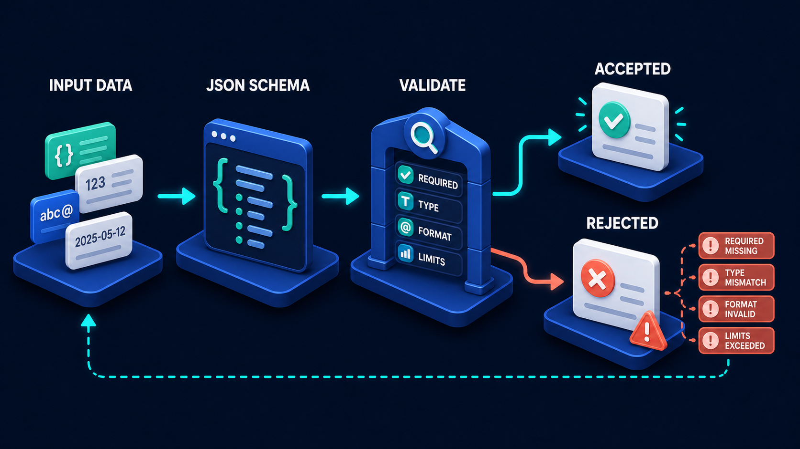

# Diagram 40 — Tool Call Lifecycle

![Five numbered stages on dark navy — MODEL PROPOSES showing a blue robot with sparkles, CLIENT VALIDATES showing a clipboard with braces and green ticks beside a magnifier, SERVER AUTHORIZES showing a teal shield with a check beside a list carrying a coral warning, DOMAIN EXECUTES showing interlocking gears, and RESULT + RECEIPT showing a printed slip with a teal check. Dashed coral lines drop from stages 2 and 3 to two red octagonal STOP signs. A dashed teal line runs along the bottom from stage 5 back to stage 1.](../diagrams/40-tool-call-lifecycle.png)

**Module:** Agent behaviour
**Role in the course:** what happens between a model wanting something and it happening
**Layout:** five stages with two coral stop exits and a result return

---

## At a glance

Five stages: **MODEL PROPOSES → CLIENT VALIDATES → SERVER AUTHORIZES → DOMAIN EXECUTES → RESULT + RECEIPT**, with two **STOP** signs hanging beneath stages 2 and 3.

The first word is the whole diagram. The model **proposes**. It does not call, invoke, execute, or decide. It produces a suggestion, and three other components get to examine that suggestion before anything happens.

---

## What the diagram teaches

### 1. "Proposes" is the most carefully chosen word in the volume

Stage 1 shows a robot with sparkles around it — generating something. The label says **MODEL PROPOSES**.

Every other framing is wrong in a way that matters:

- *The model calls the tool* — implies the model executes. It does not; it emits structured text describing a call it would like made.
- *The model decides to use a tool* — implies authority. It has none.
- *The model invokes* — implies a direct connection to the thing being invoked. There are three components in between.

What the model actually produces is a **proposal in JSON**: a tool name and some arguments. That output is data, and it has the same trust status as data arriving from any other untrusted source — which is precisely the situation the schema-validation diagram earlier in the volume describes:

Stage 2 of this diagram is that gate, pointed at a model's output.

The sparkles are apt. Generation is what happened. Nothing has been decided.

### 2. Two checks, in two different places, run by two different parties

Stages 2 and 3 both refuse, and they are not redundant.

**CLIENT VALIDATES — is this proposal well-formed?** The panel shows a clipboard with `{ }` braces and green ticks, plus a magnifier. Is this a tool that exists, are the arguments the right shape, are the types right, are the values within limits.

This is a **structural** check and it runs on your side, before anything leaves. It is the schema gate applied to a model's output. A proposal to call a tool that does not exist, or with a missing required argument, or with a string where a number belongs, never leaves the client.

**SERVER AUTHORIZES — is this caller permitted to do this?** The panel shows a teal shield with a check, beside a list carrying green ticks and a **coral warning**. Well-formed is not permitted. The server takes a syntactically perfect request and decides whether this principal may perform this action on this resource.

The separation matters because the two checks cannot be merged. The client does not know the server's permission model, and the server should not trust the client's validation. Each does what it is positioned to do.

Note the coral warning in the authorize panel: like the authorize stages elsewhere in both volumes, the verdict is **per item**, not a single yes.

### 3. The two STOP signs are drawn as road signs, and there is no third

Red **octagons** — the universal stop shape — hanging on dashed coral lines beneath stages 2 and 3.

Two exits, and their placement is the structural claim: **all refusal happens before execution**. Stages 4 and 5 have no stop. Once the domain executes, the proposal has become an action and refusing is no longer available.

That is the same shape as the server request pipeline earlier in the volume — a refusal zone before the work — and pointing out the echo is worth doing. It is the same idea at a different altitude.

### 4. Domain executes, and the model is not in that panel

Stage 4 shows interlocking gears. No robot, no sparkles, no model.

The absence is deliberate and it is the diagram's second most important teaching point after "proposes." The thing that actually performs the work is ordinary code with ordinary rules. The model is not present at the moment of execution and has no influence over how it happens.

This is what the course's own quality checklist means when it says no icon should imply the model owns authentication, authorization, or business truth. Stage 4 is business truth, and the model is three stages away from it.

### 5. Result and receipt share a stage, and that pairing is now familiar

Stage 5 shows a printed slip with a teal check — the receipt motif used throughout both volumes.

Two things are produced: the **result**, which goes back to the model so it can continue reasoning, and the **receipt**, which is the durable record that this happened.

They share a panel because they are one event. Producing the outcome and recording it are not separable steps, for the same reason the safe-side-effect pipeline in Volume 1 puts change and receipt together: a change without a record cannot be verified, audited, or de-duplicated.

### 6. The dashed return goes to the model, and it closes the agent loop

A dashed teal line runs from stage 5 along the base of the frame back to stage 1.

The result returns to the model, which now has new information and can continue. That is precisely the **CHECK → PLAN** iteration from the agent decision loop, seen from the tool's side.

Reading the two diagrams together is worth doing explicitly: the agent decision loop's **ACT** stage *is* this entire five-stage lifecycle. One box in that diagram expands into this one.

---

## Case study — Verity Recruitment, the candidate record that nearly got deleted

Verity is a recruitment agency with about eighty consultants. They built an assistant to help consultants manage their candidate pipeline — searching candidates, updating statuses, scheduling calls, and tidying records.

The tools they exposed included `update_candidate`, `add_note`, `schedule_call`, `search_candidates`, and — the one that caused the incident — `archive_candidate`.

### What happened

A consultant typed: *"Clear out the old records for the Manchester warehouse role, none of them are relevant any more."*

The model proposed a sequence of `archive_candidate` calls. Fourteen of them, covering every candidate associated with that role.

Two of those fourteen candidates had been placed in other roles the previous month and were active, billing clients. Archiving them would have removed them from the consultants' pipelines, broken the link to their placements, and — because the archive process cascaded — orphaned their timesheet records.

### Where it was stopped

Not at stage 1. The model's proposal was well-formed, plausible, and a reasonable reading of what the consultant said.

**Stage 2 — client validates — passed it.** The tool existed, the arguments were correct candidate IDs, the types were right. Structurally there was nothing wrong with any of the fourteen calls. Validation is not judgement, and this was a judgement problem.

**Stage 3 — server authorizes — stopped twelve of the fourteen.** Verity's authorization rules included one that turned out to be the entire safety net: *a candidate with an active placement cannot be archived.* Twelve calls were refused with that reason.

Two calls went through, for candidates who genuinely were inactive. Correct outcome.

### What they learned from the near-miss

The incident was, technically, a success — the system did exactly what it should. But the review found three things worth changing.

**The consultant did not know twelve calls had been refused.** The assistant reported that it had archived the old records. It had archived two and been refused twelve, and the summary said neither. The consultant believed the tidy-up was complete.

**Fix:** refusals are surfaced. The assistant now reports "archived 2, refused 12 — active placements" with the list. This is the same lesson as the schema-validation diagram's four rejection chips: a refusal is useless if the caller does not see it.

**Bulk operations had no confirmation.** Fourteen archive calls proposed and executed with no human checkpoint. Individually each was authorized; collectively it was a large destructive operation.

**Fix:** any proposal containing more than three mutating calls of the same type is presented to the consultant as a batch for confirmation before stage 2 runs. This is not an authorization rule — it is a scale rule, and it needed its own mechanism.

**One authorization rule was doing all the work.** The active-placement rule was written eighteen months earlier for an unrelated reason. Nobody had designed it as protection against this scenario. Had it not existed, twelve records would have been archived.

**Fix:** they audited every mutating tool against a specific question — *what would stop this if the model proposed it wrongly?* Three tools had no answer. `update_candidate` could change any field on any candidate the consultant could see, including placement status and rate. `add_note` could write to any record. `schedule_call` could double-book.

All three gained authorization rules that had never existed because nobody had asked what the tool would do if it were pointed at the wrong thing.

### The tool inventory they now maintain

For every tool exposed to the assistant:

| Question | Recorded answer |
| --- | --- |
| Does it mutate? | yes / no |
| What does validation check? | schema, and any value constraints |
| What authorization rules apply? | the specific list |
| What is the blast radius if misapplied? | one record / many / cascading |
| Does it need batch confirmation? | threshold, if any |
| What does the receipt record? | fields captured |

Filling that in for eleven tools took two days and found the three unprotected ones.

### The framing that stuck

Their lead developer's note, which is the whole diagram in a sentence: *the model is a very good suggestion engine with no authority whatsoever, and every safety property we have comes from stages two and three.*

---

## Composition

Five stages run left to right, each on a blue platform with a numbered blue disc and a white uppercase label above it. Cyan arrows connect them.

**Dashed coral lines** drop from beneath stages 2 and 3 into two **red octagonal STOP signs**.

A **dashed teal line** runs from beneath stage 5, along the base of the frame, and turns upward into stage 1.

## Element by element

**1 MODEL PROPOSES**
A **blue cube robot** on a glowing teal disc, with three **cyan sparkle marks** to its upper left. Generation, not execution.

**2 CLIENT VALIDATES**
A white **clipboard** with a teal clip, showing a teal `{ }` tile and three **green tick rows**, with a **teal magnifying glass** in front. Structural checking of the proposal. *Dashed coral exit to STOP.*

**3 SERVER AUTHORIZES**
A **teal shield with a white check**, beside a dark list panel showing two green ticks and a **coral warning triangle**. Permission, decided per item. *Dashed coral exit to STOP.*

**4 DOMAIN EXECUTES**
Two interlocking **gears** — one large teal, one blue — above a glowing ring on a blue platform. Ordinary code doing the work. No model present.

**5 RESULT + RECEIPT**
A white **printed slip** with a curled top edge, text lines, and a large **teal check disc**. Outcome and durable record together.

**The two STOP signs**
Red **octagonal road signs** with white **STOP** lettering, hanging on short dashed coral lines beneath stages 2 and 3.

**The return path**
A dashed teal line from stage 5 back to stage 1, carrying the result to the model.

## Colour and flow semantics

- **Cyan arrows** carry the proposal forward through the five stages.
- **Dashed coral lines** carry refusals downward and out — dashed because a refused proposal does not continue, it terminates.
- The **octagonal stop shape** is used only here in the volume; the request pipeline uses square tiles. Both mean refusal.
- **Teal** marks the working and passing elements: the shield, the ticks, the gears, the receipt check.
- Stages 4 and 5 have **no exits**, marking execution as the point of no return.
- The **dashed teal return** closes the loop to the model, connecting this diagram to the agent decision loop.

## How to present it

**Read the first label aloud and stop on the verb.** *Proposes.* Ask what the model actually produces. Push until someone says "text" or "JSON" — a description of a call it would like made. Then list the wrong framings: calls, invokes, decides. Each implies authority the model does not have.

**Ask what stage 2 checks and what stage 3 checks.** Well-formed versus permitted. Then ask whether either alone is sufficient. A perfectly-shaped request to do something forbidden; a permitted action with a malformed argument. Two checks, two failure modes.

**Ask why the client validates and the server authorizes rather than one doing both.** The client does not know the permission model; the server should not trust the client's validation. Position determines responsibility.

**Count the stop signs and ask where the third one is.** There isn't one. All refusal happens before execution. Then point back at the server request pipeline's three stops in the same position — the same idea, one altitude up.

**Point at stage 4 and ask what is missing.** The model. Ask what that means. Business logic is ordinary code with ordinary rules, and the model has no influence over how the work is performed.

**Tell the Verity story and pause before the outcome.** Fourteen archive calls, well-formed, plausible, and two of the candidates were actively placed. Ask the room which stage should catch it. Most say validation. It cannot — the calls were structurally perfect. It is a judgement problem, and only authorization has the domain knowledge to make it.

**Then give them the uncomfortable part.** One rule, written eighteen months earlier for an unrelated reason, was the entire safety net. Ask the room: *for each of your tools, what would stop it if the model proposed it wrongly?* Three of Verity's eleven had no answer.

**Ask what the consultant saw.** "Archived the old records." Two done, twelve refused, and the summary mentioned neither. Refusals must be surfaced — the same lesson as the rejection chips in the schema diagram.

**Connect it to the decision loop.**

The **ACT** stage there is this entire diagram. One box expands into five, and the dashed return at the bottom of this picture is that loop's **CHECK** stage receiving its result. Showing the relationship is worth thirty seconds and it makes both diagrams more useful.

**Timing.** Twenty-five minutes. Thirty-five if you build the tool inventory table for a real set of tools, which is the exercise that finds the unprotected ones.

---

## Lab and checkpoint

**Lab:** Inventory one real set of tools your agent can call. For each tool, write the stage-2 validation rule (what makes the call well-formed), the stage-3 authorisation rule (what makes it permitted), and the business logic that executes it. For any tool where only one of the two rules exists, write the malformed or forbidden call that would slip through.

**Checkpoint:** Why does the client validate and the server authorise, rather than one doing both?

**Answer:** Because the client does not know the server's permission model, so it cannot authorise. The server should not trust the client's validation, because a compromised client could submit malformed calls. Position determines responsibility.

## Glossary

- **Authorise** — the stage that decides whether the proposed call is permitted.
- **Business logic** — the stage that performs the work the tool is meant to do.
- **Client validate** — the stage that checks the call is well-formed before sending it.
- **Execute** — the stage that actually carries out the call.
- **Model proposes** — the stage where the model produces a description of a call it would like made.
- **Receipt** — the record that the call happened and what its result was.
- **Stop sign** — the visual marker that a proposed call is refused before execution.
- **Tool call lifecycle** — the five stages from proposal to receipt.
- **Well-formed** — structurally valid according to the tool's schema.

## Sources

- Tool-calling and function-calling in language-model agents
- Client-side validation and server-side authorisation patterns
- Agent tool inventory and least-privilege design
