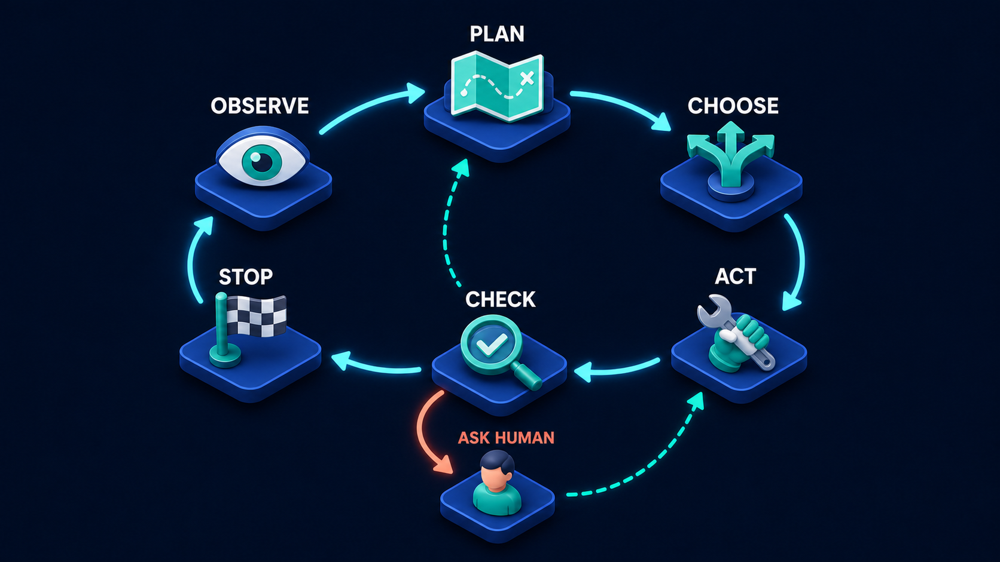

# Diagram 41 — RAG Reliability Loop

**Module:** Agent behaviour
**Role in the course:** making retrieval-based answers trustworthy
**Layout:** a six-stage path with a decision diamond and a correction loop

---

## At a glance

Six stages — **QUESTION → RETRIEVE → RELEVANT? → ANSWER → CITE → VERIFY** — with a decision diamond in the middle that can send the process back around.

The diamond is what makes this a *reliability* loop rather than a pipeline. Between retrieving and answering sits a question: **is what we found actually relevant?** If the answer is no, the correct move is not to answer anyway with poor material — it is to improve the query and retrieve again.

An agent that lacks that diamond will always produce an answer, and some of those answers will be built from whatever happened to come back.

---

## What the diagram teaches

### 1. The diamond is the only decision shape in the volume

Every other stage in every other diagram is a platform. **RELEVANT?** is a **teal diamond** — the traditional flowchart symbol for a branch.

The shape change signals that something different happens here. This is not a step that transforms data; it is a judgement that determines which of two paths the process takes.

What is being judged is not whether documents came back. Retrieval nearly always returns *something* — a similarity search over a large corpus will find the closest matches whether or not they are any good. The diamond asks the harder question: **do these actually help answer this question?**

### 2. "No" is a normal outcome, and it has somewhere to go

The coral arrow labelled **NO** drops to **IMPROVE QUERY**, drawn as a card with a speech bubble and a **pencil** — a question being rewritten.

That destination is the diagram's practical content. When retrieval fails, the fault is usually in the query rather than in the corpus. Typical repairs:

- **The vocabulary mismatched.** The user asked about "time off," the documents say "annual leave." Rewriting with domain vocabulary fixes it.
- **The question was too broad.** One retrieval cannot serve a question with four parts. Splitting it into sub-questions gives each one a focused search.
- **The question was too narrow.** Over-specific terms match nothing; broadening recovers.
- **Context was missing.** A follow-up like "what about part-time staff?" is meaningless as a standalone query and must be expanded with what came before.

A dashed teal line returns from **IMPROVE QUERY** to **RETRIEVE** — not to **QUESTION**. The user's question has not changed. What changed is how the system is searching for it.

### 3. Answer, cite and verify are three stages, not one

The three stages after the diamond could easily have been one box labelled "respond." They are three, and each removes a different failure.

**ANSWER** — a browser window with content. The response is composed from what was retrieved.

**CITE** — a card carrying three **chain-link icons**. Each claim is linked to its source. The chain metaphor is exact: a citation is a link between an assertion and the evidence for it, and a claim with no link is unattached.

**VERIFY** — a **teal shield with two checks**. A final pass confirming that the citations resolve and that the answer is supported by them.

Separating them means each can fail visibly. An answer with no citations fails at stage 5. An answer whose citations do not support it fails at stage 6. Merged into one stage, both failures are invisible.

### 4. Citing comes after answering, and that ordering carries a risk worth naming

The diagram draws **ANSWER** and then **CITE**, which is how most implementations work: compose the response, then attach references.

That ordering has a known hazard — citations attached after the fact can be attached to claims they do not actually support, because the attaching step is looking for a plausible match rather than tracing where the claim came from.

**VERIFY** exists to catch precisely that. Its job is not to check that citations exist; it is to check that the cited source **actually says what the claim says it says**.

When teaching this, it is worth stating that the alternative ordering — generating claims already bound to their sources — is stronger, and that this diagram shows the common implementation with the check that makes it safe.

### 5. Retrieval returning something is not retrieval succeeding

The single most useful idea in this diagram for a beginner.

A vector search does not fail. It returns the closest matches in the corpus, and "closest" can still be very far away. If your corpus is about employment policy and someone asks about parking, you will get employment policy documents back — the ones that happen to be nearest.

Without the diamond, those documents become the basis of an answer about parking. The result is fluent, sourced, cited, and wrong.

The check has to be an explicit judgement about relevance, not a check that results exist.

### 6. The loop needs a limit, and the diagram does not draw one

Honest gap worth flagging when teaching. **IMPROVE QUERY → RETRIEVE → RELEVANT? → NO → IMPROVE QUERY** is a cycle with no drawn exit.

If the corpus simply does not contain the answer, that cycle runs forever. Every real implementation needs a bound — after two or three attempts, stop and say so.

And "say so" is the important part. The honest outcome of a failed retrieval loop is **"I could not find this in the available material,"** which is a genuinely useful answer. It tells the user the corpus has a gap, which is actionable, whereas a fabricated answer is not.

This is the same lesson as the agent decision loop's stop condition, applied to retrieval:

That diagram gives its check stage three exits, one of which is a chequered flag. This one gives its diamond two, and neither of them is a way out of the improvement cycle. A loop without a way out is a bug in both pictures.

---

## Case study — Fernbank Housing, the repairs assistant that answered from the wrong policy

Fernbank is a housing association managing about 9,000 homes. They built an assistant for their contact centre so that advisors could answer tenant questions about repairs, tenancy terms, rent, and antisocial behaviour procedures without hunting through a policy intranet.

The corpus was about 1,400 documents. The assistant launched with retrieve-then-answer and no relevance check.

### What went wrong

A tenant called about a broken communal door entry system. The advisor asked the assistant what the repair timescale was.

The assistant answered: **24 hours**, citing the emergency repairs policy.

That was wrong. Communal door entry is a communal repair with a 5-working-day target under a different policy. The 24-hour figure applies to emergency repairs — loss of heating in winter, major leaks, insecure front doors to individual homes.

The advisor told the tenant 24 hours. Nobody attended within 24 hours because no such target existed. The tenant complained, and the complaint was upheld because Fernbank had told them something incorrect in writing.

### Why retrieval produced it

The query was roughly *"repair timescale for door entry not working."*

The word "door" was doing the damage. The emergency repairs policy contains prominent text about insecure doors — a genuine emergency category. The similarity search matched strongly on that, and the emergency policy came back as the top result.

The communal repairs policy uses the phrase "door entry systems" and does not use the word "emergency," so it ranked below.

**Retrieval did not fail. It returned the closest match, confidently, and the closest match was about a different thing.**

Without a relevance check, that document went straight into an answer.

### What they added

**A relevance gate.** Before composing an answer, the assistant assesses whether the retrieved material actually addresses the question asked. Not "did we get results" — "do these results speak to this question."

For the door entry query, the gate now catches that the retrieved emergency policy is about individual property security, while the question concerns a communal system, and routes to NO.

**Query improvement with domain vocabulary.** Fernbank maintains a small mapping of tenant language to policy language:

| Tenant says | Policy says |
| --- | --- |
| door entry / buzzer / intercom | door entry system (communal) |
| boiler broken | loss of heating and hot water |
| damp / mould | damp, mould and condensation |
| neighbour trouble | antisocial behaviour |

The improved query for the failing case became *"communal door entry system repair target timescale,"* which retrieves the communal repairs policy as the top result.

That mapping table was built by two contact centre advisors in an afternoon. It is not sophisticated, and it is responsible for a large share of the improvement — because the vocabulary gap between how tenants speak and how policies are written was the dominant failure mode.

**A retrieval limit and an honest failure.** Two improvement attempts. If relevance still fails, the assistant says: *"I could not find a policy covering this. Escalate to the repairs team."*

That output was contentious internally — an assistant that says it does not know felt like a failure. Their head of customer service argued the other way and won: an advisor who is told the system does not know will look it up or escalate. An advisor who is told 24 hours will repeat it.

**Verify checks support, not presence.** The verification stage confirms that the cited policy section actually contains the stated timescale, rather than merely that a citation is attached. This caught a second class of error where the correct policy was cited and the figure quoted came from an adjacent table.

### Results after four months

- **Policy answers verified as correct** in advisor spot-checks: from 78% to 96%.
- **"Could not find" responses:** about 7% of questions — which the contact centre regards as accurate, since roughly that share concern things the policy set genuinely does not cover.
- **Upheld complaints citing incorrect information given by an advisor:** from 9 in the preceding six months to 1.

That last figure is the one they report to their board, and the single change most responsible for it is the diamond.

### The line in their internal documentation

*Getting documents back is not the same as finding the answer.*

---

## Composition

Six stages run left to right across the upper portion of the frame, connected by cyan arrows, with a decision diamond at position three.

From the diamond, a **cyan arrow labelled YES** continues rightward to **ANSWER**. A **coral arrow labelled NO** drops downward to **IMPROVE QUERY**, positioned below the main line. A **dashed teal line** runs from IMPROVE QUERY leftward and turns upward into **RETRIEVE**.

## Element by element

**QUESTION**
A **teal rounded speech bubble** containing a white question mark, on a blue platform.

**RETRIEVE**
A white document card with blue text lines, with a **teal-rimmed magnifying glass** overlapping its lower right.

**RELEVANT?**
A **teal diamond** standing on one point, carrying a white question mark. The only decision shape in the volume.

**ANSWER**
A white browser window with a blue title bar, a large teal content block and grey text lines.

**CITE**
A white card carrying three **teal chain-link icons** down its left edge, each with text lines beside it. Claims attached to sources.

**VERIFY**
A **teal shield** carrying a white check, with a second **teal check disc** at its lower right. Two checks — that citations resolve, and that they support the claims.

**IMPROVE QUERY**
A white card showing a **teal speech bubble** and text lines, with a **pencil** overlapping its lower right. A question being rewritten.

## Colour and flow semantics

- **Cyan arrows** carry the main path; the **YES** label is set in teal.
- The **NO** branch is coral, consistent with coral marking the path that does not proceed.
- The **return from IMPROVE QUERY is dashed teal** — a recovery route, not a failure route.
- The return goes to **RETRIEVE**, not to **QUESTION** — the user's question is unchanged; only the search changed.
- **Teal** dominates the working stages: the bubble, the magnifier, the diamond, the chain links, the shield.
- The improvement loop has **no drawn exit**, which should be named as a gap when presenting.

## How to present it

**Ask what happens if the retrieved documents are not relevant.** Before showing the diagram. Most beginner implementations answer anyway. Then reveal the diamond and ask why it needs to exist.

**Make the key point directly: retrieval does not fail.** A similarity search returns the closest matches whether or not they are any good. Ask what happens when someone asks about parking and the corpus is about employment policy. Fluent, sourced, cited, wrong.

**Tell the Fernbank door story.** It is the ideal example because the retrieval was *reasonable* — "door" genuinely appears prominently in the emergency policy. Nobody wrote a bug. The system did what similarity search does, and without a relevance check that became a wrong answer given to a tenant in writing.

**Ask where the NO branch should go.** Back to retrieve, or back to the question? Push for the reasoning: the user's question has not changed, so re-asking them is wrong. What changed is how you search.

**Build a vocabulary mapping live.** Take a domain the room knows and list five things users say versus five things the documents say. Fernbank's table was built by two advisors in an afternoon and drove most of their improvement. It is the cheapest high-value intervention in this diagram.

**Ask why cite and verify are separate.** Citations existing versus citations supporting. Then name the risk in the ordering — attaching references after composing an answer can attach them to claims they do not support, which is exactly what verify is for.

**Point out the missing exit.** The improvement loop has no bound in the picture. Ask what happens if the corpus genuinely lacks the answer. Then get to the honest failure: *"I could not find this."* Ask whether that feels like a failure, and use Fernbank's argument — an advisor told "I don't know" looks it up; an advisor told "24 hours" repeats it.

**Connect it to the decision loop.** A retrieval loop without a stop condition is the same bug as an agent loop without one. The same lesson, one diagram apart.

**Timing.** Twenty-five minutes. Thirty-five if you build the vocabulary table, which is the part people take back and use immediately.

---

## Lab and checkpoint

**Lab:** Take three real user questions your RAG system has answered. For each, retrieve the top three chunks and judge relevance: do they actually answer the question? If not, build a small vocabulary map of what users say versus what the documents say, then rewrite the query and retrieve again. Write the check that would stop an answer when the corpus genuinely lacks the answer.

**Checkpoint:** Why does the improvement loop return to retrieve, not to the user's question?

**Answer:** Because the user's question has not changed; the problem is how the system searched. Rewriting the query and retrieving again is the right fix. Re-asking the user is wrong unless the question itself is genuinely unclear.

## Glossary

- **Cite** — the stage that attaches a source reference to each claim.
- **Improve query** — the stage that rewrites the search query when the retrieved chunks are not relevant.
- **Relevance** — whether the retrieved documents actually answer the question.
- **Retrieve** — the stage that fetches candidate documents.
- **Verify** — the stage that checks that citations resolve and support the claims.
- **Vocabulary mapping** — the table of what users say versus what documents say.

## Sources

- RAG retrieval relevance and query-rewriting techniques
- Citation verification and grounded answer design
- Query expansion and vocabulary mapping for retrieval
