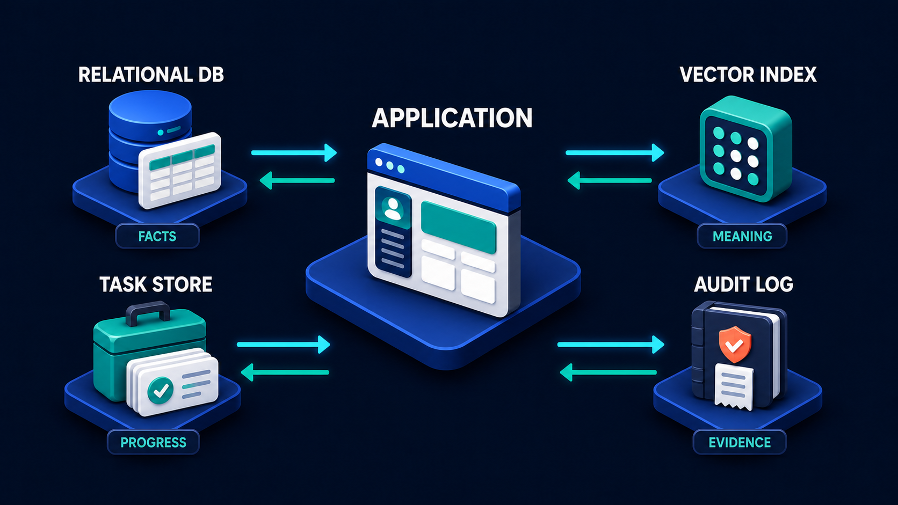

# Diagram 44 — Observability Trace

![A horizontal trace on dark navy. USER REQUEST shows a person at a laptop. A cyan arrow leads to TRACE ID, a white card with a teal hash symbol. One continuous cyan line then passes through four platforms — APP as a browser window, RAG as a book with a magnifier, MCP as a green toolbox, A2A as two robots — with a node dot at each junction. Beneath the line, four teal brackets label SPAN 1, SPAN 2, SPAN 3 and SPAN 4. At the right, the line branches into three arrows leading to METRICS with a stopwatch, LOGS with a document, and AUDIT with a bound ledger carrying a check.](../diagrams/44-observability-trace.png)

**Module:** Running the system
**Role in the course:** following one request across everything it touches
**Layout:** a single continuous trace line with spans, branching into three destinations

---

## At a glance

A request gets an identifier, and that identifier travels with it through every component it touches. The journey is drawn as **one continuous line** with node dots at each hop, divided into four labelled **spans**, and it ends by branching into three different destinations: **METRICS**, **LOGS**, and **AUDIT**.

The continuity is the point. Four components, four different systems, one line. Without the trace ID, that line is four disconnected fragments and nobody can tell they belong together.

---

## What the diagram teaches

### 1. The trace ID is issued once, at the front

Stage two is a white card with a **teal hash symbol** — an identifier, created at the moment the request arrives and before any work begins.

That positioning matters. The ID is not generated by whichever component happens to log first; it is minted at the entrance and then **carried** through everything downstream. Every component receives it, uses it in its own records, and passes it on.

The practical rule that follows: **if a component cannot receive and forward the trace ID, it becomes a hole in your trace.** That is usually the first thing to fix when introducing tracing to an existing system — not the logging, but the propagation.

### 2. One line, not four logs

The trace is drawn as **a single unbroken cyan line** running from the trace ID through APP, RAG, MCP and A2A, with a small node at each component.

Compare that to what most systems actually have: four components each writing their own logs, in their own format, to their own destination, with their own timestamps and no shared key.

Answering "what happened to the request that failed at 14:32" against four separate logs means correlating by timestamp and hoping. Against one trace it means looking up an identifier.

The line being continuous *through* the components rather than stopping at each one is a deliberate rendering choice. It is one journey, observed, rather than four things that happened near each other.

### 3. Spans divide the line into measurable segments

Four teal brackets beneath the line label **SPAN 1** through **SPAN 4**, each covering the gap between two components.

A span is a **measured segment of work** — it has a start, an end, and therefore a duration. Four spans means four numbers, and four numbers means you can say *where* the time went rather than only how much there was.

This is the difference between "the request took 4.2 seconds" and "the request took 4.2 seconds, of which 3.6 was span 2." The first is a symptom; the second is a location.

Spans also nest in real implementations — a span can contain child spans — though the diagram keeps them flat for clarity. Worth mentioning rather than drawing.

### 4. Three destinations, because three different people ask three different questions

The branch at the right is the most useful structural idea in the diagram.

**METRICS** — a stopwatch. Aggregate numbers over time: how many requests, how long, how many failed. Answers *how is the system behaving?* Read by whoever is watching a dashboard. Numbers only, no request details.

**LOGS** — a document with teal rows. Detailed records of what happened, for debugging. Answers *why did this specific thing go wrong?* Read by an engineer with a problem. Verbose, sampled, short-lived.

**AUDIT** — a bound ledger with a check. Durable record of consequential actions. Answers *what did the system do, and who caused it?* Read by someone outside the team, possibly years later. Complete, never sampled, long retention.

These are frequently conflated, and conflating them fails in both directions. Using logs as audit gives you sampled, rotated evidence that disappears before anyone asks. Treating audit as logs makes it expensive and noisy.

The storage map earlier in the volume already separated audit as its own store tagged **EVIDENCE**:

This diagram shows where that store's contents come from. Note that logs do not appear on the storage map at all — they are not a store you design, they are output you produce. Audit is a store, with a schema, a retention policy and a reader.

### 5. "Safe copies" — the branch carries different content to each destination

The course's own prompt for this diagram specifies *safe copies* to the three destinations, and the word is load-bearing.

The same trace does not fan out identically three ways. Each destination receives what it needs and nothing more:

- **Metrics** get durations, counts and status codes. No identifiers, no payloads, no personal data.
- **Logs** get enough to debug — request shape, error detail, timings — with sensitive fields redacted.
- **Audit** gets who, what, which resource, when, and the outcome. Not the payload; the action.

Getting this wrong is one of the most common ways personal data ends up somewhere it should not be. A log line containing a full request body sits in a debugging system with wide access and a retention policy nobody chose.

### 6. The four components are the whole course

**APP, RAG, MCP, A2A.** The four things Volume 1 spent thirty diagrams on, appearing here as four hops on one line.

That is the point of placing this diagram late in Volume 2. A learner who has built each piece now sees the operational consequence: a request touches all of them, and without a shared identifier there is no way to see it as one thing.

The iconography is deliberately consistent with Volume 1 — the toolbox is MCP, the two robots are A2A, the book and magnifier are retrieval. Recognising them without labels is the intended experience.

---

## Case study — Havenbrook Insurance, the 9-second quote

Havenbrook sells home and contents insurance direct to consumers. Their quote assistant answers questions and produces indicative quotes: it retrieves policy wording, calls their rating engine and a flood-risk service through a capability layer, and delegates underwriting referral checks to a specialist agent.

Four components. Roughly the four on this diagram.

### The complaint

Quotes were slow. Not always — most returned in about two seconds — but a meaningful share took eight to ten, and users abandoned. Their analytics showed roughly 30% drop-off on quotes exceeding six seconds.

### Six weeks of not finding it

The team had good monitoring in the conventional sense. Each component had logs. The app had response-time metrics. The rating engine had its own dashboard.

What they did not have was a way to connect them.

**The app's logs** showed request start and end, and total duration. For a slow quote: 9.1 seconds. No breakdown.

**The retrieval service's logs** showed queries and durations. Mostly fast. Occasionally slow. No way to tell which query belonged to which quote.

**The capability layer's logs** showed tool calls and durations. Same problem.

**The referral agent's logs** were on a different platform entirely, with a different timestamp format and a two-hour clock offset nobody had noticed.

Their investigation method was: find a slow quote in the app logs, note the timestamp, and search the other three systems for anything nearby. In a system handling 40 quotes a minute, "nearby" contains dozens of candidates. They were correlating by guessing.

Six weeks produced three theories, all wrong.

### What the trace showed in one afternoon

They implemented a trace ID at the entrance, propagated it to all four components, and had every component include it in its records.

The first slow quote they inspected told them everything:

| Span | Component | Duration |
| --- | --- | --- |
| 1 | App — parse and plan | 0.3s |
| 2 | RAG — policy wording retrieval | 0.4s |
| 3 | MCP — rating engine + flood risk | **7.9s** |
| 4 | A2A — referral check | 0.5s |

Span 3. Not close.

Drilling in, the capability layer made two calls. The rating engine returned in 0.4s. The **flood-risk service took 7.5s**, but only for addresses in certain postcode areas — those where the provider fell back to a slower detailed lookup because the fast cached dataset had no coverage.

About 12% of addresses were in those areas. That matched the proportion of slow quotes almost exactly.

### Why six weeks of logs had not shown it

The flood-risk service's own dashboard reported an average response of 0.9 seconds — dominated by the 88% of fast lookups. The slow tail was invisible in the average, and nobody had looked at the distribution because nobody had reason to suspect that service.

The trace made it visible in one request, because a trace shows **where the time went in this specific case**, not what is typical.

### What they fixed

The immediate fix was to call the flood-risk service concurrently with the rating engine rather than sequentially, which removed 0.4s from every quote. The real fix was a provider conversation about coverage gaps and a local cache for the slow postcodes, taking the tail from 7.5s to about 1.1s.

Quotes above six seconds went from 12% to under 1%. Abandonment fell accordingly.

### The three destinations, built properly

Having introduced tracing, they separated the three outputs deliberately.

**Metrics.** Duration by span, percentiles rather than averages — the average had actively hidden the problem. Their p95 dashboard would have surfaced this in a day.

**Logs.** Full trace detail, sampled at 10% for successful quotes and 100% for slow or failed ones. Retained 30 days. Postcodes and addresses redacted.

**Audit.** Every quote issued, with the trace ID, the inputs that determined the price, the rating engine version, and the referral outcome. Seven-year retention.

That last one earned its cost independently. A customer disputed a premium four months later, and Havenbrook could reconstruct exactly what had been used to calculate it — which rating version, which flood-risk band, which referral determination. Under the old logging that would have been irrecoverable.

### The line in their runbook

*If you cannot follow one request across every component it touched, you are not debugging — you are guessing near a timestamp.*

---

## Composition

A single horizontal trace running left to right, branching into three at the right edge.

**USER REQUEST** (far left) → cyan arrow → **TRACE ID** → one continuous cyan line through **APP**, **RAG**, **MCP**, **A2A**, with a small circular node at each junction → branching into three cyan arrows to **METRICS** (upper right), **LOGS** (centre right), and **AUDIT** (lower right).

Beneath the trace line, four **teal square brackets** span the gaps between components, labelled **SPAN 1**, **SPAN 2**, **SPAN 3**, **SPAN 4**.

## Element by element

**USER REQUEST**
A person seated at a desk, seen from behind, at a dark laptop showing teal content.

**TRACE ID**
A white card with a large **teal hash symbol** tile and two text lines. The identifier, minted at the entrance.

**APP**
A browser window with a blue title bar, teal avatar, teal content block and white cards.

**RAG**
A **teal book** standing upright with a **magnifying glass** over it.

**MCP**
The **green toolbox** with plug, gear and database tiles — the same object used throughout Volume 1.

**A2A**
A **blue cube robot** and a **teal cube robot** on discs, with curved cyan arrows circulating between them.

**METRICS**
A dark panel containing a **teal stopwatch**. Aggregate numbers.

**LOGS**
A dark panel containing a white **document** with teal bullet rows. Detailed records.

**AUDIT**
A dark panel containing a **teal bound ledger** with a white **check disc**. Durable evidence.

**The spans**
Four teal bracket marks beneath the trace line, each labelled in teal capitals.

## Colour and flow semantics

- **One continuous cyan line** carries the trace, with **node dots** marking each component boundary rather than breaking the line.
- **Teal brackets** measure segments beneath the line without interrupting it.
- The **three-way branch** at the right is the only fan-out, and each destination receives a different subset of the trace.
- **Teal** marks all four component icons and all three destination icons, consistent with teal as working machinery.
- No coral appears — this diagram describes observation rather than failure, though what it observes is often failure.

## How to present it

**Ask how they would investigate a slow request today.** Most answers involve opening several log files and looking at timestamps. Name that: correlating by guessing. Then show one line.

**Ask where the trace ID comes from.** At the entrance, before any work. Then ask what happens if one component does not forward it — a hole in the trace, and that is usually the first engineering problem when introducing tracing, not the logging itself.

**Point at the four spans.** Ask what a span gives you that a total duration does not. A location. "4.2 seconds" versus "3.6 of the 4.2 was span 2." Symptom versus cause.

**Tell the Havenbrook story with the table.** Six weeks, three wrong theories, then one afternoon and a 7.9-second span 3. The detail that lands hardest is *why* the logs had not shown it: the flood-risk provider's average was 0.9 seconds, and the problem was entirely in the tail.

**Make the averages point explicitly.** An average hides a tail affecting 12% of users. Ask what percentile their dashboards show. If the answer is "average," that is the finding.

**Separate the three destinations by asking who reads each.** A dashboard watcher, an engineer with a bug, and someone outside the team years later. Three readers, three requirements, three retention policies. Then ask what their system uses for audit — usually logs, which are sampled and rotated.

**Ask what "safe copies" means.** Each destination gets a different subset. Metrics get no identifiers. Logs get redacted detail. Audit gets the action, not the payload. Then ask what is currently in their log lines — full request bodies are common, and they sit in a widely-accessible system with an unchosen retention policy.

**Name the four components.** APP, RAG, MCP, A2A — everything the two volumes have taught, on one line. Ask how many of the four their own system has, and whether a single request can currently be followed across them.

**Close on the runbook line.** *If you cannot follow one request across every component it touched, you are not debugging — you are guessing near a timestamp.*

**Timing.** Twenty-five minutes. Thirty-five if you work through what each of the three destinations should contain for a real system, which is where the redaction question surfaces.

---

## Lab and checkpoint

**Lab:** Trace one real request through your system. Identify the trace ID, the components it touches, and the spans between them. For each span, record the duration and whether it shows an average or a tail percentile. Then write what each of the three destinations — metrics, logs, and audit — should contain for this trace and what redaction each requires.

**Checkpoint:** Why is a span more useful than a total duration?

**Answer:** Because a total duration only tells you how long the whole request took. A span tells you where the time was spent. "4.2 seconds" does not say what to fix; "3.6 of the 4.2 seconds was in span 2" points to the cause.

## Glossary

- **Audit** — the durable, long-term record of what happened.
- **Logs** — the detailed, engineer-facing records used for debugging.
- **Metrics** — the aggregate numbers used for dashboards and alerting.
- **Span** — a segment of a trace, measuring one part of the request journey.
- **Trace** — the complete record of one request as it moves through components.
- **Trace ID** — the identifier minted at the request entrance and carried through every component.
- **Redaction** — the removal of sensitive data before a trace is stored in a given destination.
- **Tail percentile** — a duration measurement for the slowest fraction of requests, such as p95 or p99.

## Sources

- Distributed tracing and OpenTelemetry concepts
- Metrics, logs, and audit retention patterns
- Request correlation and trace-ID propagation
