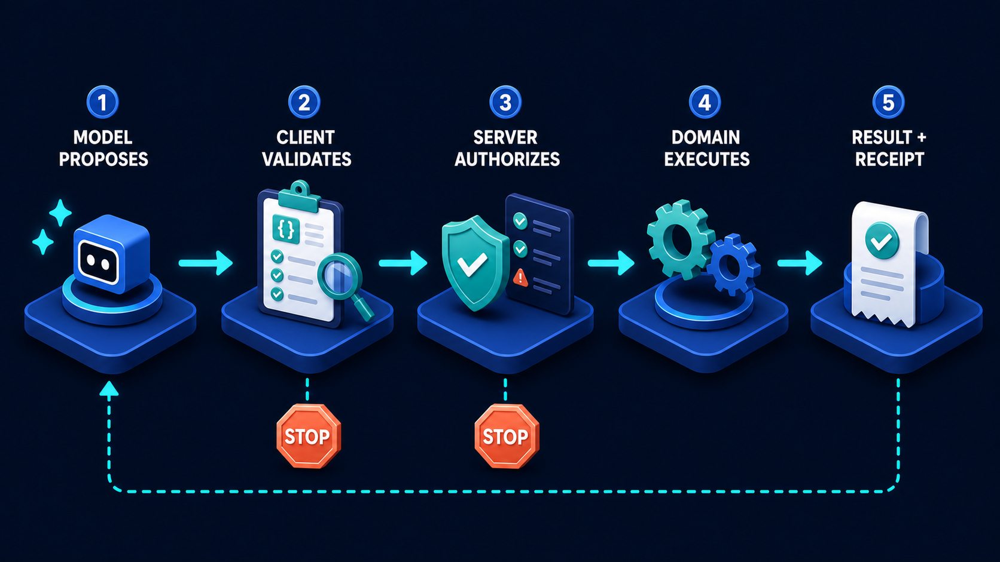

# Diagram 45 — Local to Vercel

![Six numbered stages on dark navy — LOCAL CODE as a laptop showing code, TESTS as a checklist with three green ticks, GIT as a dark panel with a teal branch graph, VERCEL BUILD as a blue cube with a white triangle, PREVIEW as a browser window with teal content, and PRODUCTION as a glowing wireframe globe. Cyan arrows connect them left to right. Two coral arrows loop back beneath — from TESTS to LOCAL CODE and from VERCEL BUILD to GIT. A dashed teal arrow labelled PROMOTE runs from PREVIEW to PRODUCTION.](../diagrams/45-local-to-vercel.png)

**Module:** Running the system
**Role in the course:** getting your work from your machine to the internet
**Layout:** six stages with two coral failure returns and a dashed promotion step

---

## At a glance

Six stages from your laptop to the internet: **LOCAL CODE → TESTS → GIT → VERCEL BUILD → PREVIEW → PRODUCTION**.

Two things make it more than a pipeline picture. **Two coral arrows loop backwards** — failures return you to an earlier stage rather than dropping out. And the final step is a **dashed arrow labelled PROMOTE**, not a solid one, because reaching production is a separate deliberate act rather than the automatic consequence of a successful build.

---

## What the diagram teaches

### 1. Failure loops back, and the two loops go to different places

The coral arrows are the diagram's structure. **TESTS** fails back to **LOCAL CODE**. **VERCEL BUILD** fails back to **GIT**.

Different destinations, and the difference is informative.

**A test failure is your problem, on your machine.** The code is wrong. You go back to where you write code, fix it, and come forward again. Nothing has left your laptop.

**A build failure is a repository problem.** The code is committed and shared. Something about it does not build in a clean environment — a missing dependency, an environment variable that only exists locally, a file that was never added. You go back to **GIT** because the fix has to be a new commit; you cannot un-push.

That asymmetry teaches something beginners feel but rarely articulate: **the point of no return is the push**, not the deploy. Before git, mistakes are private. After it, mistakes are history.

### 2. Tests come before git, and that ordering is a discipline

Stage 2 sits between writing code and committing it.

Running tests before pushing rather than relying on the build to catch problems is the difference between a private failure and a public one. A test that fails on your machine costs you a minute. The same failure caught at build costs a commit, a build cycle, a fix, and another commit — and it is visible to everyone.

The three green ticks on the checklist are aspirational rather than descriptive. The stage's real content is that it has a coral exit, which is the acknowledgement that it usually fails at least once.

### 3. Build happens somewhere else, in a clean environment

Stage 4 is drawn as a distinct object — a blue cube with the Vercel triangle — with its own platform, separated from your laptop by two stages.

The separation is the concept beginners most need. Your build does not run on your machine. It runs somewhere clean, with nothing installed except what your repository declares, and with no environment variables except those you configured on the platform.

That is why "it works on my machine" is not evidence. Your machine has things in it that arrived over months and are in nobody's manifest. The build environment has only what you declared.

Almost every first-deploy failure is a version of this: a dependency installed globally and never added to the manifest, an environment variable in a local file that was correctly excluded from git, a filename whose capitalisation works on a case-insensitive laptop filesystem and not on the case-sensitive build machine.

### 4. Preview is a full deployment, and it is the most under-used stage

Stage 5 shows a browser window with real content. Not a staging approximation — **a complete, working deployment of exactly the code you pushed**, at its own URL.

Two properties make it valuable:

**It is real.** Same build, same runtime, same configuration shape as production. What you see is what production will do.

**It is disposable and isolated.** It has its own address. Sharing it with someone does not affect production. Getting it wrong costs nothing.

Beginners routinely skip from build straight to production, treating preview as a formality. The diagram gives it a numbered stage of its own because it is the last point at which a mistake is free.

### 5. The promote arrow is dashed, and that is the diagram's sharpest detail

Every other arrow in the diagram is solid. The one from **PREVIEW** to **PRODUCTION** is **dashed** and carries a label: **PROMOTE**.

Dashed lines throughout both volumes mark something other than automatic forward flow. Here it means: **this step is a decision**.

A successful build does not entitle code to be in production. Something has to look at the preview and decide. That something might be a person clicking, an approval in a pull request, or an automated policy — but it is a distinct act with its own gate, not the tail end of the build.

This is the deployment equivalent of the human approval gates that run through both volumes: the machinery can prepare a change, and committing it is a separate decision. The tool-call lifecycle makes the same argument about a model's proposal —

— a well-formed proposal is not an authorised action, and a successful build is not an approved release.

### 6. Production is drawn as a globe, and the change of metaphor is the point

Stage 6 is a **glowing wireframe globe** — the only stage that is not a device, a document or a tool.

Everything before it is an artefact you are working on. Production is a place your work now exists, reachable by anyone.

That shift in metaphor carries the weight of the stage. There is no coral arrow leaving production in this diagram, which is worth naming honestly when teaching: rolling back is real and necessary, and this picture does not show it. The absence should be read as "getting here is deliberate," not "there is no way back."

---

## Case study — Pipit Books, the deploy that took down the shop on a Friday

Pipit is an online bookshop, four people, running a Next.js storefront on Vercel. Their developer works alone and deploys frequently.

They had connected the repository to Vercel with production deploys on every push to `main`. It was simple and it worked for about seven months.

### The Friday

A small change: adjusting how shipping costs display at checkout. Tested locally, worked, pushed to `main`.

The build succeeded. Production updated. And the checkout page began throwing an error for every customer.

The cause was a currency-formatting library that had been installed locally months earlier while experimenting and never added to `package.json`. It existed on the developer's laptop. It did not exist in the build environment — but the build had succeeded, because the import was inside a code path only reached at runtime on the checkout page.

Local tests passed because the library was present locally. The build passed because nothing statically required it. The failure appeared only when a real customer reached checkout.

### What it cost

The developer had pushed at 17:40 and closed their laptop. The first customer complaint arrived at 18:20. It was not seen until 21:15.

**Three and a half hours of a completely broken checkout on a Friday evening**, which is their second-busiest window of the week. Analytics showed 214 sessions reaching checkout and failing. They can identify eleven who returned later. The rest they cannot account for.

### What was missing

Mapped onto the diagram:

**Stage 2 gave false confidence.** Tests ran against the developer's environment, which contained the library. The test result said nothing about whether the code would work anywhere else.

**Stage 5 did not exist.** Push went to `main`, `main` deployed to production. There was no preview, so there was no moment at which the code ran in a clean environment where somebody could have opened the checkout page.

**The promote arrow was solid.** Build success automatically meant production. No decision, no gate, no look.

### The rebuild

**Branch and preview.** Work happens on a branch. Every push produces a preview deployment at its own URL. `main` still deploys production, but nothing reaches `main` without going through a preview first.

**A five-minute manual check.** Before promoting, the developer opens the preview and walks four paths: homepage, a product page, add to basket, and complete a test checkout. It takes five minutes and it would have caught this exact bug in under two.

**Dependencies verified in a clean install.** Their test command now runs against a fresh install from the manifest rather than whatever is on the machine. The missing library was found by this within a day of being introduced — on an unrelated change, because it had been quietly missing the whole time.

**A deploy window.** Nothing goes to production after 16:00 on a Friday. Not a technical control, just an agreement. Their reasoning: the cost of a bad deploy is not the bug, it is the hours it goes unnoticed.

### Eleven weeks later

The preview caught three problems that would have reached production:

- A product image path that worked on the developer's case-insensitive filesystem and 404'd on the build server.
- An environment variable for the payment provider that had been added locally and never configured on Vercel — the preview checkout failed immediately and obviously.
- A layout break on mobile that was invisible at desktop width and obvious on the preview URL opened on a phone.

None of the three would have been caught by tests. All three were caught by a person opening a real deployment and looking at it.

### The developer's note

*The build succeeding means it compiled. It does not mean it works. Preview is the only stage where a human looks at the actual thing.*

---

## Composition

Six stages run left to right, each on a blue platform with a numbered blue disc and a white uppercase label above it. Cyan arrows connect them.

Below the platforms, two **coral arrows** curve backwards: one from beneath **TESTS** to **LOCAL CODE**, and one from beneath **VERCEL BUILD** to **GIT**.

Between stages 5 and 6, a **dashed teal arrow** labelled **PROMOTE** in teal capitals.

## Element by element

**1 LOCAL CODE**
A dark **laptop** open, screen showing blue and purple code lines with a `</>` glyph. Your machine.

**2 TESTS**
A white checklist card with three **green tick circles** and text lines. *Coral return to LOCAL CODE.*

**3 GIT**
A dark rounded panel showing a **teal branch graph** — three nodes connected by lines, the standard commit-and-branch shape.

**4 VERCEL BUILD**
A blue **cube** carrying a white triangle on its face. Building in a clean environment, elsewhere. *Coral return to GIT.*

**5 PREVIEW**
A browser window with a blue title bar, a large teal content block, a smaller teal block and grey text lines. A real, complete deployment at its own address.

**6 PRODUCTION**
A glowing blue **wireframe globe** with a small teal node. Reachable by anyone.

**The promote step**
A dashed teal arrow from preview to production, labelled **PROMOTE**.

## Colour and flow semantics

- **Cyan arrows** carry forward progress through the six stages.
- **Coral arrows** carry failures backwards, and the two go to different stages — tests to local, build to git.
- The **dashed teal promote arrow** is the only non-solid forward step, marking it as a decision rather than automatic flow.
- **Teal** marks the working elements: the ticks, the branch graph, the preview content, the globe's node.
- Production has **no outgoing arrow**, which should be flagged as a simplification when presenting — rollback exists and is not drawn.

## How to present it

**Ask where the point of no return is.** Most beginners say production. It is **git** — after the push, mistakes are history. That reframing explains why the two coral loops go to different places, and it makes the tests-before-push discipline feel motivated rather than bureaucratic.

**Ask why the build runs somewhere else.** Then explain what a clean environment means: only what your repository declares, nothing accumulated over months. This is the whole explanation for "works on my machine," and beginners find it genuinely clarifying.

**Ask for their own first-deploy failure.** In any room with deployment experience, the answers cluster into three: a missing dependency, a missing environment variable, or a filename capitalisation problem. All three are the same cause — something present locally that was never declared.

**Point at the dashed promote arrow.** Ask why it is the only dashed forward arrow in the diagram. Because promotion is a decision, not a consequence. Then ask what their pipeline does — for many, push to main means production, and nothing between build success and public.

**Tell the Pipit story, with the timing.** Pushed at 17:40, first complaint 18:20, seen at 21:15. Three and a half hours of broken checkout on a Friday. The bug is ordinary; the cost came entirely from the absence of stages 5 and the dashed arrow.

**Ask what tests would have caught it.** None of them — the library was present locally, so local tests passed. This is the important nuance: tests validate logic, not environment. Only a clean build and a real deployment validate environment.

**Ask what preview is for, and push past "checking."** It is the last stage where a mistake is free. Then list Pipit's three catches — a case-sensitive path, a missing environment variable, a mobile layout break — and note that no test suite would have found any of them.

**Suggest the five-minute walk.** Open the preview, walk the critical paths, then promote. It is unglamorous, it is not automated, and it catches the class of problem automation does not.

**Name the missing arrow.** There is no rollback path drawn. Ask what they would do if production broke. Having an answer before you need one is the point.

**Timing.** Twenty minutes. Thirty if you work through what their own preview check should cover, which is a useful concrete artefact to leave with.

---

## Lab and checkpoint

**Lab:** Map your own deployment pipeline onto the diagram. Identify the local environment, git, build, preview, and production stages. For each stage, write what must be true before promotion and the most common failure that appears at that stage. Then write the rollback rule that is missing from the diagram.

**Checkpoint:** Why is git, not production, the point of no return?

**Answer:** Because once code is in git, it is history and can be deployed from any environment. A bad push becomes a permanent mistake unless it is fixed or reverted. Production is the consequence of what is in git.

## Glossary

- **Build** — the stage that turns the declared repository into a runnable artifact in a clean environment.
- **Deploy** — the stage that makes the artifact available in a target environment.
- **Environment variable** — a configuration value supplied outside the repository.
- **Git** — the source of truth and the point of no return.
- **Local environment** — the developer's own machine, which often contains undeclared state.
- **Pipeline** — the sequence of stages from code change to running production.
- **Preview** — the stage where a real deployment is tested before production promotion.
- **Production** — the live environment that users see.
- **Promotion** — the decision to move a build from preview to production.

## Sources

- Vercel preview and production deployment docs
- CI/CD pipelines and clean-build practices
- Environment parity and deployment rollback
