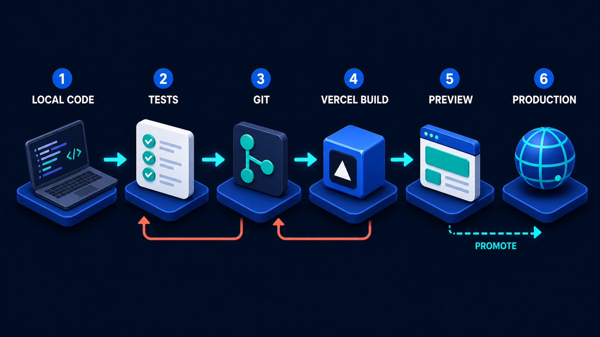

# Diagram 46 — Capstone Build Roadmap

![Seven ascending isometric steps on dark navy, rising left to right, connected by cyan arrows. A person in a teal top walks upward from the first step. The steps are LOCAL DATA with a teal folder, DOMAIN FUNCTION with a teal cube and gear, MCP TOOL with a green toolbox showing a plug, RAG SEARCH with a document and magnifier, A2A TASK with two robots exchanging arrows, WEB UI with a browser window, and DEPLOY with a rocket launching from a cloud. At the top right, a coral flag reads WORKING SYSTEM.](../diagrams/46-capstone-build-roadmap.png)

**Module:** Capstone
**Role in the course:** the order to build things in
**Layout:** seven ascending steps with a figure climbing toward a flag

---

## At a glance

Seven steps rising left to right, a person walking up them, and a flag at the top reading **WORKING SYSTEM**.

This is the last diagram of the volume and the only one that is a plan rather than an explanation. Its content is the **order**: **LOCAL DATA → DOMAIN FUNCTION → MCP TOOL → RAG SEARCH → A2A TASK → WEB UI → DEPLOY**.

That order is not obvious, and most beginners attempt it in almost exactly the reverse.

---

## What the diagram teaches

### 1. The ascent means each step stands on the one below it

The steps rise. That is not decoration — it says each stage **depends on** what came before, and that you cannot skip.

You cannot expose a tool that calls a function you have not written. You cannot retrieve over data you have not organised. You cannot delegate work whose shape you have not established. You cannot build a UI for capabilities that do not exist. You cannot deploy something that does not work.

The ascent also implies accumulation: at step five you have everything from steps one to four still under you. Nothing is discarded as you climb.

### 2. Data comes first, and that is the least intuitive part

Step one is a **teal folder** — files on your machine.

Almost nobody starts here. The instinct is to start with the interesting part: the agent, the model, the retrieval. Starting with data feels like admin.

It is first because everything above it is shaped by it. What your domain function computes depends on what your data contains. What your tool exposes depends on what the function can do. What retrieval can find depends on what is in the corpus. Building upward from an unexamined dataset means discovering at step four that the data does not support what you built at step two.

"Local" is also doing work. Not a database, not a cloud store — **files you can open and read**. At this stage you are establishing what you have, and that is easier when you can look at it directly.

### 3. Domain function before MCP tool, and this is the step most often skipped

Step two is a **teal cube with a gear** — plain code. Step three is the **toolbox** — that code exposed.

The sequence says: **write the thing, then expose the thing.** They are separate steps, and conflating them is the most common structural mistake in a first agent build.

What you get from separating them:

- **The function is testable without any agent involved.** You can call it, check it, and fix it in isolation. Debugging a wrong answer means debugging one function, not an agent-plus-protocol-plus-function stack.
- **The function is correct before anything depends on it.** A tool wrapping a broken function is a reliable way to deliver wrong answers.
- **The boundary is visible.** Writing the wrapper as a separate act forces you to decide what the contract is — arguments, return shape, error behaviour — rather than letting it emerge.

This is the boundary lesson from Volume 1 applied to build order. Local function is a legitimate and frequently correct answer, and here it is a mandatory intermediate step even when the destination is a tool.

It is also where the tool-call lifecycle's fourth stage comes from:

**DOMAIN EXECUTES** is step two of this staircase. Building it first, on its own, is what makes that stage trustworthy.

### 4. RAG comes fourth, after tools, and the ordering is a claim about difficulty

Retrieval is placed after capabilities, which surprises people who think of RAG as the simpler thing.

Two reasons.

**Tools are deterministic; retrieval is not.** A tool either returns the right value or it does not, and you can test it. Retrieval quality is a spectrum, requires judgement to assess, and needs a corpus, chunking decisions, and an evaluation method. Building the deterministic part first means that when retrieval misbehaves, you know the rest works.

**Retrieval needs the data step to have been done properly.** Step one is where you found out what documents you have and what state they are in. Chunking and indexing decisions depend on that.

### 5. A2A comes fifth, and by then you know what a task is

Delegation is the second-to-last capability, and it is placed there because it is the only step that involves another party.

By step five you have a working function, a working tool, and working retrieval. You know what your system can do on its own, which means you can answer the question delegation requires: **what is genuinely not mine?**

Attempting A2A earlier means delegating work you have not yet established you cannot do — which is how systems end up handing out tasks that should have been a function call.

### 6. The UI is sixth, and putting it there is deliberate

**WEB UI** is the second-to-last step, which contradicts how most beginners actually build.

The common approach is to build the interface first, because it is visible and it feels like progress. The result is a UI designed around what you imagined the system would do, which then has to be rebuilt when you discover what it actually does.

Building it sixth means the interface is designed around **real capabilities with known shapes and known failure modes**. You know what a task in progress looks like, what an unanswerable question looks like, what a refused action looks like — all things that have to be represented in the interface and cannot be designed for before they exist.

There is a legitimate counter-argument — a rough interface early helps you understand the problem — and it is worth acknowledging. The diagram's position is about the *real* UI, not a throwaway one.

### 7. Deploy is a step, and the flag is not the same thing

Step seven is a **rocket launching from a cloud**. The flag reading **WORKING SYSTEM** sits on a *separate platform* beyond it.

That separation is precise. Deploying is an act; having a working system is a state. You can complete step seven and not reach the flag — the deploy succeeds and the thing does not work, which is exactly the failure the previous diagram's preview stage exists to catch:

Step seven of this roadmap is that entire pipeline. The gap between the rocket and the flag is the gap between **VERCEL BUILD** succeeding and someone opening **PREVIEW** and looking at it.

The flag being **coral** is the only coral in the diagram. Throughout both volumes coral marks the things that matter and can refuse — and a system that is genuinely working is a claim that has to be earned rather than declared.

### 8. There is one person, walking

A single figure on the first step, facing up the staircase. Not a team, not an org chart.

This is the volume's audience: one person building their first agent system. The scale of the diagram is a reassurance — seven steps, walkable, with a visible destination.

---

## Case study — Rowan Fielding, building it in the wrong order first

Rowan is an operations manager at a small architectural practice, not a professional developer, who had worked through the volume and wanted to build something real: an assistant to help the practice answer questions about their own past projects — what was specified where, which contractors were used, what the planning conditions were.

They built it twice.

### The first attempt — top-down

Rowan started where the interest was: the interface and the retrieval.

**Week 1** — a web UI. Chat panel, project selector, results area. It looked good and did nothing.

**Week 2** — retrieval. Pointed at the practice's project folders, chunked everything, indexed it. Answers came back and were poor. The folders held 14 years of material: PDFs, scanned drawings, spreadsheets, emails exported as text, and three different folder conventions from three different eras. About 40% of it was superseded drafts sitting alongside final versions, indistinguishable.

**Week 3** — trying to improve retrieval by adjusting chunking and search. Marginal gains. The problem was not retrieval; it was that the corpus was 40% noise and nothing marked which was which.

**Week 4** — realised the practice's project data needed structuring before any of this could work, and that the questions they actually wanted answered — *which contractors have we used on conservation projects* — were not retrieval questions at all. They were queries over structured facts that existed nowhere in structured form.

Four weeks, and the honest assessment was that almost none of it was usable.

### The second attempt — bottom-up

Rowan restarted at step one.

**Step 1 — Local data.** Two weeks, and the least glamorous part of the whole project. Every project folder catalogued into a spreadsheet: project reference, client, type, year, contractors, planning references, and which documents were final versus draft.

The finding that justified the whole exercise: the draft-versus-final distinction existed only in filenames and people's memory, and the filename conventions had changed twice. That is why attempt one's retrieval was poor, and no amount of chunking would have fixed it.

**Step 2 — Domain function.** Plain code over the catalogue: `find_projects(type, year_range, contractor)`. No agent, no protocol, called from a script and checked against what Rowan knew. Three days.

This is what answered the contractor question — and it was a query, not a retrieval. Attempt one had been trying to solve a structured-data problem with semantic search.

**Step 3 — MCP tool.** The function exposed as a tool with a declared schema. Two days. Because the function was already correct and tested, this step was genuinely just the wrapper.

**Step 4 — RAG search.** Retrieval over the *final* documents only, filterable by project. Because the catalogue from step one marked what was final, the corpus was clean. Answer quality was dramatically better than attempt one, over the same source material, because the noise had been excluded at step one rather than fought at step four.

**Step 5 — A2A task.** Rowan skipped it, correctly. Nothing in the project belonged to another party. They noted the decision and moved on — which is the right use of the step, since the question it asks is *what is genuinely not mine*, and the honest answer was "nothing."

**Step 6 — Web UI.** Rebuilt in four days, and quite different from attempt one's. It now needed a way to show which project a result came from, whether a document was final, a distinction between a factual query result and a retrieved passage, and a state for "not found in the archive." None of those had been in the first UI because none of them were knowable before the capabilities existed.

**Step 7 — Deploy.** Preview first, walked the critical paths, then promoted.

### The comparison

Attempt one: four weeks, unusable. Attempt two: about five weeks, working and in daily use by six people.

Rowan's own assessment is the argument for the diagram: *the second attempt wasn't faster because I knew more. It was faster because the two weeks I spent on data made every step after it easy, and in the first attempt I spent those two weeks at the top of the staircase trying to fix a problem that lived at the bottom.*

### The step they would emphasise

Step one, by a distance. Not because it is difficult, but because it is the step that feels most like a delay and is the one that determines whether everything above it can work.

---

## Composition

Seven blue platforms ascend from lower left to upper right in isometric perspective, connected by short **cyan arrows** pointing up-right. Each carries a teal numeral and a white uppercase label.

A **person in a teal top** walks upward from the first platform, mid-stride.

At the top right, on a final platform beyond step seven, a **coral flag** on a dark pole reads **WORKING SYSTEM**.

## Element by element

**1 LOCAL DATA**
A **teal folder** with white document pages emerging from it. Files you can open and read.

**2 DOMAIN FUNCTION**
A **teal cube** with a white **gear** on its face. Plain code, tested on its own.

**3 MCP TOOL**
A **green toolbox** with a dark handle, carrying a white **plug** tile. The function exposed.

**4 RAG SEARCH**
A white **document** with blue text lines and a **teal-rimmed magnifying glass** over it.

**5 A2A TASK**
A **blue cube robot** and a **teal cube robot** on a shared platform with curved cyan arrows circulating between them.

**6 WEB UI**
A browser window with a blue title bar, two teal content blocks and three white cards.

**7 DEPLOY**
A **teal and white rocket** launching upward from a white **cloud**, with a flame beneath it.

**WORKING SYSTEM**
A **coral flag** on a dark pole, on its own platform beyond the final step.

## Colour and flow semantics

- **Cyan arrows** carry the climb, each pointing up and to the right.
- **Teal** marks every step's icon — the folder, the cube, the toolbox, the magnifier, the robots, the rocket — establishing the whole path as working material.
- **Coral** appears once, on the destination flag, marking the goal as a claim to be earned.
- The **ascent** encodes dependency: each step stands on the one below.
- The **flag sits on a separate platform** from the deploy step, distinguishing the act from the outcome.

## How to present it

**Ask what order they would build in.** Before showing the diagram. Write the answers up. Most rooms produce something starting with the UI or the agent, and several will put data last or not mention it.

**Then reveal the order and ask what is surprising.** Usually two things: data first, and UI sixth. Those are the two the room got wrong, and they are the two the diagram exists to correct.

**Ask why data is first.** Push past "you need data" to the real reason: everything above it is *shaped* by it. You discover at step four whether step one was done properly, and by then the cost of fixing it is four steps of rework.

**Ask why function and tool are separate steps.** Testability, correctness before dependency, and an explicit contract. Then ask what debugging looks like when they are merged — an agent, a protocol and a function all at once, with a wrong answer and no way to isolate.

**Ask why RAG is after tools.** Deterministic before non-deterministic. When retrieval misbehaves, you want to already know the rest works.

**Ask why the UI is sixth.** Then make the concrete point: you cannot design an interface for a task-in-progress state, a not-found state, or a refused-action state before those states exist. Acknowledge the counter-argument for a rough early prototype — the diagram is about the real UI.

**Tell the Rowan story with the two timelines.** Four weeks unusable, five weeks working. The detail that lands is *why* attempt one's retrieval was poor: 40% superseded drafts, indistinguishable, and no amount of chunking would have fixed a problem that lived at step one.

**Point out that Rowan skipped step five.** Correctly. The step asks "what is genuinely not mine," and the honest answer was nothing. A roadmap is not a checklist of things you must include — it is an order for the things you do include.

**Point at the gap between the rocket and the flag.** Deploying is an act; working is a state. You can complete step seven and not reach the flag. Connect it back to the preview stage in the previous diagram, which exists precisely to close that gap.

**End on the figure.** One person, seven steps, a visible flag. For a room of beginners at the end of a volume, that is the right last image, and it is worth saying out loud that the staircase is walkable.

**Timing.** Twenty minutes as a closing session. Forty if you have each person map their own project idea onto the seven steps, which is the most useful possible exit from the volume.

---

## Lab and checkpoint

**Lab:** Take one project idea of your own and map it onto the seven-step roadmap. For each step, write the concrete artifact you would produce and the test that would prove it is ready before moving up. Identify any step you can skip or defer because it does not apply, and note why the order still matters for the ones you keep.

**Checkpoint:** Why is data the first step, not the last?

**Answer:** Because everything above it is shaped by it. RAG, tools, and the agent all depend on the data being correct, well-structured, and retrievable. Discovering a data problem at step four means reworking the four steps above it, so data should be the first foundation.

## Glossary

- **A2A task** — delegated work to another agent.
- **Capstone** — the final project that integrates the skills from the volume.
- **Data corpus** — the collected, cleaned, and ingested source material.
- **Deploy** — the act of putting the system into a live environment.
- **Function** — the deterministic server-side code that a tool calls.
- **MCP tool** — the capability exposed through the Model Context Protocol.
- **RAG search** — the retrieval stage that provides answers from the data corpus.
- **Roadmap** — the ordered plan for building the project.
- **Web UI** — the user interface built after the states it must display are known.
- **Working system** — the goal state, distinct from the act of deployment.

## Sources

- Capstone project planning and data-first design
- MCP, RAG, and A2A integration patterns
- Deployment, preview, and working-system validation
