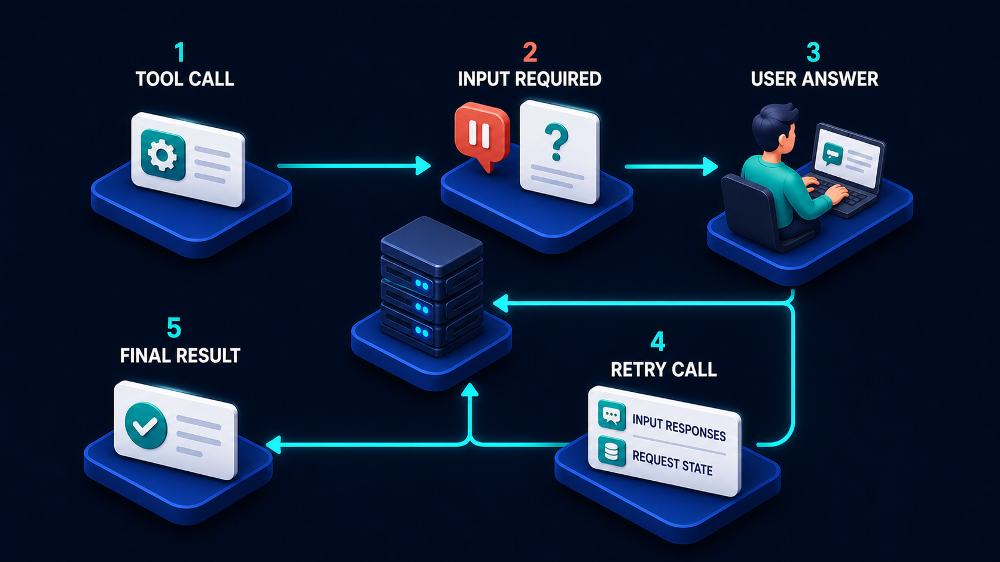

# Diagram 49 — The MCP Tasks Extension

![A task lifecycle on dark navy. TOOL CALL leads to TASK HANDLE, a white card showing braces and a teal check. A server platform captioned SERVER DECIDES LONG WORK BECOMES A TASK leads to WORKING, showing a teal gear beside a progress card. A dashed cyan arrow rises to INPUT REQUIRED. A cyan arrow continues to COMPLETED with a teal check. Two coral arrows drop to FAILED with a red triangle and CANCELED with a red cross. Below, three control cards read TASKS GET, TASKS UPDATE and TASKS CANCEL, feeding the server. At lower left, SUBSCRIPTIONS LISTEN receives a dashed UPDATE STREAM.](../diagrams/49-mcp-tasks-extension.png)

**Module:** Modern MCP
**Role in the course:** what happens when a tool call is too long to be a call
**Layout:** a lifecycle with three control operations and an update stream

---

## At a glance

A tool call that will take too long **becomes a task**. The caller receives a handle instead of a result, and from then on interacts with the work through three control operations — **TASKS GET**, **TASKS UPDATE**, **TASKS CANCEL** — plus a subscription that streams updates.

The caption in the middle is the diagram's hinge: **SERVER DECIDES LONG WORK BECOMES A TASK**. Not the client. The server knows how long its own work takes, and it is the party that promotes a call into a task.

---

## What the diagram teaches

### 1. The server decides, and that is a considered design choice

The caption sits above the server platform and it is doing real work.

The alternative — the client declaring "this should be a task" — requires the client to know how long each capability takes, which it cannot know, and which changes as the server's implementation changes.

The server knows. It knows that generating a small report takes 200ms and a large one takes eleven minutes. It can decide per call, based on the actual parameters, whether this particular invocation should return a result or a handle.

The practical consequence for client authors: **a call may return either a result or a task handle, and the client must handle both.** That is a small amount of extra branching in exchange for never having to guess.

### 2. The task handle is what you hold instead of a result

Stage 2 shows a white card with **`{...}` braces and a teal check**.

The braces matter — it is a structured object, not a bare string. A handle carries the identifier plus enough for the client to act on it: what to poll, how to subscribe, and what the expected duration is.

The check says the handle is a *successful* response. The call did not fail; it returned a different kind of success.

### 3. Three control operations, and they map onto three different needs

The trio of white cards beneath the server are the task's public interface.

**TASKS GET** — read the current state. The polling primitive. Cheap, safe to repeat, and the fallback when anything else fails.

**TASKS UPDATE** — supply something the task needs. This is how the **INPUT REQUIRED** state is resolved: the task asked a question, and update delivers the answer. It is the same idea as the retry-with-input-responses from the previous diagram, expressed as an operation on a durable object rather than as a re-invocation.

**TASKS CANCEL** — stop it. Not "abandon it" — an explicit instruction that produces the **CANCELED** terminal state.

Three operations is a deliberately small surface. Everything you need to manage long work, and nothing more.

### 4. Subscriptions listen, and the stream is drawn dashed for a reason

At lower left, **SUBSCRIPTIONS LISTEN** receives a **dashed teal UPDATE STREAM** from the control platform.

Dashed, because it is a different kind of channel from the solid request/response arrows. Updates arrive when there is something to say, rather than in response to being asked.

The relationship between subscriptions and `tasks/get` is worth being explicit about: **the subscription is an optimisation, and polling is the guarantee.** A stream can drop. A client that only listens will miss the completion of a task if its connection blips. A client that listens and falls back to polling gets both efficiency and reliability.

### 5. Five states, and the branch structure is informative

**WORKING** is the hub. From it:

- A **dashed cyan arrow rises to INPUT REQUIRED** — dashed, because it is a pause that returns rather than a terminal transition.
- A **solid cyan arrow continues to COMPLETED**.
- Two **coral arrows drop to FAILED and CANCELED**.

Every branch leaves from working, which is the same shape as the task state machine in Volume 2. What this diagram adds is the **control surface** — the operations that let a caller act on those states rather than merely observe them.

Note also that **INPUT REQUIRED is reached by a dashed arrow while the failures are solid coral**. The pause is provisional; the failures are final.

### 6. This is an extension, and that word carries weight

The title says extension. Tasks are not how every MCP call works — they are a capability a server may offer for work that needs it.

That means a client has to discover whether a server supports tasks, and a server has to be able to serve callers that do not. A capability that only works for task-aware clients is a capability half your callers cannot use.

---

## Case study — Corvid Analytics, the eleven-minute report

Corvid provides marketing analytics to about 1,200 e-commerce businesses. Their MCP layer exposes capabilities that their own assistant and their customers' integrations call — audience queries, attribution analysis, and report generation.

Report generation is the problem capability. A weekly summary for a small merchant takes about 900ms. A full-year multi-touch attribution analysis for a large one takes between four and eleven minutes.

### What broke before tasks

`generate_report` was a normal tool call. Everything downstream of it had a timeout.

Their gateway timed out at 30 seconds. Their HTTP clients at 60. Their customers' integrations at whatever their frameworks defaulted to, usually 30 or 120.

For long reports, every one of these fired. The report kept generating — the compute job did not know its caller had gone away — and the result landed in storage where nobody collected it.

**The retry storm was the expensive part.** Customers' integrations, seeing a timeout, retried. Each retry started a *new* eleven-minute job. During one Monday morning, a single customer's integration had fourteen concurrent identical attribution jobs running, and Corvid's analytics cluster was 60% occupied by duplicate work.

### The rebuild as tasks

**The server decides.** `generate_report` estimates duration from the report type, the date range and the account's data volume. Under two seconds, it returns a result. Over, it returns a task handle. About 15% of calls become tasks.

This is the part their client authors appreciated most: they did not have to know which reports were slow. The server tells them, per call.

**The handle carries an estimate.** Their task handle includes an expected completion window, which lets clients set sensible poll intervals rather than guessing.

**tasks/get with backoff.** Clients poll every 2 seconds for the first 30, every 15 thereafter, every 60 after five minutes. For an eleven-minute report that is about 40 checks rather than the 660 a fixed 1-second interval would produce.

**Subscriptions for their own assistant.** Corvid's first-party assistant subscribes, so users see progress without polling. It also polls on a slow interval as a fallback, which has fired 31 times in a year — each one a dropped stream that would otherwise have left a report apparently unfinished.

**tasks/cancel became commercially significant.** Analysts start an attribution run, realise they set the wrong date range, and cancel. Before, the job ran to completion regardless and the compute was spent. Cancellation now reclaims it. About 6% of long reports are cancelled, which recovered roughly 9% of their analytics cluster capacity.

**tasks/update for the one case that needs it.** Some attribution runs encounter ambiguity — two channels with overlapping tracking parameters that could be attributed either way. The task moves to `input_required` with the specific conflict, and the analyst resolves it via `tasks/update`. The run resumes rather than restarting, which for a nine-minute job that paused at minute seven matters a great deal.

### The duplicate problem, solved differently than expected

Tasks alone did not fix the retry storm. A client that times out waiting for the *handle* can still resubmit.

The fix was idempotency on the submission: the same report request from the same caller within the retention window returns the **existing task handle** rather than starting a second job.

That is the pattern from later in this volume, applied to task creation. Tasks made long work manageable; idempotency made task creation safe.

### Results

- **Duplicate analytics jobs:** from roughly 15% of cluster load at peak to effectively zero.
- **Reports abandoned uncollected:** from about 200/week to under 5.
- **Cluster capacity recovered:** ~9% from cancellation, ~15% from de-duplication.
- **Customer integration support tickets about report timeouts:** from 20–30/month to two in the following year.

### What their API lead tells new client authors

*Your call might come back with an answer or with a handle. Handle both, poll with backoff, and subscribe if you can — but never only subscribe.*

---

## Composition

A lifecycle running left to right across the upper portion of the frame, with a control platform beneath the centre and a subscription platform at lower left.

**TOOL CALL → TASK HANDLE → [server] → WORKING → COMPLETED**, with a **dashed cyan arrow** from working up to **INPUT REQUIRED** and two **coral arrows** down to **FAILED** and **CANCELED**.

Three control cards sit on a shared platform below the server, each sending a cyan line up into it. A **dashed teal UPDATE STREAM** runs left from that platform to **SUBSCRIPTIONS LISTEN**.

## Element by element

**TOOL CALL**
A teal terminal tile showing `>_` beside a white card with text lines.

**TASK HANDLE**
A white card showing **`{...}`** braces, with a **teal check disc** at its lower right.

**The server**
A blue server tower with a **teal magnifying glass**, captioned above in white: **SERVER DECIDES / LONG WORK BECOMES A TASK**.

**WORKING**
A large **teal gear** beside a white card showing a progress row and text lines.

**INPUT REQUIRED**
A **teal question-mark bubble** beside a white card, reached by a dashed cyan arrow.

**COMPLETED**
A **teal check disc** beside a white card.

**FAILED**
A **red warning triangle** beside a white card.

**CANCELED**
A **red circular cross** beside a white card.

**The three control cards**
White cards on a shared blue platform: a teal list icon and **TASKS GET**; a teal edit icon and **TASKS UPDATE**; a teal ✗ icon and **TASKS CANCEL**.

**SUBSCRIPTIONS LISTEN**
A teal broadcast/signal tile beside a white card, fed by a dashed teal line labelled **UPDATE STREAM**.

## Colour and flow semantics

- **Solid cyan arrows** carry the main lifecycle and the control operations into the server.
- The **dashed cyan arrow to INPUT REQUIRED** marks a provisional pause rather than a terminal state.
- **Coral arrows** carry the two terminal failures.
- The **dashed teal update stream** is a different channel kind from the solid request/response arrows — pushed, not requested.
- **Teal** marks all working machinery; **red** distinguishes the two failure badges by shape.

## How to present it

**Ask who should decide that work becomes a task.** Most rooms say the client. Then make the case for the server: it knows its own durations, per call, and those durations change with implementation. Corvid's client authors not having to know which reports are slow is the concrete benefit.

**Point out that a call can now return two shapes.** A result or a handle. Ask what that means for client code. A small amount of branching, in exchange for never guessing.

**Walk the three control operations and ask what each is for.** Get is observation, update is supplying what the task asked for, cancel is stopping. Then ask which one their current long-running work supports. Usually none of them, or only an implicit poll.

**Ask about cancel specifically.** It is the operation teams omit, and it has direct cost consequences. Corvid recovered 9% of cluster capacity from cancellation alone.

**Draw the subscription/polling relationship.** The stream is an optimisation; polling is the guarantee. Then give them the number: 31 dropped streams in a year, each of which would have looked like an unfinished job. Never only subscribe.

**Point out where INPUT REQUIRED sits.** Dashed arrow, provisional, resolved by `tasks/update`. Connect it to the previous diagram — same idea, expressed as an operation on a durable object rather than as a re-invocation.

**Raise the duplicate-submission gap.** Tasks make long work manageable and do not by themselves prevent a client from submitting the same work twice. Corvid needed idempotency on task creation, and that is a separate control.

**Note that it is an extension.** Clients must discover whether tasks are supported; servers must serve callers that do not. A capability only usable by task-aware clients is half-usable.

**Timing.** Twenty-five minutes. Thirty-five if you map the room's own long-running work onto the five states and three operations.

---

## Lab and checkpoint

**Lab:** Take one long-running operation in your system and model it as an MCP task. Define the initial call, the task handle, the three control operations (get, update, cancel), and the subscription or poll rule. Then write the idempotency rule for task creation and the test that proves a client can use the capability whether or not it is task-aware.

**Checkpoint:** Why is the update stream an optimisation and polling the guarantee?

**Answer:** Because streams can drop or fail. Polling is a reliable, always-available way to check status. Subscriptions make the common case efficient, but a correct client must be able to fall back to polling.

## Glossary

- **Cancel** — the control operation that stops a running task.
- **Get** — the control operation that observes the current task state and result.
- **Input required** — a provisional pause where the task needs more information.
- **Subscription** — the pushed update stream that notifies the client of task changes.
- **Task** — a durable, long-running unit of work identified by a handle.
- **Task handle** — the identifier returned when a call becomes a task.
- **Update** — the control operation that supplies input required by the task.

## Sources

- MCP durable task and task control operations
- Long-running work and task-state polling/subscription
- Idempotency in task creation and continuation
