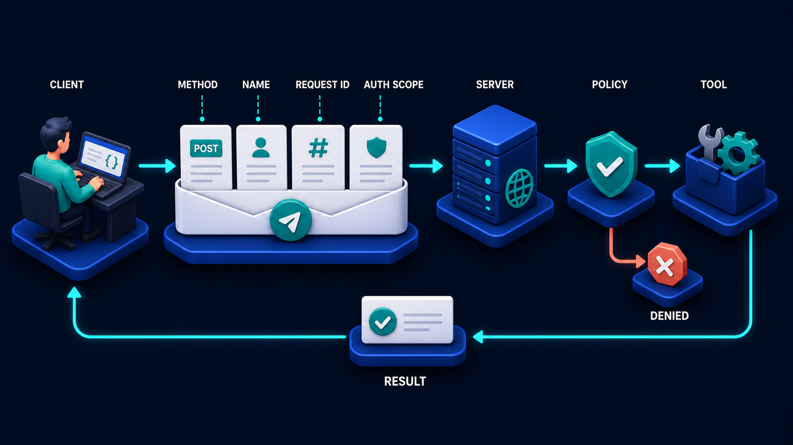

# Diagram 51 — The Modern MCP Migration Map

**Module:** Modern MCP
**Role in the course:** what to stop using and what replaces it
**Layout:** two columns joined by a bridge carrying a testing instruction

---

## At a glance

Seven retired or deprecated mechanisms on the left, six modern replacements on the right, and a **bridge between them carrying one instruction: TEST BOTH VERSIONS**.

The bridge is the diagram's real content. Most migration diagrams are two columns and an arrow, which implies a switch you flip. This one puts a structure in the middle with a testing requirement written on it, because the dangerous part of a protocol migration is not choosing the destination — it is the period when both versions are live.

---

## What the diagram teaches

### 1. The left column is not a random list — it is one idea repeated

Read the seven retired items together and a pattern appears. Almost all of them are **things that assumed a connection with memory**.

**INITIALIZE** — a handshake that establishes shared state for a connection's lifetime.
**SESSION ID** — an identifier standing in for "the connection you already know."
**ROOTS** — a client-declared scope, set once and assumed thereafter.
**SAMPLING** — the server reaching back into the client's model, which requires a live channel.
**LOGGING** — a connection-scoped log channel.
**LEGACY HTTP PLUS SSE** — a transport built around a long-lived server-to-client stream.
**DCR** — dynamic client registration, establishing identity out of band and then relying on it.

Every one of them presumes that the two parties have a relationship that persists between requests. The modern path replaces that presumption with requests that carry what they need.

That reframing is more useful than memorising seven items. **The migration is from connection-state to request-state**, and each retired item is one instance of it.

### 2. The right column is fewer items, and it is not a one-to-one map

Seven on the left, six on the right, and the arrows do not pair up neatly.

That asymmetry is honest. Some retired mechanisms collapse into one replacement: initialize, session id and roots are all subsumed by **SELF DESCRIBING REQUESTS**, because a request that carries its own version, identity and scope needs none of them.

Others are genuinely new capability rather than a replacement — **EXTENSIONS** is a mechanism for optional capabilities like the tasks extension, which had no predecessor.

Presenting it as a lookup table would misrepresent it. This is a *map*, and the topology is the message.

### 3. Self-describing requests is the keystone

Positioned first in the modern column, and it is the item everything else depends on.

That envelope is what makes initialize unnecessary, session id meaningless, and roots redundant. Once every request carries its own version, identity, scope and target, there is nothing left for a handshake to establish.

If a team migrates one thing, it is this. The rest follows.

### 4. Streamable HTTP replaces the transport, not the semantics

**LEGACY HTTP PLUS SSE** → **STREAMABLE HTTP** is the one pairing that is a genuine like-for-like swap, and it is worth separating from the others because it is a *transport* change rather than a *model* change.

The old arrangement used a separate long-lived server-sent-events channel alongside HTTP requests, which meant two connections to manage, correlate and recover. The modern transport carries streaming within the request/response model.

Practically: fewer moving parts, better behaviour through proxies and load balancers, and reconnection that does not require re-establishing a second channel.

### 5. The bridge is the migration period, and it is drawn as a structure

A suspension bridge, with towers and cables, rather than an arrow.

Bridges are built, take time, and carry traffic in both directions while they stand. That is an accurate picture of a protocol migration: for weeks or months, some clients speak the old way and some the new, and both must work.

The plaque reads **TEST BOTH VERSIONS** — not "test the new version." Testing only the destination is how teams discover, in production, that their old clients broke on the day they shipped.

Concretely this means: a test suite that runs against both, a staged rollout where mixed traffic is normal, and a metric that tells you how much old-version traffic remains so you know when the bridge can come down.

### 6. Some items on the left will surprise people, and that is worth flagging

**SAMPLING** and **LOGGING** are the two that generate the most objection, because they were genuinely useful.

Sampling let a server ask the client's model to do something — powerful, and it inverts the trust direction in a way that is difficult to secure. Logging over the protocol channel conflated observability with the protocol, which the tracing approach in this volume handles better.

Neither was a bad idea. Both had consequences that were clearer in hindsight.

---

## Case study — Kestrel Marine, migrating a shipping platform

Kestrel provides vessel-tracking and port-logistics software. Their MCP layer serves an internal assistant, a customer-facing integration API used by about 60 shipping lines, and two partner systems.

Their implementation was built early. Every item in the left column was in it.

### The audit

They started by counting what actually depended on each retired mechanism.

**INITIALIZE** — every client. The handshake negotiated a version and exchanged capabilities.

**SESSION ID** — every client, carried on all subsequent requests.

**ROOTS** — used by two internal tools to scope file access. Twelve callers.

**SAMPLING** — used by exactly one capability, a document summariser that asked the client's model to summarise fetched content. Eleven callers.

**LOGGING** — used by everything, and read by nobody. Their actual observability came from a separate tracing system. This was pure dead weight.

**LEGACY HTTP PLUS SSE** — every streaming interaction, about 30% of traffic.

**DCR** — used by the 60 shipping-line integrations for onboarding.

### The order they migrated in

Self-describing requests first, deliberately, because it made four other items unnecessary rather than requiring separate work.

**Phase 1 — self-describing requests.** Every request gained version, identity, scope and target. Six weeks, mostly on the client library.

Once shipped, `initialize` became a no-op the servers accepted and ignored, `session_id` became an unused field, and `roots` was replaced by a scope on the request. Three retired items resolved by one change.

**Phase 2 — logging removed.** Deleted rather than migrated, since nothing read it. Half a day, and it removed about 8% of their protocol traffic volume.

**Phase 3 — sampling replaced.** The document summariser moved to calling a summarisation capability directly rather than asking the client's model. This was a genuine redesign, not a swap, and it took three weeks. It also removed a security concern their reviewer had flagged twice: a server able to invoke the client's model is a server able to spend the client's budget and influence its reasoning.

**Phase 4 — streamable HTTP.** Transport swap. Four weeks including the client library and a staged rollout.

**Phase 5 — DCR to server discovery.** The longest phase at nine weeks, because it involved 60 external parties. Each shipping line's integration had to be re-onboarded onto the new flow.

### The bridge, and what testing both versions caught

They ran both versions concurrently for four months.

**A test matrix, not a test suite.** Every capability was tested against old client / old server, new client / old server, old client / new server, and new client / new server. The third combination is the one teams forget, and it is the one that matters during a staged rollout.

It caught a real defect. Their new servers, receiving an old-style request without a scope, defaulted the scope to the caller's full permissions rather than to the narrower scope `roots` had previously established. For those twelve internal callers, the migration would have silently *widened* access.

That would not have appeared in a new/new test. It appeared because they tested a combination that only exists during the bridge period.

**A remaining-traffic metric.** They charted the proportion of requests using each mechanism. This is what told them when each phase was safe to complete — `initialize` calls did not reach zero until eleven weeks after the new client shipped, because three shipping lines had pinned an old client version.

Two of the three responded to contact. The third had gone out of business, and their integration was disabled.

### What they would do differently

Their retrospective flagged one sequencing mistake: they attempted DCR migration in parallel with streamable HTTP, and the two changes interacted during onboarding in ways that were hard to diagnose. External-party migrations should be serialised against transport changes.

They would also have deleted logging in week one rather than week nine. It was pure dead weight and removing it was trivial; it sat in the plan behind harder work for no reason.

### The measure

- **Retired mechanisms remaining:** zero, after seven months.
- **Protocol traffic volume:** down about 8% from the logging removal alone.
- **Session-affinity infrastructure:** deleted.
- **Silent scope widening:** caught in test rather than in production.

### The line their platform lead uses

*The migration was six weeks of work and four months of running both. Plan for the second number.*

---

## Composition

Two vertical columns of cards joined by a bridge at centre.

**Left column** (seven cards) headed **RETIRED OR DEPRECATED** in white. Each card sends a **coral line** rightward; the lines gather into a vertical coral spine that feeds the bridge's left end.

**Centre:** a blue **suspension bridge** with two towers and cables, carrying a **teal plaque** reading **TEST BOTH VERSIONS**.

**Right column** (six cards) headed **MODERN PATH**. **Cyan arrows** fan from the bridge's right end to each card.

## Element by element

**Retired or deprecated** *(left, coral routing)*
White cards on blue platforms, each with a teal circular icon: **INITIALIZE** (power symbol), **SESSION ID** (person), **ROOTS** (tree/branch), **SAMPLING** (bar chart), **LOGGING** (document), **LEGACY HTTP PLUS SSE** (waveform), **DCR** (database).

**The bridge**
A blue suspension bridge with two towers, suspension cables and a deck, carrying a teal plaque with white text: **TEST BOTH VERSIONS**.

**Modern path** *(right, cyan routing)*
White cards on blue platforms, each with a teal circular icon: **SELF DESCRIBING REQUESTS** (document/list), **SERVER DISCOVER** (magnifier), **MRTR** (snowflake/node), **EXTENSIONS** (puzzle piece), **STREAMABLE HTTP** (flow/layers), **CIMD** (terminal prompt).

## Colour and flow semantics

- **Coral** carries everything on the retired side, consistent with coral marking retired concepts throughout the library.
- **Cyan** carries everything on the modern side.
- The **bridge is blue** — neither retired nor modern, it is the transitional structure.
- The **teal plaque** is the only instruction in the diagram, and it sits at the point of crossing.
- The arrows **do not pair one-to-one**, which accurately reflects that some retired items collapse together and some modern items are genuinely new.

## How to present it

**Read the left column and ask what the seven have in common.** Push until someone says they all assume a connection that remembers. That single reframing is worth more than the list: the migration is from connection-state to request-state.

**Ask which modern item makes four of the retired ones unnecessary.** Self-describing requests. Then show the envelope diagram and let them see why initialize, session id and roots have nothing left to do.

**Point out that the arrows do not pair up.** Ask why. Some retired items collapse into one replacement; some modern items are new capability with no predecessor. A lookup table would misrepresent it.

**Ask what the bridge is for and why it is drawn as a structure.** Bridges take time to build and carry traffic in both directions while they stand. Then read the plaque and stress the word **both**.

**Build the test matrix live.** Old/old, new/old, old/new, new/new. Ask which one teams forget. Then tell the Kestrel finding: new server receiving an old-style request defaulted the scope *wider* than `roots` had set it. A silent access widening, invisible in a new/new test.

**Ask how they would know when to remove the bridge.** A remaining-traffic metric per mechanism. Kestrel's `initialize` calls did not hit zero for eleven weeks, and one of the three stragglers had gone out of business.

**Handle the sampling objection.** Somebody will say it was useful. Agree, then note the trust inversion — a server able to invoke the client's model can spend the client's budget and shape its reasoning. Useful and difficult to secure.

**Mention the free win.** Logging was dead weight at Kestrel: used by everything, read by nothing, 8% of traffic. Ask the room what in their protocol surface nobody actually reads.

**Timing.** Twenty minutes. Thirty if you audit which of the seven the room still depends on, which is a genuinely useful exercise for anyone running an older implementation.

---

## Lab and checkpoint

**Lab:** Audit one MCP-style surface you operate for the seven retired concepts. For each, write whether it is still in use, what traffic it receives, and which modern replacement it should move to. Then design the four-quadrant test matrix — old/old, new/old, old/new, new/new — and identify the cross-version case most likely to fail silently.

**Checkpoint:** Why do the arrows between the two columns not pair one-to-one?

**Answer:** Because some retired concepts collapse into one modern replacement, while some modern items are genuinely new with no predecessor. A one-to-one mapping would misrepresent the relationship.

## Glossary

- **CIMD** — Contextual In-Model Direction, a modern prompt-extension mechanism.
- **DCR** — Declarative Content Reference, a retired MCP concept.
- **Initialize** — the retired step that set up a session before requests.
- **Migration** — the bridge from connection-state to request-state models.
- **MRTR** — Multi-Round-Trip Request, the modern mechanism for pausing and resuming work.
- **Self-describing requests** — requests that carry all necessary context without prior setup.
- **Server discover** — the modern request-state discovery pattern.
- **Session ID** — the retired connection-state identifier.
- **Streamable HTTP** — the modern transport that supports long-lived and streaming interactions.

## Sources

- MCP protocol migration and retirement notes
- Self-describing requests and streamable HTTP
- MCP MRTR, CIMD, and server discovery specifications
