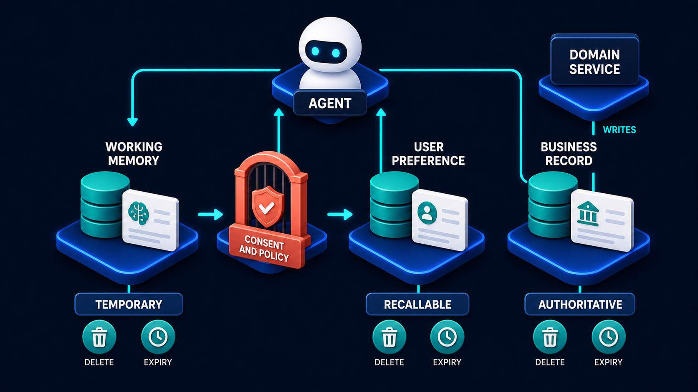

# Diagram 52 — Conversation State vs Workflow State

![Two horizontal lanes on dark navy. The upper lane, CONVERSATION STATE, holds CHAT HISTORY, CURRENT QUESTION, DISPLAY TEXT and a clock. The lower lane, WORKFLOW STATE, holds CASE ID, ACTION STATUS, RECEIPT, OWNER and a teal database. Between them sits an AGENT that READS BOTH LANES, with dashed cyan arrows reaching into each. The agent feeds a DOMAIN SERVICE, which WRITES BUSINESS TRUTH to the workflow lane along coral dashed arrows. At the right, a coral warning triangle reads CHAT IS NOT A DATABASE.](../diagrams/52-conversation-vs-workflow-state.png)

**Module:** Durable workflows
**Role in the course:** where each kind of state belongs
**Layout:** two parallel lanes with an agent reading both and a domain service writing to one

---

## At a glance

Two lanes. The top one holds what was **said**. The bottom one holds what is **true**. An agent reads both; a domain service writes only to the bottom one. And on the right, in coral, the diagram states its thesis in words: **CHAT IS NOT A DATABASE**.

The distinction sounds obvious and is violated constantly. Almost every agent system that becomes unmaintainable does so because business truth ended up in the conversation lane, where it cannot be queried, cannot be audited, and disappears when the conversation does.

---

## What the diagram teaches

### 1. The two lanes hold different kinds of thing, and the icons say so

**CONVERSATION STATE** — chat history, the current question, display text, and a **clock**.

The clock is the tell. Conversation state is **transient**. It has a lifetime, it ages, and it is allowed to be discarded. Nothing in the top lane is a system of record.

**WORKFLOW STATE** — a case ID, an action status, a receipt, an owner, and a **teal database**.

The database is the counterpart tell. Workflow state is **durable**. It persists, it is queryable, and it is the thing you consult to find out what happened.

Read the two lanes as answering different questions. The top lane answers *what did we say to each other?* The bottom lane answers *what is the state of this piece of work?*

### 2. The four workflow items are the minimum, and each is load-bearing

**CASE ID** — the identity. Without it there is no thing to have state about. Everything else attaches to this.

**ACTION STATUS** — where the work has got to. Not a chat message describing progress; a value you can query and report on.

**RECEIPT** — what actually happened, durably recorded. The evidence.

**OWNER** — who is responsible. The field most often omitted, and the one that determines whether stalled work is ever picked up.

A workflow state missing any of these has a characteristic failure. No case ID and you cannot correlate. No status and you cannot report. No receipt and you cannot audit. No owner and work sits forever because it is nobody's.

### 3. The agent reads both lanes, and reads is the operative word

The label on the agent's input is explicit: **READS BOTH LANES**. Dashed cyan arrows reach up into all three conversation items and down into the workflow items.

The agent needs both to function. Conversation state tells it what the user is asking and what has been discussed. Workflow state tells it what is actually true about the case.

But the agent's arrow to the domain service is the only thing it produces. **The agent does not write to either lane directly.** It reasons, and it proposes.

### 4. Only the domain service writes business truth, and that arrow is coral

The **DOMAIN SERVICE** — a teal gear — receives from the agent and sends **coral dashed arrows down into the workflow lane**, labelled **WRITES BUSINESS TRUTH**.

Two things about this.

The writes go **only downward**. Nothing writes to the conversation lane as a system of record, because the conversation lane is not one.

The arrows are **coral**, which throughout this library marks risk and consequence. Writing business truth is the consequential act in the picture, and the colour says so.

This is the frontend/backend lesson from Volume 2, applied to state rather than to code location: **the thing that decides is not the thing that talks.**

### 5. The warning is written out, and it deserves to be

**CHAT IS NOT A DATABASE**, in coral, beside a warning triangle, at full size.

The failure it names is specific. Teams store business facts in the conversation because it is where the facts first appeared. The user said their address changed; the address is now in the chat history; the chat history is the record.

What breaks:

- **You cannot query it.** "Which cases are awaiting approval?" has no answer if status lives in message text.
- **You cannot audit it.** A conversation is not evidence of a decision, and it has no defined structure.
- **It is not authoritative.** The same fact can appear three times with three values, and nothing says which is current.
- **It has a retention policy you did not choose.** Conversations get trimmed for context budget, and business truth goes with them.

That last one is how this usually surfaces: something worked for weeks and then stopped, because the conversation grew past the point where the early messages were still in context.

### 6. The lanes have different retention rules, and that is a design decision

Because the top lane is transient and the bottom durable, they can and should be governed differently.

Conversation state: short retention, trimmed under context pressure, deletable on user request without breaking anything.

Workflow state: retained per your business and regulatory requirements, never trimmed for convenience, deleted only under a defined policy.

Getting this backwards — retaining conversations for years because they contain business facts — is both a storage problem and a privacy problem.

The memory model applies the same split at a finer grain:

Working memory is the conversation lane's short-lived cousin; the business record is the workflow lane's authoritative store. The consent gate between them is the control this diagram does not draw.

---

## Case study — Wexford Mutual, the address that lived in a chat

Wexford is an insurance mutual with about 340,000 policyholders. They built a servicing assistant that handles policy changes: address updates, adding named drivers, changing payment dates, adjusting cover.

It worked well for four months and then produced an incident that took a fortnight to unpick.

### How business truth got into the conversation

The assistant's design held the case context in the conversation. A policyholder would say what they wanted, the assistant would confirm details, and the confirmed details lived in the message history.

When it came time to act, the assistant read back through the conversation to assemble what it needed and called the policy service.

This worked because conversations were short. Most servicing interactions are four or five exchanges.

### The incident

A policyholder called to update their address. Mid-conversation they also asked about adding a named driver, which involved a longer exchange about the driver's licence history and claims record. Then they returned to the address change and confirmed it.

The conversation had grown past the assistant's context budget. The trimming strategy dropped the oldest messages — which contained the **new address**.

The assistant, assembling the change, found an address in the remaining context: the **old** address, quoted back in a confirmation message the assistant had itself sent earlier.

It submitted a policy change setting the address to its existing value. The change was recorded as successful. The policyholder was told their address was updated. It was not.

Three months later their renewal documents went to the old address, which they had moved out of. They missed the renewal, the policy lapsed, and they had an at-fault accident eleven days later while uninsured.

### The investigation

Wexford could not initially establish what had happened, and the reason is the diagram's whole point.

There was **no case ID** — the interaction was a conversation, not a case.
There was **no action status** — nothing recorded that an address change had been requested and what state it was in.
There was **a receipt**, but it recorded the change that was submitted (address → same address), not the change that was requested.
There was **no owner** — nobody was responsible for the request because it was not a tracked thing.

Reconstructing it required pulling the raw conversation log from their chat storage and reading it, which took two days and only worked because the retention window had not yet elapsed. Had the incident surfaced a month later, the evidence would have been gone.

### The rebuild

**Every servicing request becomes a case at the moment it is identified.** The assistant's first job on recognising an intent is to create a case with an ID, a type, a status of `gathering`, and the policyholder as subject.

**Confirmed facts are written to the case, not left in the conversation.** When the policyholder confirms the new address, that value is written to the case's workflow state immediately. The conversation may be trimmed freely afterwards; the fact is durable.

**Status is a real field.** `gathering`, `awaiting_confirmation`, `submitted`, `applied`, `failed`, `abandoned`. Queryable. Their servicing team now has a dashboard of cases in each state, which did not previously exist because there was nothing to count.

**Owner is assigned.** For assistant-handled cases the owner is the assistant until it completes or escalates. Cases in `gathering` for more than 48 hours are reassigned to a human servicing agent. This alone surfaced 90 abandoned requests in the first month — people who had started a change and never finished it, invisible under the old design.

**The receipt records the request and the outcome.** Not just what was submitted, but what was asked for, so a mismatch between the two is detectable.

That last change is what would have caught the original incident at the moment it happened. Requested: new address. Submitted: unchanged address. Those differ, and the system now refuses to record such a change as successful.

### The retention change

Conversations are now retained for 30 days. Cases are retained for seven years per their regulatory requirement.

Previously, because conversations contained business truth, they were being retained for seven years — which meant Wexford was holding the full text of 340,000 policyholders' conversations for regulatory reasons that only applied to the facts inside them.

Separating the lanes let them retain what they had to and delete what they did not.

### The cost of the incident

Wexford covered the uninsured accident claim — about £47,000 — on the basis that their system had told the policyholder a change had been made when it had not. They also reported the incident to their regulator.

The rebuild took seven weeks.

### The rule now in their engineering standards

*If losing it would matter, it does not live in the conversation.*

---

## Composition

Two horizontal lanes on wide platforms, with an agent and a domain service between them.

**Upper lane — CONVERSATION STATE:** four items connected by cyan arrows — **CHAT HISTORY**, **CURRENT QUESTION**, **DISPLAY TEXT**, and a **clock**.

**Lower lane — WORKFLOW STATE:** five items connected by cyan arrows — **CASE ID**, **ACTION STATUS**, **RECEIPT**, **OWNER**, and a **teal database stack**.

**Centre:** a teal **READS BOTH LANES** label with dashed cyan arrows reaching up into three conversation items and down into two workflow items, feeding a teal **AGENT** tile, which sends a cyan arrow to a teal **DOMAIN SERVICE** gear. From the domain service, **coral dashed arrows** descend into the workflow lane, via a coral **WRITES BUSINESS TRUTH** tile.

**Right:** a large **coral warning triangle** beside **CHAT IS NOT A DATABASE** in coral capitals.

## Element by element

**CHAT HISTORY** — a white card with teal bullet rows.
**CURRENT QUESTION** — a white card with a teal question-mark bubble.
**DISPLAY TEXT** — a white card with a teal content block.
**Clock** — a blue analogue clock, marking the lane as transient.

**CASE ID** — a white card with a teal **ID** tile.
**ACTION STATUS** — a white card with a **teal check disc**.
**RECEIPT** — a white card with a teal receipt icon.
**OWNER** — a white card with a teal person icon.
**Database** — a teal stacked cylinder, marking the lane as durable.

**AGENT** — a teal rounded tile with a white person glyph.
**DOMAIN SERVICE** — a teal cube with a white gear.
**WRITES BUSINESS TRUTH** — a coral rounded tile.

## Colour and flow semantics

- **Solid cyan arrows** run along each lane, carrying the sequence within it.
- **Dashed cyan arrows** carry the agent's reads — dashed because reading does not change anything.
- **Coral dashed arrows** carry the domain service's writes, marking them as the consequential act.
- The **clock** and the **database** are the two lane-defining icons: transient versus durable.
- The **coral warning** is the only text statement in the diagram.

## How to present it

**Ask where a confirmed fact goes.** A user tells your assistant their new address. Where does that value live between the moment they say it and the moment it is applied? In most first-draft systems the honest answer is "in the conversation."

**Point at the clock and the database.** Two lanes, two lifetimes. Then ask what happens to the top lane under context pressure — it gets trimmed. Ask what happens to business truth that lives there.

**Tell the Wexford incident in order.** Long conversation, trimming drops the new address, assistant finds the old address in its own earlier confirmation message, submits a no-op change, reports success. Then the three-month gap and the uninsured accident.

**Ask what would have caught it.** Push toward the receipt recording *both* the request and the outcome, so that requested ≠ submitted is detectable. That is a small change and it is the one that closes this specific failure.

**Walk the four workflow fields and ask what breaks without each.** No case ID, no correlation. No status, no reporting. No receipt, no audit. No owner, work sits forever. The owner one usually gets underrated — Wexford's 48-hour reassignment surfaced 90 abandoned requests nobody knew about.

**Ask who writes.** Only the domain service, and only downward. The agent reads both lanes and proposes. Connect it to the frontend/backend boundary from Volume 2 — the thing that talks is not the thing that decides.

**Raise the retention angle.** Wexford was retaining 340,000 conversations for seven years because business facts were inside them. Separating the lanes let them delete conversations at 30 days. This lands well with anyone who has a privacy or storage-cost concern.

**Leave them the rule.** *If losing it would matter, it does not live in the conversation.*

**Timing.** Twenty-five minutes. Thirty-five if you sort the room's own state into the two lanes, which usually finds at least one fact in the wrong place.

---

## Lab and checkpoint

**Lab:** Pick one business fact that currently lives only in a chat history or conversation transcript in your system. Move it to workflow state by defining a case ID, action status, receipt, and owner. Then write the rule for who can write to workflow state and the retention policy for each lane.

**Checkpoint:** Why is chat not a database?

**Answer:** Because chat history is transient. It can be trimmed, lost, or deleted. If a business fact lives only in the conversation, it can disappear when context is reduced, and the system cannot reconstruct what happened.

## Glossary

- **Business truth** — a durable, consequential fact that must survive the conversation.
- **Case ID** — the identifier that lets the system correlate a request with its lifecycle.
- **Conversation state** — transient information such as chat history, current question, and display text.
- **Display text** — the text shown to the user, part of conversation state.
- **Domain service** — the only component that writes business truth to workflow state.
- **Owner** — the person or system responsible for seeing a workflow item through.
- **Receipt** — the durable record of a requested and an actual outcome.
- **Workflow state** — durable information such as case ID, action status, receipt, and owner.

## Sources

- Chat and workflow separation in agent systems
- Durable state and conversation lifecycle design
- Data retention and privacy-by-design for chat history
