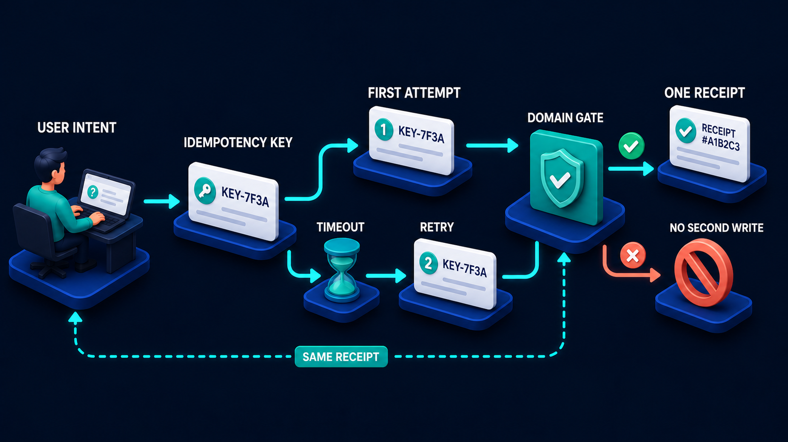

# Diagram 53 — Checkpoint and Resume

![A workflow on dark navy running left to right — START with a teal play disc, STEP 1 with a checked card, CHECKPOINT A as a teal bookmark diamond, STEP 2 with a checked card, CHECKPOINT B as a second bookmark diamond, and COMPLETE with a teal trophy. A coral arrow drops from STEP 2 to CRASH, a red warning triangle. Below, a dashed cyan box holds CHECKPOINT A and CHECKPOINT B cards above a blue database. A cyan line runs from that store to RESUME, a teal refresh disc, which rises back into COMPLETE.](../diagrams/53-checkpoint-and-resume.png)

**Module:** Durable workflows
**Role in the course:** surviving a crash mid-workflow
**Layout:** a linear workflow with interleaved checkpoints, a crash branch, and a resume path from a checkpoint store

---

## At a glance

A workflow with **checkpoints between the steps**, a crash partway through, and a resume that reads the last checkpoint from a durable store and carries on.

The structure is the lesson. Checkpoints are not decoration on a workflow — they are **alternating with the steps**, drawn as their own stages with their own platforms. Work, save, work, save. The store beneath is what makes the crash survivable.

---

## What the diagram teaches

### 1. Checkpoints are stages, not side effects

**CHECKPOINT A** and **CHECKPOINT B** each get a numbered position in the sequence, their own platform, and a distinctive shape — **teal bookmark diamonds**, visually different from the white step cards.

That treatment says a checkpoint is a deliberate act with a cost, not something that happens automatically. You choose where they go, and each one is a write.

The alternating rhythm — step, checkpoint, step, checkpoint — is the design pattern. After each unit of work that would be expensive or unsafe to repeat, you record enough to avoid repeating it.

### 2. A checkpoint records state, not progress

This is the distinction that separates a working checkpoint from a useless one.

A **progress marker** says "step 2 finished." On resume you know where you were and nothing else, so you must reconstruct everything step 2 produced.

A **checkpoint** says "here is the state after step 2." On resume you load it and continue.

The bookmark icon is apt for the first reading and slightly misleading for the second, so it is worth saying out loud when teaching: what is stored is the workflow's state at that point, not merely a position in a list.

Practically, a checkpoint needs to contain: what has been established, what side effects have been performed, what identifiers were issued, and what remains to be done.

### 3. The store is drawn separately and below, and that is the whole point

The **dashed cyan box** beneath the workflow holds both checkpoint cards above a **blue database**.

Separately, because the checkpoints must survive the thing that crashed. A checkpoint held in the process's memory is lost with the process. The store has to be somewhere else — a database, a durable queue, a workflow engine's own persistence.

Below, because it sits underneath the whole workflow rather than at any one point in it. All checkpoints go to the same place, and the resume path reads from it.

The dashed boundary groups them as one facility rather than two separate saves.

### 4. The crash comes out of a step, never out of a checkpoint

The **coral arrow to CRASH** leaves **STEP 2**.

That placement is deliberate and it reflects reality: crashes happen during work. A checkpoint is a short write; a step may be a long operation involving external calls, and it is where the process is most likely to be interrupted.

It also means the crash occurs **after checkpoint A was saved**, which is what makes recovery possible at all. Everything up to A is safe.

### 5. Resume enters at the point after the last checkpoint, not at the start

Follow the recovery path: from the store, a cyan line runs right to **RESUME** — a teal refresh disc — and from there **upward into COMPLETE**.

It does not go back to **START**. That is the property checkpointing buys.

For workflows with expensive steps this is the difference between a recoverable failure and an unaffordable one. A workflow with a forty-minute step that restarts from the beginning after a crash at minute thirty-nine has no meaningful recovery.

For workflows with **side effects** it is more than a cost question. Restarting from the beginning means re-performing steps that already changed something. Resuming from a checkpoint means those steps are known to be done.

### 6. Checkpoint placement is a real design decision with a cost

The diagram shows two checkpoints for two steps. That density is a choice.

**More checkpoints** mean less lost work per crash, more writes, and more storage.
**Fewer checkpoints** mean cheaper normal operation and more repeated work when something fails.

The useful heuristic: **checkpoint after anything you cannot cheaply or safely repeat.** An external call that costs money. A write that changed something. A computation that took minutes. A point where an identifier was issued that must not be issued twice.

Steps that are cheap and idempotent do not need a checkpoint after them, because repeating them is harmless.

### 7. Resume and retry are not the same thing

Worth separating explicitly, because they get conflated.

**Retry** re-attempts an operation that failed, from its own beginning.
**Resume** continues a workflow from a known state, skipping what is already done.

A workflow can do both: resume to the point after checkpoint A, then retry step 2. What it must not do is retry the whole workflow, which is what happens when there are no checkpoints.

And resuming safely requires knowing what step 2 had already done before it crashed — which is where the idempotency machinery comes in:

---

## Case study — Aldergate Registrars, the share transfer that ran twice

Aldergate provides share registry services to about 200 listed and private companies — maintaining shareholder records, processing transfers, and running corporate actions like dividends and rights issues.

A share transfer is a multi-step workflow: verify the transferor holds the shares, check for restrictions, calculate stamp duty, take payment, update the register, issue certificates, notify the company, and file with the relevant authority.

Eight steps, several of them irreversible, and the whole thing takes between two and twenty minutes depending on external service response times.

### The failure

A deploy went out during business hours. Forty-one transfer workflows were in flight. All forty-one processes were terminated mid-execution.

Their recovery procedure was to re-run failed transfers. There were no checkpoints, so re-running meant re-running from step one.

Of the forty-one, **nineteen had already taken payment** before being killed. Re-running took payment again.

Of those nineteen, **six had already updated the register**. Re-running attempted a second transfer of shares that had already moved, which their register service correctly rejected — leaving six workflows that could not complete and six shareholders whose records were in an indeterminate state.

**Three had already filed with the authority.** Duplicate filings had to be withdrawn, which is a manual process taking several days per filing and which is visible to the regulator.

### Why re-running from the start seemed reasonable

The team's model was that a failed workflow had not done anything, because it had not completed.

That is true for a workflow with no side effects until the end. It is false for any workflow that touches external systems partway through, which is most of them.

They had no way to know what each of the forty-one had done, because nothing had been recorded between steps.

### The rebuild

**Checkpoints after every step with an external side effect.** Not after every step — after every step that changed something outside the workflow.

Their eight steps produced five checkpoints:

- After stamp duty calculation (expensive, involves an external rate service, no side effect — checkpointed for cost, not safety).
- After payment taken. **Critical.**
- After register updated. **Critical.**
- After certificates issued.
- After authority filing. **Critical.**

Steps with no external effect — verification and restriction checks, which are reads — have no checkpoint after them because repeating them is free and harmless.

**Each checkpoint records state, not position.** The payment checkpoint stores the payment reference, the amount, the timestamp, and the payment provider's transaction ID. On resume, the workflow knows payment is done *and has the reference*, so it does not need to query the provider to find out.

**Resume is the default recovery, not re-run.** When a workflow is found in a non-terminal state with no active process, it resumes from its last checkpoint. Re-running from the start requires explicit human authorisation and is used only when a checkpoint is corrupt.

**The store is their primary database**, in the same transaction boundary as the workflow's own records. A checkpoint that is written but not durable is worse than none, because it creates false confidence.

### The deploy that tested it

Nine months later, another deploy during business hours — this time deliberate, as a test — terminated 28 in-flight transfers.

All 28 resumed. Twelve had taken payment; none took it again. Four had updated the register; none attempted it again. Two had filed; neither re-filed.

Total manual intervention: zero. Median additional time to completion: 90 seconds.

### The checkpoint they got wrong first

Their initial implementation checkpointed **after** the authority filing but recorded only that the filing had been submitted, not the filing reference the authority returned.

On the first real resume, the workflow knew filing was done, could not prove it, and could not proceed to the completion step which required the reference.

Two workflows stalled and needed manual lookup against the authority's portal.

The lesson they wrote down: **a checkpoint must contain everything the remaining steps need.** Recording that something happened is not enough if the next step needs what it produced.

### Results

- **Duplicate payments from workflow restarts:** 19 in the incident, 0 since.
- **Duplicate authority filings:** 3 in the incident, 0 since.
- **Deploys during business hours:** previously forbidden, now routine.
- **Manual intervention on interrupted workflows:** effectively eliminated.

---

## Composition

A workflow running left to right across the upper portion of the frame, with a crash branch and a recovery path below.

**START → STEP 1 → CHECKPOINT A → STEP 2 → CHECKPOINT B → COMPLETE**, connected by cyan arrows.

A **coral arrow** drops from **STEP 2** to **CRASH**. A **dashed cyan line** drops from **CHECKPOINT A** into a **dashed cyan box** containing both checkpoint cards above a **blue database**. A **cyan line** runs from that box right to **RESUME**, which sends a cyan arrow up into **COMPLETE**.

## Element by element

**START** — a **teal disc with a white play triangle**.

**STEP 1** and **STEP 2** — white cards with a **teal check tile** and text lines. Ordinary units of work.

**CHECKPOINT A** and **CHECKPOINT B** — **teal diamonds carrying a white bookmark**. Visually distinct from the step cards, marking them as a different kind of stage.

**COMPLETE** — a **teal disc with a white trophy**.

**CRASH** — a **red warning triangle** with a white exclamation, on a blue platform, reached by the only coral arrow.

**The checkpoint store** — a **dashed cyan boundary** enclosing two white cards labelled **CHECKPOINT A** and **CHECKPOINT B**, each with a teal bookmark tile, above a **blue stacked database**.

**RESUME** — a **teal disc with a white circular-refresh arrow**.

## Colour and flow semantics

- **Cyan arrows** carry the main workflow and the recovery path.
- **Coral** appears once, on the crash branch.
- **Teal** distinguishes the workflow's own control points — start, checkpoints, resume, complete — from the white work cards.
- The **dashed cyan boundary** groups the checkpoint store as one durable facility separate from the running workflow.
- **RESUME rises into COMPLETE**, not into START, which is the diagram's central structural claim.

## How to present it

**Ask what happens to in-flight work when a process dies.** Most rooms say it fails and gets retried. Then ask what "retried" means — from where?

**Tell the Aldergate incident with the numbers.** Forty-one workflows, nineteen duplicate payments, six broken register states, three duplicate regulatory filings. Then ask why re-running from the start seemed reasonable. Because the team believed an incomplete workflow had done nothing.

**Ask what a checkpoint should contain.** Push past "where we got to" to "the state at that point." Then give them Aldergate's second mistake: a filing checkpoint that recorded *that* the filing happened but not the reference the next step needed. A checkpoint must contain everything the remaining steps require.

**Ask where checkpoints go.** Build the heuristic with them: after anything you cannot cheaply or safely repeat. External call that costs money, a write that changed something, a long computation, an identifier that must not be issued twice. Then ask which of their steps are cheap and idempotent — those need nothing.

**Point at where the crash arrow originates.** Out of a step, not a checkpoint. Crashes happen during work. And it happens *after* checkpoint A, which is what makes recovery possible.

**Trace the resume arrow with your finger.** Store → resume → **complete**, not → start. Then ask what a forty-minute step means for a workflow with no checkpoints.

**Separate resume from retry.** Resume continues from known state; retry re-attempts one operation. A workflow can do both. What it must not do is retry the whole thing.

**Ask where the store lives.** If the answer is "in memory" or "in the process," it does not survive the thing it exists to survive. Aldergate put checkpoints in the same transaction boundary as the workflow's records.

**Close with the deploy question.** Aldergate went from forbidding business-hours deploys to running them routinely. Ask what the room's deploy policy currently is, and whether it is a policy or a workaround.

**Timing.** Twenty-five minutes. Thirty-five if you place checkpoints on one of the room's own workflows, which is where the "which steps have side effects" discussion earns its keep.

---

## Lab and checkpoint

**Lab:** Choose one multi-step workflow in your system. Identify which steps have side effects that cannot be cheaply or safely repeated. Place checkpoints after each such step and define what state each checkpoint must contain so the workflow can resume. Then write the resume rule and the test that would crash a step and prove recovery works.

**Checkpoint:** What is the difference between resume and retry?

**Answer:** Resume continues the workflow from the last known checkpoint state. Retry re-attempts a single failed operation. A workflow can resume from a checkpoint and then retry a step, but it must not retry the whole workflow from the start.

## Glossary

- **Checkpoint** — a durable bookmark containing the state needed to continue a workflow.
- **Checkpoint store** — the durable facility that holds checkpoint state outside the running process.
- **Complete** — the terminal state where the workflow finishes successfully.
- **Crash** — a failure during a step, after which the workflow can resume from the last checkpoint.
- **Resume** — continuing the workflow from a checkpoint, not from the start.
- **Retry** — re-attempting a single operation that failed.
- **Side effect** — an action that changes state and cannot be safely repeated.
- **Workflow** — a multi-step process with defined checkpoints.

## Sources

- Workflow checkpoint and resume patterns
- Durable workflow engines and saga patterns
- Idempotency and crash recovery in long processes
