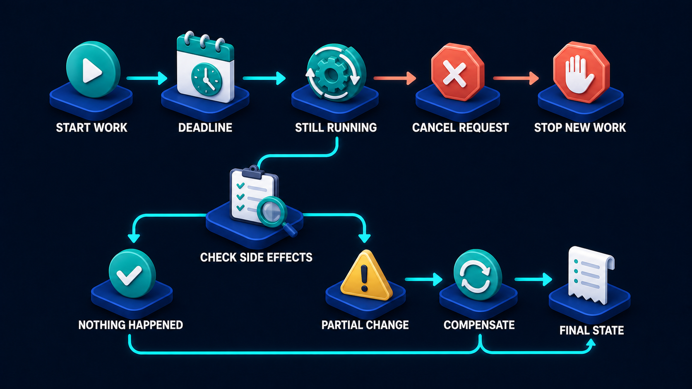

# Diagram 54 — Retry and Idempotency

![A flow on dark navy. USER INTENT shows a person at a laptop. IDEMPOTENCY KEY shows a white card reading KEY-7F3A with a teal key icon. Two branches leave it — an upper path to FIRST ATTEMPT, a card numbered 1 reading KEY-7F3A, and a lower path through TIMEOUT, a teal hourglass, to RETRY, a card numbered 2 reading KEY-7F3A. Both reach DOMAIN GATE, a teal shield. A green check leads to ONE RECEIPT reading RECEIPT #A1B2C3. A coral arrow leads to NO SECOND WRITE, a red prohibition sign. A dashed teal line labelled SAME RECEIPT returns to the user.](../diagrams/54-retry-and-idempotency.png)

**Module:** Durable workflows
**Role in the course:** making retries safe
**Layout:** one intent, two attempts carrying the same key, one gate, one receipt

---

## At a glance

One user intent produces **one key**. Two attempts carry **the same key**. One gate lets the first through and refuses the second. One receipt exists at the end, and both attempts get it back.

The key value is written on the picture — **KEY-7F3A** — and it appears three times: on the key card, on attempt 1, and on attempt 2. That repetition is the whole mechanism made visible.

---

## What the diagram teaches

### 1. The key is derived from the intent, before any attempt

Look at the order. **USER INTENT → IDEMPOTENCY KEY → attempts.**

The key is generated once, from the intent, and *then* the attempts branch off it. It is not generated per attempt.

This is the single most common implementation error. A retry that generates a fresh key is not a retry as far as the receiving system is concerned — it is a new request, and it will be processed as one. The whole mechanism collapses.

The key belongs to **what the user wanted**, not to **how many times you tried to deliver it**.

### 2. Both attempt cards carry the same value, and they are numbered

Attempt **1** and attempt **2**, both reading **KEY-7F3A**.

The numbering distinguishes them as separate deliveries. The identical key value says they are the same operation.

That combination — different attempts, same identity — is exactly what an idempotency key expresses. It gives the receiving system the ability to say "I have seen this before" about something it has genuinely never received before *in this form*, arriving on a different connection, possibly at a different instance, minutes later.

### 3. The timeout is on the path, not at the end

The lower branch runs **IDEMPOTENCY KEY → TIMEOUT → RETRY**, with a teal hourglass.

The timeout sits *between* the intent and the retry, which places it correctly: the timeout is what *caused* the retry. It is not a failure outcome; it is the trigger for a second attempt.

And critically, a timeout means the caller does not know what happened. The first attempt may have succeeded, failed, or never arrived. This is the unknown-side-effect category from Volume 2, and it is the situation idempotency exists to make safe.

### 4. One gate, two outcomes, and they are asymmetric

The **DOMAIN GATE** — a teal shield — receives both attempts and produces two different results.

**Green check → ONE RECEIPT** carrying **RECEIPT #A1B2C3**. The first attempt performed the work and produced a receipt with its own identity.

**Coral arrow → NO SECOND WRITE**, a red prohibition sign. The second attempt did not perform the work.

The asymmetry is the point: same input, different behaviour, determined entirely by whether the gate has seen the key before.

Note where the gate sits — at the **domain**, not at the transport or the gateway. Only the thing that owns the write can guarantee the write happens once. A deduplication cache in front of a service is a performance optimisation, not a correctness guarantee.

### 5. SAME RECEIPT is the most important label in the diagram

The dashed teal line along the bottom carries a teal-tiled label: **SAME RECEIPT**, returning to the user.

This is the detail that separates a working implementation from a broken one.

A retry that hits a known key must return **the original result** — not an error, not a conflict, not a bare acknowledgement. The caller retried precisely because they did not know the outcome. Returning an error leaves them still not knowing, and likely to retry again.

Returning the original receipt answers the actual question: *what happened to my request?* It happened, here is the receipt, here is the reference.

The label sits on the return path rather than at either end because it applies to both attempts. Both callers get the same answer.

### 6. The receipt has its own identity, and that matters

**RECEIPT #A1B2C3** — a different identifier from the key.

Two identities, two purposes. The **key** identifies the intent and is chosen by the caller. The **receipt** identifies the outcome and is issued by the domain.

Keeping them distinct means the caller can reference the receipt in downstream systems, in support conversations, and in reconciliation — without exposing or depending on their own internal key format.

### 7. What the key must be derived from

The diagram shows a key but not its construction, which is where implementations go wrong.

A good key is derived from the **stable, meaningful facts of the intent**: the entity being acted on, the nature of the action, the amount or payload that matters, and the authorisation that permitted it.

It must not include anything that varies between attempts — no timestamps, no attempt counters, no random values, no request IDs.

And it needs a **retention window**. A key remembered for 60 seconds protects against network retries. One remembered for 24 hours protects against a user clicking again after lunch. Choose deliberately; the right answer depends on how the duplicate could plausibly arise.

---

## Case study — Halloway Energy, the direct debit that ran twice

Halloway supplies gas and electricity to about 210,000 domestic customers. They collect by direct debit, and their billing agent submits collection instructions to their payment provider on a monthly cycle.

### The night it went wrong

Their payment provider had a 40-minute degradation. Requests were being received and processed; responses were timing out.

Halloway's submission code retried on any exception, three times, with a five-second gap.

During the window, 3,400 collection instructions timed out. All were retried. Nearly all of the originals had been processed.

**3,180 customers were debited twice.** Amounts ranged from £31 to £340. Total duplicate collection: about £412,000, taken overnight from domestic bank accounts.

### The consequences

By 09:00 the following morning their contact centre had received 900 calls. By midday, 2,400.

**Four hundred and eleven customers went overdrawn.** Halloway covered the bank charges, which came to about £9,400, and made goodwill payments to 180 customers who had incurred further consequences — failed standing orders, declined card payments.

Refunds were processed within three working days. The regulator was notified. Local and then national press covered it.

### Why the code did it

There was no idempotency key. Each submission was a fresh instruction with no identifier connecting it to the collection it represented.

From the payment provider's side, the retry was indistinguishable from a second legitimate collection. There was nothing to compare against.

The error handling also treated a timeout as a temporary failure rather than as an unknown outcome — the distinction that determines whether retrying is safe:

That diagram's **CHECK SIDE EFFECTS** stage is the correct response to a timeout: go and find out what happened. Halloway's handler skipped it and retried instead.

### The rebuild

**Keys derived from the collection itself.** The key is a hash of the account number, the billing period, the amount in pence, and the collection schedule ID. Same collection, same key, however many times it is submitted.

Critically, it contains **no timestamp and no attempt counter**. Their first draft included a submission timestamp, which meant every retry produced a different key and the mechanism did nothing. This was caught in testing by deliberately timing out a submission and observing that it went through twice.

**Retention set to 30 days**, covering the full billing cycle. A duplicate submission arising from an operator re-running a batch a fortnight later is still caught.

**The provider returns the original.** On a known key, the payment provider returns the original collection object with a duplicate-suppressed flag. Halloway's code records it and moves on. It does not error, which means the retry loop terminates cleanly.

**Timeouts reclassified.** A timeout no longer triggers a retry. It triggers a status query against the key. If a collection exists, record it. If not, submit.

**Reconciliation an hour after every run**, comparing Halloway's receipts against the provider's records, with discrepancies reported before customers see them.

### The following year

Their provider had a longer degradation — about 90 minutes — during a collection run.

The code encountered 5,900 timeouts. It retried none of them. It queried by key for all of them, found 5,610 already collected, and submitted 290.

**Zero duplicate collections.** The incident produced a log file and no customer impact. Nobody outside the platform team noticed.

### What their finance director said afterwards

*The £412,000 came back. The nine thousand in bank charges came back. What did not come back was about fifteen thousand customers who now check their bank statement the day after we collect.*

---

## Composition

A left-to-right flow that splits into two attempt paths and reconverges at a gate.

**USER INTENT → IDEMPOTENCY KEY**, then two branches: an upper cyan arc to **FIRST ATTEMPT**, and a lower cyan arc through **TIMEOUT** to **RETRY**. Both send cyan arrows into **DOMAIN GATE**.

From the gate, a **green check** leads right to **ONE RECEIPT**; a **coral arrow** leads down-right to **NO SECOND WRITE**.

Along the base, a **dashed teal line** carrying a teal **SAME RECEIPT** tile runs from the gate area leftward and up into **USER INTENT**.

## Element by element

**USER INTENT**
A person seated at a laptop showing a teal question mark.

**IDEMPOTENCY KEY**
A white card with a **teal key icon** and the text **KEY-7F3A**.

**FIRST ATTEMPT**
A white card with a **teal numeral 1** badge and the text **KEY-7F3A**.

**TIMEOUT**
A **teal hourglass** on a blue platform, positioned between the key and the retry.

**RETRY**
A white card with a **teal numeral 2** badge and the text **KEY-7F3A**.

**DOMAIN GATE**
A large **teal shield with a white check**, receiving both attempts.

**ONE RECEIPT**
A white card with a **teal check disc** reading **RECEIPT #A1B2C3**.

**NO SECOND WRITE**
A **red circular prohibition sign** on a blue platform, reached via a small red ✗ badge and a coral arrow.

**SAME RECEIPT**
A teal rounded tile on the dashed return line.

## Colour and flow semantics

- **Cyan arrows** carry both attempts forward to the gate.
- **Green** marks the successful write path; **coral** marks the suppressed duplicate.
- **Teal** marks the key, the hourglass, the attempt badges, the gate, the receipt check, and the return label.
- The **dashed teal return** is a result path, not a failure path, and it serves both attempts.
- **KEY-7F3A appearing three times** is the diagram's central device.

## How to present it

**Point at the three places the key value appears.** Same string on the key card, on attempt 1, and on attempt 2. Ask what that means. One intent, two deliveries, one identity.

**Ask where the key is generated.** From the intent, before the attempts, once. Then ask what happens if a retry generates a fresh key — the mechanism does nothing. Halloway's first draft included a timestamp and was caught in testing.

**Ask what a timeout means.** Push past "it failed" to "you do not know." Then place it on the diagram: the hourglass is between the intent and the retry, so it is the cause of the retry rather than an outcome.

**Ask what the gate returns to attempt 2.** Most rooms say an error or a conflict. Then point at **SAME RECEIPT** and ask why that is better. The caller retried because they did not know the outcome; an error leaves them still not knowing, and likely to retry again.

**Ask where the gate sits.** At the domain. A dedupe cache in front of a service is a performance optimisation, not a correctness guarantee — only the thing that owns the write can guarantee it happens once.

**Build the key-derivation rule with them.** Entity, action, payload, authorisation. Then ask what must *not* be in it: timestamps, attempt counters, random values, request IDs. This is where implementations break.

**Ask about the window.** Sixty seconds protects against network retries. Twenty-four hours protects against a user clicking again after lunch. Thirty days protects against an operator re-running a batch. Halloway needed the third.

**Tell the Halloway incident with the human number.** 3,180 customers debited twice, 411 overdrawn, £412,000 taken overnight from domestic accounts. Then the following year: 5,900 timeouts, zero duplicates, nobody noticed. Same infrastructure failure, entirely different outcome.

**Timing.** Twenty minutes. Thirty if you derive keys for one of the room's own write operations, which is where the timestamp mistake usually surfaces.

---

## Lab and checkpoint

**Lab:** Pick one write operation in your system and design an idempotency key for it. Derive the key from entity, action, payload, and authorisation — and explicitly exclude timestamps, attempt counters, random values, and request IDs. Write the retry rule, the deduplication window, and the test that proves a second identical request returns the same receipt without a second write.

**Checkpoint:** Why must the idempotency gate sit at the domain, not just in front of the service?

**Answer:** Because a dedupe cache in front of the service is a performance optimisation, not a correctness guarantee. Only the thing that owns the write can guarantee the operation happens once. The domain gate is the authoritative place to refuse a duplicate.

## Glossary

- **Deduplication window** — the time window during which a duplicate key is recognised and refused.
- **Domain gate** — the authoritative service layer that owns the write and enforces idempotency.
- **Idempotency key** — a unique identifier derived from the intent, used to recognise duplicate attempts.
- **Key derivation** — the rule for building the idempotency key from stable inputs.
- **Receipt** — the durable record returned for both attempts, showing the write happened once.
- **Retry** — a repeated attempt due to uncertainty about the outcome of the first.
- **Timeout** — a failure to get a response, which causes uncertainty and triggers a retry.

## Sources

- Idempotency keys and duplicate-operation prevention
- Distributed write safety and at-least-once delivery
- Domain-driven deduplication and receipt patterns
