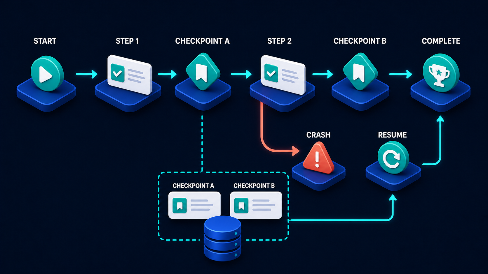

# Diagram 56 — Timeout, Cancel, and Compensate

![A flow on dark navy. The top row runs START WORK with a teal play disc, DEADLINE with a calendar and clock, STILL RUNNING with a teal gear and circular arrows, then two coral arrows to CANCEL REQUEST, a red octagon with a cross, and STOP NEW WORK, a red octagon with a raised palm. Below, a cyan line drops from STILL RUNNING to CHECK SIDE EFFECTS, a clipboard with a magnifier, which branches left to NOTHING HAPPENED, a teal check, and right to PARTIAL CHANGE, an amber warning triangle, then to COMPENSATE with teal circular arrows and FINAL STATE, a white receipt. A cyan line runs along the bottom joining both branches into the final state.](../diagrams/56-timeout-cancel-and-compensate.png)

**Module:** Durable workflows
**Role in the course:** stopping work that has already changed something
**Layout:** a deadline path leading to cancellation, with a side-effect investigation branching to two outcomes

---

## At a glance

Work runs past its deadline. A cancel request goes out, new work stops — and then the diagram does the thing most cancellation designs omit: it **checks what already happened**.

Two outcomes. **NOTHING HAPPENED**, in which case you are done. **PARTIAL CHANGE**, in which case you must **COMPENSATE** — actively undo or offset what was already done — before you can honestly record a final state.

Cancelling is not the same as nothing having occurred, and the bottom half of this picture is about the gap between the two.

---

## What the diagram teaches

### 1. Cancel stops new work; it does not undo old work

The top row ends with two coral stages: **CANCEL REQUEST** and **STOP NEW WORK**.

The second label is precise and it is doing the work. Cancellation is a **forward-looking instruction**: do not start anything else. It says nothing about what has already been started, completed, or committed.

That distinction is where most cancellation bugs live. A team implements cancel, sees the process stop, and assumes the state is clean. It is clean only if the work had no side effects — which for anything worth cancelling is rarely true.

### 2. The deadline is a stage, and it is what triggers everything

**DEADLINE** sits between starting and still-running, drawn as a calendar with a clock.

Making it a stage says a deadline is a property the work carries, not a timeout on the caller's side. There is a difference:

- **A caller-side timeout** means the caller gives up. The work continues, unobserved.
- **A work-side deadline** means the work itself knows when it has run too long, and something can act on it.

The second is what allows the cancel request in the next stage to be meaningful. You cannot cancel work you have stopped watching.

### 3. STILL RUNNING is the branch point, and it goes two ways

Look at where the arrows leave **STILL RUNNING**. One coral path continues right to cancellation. One cyan path drops down to **CHECK SIDE EFFECTS**.

Both happen. The cancel request stops further work; the side-effect check establishes what the work did before it stopped.

Drawing them as separate paths from the same stage is correct — they are concurrent concerns, not sequential steps. You issue the cancel and you investigate.

### 4. Check side effects is the stage that makes this honest

A clipboard with a magnifier, in the centre of the frame, receiving from still-running and branching to two outcomes.

This is the diagram's centrepiece and it is the stage that separates a real cancellation design from a hopeful one. The question it asks: **what did this work actually do before we stopped it?**

Answering it requires that the work left evidence. A workflow that performed three external calls and recorded nothing about them cannot answer this question, and its cancellation is a guess.

This is where receipts and checkpoints earn their cost:

A checkpointed workflow can answer the side-effect question by reading its own checkpoints. An unrecorded one has to interrogate every external system it might have touched.

### 5. Two outcomes, and they are coloured differently for a reason

**NOTHING HAPPENED** — a **teal check disc**. The work was cancelled before it changed anything. Clean stop, nothing to do.

**PARTIAL CHANGE** — an **amber warning triangle**. Something was done. Not a failure — the work performed correctly up to the point it was stopped — but a state that needs attention.

Amber rather than coral is a considered choice. A partial change is not an error; it is an incomplete but valid intermediate state that now requires deliberate handling. The coral in this diagram is reserved for the cancellation instruction itself.

### 6. Compensate is an action, not a rollback

**COMPENSATE** shows **teal circular arrows** — a cycle, an active operation.

The word matters. Many side effects cannot be rolled back:

- A payment taken can be refunded, not un-taken.
- An email sent can be followed by a correction, not unsent.
- A record created can be marked void, not un-created.
- An external filing submitted can be withdrawn, which is itself a filing.

**Compensation is forward motion that offsets a prior effect**, not reversal. Each compensating action is a real operation with its own possibility of failure, its own audit trail, and sometimes its own cost.

Designing compensation means, for each side effect a workflow can produce, knowing the specific action that offsets it. That is domain work, not infrastructure work, and it cannot be added generically afterwards.

### 7. Both branches converge on a final state, and the final state is a receipt

The cyan line along the bottom joins both outcomes into **FINAL STATE**, drawn as a **white receipt**.

Both paths produce a record. "Nothing happened" is a finding worth recording as much as "we compensated for two partial changes." The receipt is the durable answer to the question someone will ask later: *what state did this end up in?*

A cancellation that leaves no record is a cancellation nobody can verify.

---

## Case study — Sherbourne Travel, the itinerary cancelled halfway

Sherbourne is a corporate travel manager handling about 4,000 bookings a month for around 300 client companies. A trip booking is a multi-part workflow: flights, hotel, rail transfer, car hire, and travel insurance, each with a different supplier.

A booking takes between 90 seconds and 6 minutes depending on how many components and how responsive the suppliers are.

### What happened

A booker started a five-component itinerary for a client executive. Two minutes in, the executive's meeting was cancelled and the booker clicked cancel.

The system stopped. The booking showed as cancelled. Everyone moved on.

**Three things had already been committed:** the flight was ticketed, the hotel was confirmed with a non-refundable rate, and the insurance policy had been issued.

Nobody knew, because the cancel had stopped the workflow and recorded it as cancelled without asking what had been done.

### How it surfaced

Six weeks later, at month-end reconciliation. Sherbourne's finance team found three supplier invoices with no corresponding booking.

By then:

- The **flight** was past its free-cancellation window. Change fee plus fare difference: £680, unrecoverable.
- The **hotel** rate was non-refundable and the date had passed. £1,240.
- The **insurance** policy had been live for six weeks covering a trip that did not happen. Refundable, but only pro-rata: £90 of £310 recovered.

Total unrecoverable: about £2,140 on one cancelled booking.

An audit of the previous nine months found **31 similar cases**, totalling roughly £38,000, all of which had been absorbed as unexplained supplier charges.

### The rebuild

**A side-effect register per workflow.** Every component booking writes to it the moment it commits — supplier, reference, amount, cancellation terms, and the deadline after which cancellation becomes costly.

This is the thing that makes the check-side-effects stage answerable. Before, the workflow's state was "in progress" and nothing else.

**Cancel triggers an investigation, not a stop.** Clicking cancel now:

1. Issues the stop instruction — no further components are booked.
2. Reads the side-effect register.
3. Presents the booker with exactly what has already been committed and what it will cost to unwind.

That third step changed behaviour immediately. Bookers now see "flight ticketed — cancellation £680 if cancelled now, free until 14:00 tomorrow" *before* confirming the cancellation. In about 15% of cases they hold the booking rather than cancelling.

**A compensating action per side-effect type.** Sherbourne wrote these down explicitly:

| Side effect | Compensating action |
| --- | --- |
| Flight ticketed | Void within 24h if eligible, else request refund per fare rules |
| Hotel confirmed | Cancel per rate rules; non-refundable rates flagged for client decision |
| Rail booked | Cancel; usually free |
| Car hire reserved | Cancel; free before 48h |
| Insurance issued | Cancel with pro-rata refund request |

Each is a real operation against a supplier, each can fail, and each produces its own receipt.

**Compensation failures are tracked and escalated.** A compensating action that fails — a supplier API rejecting a cancellation, a refund request that errors — creates a task assigned to a human. It does not silently disappear, which is what the old system effectively did with the entire problem.

**The final state is recorded either way.** A cancelled booking now carries a completion record: what was committed, what was compensated, what recovered, and what did not. Their finance team reconciles against it, which is how the original problem would have been caught in days rather than weeks.

### The number that made the case

The rebuild took five weeks. The £38,000 of absorbed charges over nine months paid for it about three times over in the first year, and that was before counting the 15% of cancellations that bookers now decline once they can see the cost.

### The distinction their team now teaches

*Cancel means stop. It does not mean undo. If you want undo, you have to build it, and you have to build it per side effect.*

---

## Composition

A top row running left to right, with a branch dropping to a lower investigation path.

**START WORK → DEADLINE → STILL RUNNING**, in cyan, then **two coral arrows** to **CANCEL REQUEST** and **STOP NEW WORK**.

From **STILL RUNNING**, a cyan line drops to **CHECK SIDE EFFECTS**, which branches with cyan arrows left to **NOTHING HAPPENED** and right to **PARTIAL CHANGE**. From partial change, cyan arrows continue to **COMPENSATE** and then **FINAL STATE**.

A **cyan line along the base** runs from **NOTHING HAPPENED** rightward and joins the path into **FINAL STATE**.

## Element by element

**START WORK** — a **teal disc with a white play triangle**.

**DEADLINE** — a white **calendar with a teal clock face**.

**STILL RUNNING** — a **teal gear encircled by white rotation arrows**.

**CANCEL REQUEST** — a **red octagon with a white ✗**.

**STOP NEW WORK** — a **red octagon with a white raised palm**.

**CHECK SIDE EFFECTS** — a **clipboard with teal check rows and a teal magnifying glass**. The investigation.

**NOTHING HAPPENED** — a **teal disc with a white check**.

**PARTIAL CHANGE** — an **amber warning triangle** with a white exclamation.

**COMPENSATE** — a **teal disc with white circular arrows** — an active cycle.

**FINAL STATE** — a white **receipt** with teal rows and a torn lower edge.

## Colour and flow semantics

- **Cyan arrows** carry the work, the investigation, and both outcome paths.
- **Coral arrows** carry only the cancellation instruction — the two red octagons.
- **Amber** marks the partial change: not an error, but a state needing deliberate handling.
- **Teal** marks the clean outcome and the compensating action.
- Both outcome branches **converge on one final state**, which is a receipt — a record either way.

## How to present it

**Ask what cancel means.** Most rooms say "stop the work." Then point at **STOP NEW WORK** and ask what it says about work already done. Nothing.

**Ask what happens to a workflow that took a payment and was then cancelled.** In most systems, nothing — the workflow stops and the payment stands. Then tell the Sherbourne booking: flight ticketed, hotel confirmed, insurance issued, all invisible for six weeks.

**Point at CHECK SIDE EFFECTS and ask how you would answer it.** Push toward the requirement: the work must have left a record of what it did. Then connect to checkpoints — a checkpointed workflow can read its own history; an unrecorded one has to interrogate every external system.

**Ask why PARTIAL CHANGE is amber rather than coral.** It is not a failure; the work performed correctly up to the point it stopped. It is an incomplete valid state needing deliberate handling. Coral is reserved for the cancellation instruction.

**Insist on the word compensate rather than rollback.** Ask for examples of side effects that cannot be reversed — payment taken, email sent, filing submitted, record created. Each has a compensating action that is itself a real operation. This is domain work and it cannot be added generically later.

**Build the compensation table live.** For one of the room's own workflows, list every side effect and the specific action that offsets it. Most teams have never written this down, and doing it usually reveals one or two effects with no known compensation at all.

**Ask what happens when compensation fails.** A supplier rejecting a cancellation, a refund that errors. Sherbourne creates a human task. The old system silently absorbed it.

**Note the behavioural change.** Showing bookers the cost of cancelling *before* they confirm meant 15% chose not to. Surfacing side effects is not only a correctness measure; it changes decisions.

**Close on the final state.** Both branches produce a receipt. "Nothing happened" is a finding worth recording. A cancellation with no record is one nobody can verify.

**Timing.** Twenty-five minutes. Thirty-five if you build the side-effect and compensation table for a real workflow, which is the exercise that produces the useful discomfort.

---

## Lab and checkpoint

**Lab:** Choose one real workflow with external side effects. List every side effect, the deadline or cancellation rule, and the compensating action for each partial change. For any side effect with no known compensation, write the human task that would be created if compensation failed.

**Checkpoint:** Why is partial change amber, not coral?

**Answer:** Because partial change is not a failure. The work performed correctly up to the point it was stopped. It is an incomplete valid state that needs deliberate handling. Coral is reserved for the cancellation instruction itself.

## Glossary

- **Cancel request** — the instruction to stop the work.
- **Compensate** — the action that offsets a side effect and returns the system to a consistent state.
- **Compensation** — a real domain operation, not a generic rollback, that undoes or offsets an earlier side effect.
- **Deadline** — the point at which the system decides the work has taken too long.
- **Final state** — the receipt that records the outcome, whether nothing happened or a compensation was applied.
- **Partial change** — an incomplete state where some side effects have occurred but not all.
- **Rollback** — the incorrect term for undoing side effects generically; compensation is the correct domain operation.
- **Side effect** — an external change produced by the workflow, such as a payment or a filing.

## Sources

- Saga and compensation patterns in distributed systems
- Timeout, cancellation, and deadline management
- Workflow side-effect audit and compensation design
