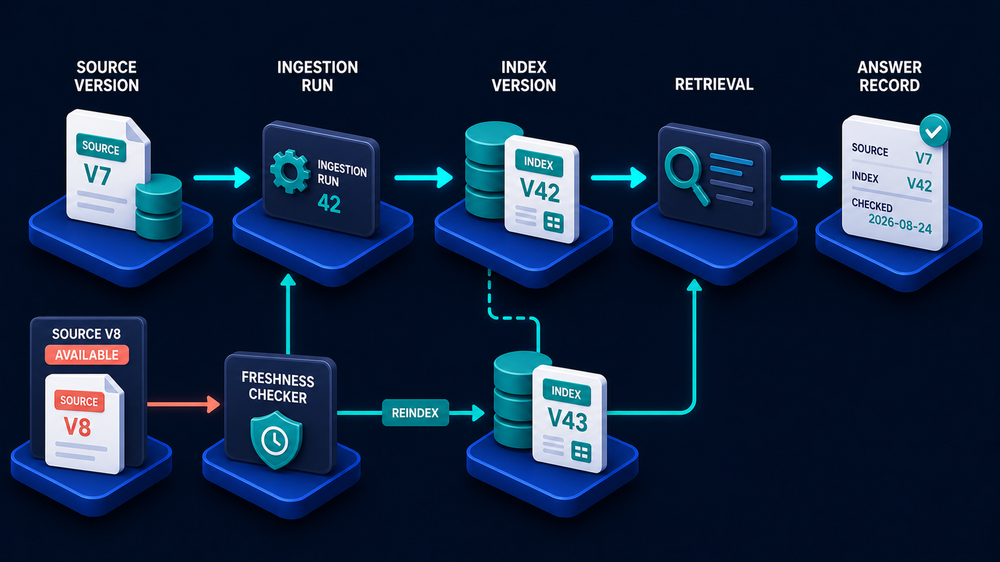

# Diagram 57 — Context Budget

![A funnel composition on dark navy. A large blue funnel labelled SELECT AND COMPRESS receives an assortment of documents, message bubbles, a database, an image tile and a code tile. A coral dashed path leaves left through a red ✗ to a coral waste bin labelled IRRELEVANT OR STALE. A teal dashed path leaves right through a teal shield to a card labelled MUST KEEP. Below the funnel, a cyan arrow feeds a long horizontal bar labelled CONTEXT BUDGET, divided into six teal-icon segments — INSTRUCTIONS, USER REQUEST, HISTORY, EVIDENCE, TOOL RESULTS, RESPONSE — with a fill gauge at its right end.](../diagrams/57-context-budget.png)

**Module:** Memory and retrieval
**Role in the course:** deciding what actually reaches the model
**Layout:** a funnel with two exits feeding a segmented budget bar

---

## At a glance

Everything available goes into a funnel labelled **SELECT AND COMPRESS**. Two things leave it sideways — **IRRELEVANT OR STALE** into a bin, and **MUST KEEP** to a protected card — and what remains drops into a **CONTEXT BUDGET** divided into six named segments with a fill gauge at the end.

The bar is the honest part. Context is not "as much as we can fit." It is a **fixed allocation divided between six competing claims**, and every one of them will take more if you let it.

---

## What the diagram teaches

### 1. The budget has six segments, and they compete

Read the bar left to right: **INSTRUCTIONS, USER REQUEST, HISTORY, EVIDENCE, TOOL RESULTS, RESPONSE**.

Six claims on one fixed space. The critical one is the last: **RESPONSE**. Space the model needs to write its answer is part of the budget, and it is the segment most often forgotten.

A system that fills the window with evidence and leaves no room to respond produces truncated answers, and the failure looks like a model problem rather than an allocation problem.

The others each have a characteristic failure when squeezed:

- **Instructions** squeezed → the model forgets its constraints and format.
- **User request** squeezed → it answers a truncated version of the question.
- **History** squeezed → it loses conversational referents.
- **Evidence** squeezed → it answers without grounding.
- **Tool results** squeezed → it acts on partial data.

Naming the six lets you decide the trade rather than discover it.

### 2. Select and compress are two operations, not one

The funnel label pairs them, and they are different.

**Select** — decide what goes in at all. A binary include/exclude on each candidate.

**Compress** — reduce what is included. Summarise a long document to its relevant passage, collapse a fifteen-turn history into a short summary, trim a tool result to the fields that matter.

Selection is cheaper and blunter. Compression is more expensive and preserves more. A system that only selects throws away whole items; one that only compresses keeps everything in a degraded form.

The funnel shape says both happen in sequence: a wide input, a narrowing, a controlled output.

### 3. The two side exits are the interesting part

Most funnels have one output. This one has three, and the two side exits are where the design decisions live.

**IRRELEVANT OR STALE → the bin.** Coral, with a red ✗. Actively discarded.

The word **stale** is doing as much work as **irrelevant** here. Something can be perfectly relevant and out of date, and out-of-date context is worse than absent context because it looks like evidence. A retrieved policy that has been superseded, a tool result from four minutes ago describing state that has since changed — both belong in the bin.

**MUST KEEP → a protected card.** Teal, behind a shield.

This is the pin list: things that are never dropped regardless of pressure. Safety instructions. The user's actual question. Identity and permission context. A confirmed value the workflow depends on.

Without an explicit must-keep set, compression under pressure drops whatever is oldest or longest, which is not the same as whatever is least important.

### 4. The fill gauge at the right end is the control loop

The bar terminates in a small vertical gauge — a fuel-gauge motif.

Its presence says the budget is **measured, not assumed**. You know how full it is, in this request, before you send it.

That measurement is what allows graceful behaviour. A system that measures can decide: compress more, drop a lower-priority segment, split the work into two requests, or tell the user the question is too broad. A system that does not measure discovers the limit by being refused, and its only response is failure.

### 5. Stale context is a correctness problem, not an efficiency one

Worth separating from the rest because it is the least intuitive.

The instinct is that context budgeting is about cost and speed. Mostly it is. But the stale branch is about being **wrong**.

A model given a superseded policy and a current one will reason over both. A model given a tool result that has since changed will act on the old value. Neither produces an error; both produce confident wrong answers with plausible-looking grounding.

Which means the freshness question belongs in the funnel, not downstream of it:

### 6. History is the segment that grows without anyone deciding

Of the six, history is the one that expands silently.

Instructions are fixed. The user request is what it is. Evidence and tool results are bounded per request. History accumulates every turn, and if nothing manages it, it eventually consumes the space the other five need.

The two standard approaches — a rolling window, or progressive summarisation — are both compression strategies, and both need a must-keep list so that a confirmed fact from turn three is not dropped at turn twenty.

That is the failure the Volume 3 state diagram warns about from a different angle: business truth held in history and trimmed away.

---

## Case study — Tallow & Finch, the surveyor's report that lost its constraints

Tallow & Finch is a property consultancy of about 260 staff, doing commercial valuations and building surveys. They built an assistant to help surveyors draft condition reports: it retrieves the property file, prior inspections, relevant standards, and the client's specific instruction, then drafts sections the surveyor edits.

It worked well for short jobs and degraded badly on long ones, in a way that took three months to characterise.

### The symptom

On complex properties — those with many prior inspections and long client instructions — draft reports began omitting the client's specific scope limitations.

A commercial client instructing a survey commonly excludes certain elements: roof voids not accessed, services not tested, no opening up of concealed areas. These exclusions are legally significant. A report that describes a building's condition without stating what was not inspected exposes the firm.

Two drafts went out to clients with exclusions missing. Both were caught by the client, not by Tallow & Finch. The second client was unimpressed.

### What was actually happening

The assistant's context was assembled by concatenating everything available and truncating at the limit.

For a simple property that was fine. For a property with fourteen prior inspection records, the retrieved history pushed the client instruction — which had been placed early in the assembly — past the truncation point.

The instruction was retrieved successfully. It reached the assembly step. It was cut before it reached the model.

Nothing errored. The draft was fluent, well-structured, and missing a legally significant section.

### The rebuild as a budget

**Six segments, explicitly allocated.**

| Segment | Allocation | Notes |
| --- | --- | --- |
| Instructions | 8% | Fixed drafting rules and format |
| User request | 5% | The surveyor's specific ask |
| History | 12% | Prior conversation, summarised |
| Evidence | 45% | Property file, prior inspections, standards |
| Tool results | 10% | Live checks — planning, flood, EPC |
| Response | 20% | Room to write a report section |

The response allocation at 20% was the first surprise. Their previous approach left whatever remained, which on complex properties was almost nothing — which is why some drafts were truncated mid-sentence, a symptom they had attributed to the model.

**A must-keep list.** Four things are never dropped, regardless of pressure:

- The client instruction, including scope limitations. **Non-negotiable.**
- The property address and title reference.
- The surveyor's identity and their qualification scope.
- The safety and liability boilerplate.

The client instruction being pinned is the specific fix for the incident. It now cannot be truncated; if the budget is tight, evidence is compressed instead.

**Selection before compression.** Prior inspections are selected by relevance and recency before any are included — the most recent three plus any that flagged a defect, rather than all fourteen. Only then is what remains compressed.

This alone freed about 30% of the evidence allocation on complex properties.

**Staleness rules.** Their evidence carries dates and they discovered a second, quieter problem: superseded versions of surveying standards were being retrieved alongside current ones, because both were in the index.

A report drafted against a superseded standard is a professional problem. The funnel now excludes superseded standards unless the surveyor explicitly asks for a historical version.

**A measured gauge.** The assembly step reports fill percentage per segment. When evidence exceeds its allocation after compression, the assistant tells the surveyor: *"This property has extensive history — I have used the most recent five inspections. Ask me about earlier ones if needed."*

That message is the difference between degrading transparently and degrading silently.

### Results

- **Drafts missing scope limitations:** two before, zero in fourteen months.
- **Truncated drafts:** eliminated once the response segment was allocated.
- **Reports drafted against superseded standards:** three found in a retrospective audit, zero since.
- **Median context fill:** 71%, with the gauge alerting above 90%.

### The line in their engineering notes

*Everything we retrieved reached the assembly step. The client instruction was cut there. Retrieval was never the problem.*

---

## Composition

A vertical composition with a funnel at centre and a horizontal budget bar beneath.

At the top, an assortment of content objects feeds into a large blue **funnel** carrying the white label **SELECT AND COMPRESS**.

Two dashed paths leave the funnel's rim: **left** through a **red ✗ tile** to a **coral waste bin** labelled **IRRELEVANT OR STALE**; **right** through a **teal shield with a check** to a white card labelled **MUST KEEP**.

From the funnel's spout, a **cyan arrow** drops to a long horizontal blue bar labelled **CONTEXT BUDGET**, divided into six white segments each with a teal circular icon, with a **fill gauge** at the right end.

## Element by element

**The funnel input**
White document cards, a **teal message bubble**, a **teal database stack**, a **teal image tile**, and a **teal code tile** — a deliberately heterogeneous set of candidate content.

**The funnel**
A large blue cone with the label **SELECT AND COMPRESS** across its face.

**IRRELEVANT OR STALE**
A **coral waste bin** on a platform, reached via a dashed coral line through a red ✗ tile.

**MUST KEEP**
A white card with a **teal shield and check**, reached via a dashed teal line through a teal shield tile.

**The budget bar segments**
Six white panels, each with a teal circular icon: a **document** — INSTRUCTIONS; a **person** — USER REQUEST; a **clock** — HISTORY; a **magnifier** — EVIDENCE; a **wrench** — TOOL RESULTS; a **message bubble** — RESPONSE.

**The fill gauge**
A small vertical indicator with teal segments at the bar's right end.

## Colour and flow semantics

- **Coral** marks the discard path and the bin — the only coral in the diagram.
- **Teal** marks the protected must-keep path, the shield, and every budget segment icon.
- **Cyan** carries the single output from funnel to budget.
- The **funnel form** conveys narrowing; the **bar form** conveys fixed capacity divided into competing claims.
- The **fill gauge** asserts that the budget is measured rather than assumed.

## How to present it

**Read the six segments aloud and ask which one gets forgotten.** **RESPONSE**. Then ask what happens to a request that fills the window with evidence — a truncated answer that looks like a model problem.

**Ask how their system decides what goes into context.** If the answer is "everything we have, truncated," that is the Tallow & Finch failure waiting to happen. Ask what gets cut when it truncates. Usually whatever is last, which has no relationship to importance.

**Point at the must-keep exit and ask what belongs there.** Safety constraints, the actual question, identity and permissions, confirmed values the workflow depends on. Then ask what their system pins today. Usually nothing explicitly.

**Tell the Tallow & Finch story.** Fourteen prior inspections pushed the client's scope limitations past the truncation point. Retrieved successfully, assembled, cut before the model saw it. Two reports went to clients without legally significant exclusions.

**Separate select from compress.** Selection is a binary include/exclude; compression reduces what is included. A system that only selects throws away whole items; one that only compresses keeps everything degraded. Ask which theirs does.

**Dwell on the word "stale."** This is the least intuitive part and it is a correctness issue, not an efficiency one. A superseded policy in context is worse than no policy, because it looks like evidence. Ask what in their corpus has versions.

**Ask about the gauge.** Do they measure fill before sending? A system that measures can compress more, drop a segment, split the work, or tell the user. A system that does not, fails.

**Point at history as the segment that grows silently.** Instructions are fixed, the request is what it is, evidence and tool results are per-request. History accumulates every turn. Ask what manages theirs.

**Close on the transparency behaviour.** Tallow & Finch's assistant now says which inspections it used and offers the rest. Degrading visibly is a feature; degrading silently is the bug.

**Timing.** Twenty-five minutes. Thirty-five if you allocate percentages for the room's own system, which reliably starts an argument about evidence versus response.

---

## Lab and checkpoint

**Lab:** For one real agent in your system, estimate the context budget and divide it into the six segments: instructions, user request, history, evidence, tool results, and response. Allocate percentages and identify which segment grows silently. Write the rule that decides what is irrelevant or stale and the rule that decides what is must-keep. Then write what the assistant should say if the budget is exceeded.

**Checkpoint:** Why is degrading visibly a feature, while degrading silently is a bug?

**Answer:** Because when the assistant degrades visibly, the user can see that some information was not used and can ask for it. Silent degradation produces incomplete or wrong answers that look correct. It hides the fact that important content was dropped.

## Glossary

- **Budget bar** — the fixed context capacity divided into competing segments.
- **Compression** — reducing the size of included content rather than dropping it.
- **Context budget** — the total amount of context available for a model call.
- **Evidence** — retrieved information supporting the answer.
- **Fill gauge** — the measure of how much of the budget is used.
- **History** — the accumulated conversation turns, which grow silently.
- **Instructions** — the fixed guidance to the model.
- **Must-keep** — the content that must remain in context, such as safety constraints and the actual question.
- **Response** — the model's answer, often forgotten in budget allocation.
- **Selection** — the binary decision to include or exclude a piece of content.
- **Stale** — superseded content that is worse than no content.

## Sources

- Context-window management and budget allocation
- Long-context model compression and selection
- RAG and agent context truncation transparency
