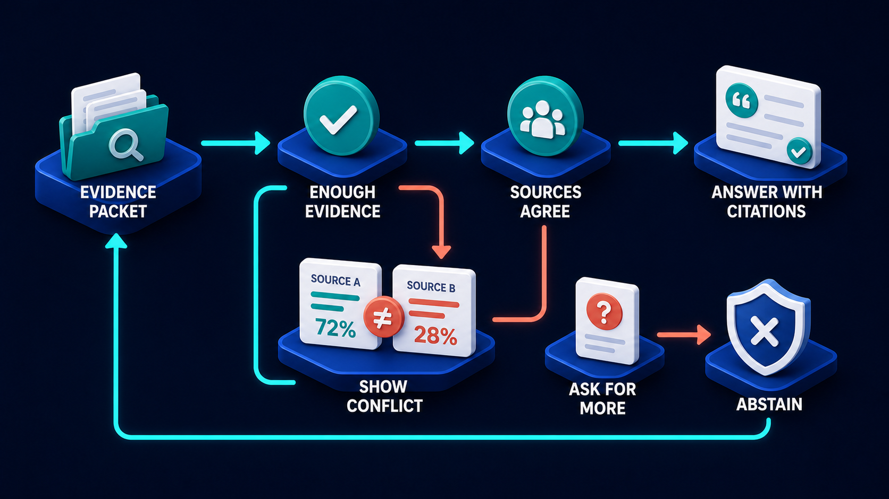

# Diagram 59 — Advanced Retrieval Pipeline

![Eight numbered stages on dark navy — QUESTION as a question bubble, REWRITE as a card with a pencil, FILTER as a teal funnel with a check, HYBRID SEARCH showing stacked KEYWORD and VECTOR platforms, RERANK as a numbered list with an up arrow, ASSEMBLE EVIDENCE as interlocking puzzle pieces, ANSWER as a checked card, and CITE as a card with quotation marks. A coral arrow drops from FILTER to a red shield labelled NOT PERMITTED. A dashed cyan path runs from a WEAK EVIDENCE badge beneath ASSEMBLE EVIDENCE back to REWRITE.](../diagrams/59-advanced-retrieval-pipeline.png)

**Module:** Memory and retrieval
**Role in the course:** production retrieval, with permissions and a quality loop
**Layout:** eight numbered stages with a permission exit and a weak-evidence return

---

## At a glance

Eight stages: **QUESTION → REWRITE → FILTER → HYBRID SEARCH → RERANK → ASSEMBLE EVIDENCE → ANSWER → CITE**.

Two things separate this from a teaching-level retrieval pipeline. **FILTER sits at stage 3, before search**, with a coral exit to **NOT PERMITTED**. And a **dashed return from weak evidence to rewrite** means the pipeline can decide its own output is not good enough and go round again.

Those two additions are what make it a production pipeline rather than a demonstration.

---

## What the diagram teaches

### 1. Rewrite comes before anything touches the index

Stage 2 is a card with a **pencil** — the question being edited before it is used.

Three things happen here, and they are the difference between a pipeline that works for experts and one that works for everyone:

**Vocabulary translation.** Users ask in their words; documents are written in the organisation's words. "Time off" versus "annual leave." "Buzzer" versus "door entry system."

**Context resolution.** A follow-up like "what about part-time staff?" is meaningless as a standalone query. Rewriting expands it using the conversation.

**Decomposition.** A question with three parts is three searches. One retrieval cannot serve a compound question well.

Doing this at stage 2 rather than accepting the raw question is one of the highest-value, lowest-cost improvements available in retrieval.

### 2. Filter before search, and this is the diagram's most important ordering claim

**FILTER** at stage 3 — a teal funnel with a check — sits between rewrite and search, with a **coral arrow down to NOT PERMITTED**.

Filtering before search means the index is queried **only over content this caller may see**. The alternative — search everything, then remove what they may not see — has a specific and serious flaw.

**Post-filtering leaks.** Even if the forbidden documents are removed from the result set, their existence has influenced the outcome. Result counts differ. Ranking differs. Relevance scores shift. A caller can infer the existence and approximate content of documents they cannot read by observing how results change.

And in a system where retrieval feeds a model, post-filtering is worse still: if the removal happens after assembly, the forbidden content reached the model.

Pre-filtering makes the permission boundary a property of the search itself. What the caller cannot see does not exist as far as the query is concerned.

### 3. NOT PERMITTED is drawn as a shield, not a bin

The coral exit terminates at a **red shield with a white ✗**, not a waste bin.

The distinction is meaningful. A bin means discarded. A shield means **defended** — this is a security boundary being enforced, not noise being cleaned up.

It also means the exit should produce a defined response. A query that filters down to nothing because the caller may see nothing is different from a query that finds nothing because nothing matches. Conflating them tells the caller more than they should know.

### 4. Hybrid search is drawn as two stacked lanes for a reason

Stage 4 shows **KEYWORD** and **VECTOR** on separate platforms with a **+** between them.

The two fail in opposite directions. Keyword search is exact and has no notion of meaning — it finds part numbers, case references and error codes perfectly, and fails entirely on paraphrase. Vector search finds meaning and is unreliable on exact identifiers, because an alphanumeric code carries almost no semantic content.

Running both is not a hedge; it is the only way to cover both query types. The **+** is the point: they are combined, not chosen between.

### 5. Assemble evidence is a stage, and it is where weak evidence is detected

Stage 6 shows **interlocking puzzle pieces** — separate results being fitted into a coherent whole.

Assembly is not concatenation. It involves ordering, deduplication, ensuring the pieces actually cover the question, and deciding whether what you have is sufficient.

That last judgement is what produces the **WEAK EVIDENCE** badge and the dashed return path. The pipeline checks its own work before answering.

### 6. The weak-evidence loop returns to rewrite, not to search

Follow the dashed cyan path: from **WEAK EVIDENCE** beneath stage 6, leftward along the base, and up into **REWRITE** at stage 2.

Not to search. That placement is a claim about why retrieval usually fails: **the query was wrong, not the search**.

Re-running the same query against the same index produces the same results. Rewriting it — different vocabulary, narrower scope, decomposed into parts — produces different ones. The loop only makes sense if it returns to the stage that can change the query.

The loop needs a bound, which the diagram does not draw. Two or three attempts, then abstain — which is the subject of the next diagram:

That diagram's **ENOUGH EVIDENCE** gate is this one's weak-evidence badge, given somewhere to go.

### 7. Cite is a separate stage after answer

Stages 7 and 8 are distinct: **ANSWER** then **CITE**.

Separating them means citation failures are visible. An answer with no citations fails at stage 8 rather than being silently unattributed.

It also flags a risk worth naming: citations attached after composition can be attached to claims they do not support, because the attaching step is matching plausibly rather than tracing provenance. Verification has to check support, not merely presence.

---

## Case study — Ardwick Legal Services, the permission leak in the search results

Ardwick provides in-house legal support to a group of NHS trusts — employment matters, clinical negligence, procurement, and information governance. Their document corpus is about 240,000 items spanning case files, advice notes, policies and correspondence.

Access is tightly segmented. A solicitor working on employment matters for Trust A may not see clinical negligence files, and may not see any Trust B material.

### The original design

They built retrieval with post-filtering, because it was simpler: search the whole index, then remove anything the caller may not see.

It passed their initial security review, because the reviewer checked that forbidden documents did not appear in results. They did not.

### What the penetration test found

The tester held credentials for an employment solicitor at Trust A. They could not retrieve clinical negligence documents and did not try to.

Instead they ran a series of queries and observed the **result metadata**.

Their system returned a total match count before filtering — a UI convenience, showing "showing 8 of 34 results." The 34 included documents the caller could not see.

By crafting queries around specific terms, the tester could establish:

- Whether documents existed matching a named individual.
- Roughly how many.
- By varying terms, approximately what they concerned.

They demonstrated, from an employment-only account, that Trust B had a cluster of documents matching a particular clinical procedure and a date range. No document content was ever returned. The counts were enough.

For an organisation handling clinical negligence matters, the inference that a specific procedure had generated a cluster of files in a specific period is exactly the information that must not leak.

### The second finding, which was worse

The filtering happened **after assembly**, in the code path that fed the model.

Retrieved content — including content the caller was not entitled to — was assembled into context, and the filter removed it from the *displayed sources* but not from what the model had already been given.

The model was reasoning over documents the caller could not see. Its answers were subtly shaped by material that should never have reached it. In two test cases the tester elicited a summary that reflected content from a filtered document.

Nobody had noticed because the citations were correctly filtered. The answer looked properly grounded in permitted sources.

### The rebuild

**Filter moved to stage 3, before search.** The permission set is resolved from the caller's identity and applied as a pre-condition on the query itself. The index is searched only over the permitted subset.

Match counts are now counts of *permitted* matches. The "8 of 34" display became "8 results," because 34 was never a number the caller was entitled to.

**Not-permitted produces a defined response.** A query whose permitted scope is empty returns the same shape of response as a query that found nothing — no distinction visible to the caller.

**Permission resolution is cached per request, not per session.** An early version cached the permitted set for the session, which meant a permission change mid-session was not reflected. Resolving per request costs about 15ms and closes the gap.

**Rewrite was added, and it mattered more than expected.** NHS staff ask in clinical and operational language; their legal documents are written in legal language. A query about "a patient complaint about a delayed diagnosis" needed rewriting toward the vocabulary of their advice notes. Adding rewrite improved top-5 retrieval accuracy by about 19 points on its own.

**The weak-evidence loop, bounded at two attempts.** If assembly finds the evidence insufficient after two rewrites, the assistant says so and offers to escalate to a solicitor rather than answering thinly.

### Results

- **Existence inference from result counts:** eliminated structurally.
- **Unpermitted content reaching the model:** eliminated structurally.
- **Top-5 retrieval accuracy:** 63% → 89%, driven mainly by rewrite and hybrid search.
- **Queries ending in an honest "insufficient evidence, escalating":** about 6%, which their solicitors regard as correct.

### What their information governance lead says about the ordering

*Post-filtering told the truth about what we showed and lied about what we knew. Pre-filtering makes the two the same.*

---

## Composition

Eight numbered stages running left to right, each on a blue platform with a cyan numeral above and a white uppercase label.

**1 QUESTION → 2 REWRITE → 3 FILTER → 4 HYBRID SEARCH → 5 RERANK → 6 ASSEMBLE EVIDENCE → 7 ANSWER → 8 CITE**, connected by cyan arrows.

A **coral arrow** drops from **FILTER** to a red shield labelled **NOT PERMITTED**. A **teal warning badge** labelled **WEAK EVIDENCE** hangs beneath **ASSEMBLE EVIDENCE**, from which a **dashed cyan path** runs left along the base and up into **REWRITE**.

## Element by element

**1 QUESTION** — a white **question-mark bubble**.

**2 REWRITE** — a white card with teal text lines and a **teal pencil**.

**3 FILTER** — a **teal funnel** with a white check disc. *Coral exit to NOT PERMITTED.*

**4 HYBRID SEARCH** — a **teal magnifier with a T** above a platform labelled **KEYWORD**, a **+**, and a **teal node graph** above a platform labelled **VECTOR**.

**5 RERANK** — a white card listing **1 2 3** with teal bars and an **up arrow** badge.

**6 ASSEMBLE EVIDENCE** — **interlocking teal and white puzzle pieces**.

**7 ANSWER** — a white card with teal lines and a **teal check disc**.

**8 CITE** — a white card with teal bullet rows and a **teal quotation-mark badge**.

**NOT PERMITTED** — a **red shield with a white ✗** on a blue platform.

**WEAK EVIDENCE** — a **teal circular badge with a white exclamation**, labelled in teal.

## Colour and flow semantics

- **Cyan arrows** carry the main pipeline through all eight stages.
- **Coral** appears once, on the permission exit, terminating at a **shield** rather than a bin — a boundary defended, not noise discarded.
- The **dashed cyan return** carries the weak-evidence loop back to rewrite, and is dashed because it is a retry rather than forward progress.
- **Teal** marks every working stage icon and the weak-evidence badge.
- **KEYWORD and VECTOR are stacked with a + between them**, marking them as combined rather than alternative.

## How to present it

**Ask where permission filtering happens in their pipeline.** Most rooms say after search, because it is simpler. Then ask what a match count reveals.

**Tell the Ardwick count-inference finding.** No document content returned, and the tester established that a cluster of files existed for a named procedure and date range at another trust. Counts alone were enough.

**Then tell the second finding, which is worse.** Filtering after assembly meant unpermitted content reached the model. The citations were correctly filtered, so the answer looked properly grounded. Ask the room where their filter sits relative to their context assembly.

**Give them the ordering rule.** Pre-filter, so that what the caller cannot see does not exist as far as the query is concerned. Then note the response requirement: an empty permitted scope must look identical to no matches.

**Ask what rewrite does.** Build the three: vocabulary translation, context resolution, decomposition. Then give them Ardwick's 19-point improvement from rewrite alone — it is the cheapest stage to add and among the highest-value.

**Ask why keyword and vector are stacked with a plus.** Opposite failure modes. Ask the room for their domain's exact-identifier case — case references, part numbers, drug codes. Every domain has one, and vector search handles none of them well.

**Ask where the weak-evidence loop returns to.** Rewrite, not search. Then ask why: re-running the same query against the same index returns the same results. The query was wrong, not the search.

**Name the missing bound.** The loop has no drawn exit. Ardwick capped it at two and then abstains. Ask what their pipeline does when the evidence is genuinely not there.

**Point out that cite is its own stage.** Separating it makes citation failures visible. Then flag the risk in the ordering — citations attached after composition can be attached to claims they do not support.

**Timing.** Thirty minutes. Forty if you audit where the room's permission filter currently sits, which is the most consequential finding this diagram produces.

---

## Lab and checkpoint

**Lab:** Draw the eight-stage advanced retrieval pipeline for one real query in your system. Mark where permission filtering currently happens and whether it is before or after hybrid search, rerank, and assemble. If the filter is after any of these stages, write the leak or inference risk that results and the smallest move to pre-filter.

**Checkpoint:** Why does the weak-evidence loop return to rewrite, not search?

**Answer:** Because re-running the same query against the same index returns the same results. If the evidence is weak, the query is probably wrong. Returning to rewrite changes the query, not the search.

## Glossary

- **Assemble evidence** — the stage that combines the selected passages into a context.
- **Citation** — the stage that attaches a source reference to claims in the answer.
- **Filter** — the permission gate that removes results the caller is not allowed to see.
- **Hybrid search** — the combination of keyword and vector search.
- **Keyword search** — exact or term-based retrieval.
- **Permission** — the rule deciding which documents the caller may see.
- **Pre-filter** — filtering before search, so hidden documents do not enter the query.
- **Rewrite** — the stage that reformulates the user's question to improve retrieval.
- **Rerank** — the stage that reorders search results by relevance.
- **Vector search** — semantic retrieval using embeddings.
- **Weak evidence** — retrieved results that do not adequately support the answer.

## Sources

- Permission-aware retrieval and pre-filtering
- Hybrid search, rerank, and query rewriting
- Grounded answers and citation design in RAG
