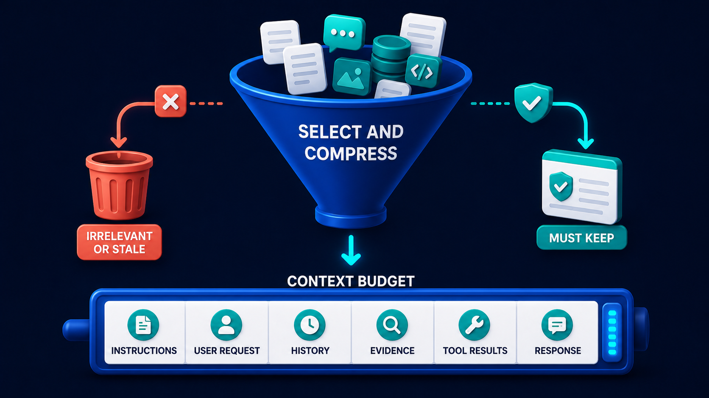

# Diagram 60 — Freshness and Index Versions

![A versioned pipeline on dark navy. The upper row runs SOURCE VERSION showing a document tagged V7, INGESTION RUN showing a gear panel numbered 42, INDEX VERSION showing teal cylinders tagged V42, RETRIEVAL showing a magnifier panel, and ANSWER RECORD showing a card listing SOURCE V7, INDEX V42 and CHECKED 2026-08-24 with a teal check. Below, a card reading SOURCE V8 AVAILABLE in coral feeds a FRESHNESS CHECKER shield, which sends a teal REINDEX arrow to INDEX V43. A dashed line links V42 to V43, and a cyan arrow rises from V43 into RETRIEVAL.](../diagrams/60-freshness-and-index-versions.png)

**Module:** Memory and retrieval
**Role in the course:** knowing which version of the truth you answered from
**Layout:** a versioned ingestion chain with a freshness checker triggering a reindex

---

## At a glance

Everything in this diagram carries a version. The source is **V7**. The ingestion run is **42**. The index is **V42**. And the answer record at the end states all of it: **SOURCE V7, INDEX V42, CHECKED 2026-08-24**.

Underneath, a **FRESHNESS CHECKER** notices that **SOURCE V8** exists, triggers a **REINDEX**, and produces **INDEX V43** — which retrieval then uses.

The claim is that "we retrieved it from the index" is not an adequate answer to "why did the system say that." You need to know *which* index, built from *which* source, and *when* it was last checked.

---

## What the diagram teaches

### 1. Three version numbers, and they are deliberately different

**SOURCE V7** — the version of the underlying document. Owned by whoever writes it.

**INGESTION RUN 42** — the identity of the processing job. Owned by the pipeline.

**INDEX V42** — the version of the searchable artefact. Owned by the retrieval system.

They are separate because they change for different reasons. A source can be revised without being reindexed. An ingestion run can fail partway. An index can be rebuilt from an unchanged source because the chunking strategy changed.

Collapsing them into one "version" loses the ability to answer the diagnostic questions: *was the source out of date, or did ingestion not run, or did the index not get updated?*

### 2. The answer record is the diagram's payload

The rightmost card is the most important object in the frame. It lists three facts about an answer that has already been given:

**SOURCE V7** — which version of the document this rested on.
**INDEX V42** — which build of the index served it.
**CHECKED 2026-08-24** — when freshness was last verified.

That is a **provenance stamp**, and it converts an answer from an assertion into something reconstructable.

Six months later, when someone asks why the system said what it said, this card is the answer. Without it, the only honest response is "it was whatever the index held at the time," which is not a response.

### 3. The freshness checker sits outside the main flow, and that is correct

The **FRESHNESS CHECKER** — a teal shield with a clock — sits on the lower row, taking input from the coral **SOURCE V8 AVAILABLE** card and outputting a **REINDEX** instruction.

It is not a stage of the retrieval path. It runs independently, on its own schedule, comparing what the index was built from against what now exists.

That separation matters operationally. Freshness checking is a background concern that must not be on the critical path of answering a question — but its findings must be able to change what the answering path uses.

### 4. SOURCE V8 AVAILABLE is coral, and the colour is a judgement

The card announcing that a newer source exists is rendered in **coral**, not teal.

Coral throughout this library marks risk. A newer source version existing while the index still serves the older one is a **risk state**: every answer given in that window is grounded in superseded material.

It is not yet a failure — the older version may still be substantially correct, and reindexing takes time. But it is a condition that needs attention, and colouring it as neutral would misrepresent it.

### 5. The reindex produces a new version rather than mutating the old one

**REINDEX** leads to **INDEX V43**, drawn as a separate object beside **INDEX V42**, with a **dashed line** linking them.

New version, not an update in place. Three consequences:

**Answers remain reconstructable.** An answer stamped INDEX V42 can still be explained, because V42 still exists.

**Rollback is possible.** If V43 turns out to be broken — a bad chunking change, a failed extraction — retrieval can be pointed back at V42.

**The cutover is atomic.** Retrieval uses V42 until it uses V43. There is no window in which the index is half-rebuilt, which is what in-place updates produce.

The dashed line between them is a lineage marker: V43 supersedes V42, and the relationship is recorded.

### 6. Retrieval reads from the current index, and the arrow says which

Note the arrow into **RETRIEVAL**: it comes from **INDEX V43**, rising from the lower row, not from V42.

That single arrow is the cutover. Retrieval points at exactly one index version at a time, and switching it is a deliberate act.

Systems that let retrieval read from "the index" without a version pointer cannot answer what they were reading at any given moment, and cannot roll back.

### 7. Staleness is a correctness failure with no error

Worth stating plainly because it is the least visible failure mode in retrieval.

A stale index returns results. They are relevant, well-ranked, properly cited, and grounded in a version of the truth that is no longer true. Nothing in the pipeline errors, no metric degrades, and the answer looks correct.

The only defence is knowing — per answer — what version it rested on, and having something watching for the gap between index and source.

It is also why staleness belongs in the context funnel rather than downstream of it:

That funnel's **IRRELEVANT OR STALE** exit is only usable if something knows which version each piece of evidence came from. This diagram supplies that knowledge.

---

## Case study — Pennington & Vale, the guidance that had changed in March

Pennington & Vale is an accountancy practice of about 90 staff serving small and medium businesses. Their assistant answers staff questions about tax treatment, filing requirements and their own internal procedures, from a corpus of about 12,000 documents — HMRC guidance, professional standards, and internal advice notes.

### The incident

In September, a partner reviewing a client file found that advice given in June had been based on a treatment that had changed in March.

The assistant had answered a staff question about the tax treatment of a specific type of employee benefit. Its answer was correct as of the guidance published in 2024. The guidance had been superseded in March 2026.

The advice had gone to four clients. Two had filed on it. Correcting the filings cost about £4,000 in remedial work and one client relationship became difficult.

### Why nobody caught it

The assistant's answer had been fluent, specific, and cited the source document by name — *"HMRC guidance on employment-related benefits"*.

That citation was accurate about the document and silent about the version. The document had the same title, the same reference, and materially different content.

Staff reading the answer saw a properly cited response from an authoritative source. There was no signal that the version was two revisions old.

### The investigation

Establishing what had happened took eleven days, and the difficulty is the reason they rebuilt.

They could not determine which version of the guidance had been in the index in June. The index was updated in place — a nightly job that re-processed changed documents and overwrote the existing entries.

There was no record of what the index had contained at any past moment. There was no record of which documents any past answer had used beyond the title.

They eventually reconstructed it by finding an old backup of the index and diffing it, which worked by luck rather than design.

### The rebuild

**Source versions tracked explicitly.** Every ingested document carries the publisher's version identifier where one exists, plus a content hash where one does not. A document whose hash changes is a new version, whether or not its title or reference changed.

That hash caught something immediately: 340 documents in their corpus had changed content under an unchanged title since ingestion. Nobody had known.

**Immutable index versions.** Reindexing builds a new index version rather than updating in place. Retrieval points at one version. Previous versions are retained for 24 months.

The storage cost was a concern until they measured it: their index is small relative to their document store, and 24 months of versions cost less than their monthly document storage.

**A freshness checker on its own schedule.** It polls source locations, compares published versions and content hashes against what each index version was built from, and reports the gap.

It surfaces three states: **current** (index matches source), **stale** (newer source exists, reindex pending), and **unknown** (source location unreachable — which turned out to matter, since two of their sources had moved and were silently returning 404s to the ingestion job).

**Answer records with provenance stamps.** Every answer records the index version, the source version of each document used, and the freshness-check date for those sources.

That stamp is now attached to the advice note when staff paste an assistant answer into client work. A partner reviewing a file can see immediately what it rested on.

**A staleness rule with teeth.** If a source is more than 7 days stale, answers drawing on it carry a visible warning. If more than 30 days, the assistant declines to answer from it and escalates.

The 30-day rule fired eleven times in the first year, each time on a source whose ingestion had silently broken.

### The finding that surprised them

The freshness checker's **unknown** state found more problems than the stale state did.

Two source locations had moved. The ingestion job requested them, received a 404, logged a warning nobody read, and continued — leaving those documents at whatever version they had been at when the move happened.

One had been stale for **fourteen months**. It covered VAT treatment on a category of transaction, and it had been superseded twice in that period.

They found no client advice that had gone wrong as a result, but they could not rule it out for the period before answer records existed.

### Results

- **Answers with full provenance:** 100%, from 0%.
- **Time to determine what an answer rested on:** eleven days, now under a minute.
- **Silently broken ingestion sources:** two found immediately, both fixed; monitoring now alerts within a day.
- **Documents found to have changed under an unchanged title:** 340 at rebuild.

### The line their technical partner uses

*Citing the document is not the same as citing the version. We had been doing the first and thinking it was the second.*

---

## Composition

Two rows. The upper row is the answering path; the lower row is the freshness and reindex path.

**Upper:** **SOURCE VERSION → INGESTION RUN → INDEX VERSION → RETRIEVAL → ANSWER RECORD**, connected by cyan arrows.

**Lower:** a coral-flagged **SOURCE V8** card sends a **coral arrow** to the **FRESHNESS CHECKER**, which sends a cyan arrow up into **INGESTION RUN** and a teal **REINDEX** arrow right to **INDEX V43**. A **dashed teal line** links **INDEX V42** down to **INDEX V43**, and a **cyan arrow** rises from V43 into **RETRIEVAL**.

## Element by element

**SOURCE VERSION**
A white document with a teal **SOURCE** tag and large **V7**, beside a small teal database.

**INGESTION RUN**
A dark panel with a **teal gear** and the text **INGESTION RUN 42**.

**INDEX VERSION**
**Teal database cylinders** beside a white card with a teal **INDEX** tag and **V42**.

**RETRIEVAL**
A dark panel with a **teal magnifying glass** and text lines.

**ANSWER RECORD**
A white card with a **teal check disc**, listing three labelled rows: **SOURCE V7**, **INDEX V42**, **CHECKED 2026-08-24**.

**SOURCE V8 AVAILABLE**
A dark card carrying a **coral AVAILABLE tag** and a white document with a coral **SOURCE** tag and **V8**.

**FRESHNESS CHECKER**
A dark panel containing a **teal shield with a clock face**.

**REINDEX**
A **teal rounded label** on the arrow between the checker and the new index.

**INDEX V43**
**Teal database cylinders** beside a white card with a teal **INDEX** tag and **V43**.

## Colour and flow semantics

- **Cyan arrows** carry the answering path and the reindex trigger.
- **Coral** appears once, marking the newer-source-available state as a risk condition rather than a neutral fact.
- **Teal** marks the index objects, the freshness shield, and the reindex label.
- The **dashed line between V42 and V43** is a lineage marker — supersession recorded rather than overwritten.
- The **arrow into RETRIEVAL comes from V43**, making the cutover explicit and singular.

## How to present it

**Ask what "we got it from the index" tells you.** Almost nothing. Then read the answer record aloud — source version, index version, check date — and ask which of those three their system records. Usually none.

**Tell the Pennington & Vale story.** Advice given in June on guidance that changed in March, cited accurately by document title, silent on version. Four clients, two filings, £4,000 to correct.

**Ask why the citation did not help.** Same title, same reference, different content. Citing the document is not citing the version. This is the sentence to leave them with.

**Ask why three version numbers rather than one.** Source, ingestion run, index — they change for different reasons, and separating them is what lets you answer *which* thing was out of date.

**Ask what happens when you reindex in place.** No history, no rollback, and a window where the index is half-rebuilt. Then point at the dashed lineage line: new version, old one retained. Ask what their storage cost objection would be, and note that Pennington's 24 months of index versions cost less than a month of their document storage.

**Point at the coral on SOURCE V8 AVAILABLE.** Ask why it is coral rather than neutral. Every answer given while a newer source exists is grounded in superseded material. It is not yet a failure and it is a risk state.

**Introduce the third freshness state.** Current, stale, and **unknown**. Unknown is the one teams omit, and at Pennington it found two sources that had moved and been silently 404ing for months — one stale for fourteen months.

**Ask what happens at what staleness threshold.** Pennington warn at 7 days and refuse at 30. Ask the room what their tolerance would be, and whether anything currently measures it.

**Close on invisibility.** A stale index returns relevant, well-ranked, properly cited answers grounded in something that is no longer true. No error, no degraded metric. Provenance stamps and a checker are the only defences.

**Timing.** Twenty-five minutes. Thirty-five if you work out what a provenance stamp would need to contain for the room's own answers.

---

## Lab and checkpoint

**Lab:** Take one answer your RAG system produces and add a provenance stamp: source version, index version, and check date. Then design the freshness checker that would detect source V8, trigger a reindex to V43, and route answers to the current index. Define the staleness thresholds for warning and refusing.

**Checkpoint:** Why is reindexing in place worse than creating a new index version?

**Answer:** Because reindexing in place has no history, no rollback, and a window where the index is half-rebuilt. Creating a new version and switching over keeps the old one intact, lets you verify the new one, and lets you roll back if needed.

## Glossary

- **Answer record** — the output with a provenance stamp showing source, index, and check date.
- **Freshness checker** — the component that detects new source versions and stale indexes.
- **Index version** — the versioned snapshot of the index used for retrieval.
- **Ingestion run** — the process that turns source documents into an index version.
- **Provenance stamp** — the record of which source and index versions produced an answer.
- **Reindex** — the process of building a new index version from updated sources.
- **Source version** — the version of the original document or set of documents.
- **Staleness threshold** — the rule that decides when an answer is too stale to return.

## Sources

- Version-aware document retrieval and index versioning
- Provenance, citation, and freshness in RAG
- Index reindexing and cutover patterns
