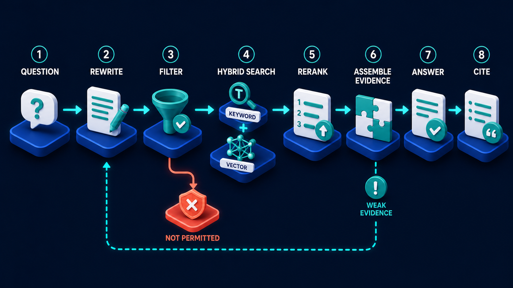

# Diagram 61 — Conflict, Citation, and Abstention

![A decision flow on dark navy. EVIDENCE PACKET shows a teal folder with a magnifier. A cyan arrow leads to ENOUGH EVIDENCE, a teal check disc, then to SOURCES AGREE, a teal group icon, then to ANSWER WITH CITATIONS, a white card with quotation marks and a check. A coral arrow drops from ENOUGH EVIDENCE to SHOW CONFLICT, two cards reading SOURCE A 72% and SOURCE B 28% separated by a red not-equals badge. A coral arrow from SOURCES AGREE leads to ASK FOR MORE, a card with a red question badge, then to ABSTAIN, a blue shield with a white cross. A cyan line returns from ABSTAIN to the evidence packet.](../diagrams/61-conflict-citation-and-abstention.png)

**Module:** Memory and retrieval
**Role in the course:** what to do when the evidence does not support an answer
**Layout:** two sequential checks with coral exits to conflict display and abstention

---

## At a glance

Two gates before an answer is allowed: **ENOUGH EVIDENCE**, then **SOURCES AGREE**. Each has a coral exit. Fail the first and you **SHOW CONFLICT**. Fail the second and you **ASK FOR MORE**, and if that does not resolve it, you **ABSTAIN**.

Abstention is drawn as a **shield**, not a bin or an error. Declining to answer is a defended, correct outcome — the system protecting the user from a confident guess.

---

## What the diagram teaches

### 1. Two checks, and they ask genuinely different questions

**ENOUGH EVIDENCE** — is there sufficient material to say anything at all? A quantity and coverage question. Did retrieval find things that address what was asked?

**SOURCES AGREE** — do the things we found say the same thing? A consistency question, and it only arises once you have enough to compare.

Ordering matters. You cannot assess agreement among sources you do not have. And the two failures need completely different handling: insufficient evidence means go and look harder; disagreement means the evidence is present and contradictory, which is a different problem entirely.

Most retrieval pipelines have neither check. They answer from whatever came back.

The evidence packet arriving at stage 1 is the output of the retrieval pipeline:

Its **ASSEMBLE EVIDENCE** stage produces the packet; its **WEAK EVIDENCE** badge is the first gate here, seen from the other side.

### 2. Show conflict is not a failure — it is a better answer

The first coral exit leads to **SHOW CONFLICT**: two cards, **SOURCE A 72%** and **SOURCE B 28%**, separated by a **red not-equals badge**.

This is the diagram's most useful idea. When sources disagree, the correct output is often **not** to pick one — it is to say that they disagree and show both.

The percentages make it concrete. This is not "sources conflict, sorry." It is *here is what A says, here is what B says, here is the weight of each*. A user with domain knowledge can resolve that in seconds; a system that silently picked the 72% figure would have given them a confident answer and hidden the 28%.

The not-equals symbol is the right glyph — it asserts inequality rather than error. Neither source is wrong; they differ.

### 3. The conflict path rejoins the main flow

Follow the arrow out of the conflict cards: it goes **up and right into SOURCES AGREE**, not off the diagram.

Showing the conflict is not a terminal state. Having surfaced it, the pipeline continues — either the conflict is resolvable (one source is more recent, more authoritative, or more specific to the question) or it is not, in which case the second gate refuses.

That routing says conflict display is a *stage in reasoning*, not an abandonment.

### 4. Ask for more sits between disagreement and abstention

The second coral exit leads to **ASK FOR MORE** — a card with a red question badge — and then to **ABSTAIN**.

The intermediate step matters. Abstention should not be the immediate response to disagreement. First, try to resolve it: retrieve more, retrieve differently, ask the user a clarifying question that would disambiguate.

Only when that fails do you abstain. The sequence gives the pipeline one more chance to produce something useful before declining.

### 5. Abstention is drawn as a shield, and that is the strongest claim in the diagram

**ABSTAIN** — a **blue shield with a white cross**.

Not a red error. Not a waste bin. A shield, which throughout this library means a boundary being defended.

The claim: **declining to answer is the system working correctly**. It is protecting the user from a fabricated or unsupported answer, which is the failure mode that does real damage in professional contexts.

Teams resist this. An assistant that says "I cannot answer this" feels like a broken assistant. The counter-argument is straightforward: a user told "I don't know" will go and find out. A user told a wrong answer confidently will act on it.

### 6. The return loop closes the circle back to evidence

A cyan line runs from **ABSTAIN** along the base and back into **EVIDENCE PACKET**.

Abstention is not the end of the story. It feeds back: this question could not be answered from the available evidence, which is information about the corpus.

Operationally that is a **coverage signal**. A pattern of abstentions in one topic area means the corpus has a gap, and that is actionable in a way a fabricated answer never is.

### 7. Answer with citations is the only exit that produces an answer

Of the four terminal-ish states in the diagram, exactly one — **ANSWER WITH CITATIONS** — produces a substantive answer, and it is reached only by passing both gates.

That is the correct proportion for a high-stakes retrieval system. Answering is the privileged path, not the default.

---

## Case study — Ilford Occupational Medicine, the two guidelines

Ilford provides occupational health assessments for around 200 employers — fitness-for-work assessments, health surveillance, and return-to-work advice.

They built an assistant to help their clinicians find relevant guidance quickly. The corpus includes national clinical guidance, industry-specific standards, their own clinical protocols, and employer-specific agreed procedures.

### The problem the corpus creates

Guidance in occupational health frequently conflicts, for legitimate reasons.

National clinical guidance says one thing. A specific industry's regulator says something more restrictive. An employer's agreed procedure may be more restrictive still. And Ilford's own clinical protocol may differ from all three where their clinical director has taken a considered position.

None of these is wrong. They apply in different circumstances, and resolving between them is clinical judgement.

### What the first version did

It retrieved, ranked, and answered from the top result.

For a question about return-to-work timescales after a specific procedure, it answered with the national guidance figure — 6 weeks — because that document ranked highest.

The industry standard for that employer's sector said 12 weeks. The employer's own agreed procedure said 12 weeks and required a specific assessment.

A clinician acting on the 6-week answer cleared an employee to return to safety-critical work 6 weeks earlier than the applicable standard permitted. It was caught at the employer's own review, before the employee returned.

Ilford's clinical director described it as the closest thing to a serious incident they had had from a software system.

### The rebuild

**Enough-evidence gate.** Before answering, the assistant checks whether it has material that actually addresses the question — the right procedure, the right sector, the right employer context. Insufficient evidence routes to escalation rather than to a general answer.

**Sources-agree gate, with a conflict display.** Where sources differ, the assistant does not choose. It shows them:

> **Return-to-work timescale — sources differ.**
> National clinical guidance (2025): 6 weeks, standard recovery.
> Sector standard for safety-critical roles (2024): 12 weeks minimum.
> Employer agreed procedure (this employer, 2026): 12 weeks plus functional assessment.
> These differ. Employer procedure is most specific and most recent.

The clinician resolves it in seconds. The assistant has done the work of finding all three and stating the difference; the judgement stays clinical.

**Weighting shown, not applied silently.** The assistant indicates which source is most specific and most recent, which is what the percentages in the diagram represent. It does not act on that weighting itself.

Their clinical director was explicit about this: the system may say which source appears most applicable, and it may not decide.

**Ask-for-more before abstaining.** Where sources conflict and none is clearly more applicable, the assistant asks a clarifying question — usually about the employee's specific role or the employer's sector — which often resolves it.

**Abstention with escalation.** Where it cannot resolve, it says so and routes to their clinical director. About 3% of questions.

### The result nobody predicted

The conflict display became the assistant's most valued feature, and not for the reason it was built.

Clinicians started using it deliberately to **find** conflicts. Before, discovering that an employer's procedure differed from national guidance required knowing to look. Now the assistant surfaces it every time.

Ilford identified 14 employer procedures that conflicted with sector standards in ways nobody had noticed, and worked through them with the employers. Four were out of date and were corrected; ten were deliberate and are now documented as such.

A feature built to prevent wrong answers turned into a corpus-quality tool.

### The abstention signal

The return loop earned its keep too. Tracking abstentions by topic showed a cluster around a particular category of health surveillance — an area where their corpus genuinely had little material.

They commissioned guidance for it. That gap had existed for years and had been invisible, because previously the assistant had answered those questions from adjacent material.

### Results

- **Answers given from a single source where others conflicted:** eliminated.
- **Conflicts surfaced to clinicians:** roughly 11% of questions.
- **Abstention rate:** ~3%, all escalated with the evidence attached.
- **Employer procedure conflicts identified and resolved:** 14 in the first year.

### The clinical director's rule

*The system's job is to find everything relevant and tell me when it disagrees. Deciding is mine.*

---

## Composition

A main path across the top with two coral branches descending.

**EVIDENCE PACKET → ENOUGH EVIDENCE → SOURCES AGREE → ANSWER WITH CITATIONS**, connected by cyan arrows.

A **coral arrow** drops from **ENOUGH EVIDENCE** to **SHOW CONFLICT**; a **coral line** rises from the conflict cards back into **SOURCES AGREE**. A **coral arrow** from **SOURCES AGREE** leads right to **ASK FOR MORE**, then a **coral arrow** to **ABSTAIN**.

A **cyan line** runs from **ABSTAIN** along the base, leftward, and up into **EVIDENCE PACKET**.

## Element by element

**EVIDENCE PACKET**
A **teal folder** holding white document pages, with a **magnifying glass** over it.

**ENOUGH EVIDENCE**
A large **teal disc with a white check**.

**SOURCES AGREE**
A large **teal disc with a white group-of-people glyph** — several sources concurring.

**ANSWER WITH CITATIONS**
A white card with a **teal quotation-mark badge**, text lines, and a **teal check disc**.

**SHOW CONFLICT**
Two white cards side by side — **SOURCE A** with teal bars and **72%**, **SOURCE B** with coral bars and **28%** — separated by a **red circular not-equals badge**.

**ASK FOR MORE**
A white card with a **red circular question badge** and text lines.

**ABSTAIN**
A **blue shield with a large white ✗**, on a blue platform.

## Colour and flow semantics

- **Cyan arrows** carry the main path and the return loop from abstention.
- **Coral arrows** carry both gate exits and the path through ask-for-more to abstention.
- The **red not-equals badge** asserts inequality between sources rather than error in either.
- **Teal** marks the two gates and the successful answer; **72% is teal and 28% is coral**, indicating relative weight without declaring either wrong.
- **ABSTAIN is a shield**, marking it as a defended correct outcome rather than a failure.

## How to present it

**Ask what a retrieval system should do when two sources disagree.** Most implementations pick the higher-ranked one silently. Ask what that costs — the user never learns the other exists.

**Tell the Ilford return-to-work story.** Six weeks from national guidance, twelve weeks from the sector standard and the employer's own procedure, an employee nearly cleared early for safety-critical work. None of the sources was wrong.

**Read the conflict display aloud.** Three sources, three figures, a note on which is most specific and most recent. Then ask how long a clinician needs to resolve it. Seconds. The system did the finding; the judgement stayed human.

**Ask why the conflict path rejoins the flow.** Showing conflict is a stage in reasoning, not an abandonment. Some conflicts resolve once surfaced.

**Ask what sits between disagreement and abstention.** Ask-for-more. Abstention should not be the first response to conflict — try to resolve it first. One more chance before declining.

**Point at the shield and make the argument.** Abstention is the system working. A user told "I don't know" goes and finds out; a user told a confident wrong answer acts on it. Expect resistance and have the Ilford incident ready.

**Trace the return loop and ask what abstentions tell you.** A pattern of abstentions in one topic is a corpus gap. Ilford found a health-surveillance area with almost no material — invisible for years, because the assistant had previously answered from adjacent documents.

**Mention the unexpected benefit.** Ilford's clinicians started using the conflict display to *find* conflicts, and identified 14 employer procedures that contradicted sector standards. A safety feature became a corpus-quality tool.

**Ask about weighting.** The percentages indicate relative applicability. Ilford's rule is that the system may say which source appears most applicable and may not decide. Ask where the room's line is.

**Timing.** Twenty-five minutes. Thirty-five if the room's domain has genuinely conflicting sources, which most professional domains do — surfacing that is half the value.

---

## Lab and checkpoint

**Lab:** Find or construct two sources in your domain that disagree. Pass them through the diagram: enough evidence, sources agree, answer with citations, or show conflict, ask for more, abstain. Write the exact answer you would give for each outcome, including how you would cite the conflict and what the abstention would say.

**Checkpoint:** Why is abstention drawn as a shield, not a failure?

**Answer:** Because abstention is the correct outcome when the evidence is genuinely insufficient or conflicting. A user told "I don't know" can go and find out; a user told a confident wrong answer may act on it. Abstention protects the user.

## Glossary

- **Abstain** — the defended outcome when the system cannot answer with confidence.
- **Ask for more** — the stage between conflict and abstention, giving the user a chance to clarify or provide more information.
- **Conflict** — the state where sources disagree but none is clearly wrong.
- **Evidence packet** — the collected sources used to answer the question.
- **Enough evidence** — the gate that checks whether there is enough material to attempt an answer.
- **Show conflict** — the stage that surfaces disagreeing sources to the user.
- **Sources agree** — the gate that checks whether the sources concur before answering.

## Sources

- Conflict detection and abstention in RAG
- Multi-source agreement and weighted citation
- Safety-critical retrieval and the right to decline
