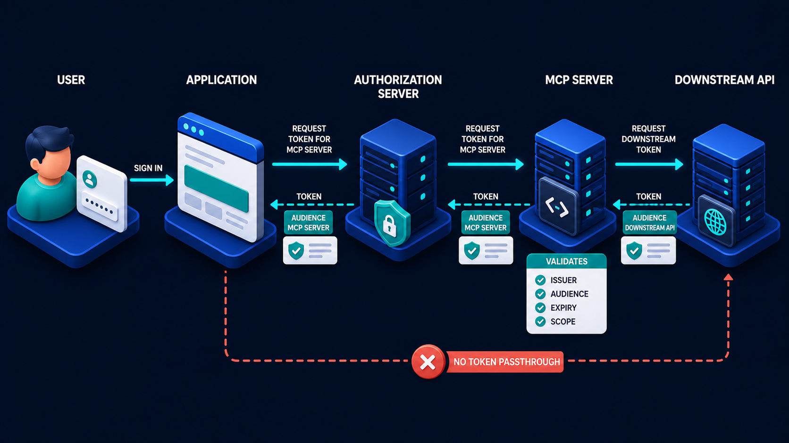

# Diagram 65 — Tenant Isolation and Secrets

**Module:** Security
**Role in the course:** keeping tenants apart and secrets out of everything
**Layout:** two mirrored tenant lanes with a deny boundary between them and a secret manager above

---

## At a glance

Two tenants, each with a **complete and separate stack** — user, app, memory, vector index, task store, audit — colour-coded blue and gold. Between them, a **red DENY line**. Above, a **secret manager** issuing short-lived handles into both. Below, a red banner: **NEVER LOG SECRETS**.

The mirroring is the argument. Isolation is not a filter applied at one point; it runs the full width of both lanes, through every store.

---

## What the diagram teaches

### 1. Isolation runs through every store, not just the database

Count what is duplicated: **MEMORY**, **VECTOR INDEX**, **TASK STORE**, **AUDIT**. Four stores, both lanes.

Teams reliably isolate the primary database. The other three are where cross-tenant leaks actually happen.

**Memory** — an agent's working and preference memory. A shared memory store keyed only by user ID leaks across tenants when IDs collide or when a preference is keyed by something ambiguous.

**Vector index** — the one most often shared, because vector databases are expensive and a shared index with tenant metadata filtering *looks* sufficient. It is not, for the same reason post-filtering fails in retrieval: relevance scores, result counts and ranking are all influenced by documents the caller cannot see.

**Task store** — long-running work. A task ID that is guessable or enumerable across tenants exposes what other tenants are doing.

**Audit** — tenant A's audit records must not be visible to tenant B, and in many regulated contexts tenant A must be able to receive their own audit trail without receiving anyone else's.

Drawing all four in both lanes says: isolate everything that holds data, not just the obvious one.

### 2. The deny line is between the lanes, and it is drawn twice

A **red dashed line with a central ✗** runs horizontally between the two lanes, labelled **DENY** on both sides. A second **DENY ✗** appears below the gold lane.

Two placements, and the second one matters: it says the boundary is not only *between the two tenants shown* but around each lane. Tenant gold is fenced below as well as above. Add a third tenant and it gets its own fence.

The arrows on the deny line point **both ways**. Blue cannot reach gold; gold cannot reach blue. Isolation is symmetric.

### 3. The colour coding is the isolation, made visible

Every element in the blue lane is blue. Every element in the gold lane is gold. Not one shared object between them.

That is worth pointing out explicitly when teaching, because the alternative architecture — one shared set of stores with a tenant column — would be drawn as a single lane with two coloured users feeding it. The fact that this diagram duplicates the entire stack is a design position.

It is a position with a cost. Two of everything is more expensive than one of everything with a filter. The trade is that isolation becomes structural rather than dependent on every query being written correctly.

### 4. The secret manager sits above both lanes and issues handles, not secrets

The **teal safe** at the top, labelled **SECRET MANAGER**, connects to a card reading **ISSUES SHORT-LIVED HANDLES**, from which teal lines descend into both lanes, each terminating in a **key badge**.

Three properties in that arrangement.

**Handles, not secrets.** What flows down is a reference that can be exchanged for access, not a credential itself. A handle that leaks is less useful than a secret that leaks.

**Short-lived.** Time-bounded. A stolen handle expires.

**Per-component.** Look at where the key badges land — on the app, the memory, the vector index, the task store, the audit. Each component gets its own, rather than one credential shared across the lane.

Per-component means a compromise of one component does not yield credentials for the others.

Those handles are exchanged for scoped tokens at each hop:

The audience claim is what makes a per-component handle meaningful. Without it, a handle issued to the vector index would work at the audit store.

### 5. NEVER LOG SECRETS is a banner, not a footnote

The red banner across the bottom, at full width, with a warning triangle.

It gets that prominence because it is the most common way secrets escape a system that otherwise handles them correctly.

The paths are mundane:

- An error handler that logs the full request, including headers.
- A debug log written during an incident and never removed.
- An exception message that includes a connection string.
- A trace span with request parameters attached.
- A crash dump.

None of these are attacks. All of them put credentials into systems with wide read access and long retention — which is exactly what a secret manager was introduced to avoid.

The banner sitting beneath both lanes says this applies everywhere, in both tenants, at every stage.

### 6. Audit is inside the tenant boundary, and that is a considered choice

**AUDIT** appears as the last stage in each lane, inside the tenant's outline, in the tenant's colour.

Per-tenant audit rather than one shared audit store. The reasoning is regulatory as much as technical: in many arrangements a tenant is entitled to their own audit trail, and delivering it must not involve extracting their records from a store containing everyone else's.

It also means an audit query cannot accidentally span tenants, which a shared store with a filter can.

---

## Case study — Kelmscott Cloud, the vector index everyone shared

Kelmscott provides a document-intelligence platform to about 90 professional-services firms — law, accountancy, architecture. Each firm's documents are confidential, and several are direct competitors of each other.

Their platform gives each firm an assistant that answers questions over their own document corpus.

### What was isolated and what was not

**Isolated properly:** the primary database. Separate schemas per tenant, with connection-level enforcement. This had been designed carefully and reviewed twice.

**Not isolated:** the vector index.

They ran one vector index for all 90 tenants, with a tenant ID stored as metadata on every chunk and applied as a filter at query time.

The reasoning was cost. A managed vector index is expensive; 90 of them was not viable at their price point. Metadata filtering was the standard pattern and their vendor's documentation recommended it.

### How it leaked

Not through returned documents. The filter worked — no chunk from another tenant was ever returned.

It leaked through **relevance behaviour**, and it was found by a customer.

A partner at one of the law firms noticed that a query about an unusual and quite specific commercial arrangement returned poor results with low relevance scores — but that a slightly reworded query returned good results. Curious, they experimented.

What they worked out, over about an hour, was that they could detect the presence of documents they could not see by observing how their own results were scored and ordered. The embedding space is shared; nearest-neighbour search is influenced by everything in it, and the filter is applied after the neighbourhood is computed.

They demonstrated to Kelmscott that they could establish, with reasonable confidence, that another tenant held documents concerning a specific named company and a specific transaction type.

Both firms acted for parties in the same sector. The partner reported it responsibly rather than exploiting it.

### The other three stores

The investigation that followed found two more.

**Task store shared, with sequential IDs.** Long-running document-analysis tasks were stored in one table with incrementing IDs. A caller could not read another tenant's task — that was checked — but they could observe which IDs existed and did not, which revealed volume and timing of other tenants' activity. For a competitor, knowing when a rival firm ran a large document analysis is meaningful.

**Memory shared, keyed by user ID.** User IDs were globally unique, so there was no collision. But the store was one store, and a query bug — which they found in review, unexploited — could return across tenants.

**Audit was already per-tenant**, correctly, because a regulated client had required it two years earlier. It was the only one of the four that had been done right, and it had been done right for a compliance reason rather than a security one.

### The rebuild

**Per-tenant vector indexes.** This was the expensive change and the one they had avoided. They moved to a vendor arrangement supporting namespace-level isolation with separate embedding spaces, which cost about 2.4× their previous vector spend.

Their CTO's framing to the board: the previous arrangement was not cheaper, it was **unpriced risk**.

**Per-tenant task stores**, with non-sequential identifiers. Both changes were needed — separation and unguessable IDs — because either alone leaves a signal.

**Per-tenant memory stores.**

**Per-component short-lived credentials.** Previously each tenant lane used one database credential across its components. Now each component holds its own handle from their secret manager, valid for 15 minutes and refreshed.

**A secret-scanning pass over logs.** This found what such passes always find: 11 instances of connection strings in exception messages, 4 of full request headers logged by an error handler, and one debug log added during a 2024 incident that had been writing bearer tokens for nineteen months.

That last one is the reason the banner sits at full width across the bottom of the diagram.

### What the customer did

The law firm stayed. Kelmscott disclosed the finding to all 90 tenants, explained the fix and the timeline, and offered independent verification.

Eleven tenants requested the verification. Two left.

### Results

- **Cross-tenant inference via vector search:** eliminated structurally.
- **Task-store enumeration:** eliminated.
- **Secrets found in logs:** 16 instances, all rotated, log retention reduced.
- **Vector infrastructure cost:** 2.4×, absorbed into pricing at renewal.

### The line their CTO now uses

*Metadata filtering tells you what you may return. It does not change what the search knew.*

---

## Composition

Two horizontal lanes with a boundary between them and a secret manager above.

**Top:** a teal **SECRET MANAGER** safe connected to a card reading **ISSUES SHORT-LIVED HANDLES**, from which teal lines descend and branch into both lanes, terminating in **key badges** above each component.

**TENANT BLUE** — a blue-outlined lane containing **USER → APP → MEMORY → VECTOR INDEX → TASK STORE → AUDIT**, all rendered in blue, connected by cyan arrows.

**TENANT GOLD** — a yellow-outlined lane containing the same six stages in gold.

**Between them:** a **red dashed line** with a central **red ✗**, labelled **DENY** with arrows pointing both ways.

**Below the gold lane:** a second **red ✗** labelled **DENY**, above a red-bordered banner with a warning triangle reading **NEVER LOG SECRETS**.

## Element by element

**SECRET MANAGER**
A **teal safe** with a combination dial, on a blue platform, linked to an outlined card carrying a teal key and the text **ISSUES SHORT-LIVED HANDLES**.

**Key badges**
Small circular teal badges with white key glyphs, one above each component in each lane.

**USER** — a coloured person figure (blue / gold).
**APP** — a browser window in the tenant colour.
**MEMORY** — a database cylinder with a chip motif, in the tenant colour.
**VECTOR INDEX** — a cube grid of small blocks, in the tenant colour.
**TASK STORE** — a clipboard with checked rows, in the tenant colour.
**AUDIT** — a shield with a check, in the tenant colour.

**The DENY boundary**
A red dashed horizontal line with a **red circular ✗** at centre, arrows pointing outward in both directions, labelled **DENY**.

**NEVER LOG SECRETS**
A red-outlined banner with a **red warning triangle**, spanning the frame's width.

## Colour and flow semantics

- **Blue and gold** encode tenancy — every element in a lane carries its tenant's colour, and no object is shared.
- **Teal** marks the secret manager and every key badge, distinguishing credential distribution from tenant data.
- **Red** marks both deny boundaries and the logging banner.
- **Cyan arrows** run within each lane only; no arrow crosses between them.
- The **bidirectional deny arrows** assert that isolation is symmetric.

## How to present it

**Count the stores in each lane.** Memory, vector index, task store, audit. Then ask which of the four their system isolates. The primary database is usually right; the other three are where leaks live.

**Ask about the vector index specifically.** Shared index with metadata filtering is the standard pattern and the standard vulnerability. Then tell the Kelmscott story — no chunk was ever returned across tenants, and a partner still established that a rival held documents on a named company.

**Give them the sentence.** *Metadata filtering tells you what you may return. It does not change what the search knew.* Relevance scores, result counts and ranking are computed over the shared space.

**Ask about task IDs.** Sequential identifiers leak volume and timing even when access is correctly refused. Ask what shape their IDs are.

**Point at the two deny lines.** The boundary is around each lane, not merely between the two shown. Add a tenant, add a fence. And the arrows point both ways.

**Ask what flows down from the secret manager.** Handles, not secrets. Short-lived. And **per component** — look at where the badges land. A compromise of one component does not yield the others' credentials.

**Spend real time on the banner.** Ask how secrets get into logs. Build the list: error handlers logging full requests, debug logs never removed, exception messages with connection strings, trace spans with parameters. None of these are attacks. Then give them Kelmscott's audit: a debug log writing bearer tokens for nineteen months.

**Handle the cost objection directly.** Per-tenant infrastructure is more expensive. Kelmscott's vector spend went up 2.4×. Their CTO's framing — the cheaper arrangement was unpriced risk — is the version that works with a board.

**Note why audit was already right.** A regulated client had required it two years earlier. Compliance pressure had accidentally produced the correct architecture for one store out of four. Worth mentioning: sometimes the requirement arrives before the understanding.

**Timing.** Thirty minutes. Forty if you audit which of the room's stores are genuinely per-tenant, which usually finds at least one shared.

---

## Lab and checkpoint

**Lab:** Audit the four stores in your system — memory, vector index, task store, and audit — for one tenant. For each, determine whether it is physically per-tenant or shared with metadata filtering. If shared, write the leak risk and the test that would reveal cross-tenant inference. Then audit your logs for any secret or token being written.

**Checkpoint:** Why does the secret manager issue short-lived handles, not secrets?

**Answer:** Because a handle can be scoped to a single component and revoked quickly. If a component is compromised, the attacker gets only that component's handle, not the secret itself and not the credentials for other components.

## Glossary

- **Audit** — the durable record of actions, which must be per-tenant.
- **Deny** — the boundary that prevents flow between tenants in either direction.
- **Handle** — a short-lived, scoped credential issued by the secret manager.
- **Memory** — the store for working or recallable agent state.
- **Metadata filtering** — filtering results after search, which does not prevent the search from knowing about other tenants.
- **Secret manager** — the component that issues handles and keeps secrets.
- **Task store** — the store for task lifecycle state.
- **Tenant** — an isolated customer or organisation boundary.
- **Vector index** — the searchable index, which must be isolated or leak through scores and counts.

## Sources

- Multi-tenant data isolation for memory, vectors, and tasks
- Secret managers and short-lived credentials
- Tenant isolation and side-channel prevention in retrieval
