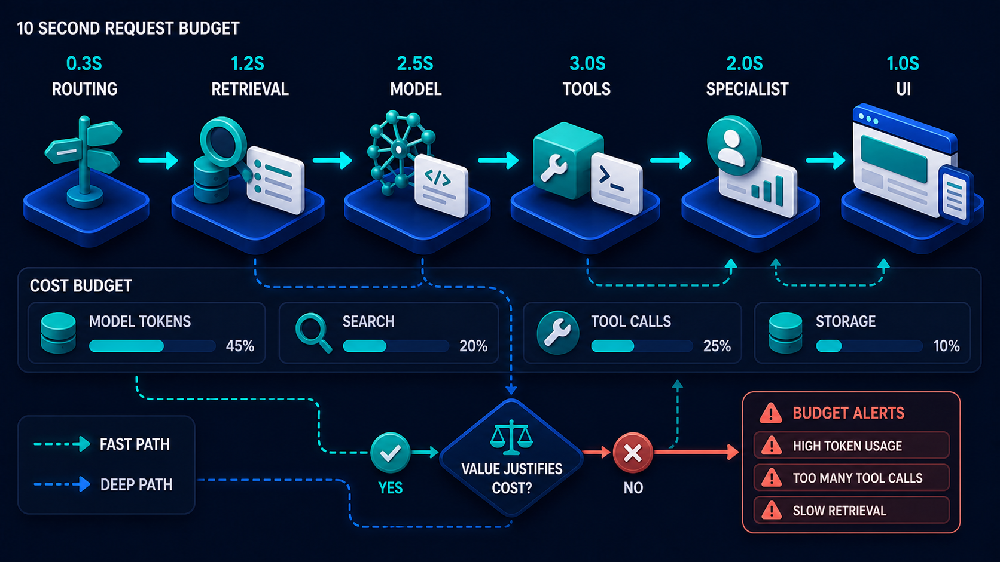

# Diagram 67 — One Request, One Trace

![A trace dashboard on dark navy headed TRACE RF-2048 with a full trace ID. Eight numbered stages run left to right — USER REQUEST, NEXT.JS API, AGENT PLAN, MCP TOOL, A2A SPECIALIST, VECTOR SEARCH, PAYMENT API, RESPONSE — each with a duration bar beneath. Seven bars are blue; the A2A SPECIALIST bar is red at 2.45s. Dashed arrows descend to four panels — CORRELATED LOGS listing timestamped entries with one WARN, CORRELATED METRICS showing total and p95 duration, CORRELATED COST showing tokens and tool calls, and CORRELATED ERROR showing SLOW SPAN DETECTED with threshold, impact and occurrence details.](../diagrams/67-one-request-observability-trace.png)

**Module:** Evaluation and operations
**Role in the course:** seeing one request completely
**Layout:** an eight-span trace with four correlated evidence panels beneath

---

## At a glance

One request, eight spans, with **every duration measured** — and one of them, **A2A SPECIALIST at 2.45s**, rendered in red against seven blue.

Beneath, four panels that all correlate to the same trace: **LOGS**, **METRICS**, **COST**, **ERROR**.

The single idea: for one request, you can see everything about it in one place — what it did, how long each part took, what it cost, what it logged, and what went wrong — and the trace ID is what joins them.

---

## What the diagram teaches

### 1. The trace ID is displayed in full, and that is a deliberate choice

The header reads **TRACE RF-2048** with the full identifier `9f7c2a4e-6b81-4d5f-a2b7-1e9d3c7b2048` beside it.

Two identifiers for two audiences. A short human-quotable reference and a full machine identifier.

That pairing matters operationally. A support agent talking to a customer can read "RF-2048" aloud. An engineer can paste the full ID into a query. Systems that expose only the long form make human correlation awkward; systems that expose only the short form risk collisions.

### 2. Eight spans, and they name the actual architecture

**USER REQUEST → NEXT.JS API → AGENT PLAN → MCP TOOL → A2A SPECIALIST → VECTOR SEARCH → PAYMENT API → RESPONSE**.

These are not generic stages. They are the specific components of a real system — a framework, a plan step, a capability call, a delegated specialist, a retrieval, an external payment API.

Instrumenting at component boundaries rather than at arbitrary intervals is what makes a span meaningful. "Span 3 took 340ms" is only useful if span 3 is a thing you can go and look at.

Note also that **AGENT PLAN is a span**. Planning is instrumented, which is unusual and correct — it is a real stage with a real duration and a real failure mode, and systems that only instrument I/O cannot see it.

### 3. One red bar among seven blue is the entire diagnostic

The durations: 120ms, 210ms, 340ms, 480ms, **2.45s**, 320ms, 680ms, 150ms.

Seven are unremarkable. One is five times the next largest, and it is coloured differently.

That is what a trace does that an aggregate cannot. Total duration is 4.74s, which tells you the request was slow. The span breakdown tells you **where**, and the answer is not distributed — it is one component.

Without spans, a 4.74s request produces a hunt. With them, it produces a name.

### 4. Four correlated panels, and "correlated" is the operative word in each title

Every panel is headed **CORRELATED**: logs, metrics, cost, error.

They are not four separate systems you consult and mentally join. They are four views of **this trace**, joined by its ID.

**CORRELATED LOGS** — timestamped entries for this request only: `User request received`, `Agent plan created`, `MCP tool executed`, a **WARN** reading `A2A specialist slow`, `Payment authorized`, `Response returned`.

Note the timestamps run from 10:15:30.123 to 10:15:34.093 — you can see the gap. The WARN at 10:15:33.263 sits exactly where the red span is.

**CORRELATED METRICS** — total duration 4.74s, p95 5.21s, throughput 128 rpm, error rate 0.8%. This request's numbers *in the context of* the system's numbers.

**CORRELATED COST** — total $0.0284, LLM tokens 24.1K, embedding tokens 6.3K, tool calls 5, external API cost $0.0127.

**CORRELATED ERROR** — `SLOW SPAN DETECTED`, A2A SPECIALIST 2.45s, threshold >1.00s, impact HIGH, first occurred 10:15:31.013, occurrences 3.

### 5. Cost per request is the panel most systems lack

Of the four, cost is the one teams least often instrument, and it is increasingly the one that determines whether a feature is viable.

The breakdown matters more than the total. **$0.0284** is a number. **LLM tokens 24.1K, embedding tokens 6.3K, tool calls 5, external API $0.0127** is a diagnosis — nearly half this request's cost is an external API call, which is a completely different optimisation target from token usage.

Cost attached to a trace also means cost can be attributed: per user, per tenant, per feature, per capability. Aggregate spend tells you what you spent; per-trace cost tells you what to do about it.

It is also what makes a budget enforceable rather than aspirational:

That diagram allocates; this one measures. A budget with no per-request measurement is a statement of intent.

### 6. The error panel distinguishes a threshold breach from a failure

**SLOW SPAN DETECTED** with a threshold of >1.00s. Nothing errored. The request succeeded, returned a response, and authorised a payment.

This is a **performance assertion**, not an exception. The system declared that a span exceeding one second is a problem, and this one did.

**Occurrences: 3** is the field that turns an observation into a signal. This is not a one-off; it has happened three times in the window. A single slow span is noise; a recurring one is a pattern.

### 7. Everything hangs off one identifier, and that is the whole architecture

The dashed arrows from every span down to the four panels are the diagram's structural claim: one ID, threaded through every component, referenced in every log line, every metric sample, every cost entry, every error.

Without it, these four panels are four separate systems with four separate query languages and a timestamp to correlate on — which, in a system handling 128 requests per minute, means correlating by guessing.

---

## Case study — Foxglove Retail, the payment flow that was slow on Tuesdays

Foxglove runs an e-commerce platform for about 700 independent retailers. Their checkout assistant handles order queries, applies promotions, verifies stock, and processes payment.

Customers reported that checkout was sometimes slow. Support could not reproduce it. Engineering could not find it.

### Six weeks of not finding it

The team had monitoring in the conventional sense. Each service logged. They had dashboards showing p50, p95 and p99 latency. Their error rate was low.

**The p95 was 5.2 seconds**, which they knew and had accepted as the cost of a multi-step checkout. The p50 was 1.8 seconds, which was fine.

What they could not do was look at **one slow request** and see where the time went. Their logs were per-service, in different formats, on different retention schedules, with no shared identifier.

Their investigation method was: find a slow request in the API gateway log, note the timestamp, and search five other systems for anything nearby. At 128 requests per minute, "nearby" contains dozens of candidates.

Three theories were pursued and abandoned: the payment provider, the vector search, and a database connection pool.

### What the trace showed in one afternoon

They implemented a trace ID at the API boundary, propagated it to every component, and added it to every log line, metric sample and cost record.

The first slow request they inspected showed exactly the shape in the diagram: seven ordinary spans and one at 2.45 seconds — **A2A SPECIALIST**.

Their specialist agent handles promotion eligibility, which is genuinely complex: stacking rules, retailer-specific terms, and customer history.

### The actual cause

Drilling into the specialist's own spans showed that it was making a **sequential series of eligibility checks**, one per applicable promotion.

For most orders there were one or two promotions. On Tuesdays, when several retailers ran overlapping weekly offers, some orders had eleven.

Eleven sequential checks at roughly 200ms each. That was the 2.45 seconds.

**Nobody had suspected the specialist** because it had no error rate, no timeout, and no alert. It was correctly returning correct answers, slowly, for a subset of orders on one day of the week.

### What the correlated panels added

**Logs** confirmed the sequence and the timing without ambiguity, because every line carried the trace ID.

**Cost** produced a second finding they had not been looking for. Each eligibility check involved a model call. An eleven-promotion order cost about **$0.19** against a typical $0.03.

Tuesdays were costing disproportionately, and nobody had known because cost was tracked monthly in aggregate. Attaching cost to traces made it attributable.

**Error** — once they set a span threshold at 1 second, the slow-span detection fired on about 4% of checkouts, clustered on Tuesdays and around promotional events. That gave them a measurable target.

### The fix and what it returned

Eligibility checks were parallelised, and the model call per check was replaced with a deterministic rules evaluation for the 80% of promotions with simple terms.

- **A2A specialist span:** 2.45s → 340ms at the same promotion count.
- **p95 checkout:** 5.2s → 2.1s.
- **Cost per order on high-promotion days:** $0.19 → $0.04.
- **Time to diagnose:** six weeks, then one afternoon.

### The practice they adopted

Every trace carries the eight spans, and their alerting is on **span-level thresholds** rather than only on total duration.

Their reasoning: a total-duration alert fires when the request is already unacceptable. A span-level threshold fires when one component starts degrading, which is usually weeks earlier.

### What their platform lead says about the six weeks

*Everything we needed was being logged the whole time. It was in five places with no way to join it.*

---

## Composition

A single bordered panel — a trace view — containing an eight-span timeline above four evidence panels.

**Header:** **TRACE RF-2048** at left, with **TRACE ID: 9f7c2a4e-6b81-4d5f-a2b7-1e9d3c7b2048** in a bordered tag at right.

**Timeline:** eight numbered stages left to right, each a white card icon on a blue platform with a cyan arrow to the next, and a **duration bar** beneath each. Seven bars are blue; the fifth is **red**.

**Beneath:** **dashed cyan arrows** rise from the timeline and descend to four dark panels — **CORRELATED LOGS**, **CORRELATED METRICS**, **CORRELATED COST**, **CORRELATED ERROR**.

## Element by element

**The eight spans**
**1 USER REQUEST** (person) 120ms · **2 NEXT.JS API** (`</>`) 210ms · **3 AGENT PLAN** (node tree) 340ms · **4 MCP TOOL** (teal cube) 480ms · **5 A2A SPECIALIST** (group of people) **2.45s, red** · **6 VECTOR SEARCH** (magnifier) 320ms · **7 PAYMENT API** (card) 680ms · **8 RESPONSE** (teal check) 150ms.

**CORRELATED LOGS**
Six timestamped rows: five **INFO** in blue and one **WARN** in amber reading `A2A specialist slow` at 10:15:33.263.

**CORRELATED METRICS**
Four rows with sparklines: **TOTAL DURATION 4.74s**, **P95 DURATION 5.21s**, **THROUGHPUT (RPM) 128**, **ERROR RATE 0.8%** with a red sparkline.

**CORRELATED COST**
Five rows: **TOTAL COST $0.0284**, **LLM TOKENS 24.1K**, **EMBEDDING TOKENS 6.3K**, **TOOL CALLS 5**, **EXTERNAL API COST $0.0127**.

**CORRELATED ERROR**
A red header reading **SLOW SPAN DETECTED / A2A SPECIALIST 2.45s**, above four rows: **THRESHOLD > 1.00s**, **IMPACT HIGH**, **FIRST OCCURRED 10:15:31.013**, **OCCURRENCES 3**.

## Colour and flow semantics

- **Cyan arrows** carry the span sequence; **dashed cyan** links spans to the correlated panels.
- **Blue duration bars** for normal spans; **one red bar** for the breach.
- **Amber** for the WARN log line; **red** for the error panel header and the error-rate sparkline.
- **Teal** marks the working icons within span cards.
- The **single bordered frame** presents everything as one view of one request, not four tools.

## How to present it

**Ask how they investigate one slow request.** If the answer involves several systems and a timestamp, name it: correlating by guessing. Then show one view.

**Point at the eight span names.** Real components, not generic stages. Then note that **AGENT PLAN** is instrumented — planning has a duration and a failure mode, and systems that only instrument I/O cannot see it.

**Read the eight durations aloud.** Seven ordinary, one at 2.45s. Ask what an aggregate would have told them: 4.74s total, which is a symptom. The breakdown gives a name.

**Walk the four panels and stress the word CORRELATED.** Four views of one trace, joined by one ID — not four systems you mentally join.

**Ask which panel they lack.** Almost always cost. Then show why the breakdown beats the total: half of this request's cost is an external API, which is a different optimisation target from token usage.

**Tell the Foxglove Tuesday story.** Eleven overlapping promotions, eleven sequential checks at 200ms, on one day of the week. No error rate, no timeout, no alert — correct answers, slowly, for a subset of orders. Six weeks of investigation, three wrong theories.

**Then give them the cost finding they were not looking for.** $0.19 versus $0.03 per order, invisible under monthly aggregate reporting. Per-trace cost makes spend attributable.

**Point at OCCURRENCES: 3.** A single slow span is noise; a recurring one is a pattern. Ask whether their alerting distinguishes them.

**Make the span-threshold argument.** A total-duration alert fires when the request is already unacceptable. A span-level threshold fires when one component starts degrading — usually weeks earlier. Ask which theirs does.

**Close on the line.** *Everything we needed was being logged the whole time. It was in five places with no way to join it.*

**Timing.** Twenty-five minutes. Thirty-five if you map the room's own request into spans and identify which they currently measure.

---

## Lab and checkpoint

**Lab:** Pick one real request in your system and draw it as a span trace with at least six stages. For each stage, record the duration and the component. Identify the slowest span and set a span-level threshold. Then add the four correlated views: logs, metrics, cost, and error, all joined by one trace ID.

**Checkpoint:** Why is a span-level threshold better than a total-duration alert?

**Answer:** Because a total-duration alert only fires when the whole request is already too slow. A span-level threshold fires when one component starts degrading, usually weeks before it becomes a total problem. It points to the cause, not the symptom.

## Glossary

- **Correlated cost** — the per-request cost breakdown, such as tokens and external API spend.
- **Correlated error** — the error panel showing threshold, impact, and occurrences for a single trace.
- **Correlated logs** — the logs joined to the trace by the trace ID.
- **Correlated metrics** — the aggregate metrics for the trace, such as total duration and error rate.
- **Span** — one timed stage in a request trace.
- **Span-level threshold** — the limit for a single component's duration.
- **Trace** — the complete view of one request across all components.
- **Trace ID** — the identifier that joins all observability data for one request.

## Sources

- Distributed tracing and span-level alerting
- OpenTelemetry and correlated observability
- Per-request cost attribution and analysis
