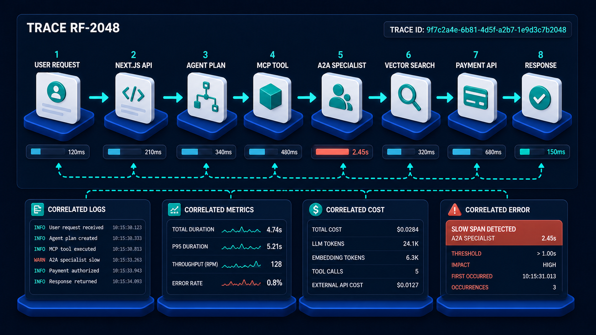

# Diagram 70 — Latency and Cost Budgets

![A budget diagram on dark navy headed 10 SECOND REQUEST BUDGET. Six stages run left to right with teal time allocations above — ROUTING 0.3S, RETRIEVAL 1.2S, MODEL 2.5S, TOOLS 3.0S, SPECIALIST 2.0S, UI 1.0S. Below, a COST BUDGET panel shows four bars — MODEL TOKENS 45%, SEARCH 20%, TOOL CALLS 25%, STORAGE 10%. A legend distinguishes a teal dashed FAST PATH from a blue dashed DEEP PATH. A blue diamond reads VALUE JUSTIFIES COST? with a teal YES check and a red NO cross leading to a coral BUDGET ALERTS panel listing HIGH TOKEN USAGE, TOO MANY TOOL CALLS and SLOW RETRIEVAL.](../diagrams/70-latency-and-cost-budgets.png)

**Module:** Evaluation and operations
**Role in the course:** spending time and money deliberately
**Layout:** a time budget across six stages, a cost budget in four categories, two routing paths, and a value gate

---

## At a glance

**Ten seconds, allocated.** Six stages with named time budgets that sum to exactly the total. **Cost, allocated** — four categories summing to 100%. Two paths through the system, **FAST** and **DEEP**. And a gate asking **VALUE JUSTIFIES COST?** with alerts on the failure side.

The discipline is the point. Both budgets are stated as allocations rather than observed as outcomes, which means exceeding one is a decision you detect rather than a surprise you discover.

---

## What the diagram teaches

### 1. The time budget sums exactly, and that forces the trade

0.3 + 1.2 + 2.5 + 3.0 + 2.0 + 1.0 = **10.0 seconds**.

Nothing is left over. Every stage's allocation comes out of another stage's, which is what makes this a budget rather than a wishlist.

The practical consequence: improving one stage's quality by giving it more time is a decision to take that time from somewhere else. Adding a reranker to retrieval costs 400ms, and that 400ms has to come from the model, the tools, or the user's patience.

Systems without an explicit budget make this trade constantly and invisibly. Each change looks affordable in isolation; the aggregate drifts until someone notices the request takes fourteen seconds.

### 2. Tools have the largest allocation, and that reflects where time actually goes

**TOOLS 3.0S** is the biggest single line, with **MODEL 2.5S** second.

That ordering surprises people who assume model inference dominates. In a production agent system it usually does not. Tool calls reach external systems with their own latency, their own queues and their own bad days — and there are often several of them per request.

Note also **ROUTING 0.3S** — small, and non-zero. Deciding what kind of request this is takes real time and it is worth accounting for rather than folding into the model's allocation.

### 3. The cost budget is proportional, not absolute, and that is the right shape

**MODEL TOKENS 45%, SEARCH 20%, TOOL CALLS 25%, STORAGE 10%.**

Percentages rather than currency, because the absolute figure changes with volume, pricing and model choice while the *shape* is what you manage.

The shape tells you where optimisation effort belongs. At 45%, halving token usage moves total cost by 22 points. At 10%, eliminating storage entirely moves it by 10.

It also makes drift detectable. If tool calls rise from 25% to 40% of spend, something changed in how the system uses tools — even if total cost is flat because volume dropped.

### 4. Two paths, and the choice is the largest lever in the diagram

The legend distinguishes a **teal dashed FAST PATH** from a **blue dashed DEEP PATH**, and both feed the value gate.

Not every request deserves the full budget. A simple factual lookup does not need retrieval, a specialist, and 2.5 seconds of model time. A complex multi-part analysis does.

Routing between them is worth more than most micro-optimisations. If 70% of traffic can take a fast path costing 1.5 seconds and a fifth of the token spend, that is a far larger effect than shaving 200ms off retrieval for everyone.

The risk is misrouting: a complex request sent down the fast path produces a shallow answer, which is worse than a slow good one. The routing decision needs to be measured, which is what route accuracy in the previous diagram is for.

### 5. VALUE JUSTIFIES COST? is a gate, and it is the diagram's most unusual element

A blue diamond — the only decision shape in the frame — with a **teal YES** and a **red NO**.

This asks a question most systems never ask: **is this request worth what it is about to cost?**

Concretely it can mean: a request already at 80% of its token budget with more work planned; a deep-path request from a context where a fast answer would do; a retry sequence whose cumulative cost has exceeded the value of the outcome.

The **NO** branch does not fail the request. It leads to **BUDGET ALERTS** — the system notices and reports rather than silently spending.

### 6. Three named alerts, and each points at a specific cause

**HIGH TOKEN USAGE** — context is too large, or the model is being called too many times.

**TOO MANY TOOL CALLS** — the plan is inefficient, or something is looping. This is the alert that catches retry bugs and re-derivation.

**SLOW RETRIEVAL** — the index is degrading, or the query is too broad.

Naming three specific conditions rather than one generic "over budget" is what makes the alert actionable. Each has a different investigation.

### 7. The dashed lines from stages into the cost panel show which stages spend what

Follow the dashed lines: **retrieval** and **model** feed downward into the cost panel; **tools** and **specialist** feed upward from it.

Time and cost are correlated but not identical. A stage can be fast and expensive — a single large model call. A stage can be slow and cheap — waiting on an external API. Managing both budgets separately, with the mapping between them visible, is more useful than a single "efficiency" measure.

Neither budget is enforceable without per-request measurement:

That diagram's **CORRELATED COST** panel is where this diagram's four categories are actually observed, per request. Allocation without measurement is a statement of intent.

---

## Case study — Cardew Insurance, the ten-second promise

Cardew sells motor and home insurance direct. Their quote assistant answers coverage questions and produces indicative quotes, and it sits on the critical path to a sale.

Their product team had a hard requirement: **a quote in under ten seconds**, because their analytics showed abandonment rising steeply past that point.

### Where they started

No budget. Median 6.2 seconds, p95 at 13.4, and a slow drift upward — roughly 4% a month — as features were added.

Every individual addition had been justified. A reranker for better retrieval. A second tool call for flood risk. A specialist agent for non-standard risks. Each cost a few hundred milliseconds and each was worth it.

The aggregate was not.

### Setting the budget

They allocated ten seconds across six stages, closely matching the diagram, and the allocation exercise itself produced three findings before any code changed.

**Nobody could say what routing cost.** It was folded into the first model call. Measuring it separately showed 0.9 seconds — three times what they eventually allocated — because routing was using the same large model as the main reasoning step.

**Tools were the largest consumer and the least examined.** 3.4 seconds median across an average of 4.2 calls. Two of those calls were to the same external service, sequentially, for data that could have been fetched in one request.

**The specialist agent was invoked on 34% of quotes and needed on about 8%.** The routing rule that sent quotes to it was far too broad.

### What the budget changed

**Routing moved to a small fast model.** 0.9s → 0.25s, with no measurable loss in routing accuracy. This was the single cheapest win and it had been invisible because routing was not a measured stage.

**Tool calls were parallelised and de-duplicated.** 3.4s → 2.1s. The duplicate external call was the embarrassing part: two teams had added a call to the same flood-risk service, independently, four months apart.

**Specialist routing was tightened.** From 34% of quotes to 11%, based on a set of explicit non-standard-risk criteria rather than a broad heuristic. This removed 2 seconds from a quarter of all quotes.

**A fast path was introduced.** Quotes for standard risks on standard cover — about 55% of traffic — skip the specialist entirely and use a reduced retrieval depth. Median 2.8 seconds.

### The cost budget, which they had never had at all

They had a monthly inference bill and no idea of its shape. Attributing cost per request produced the four-way split and one significant surprise.

**Search was 31% of cost, not the 8% they assumed.** Their retrieval was calling an embedding model on every query, including for the 40% of queries that were near-duplicates of recent ones. Caching query embeddings for five minutes cut search cost by about two thirds.

**Tool calls were 29%**, largely the external flood-risk and vehicle-data services, which are billed per call. The de-duplication that saved 1.3 seconds also saved real money.

### The value gate

They implemented it narrowly: a quote that has consumed more than 70% of its token budget with further steps planned triggers a decision.

In practice it fires on about 0.4% of quotes, almost all of them unusual multi-vehicle or multi-property cases. The system does not refuse them; it flags them, and they are reviewed weekly.

That review found a real defect within a month: a class of quote where a retry loop re-fetched the same vehicle data up to nine times. It had been invisible because the quotes completed successfully and nobody was looking at cost per quote.

### Results

- **p95 latency:** 13.4s → 6.8s.
- **Median:** 6.2s → 3.4s (2.8s on the fast path, 5.9s deep).
- **Cost per quote:** down about 44%.
- **Quote abandonment:** down 19%, which was the number the product team cared about.
- **Monthly drift:** eliminated, because every new feature now has to name where its time comes from.

That last item is the one their engineering lead considers most valuable. A budget does not only fix the current state; it makes every future addition state its price.

### The rule they added to design review

*Any change that adds latency must say which stage's allocation it is taking from.*

---

## Composition

Three horizontal bands.

**Upper:** the heading **10 SECOND REQUEST BUDGET**, then six stages left to right, each with a **teal time allocation** above its label — **ROUTING 0.3S**, **RETRIEVAL 1.2S**, **MODEL 2.5S**, **TOOLS 3.0S**, **SPECIALIST 2.0S**, **UI 1.0S** — connected by cyan arrows.

**Middle:** a bordered **COST BUDGET** panel containing four labelled bars: **MODEL TOKENS 45%**, **SEARCH 20%**, **TOOL CALLS 25%**, **STORAGE 10%**. Dashed lines connect it to the stages above — descending from retrieval and model, ascending to tools and specialist.

**Lower:** a legend distinguishing **FAST PATH** (teal dashed) from **DEEP PATH** (blue dashed); a **teal YES check** feeding a blue diamond reading **VALUE JUSTIFIES COST?**; a **red NO cross** leading right to a coral-bordered **BUDGET ALERTS** panel listing **HIGH TOKEN USAGE**, **TOO MANY TOOL CALLS**, **SLOW RETRIEVAL**.

## Element by element

**The six stages**
**ROUTING** — a teal signpost. **RETRIEVAL** — a magnifier over database cylinders with a results card. **MODEL** — a teal node network with a `</>` card. **TOOLS** — a teal cube with a wrench and a terminal card. **SPECIALIST** — a teal person disc with a bar-chart card. **UI** — a browser window.

**The cost bars**
Four rows, each with a teal circular icon and a partially-filled teal bar: a database (**MODEL TOKENS**), a magnifier (**SEARCH**), a wrench (**TOOL CALLS**), a database (**STORAGE**).

**The value gate**
A blue **diamond** containing white scales, reading **VALUE JUSTIFIES COST?**, with a **teal check disc** labelled **YES** to its left and a **red ✗ disc** labelled **NO** to its right.

**BUDGET ALERTS**
A coral-bordered panel with a warning triangle heading, listing three rows each with a coral warning icon.

## Colour and flow semantics

- **Cyan arrows** carry the stage sequence.
- **Teal dashed** marks the fast path; **blue dashed** marks the deep path — two routes, visually distinguished.
- **Coral** marks the NO branch and the alerts panel.
- **Teal** marks every time allocation, every cost bar, and the YES branch.
- The **diamond** is the only decision shape, and it asks about value rather than correctness.

## How to present it

**Add the six times up in front of the room.** Exactly ten. Then ask what happens when someone adds a reranker. The 400ms comes from somewhere, and a budget forces that to be a decision.

**Ask which stage they expect to be largest.** Most say the model. It is tools, at 3.0 seconds. Then ask how many tool calls a typical request in their system makes, and whether any of them are duplicates.

**Tell the Cardew duplicate-call finding.** Two teams added a call to the same flood-risk service, four months apart, independently. Fixing it saved 1.3 seconds and real money. Ask when the room last enumerated their outbound calls.

**Ask about routing cost.** Cardew's was 0.9 seconds because routing used the same large model as reasoning. Moving to a small model took it to 0.25s with no accuracy loss. This is the cheapest win in the case study and it was invisible because routing was not a measured stage.

**Ask what shape their cost is.** Not the total — the split. Cardew assumed search was 8% and it was 31%, because they were embedding every query including near-duplicates. Percentages tell you where optimisation effort belongs.

**Ask about the two paths.** What fraction of their traffic genuinely needs the full pipeline? Cardew's specialist was invoked on 34% of quotes and needed on 8%. Routing is a bigger lever than micro-optimisation.

**Introduce the value gate carefully.** Most rooms have never considered asking whether a request is worth its cost. Cardew's narrow implementation — 70% of token budget with work remaining — fires on 0.4% of quotes and found a nine-times retry loop within a month.

**Read the three alert names and ask what each investigation would be.** Different causes, different fixes. A generic "over budget" alert is not actionable.

**Close on the design-review rule.** *Any change that adds latency must say which stage's allocation it is taking from.* That sentence is what stopped Cardew's 4%-a-month drift.

---

## Lab and checkpoint

**Lab:** For one request in your system, allocate a 10-second latency budget across six stages and a cost budget across four categories. Then list the outbound calls, embeddings, and model calls it makes. Identify one duplicate, one misrouted call, or one over-budget stage and write the change that would bring the budget back in line.

**Checkpoint:** Why is the value gate a question, not a boolean budget check?

**Answer:** Because the value of a request can vary. A high-cost, high-value request may be justified, while the same cost for a low-value request is not. The gate asks whether the value justifies the cost, not just whether the cost is below a fixed limit.

## Glossary

- **Budget alert** — a warning that a request has exceeded a latency or cost allocation.
- **Cost bar** — the visual breakdown of cost across model tokens, search, tool calls, and storage.
- **Deep path** — the full pipeline for requests that need it.
- **Fast path** — a shortcut for requests that do not need the full pipeline.
- **Latency budget** — the time allocated to each stage of a request.
- **Routing** — the stage that decides which path the request should take.
- **Specialist** — a stage that delegates to an external agent or model.
- **Stage** — one of the six timed parts of the request.
- **Value gate** — the decision that asks whether the request's value justifies its cost.

## Sources

- Latency and cost budgeting for agent systems
- Fast path / deep path routing and stage budgets
- Cost attribution and value-based resource allocation

**Timing.** Twenty-five minutes. Thirty-five if you allocate a budget for the room's own request, which reliably produces an argument about tools versus model.
