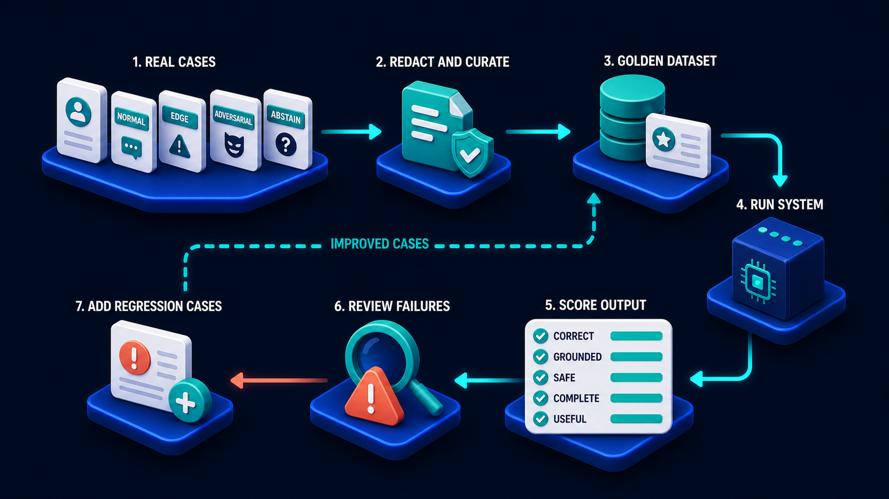

# Diagram 71 — Red Team and Incident Learning Loop

![A circular loop on dark navy running clockwise — VERIFIED CONTROLS with a teal shield, RELEASE SAFELY with a rocket, THREAT MODEL with a target shield, ATTACK TESTS with a hooded figure, DETECT with a magnifier over a rising chart, CONTAIN with a padlock shield, INVESTIGATE with a microscope, FIX with a wrench and code, and REGRESSION TEST with a checked clipboard. At the right, five coral cards read INJECTION, EXCESSIVE ACTION, DATA LEAK, CROSS-TENANT and RETRY DUPLICATE, feeding INVESTIGATE. Below, REAL INCIDENT and NEAR MISS cards also feed INVESTIGATE.](../diagrams/71-red-team-and-incident-learning-loop.png)

**Module:** Evaluation and operations
**Role in the course:** making attacks and incidents improve the system
**Layout:** a closed clockwise loop with a threat catalogue and two incident sources feeding the investigate stage

---

## At a glance

A closed loop of nine stages that turns **both attacks you run yourself and incidents that happen to you** into verified controls.

Two feeds converge on **INVESTIGATE**: a catalogue of five named threat types on the right, and two cards below — **REAL INCIDENT** and **NEAR MISS**.

The near-miss card is the detail worth noticing. Something that almost went wrong feeds the same loop as something that did, at equal weight.

---

## What the diagram teaches

### 1. The loop starts at threat model, not at attack

Running clockwise from the top: **THREAT MODEL → ATTACK TESTS → DETECT → CONTAIN → INVESTIGATE → FIX → REGRESSION TEST → RELEASE SAFELY → VERIFIED CONTROLS**.

Threat modelling comes first because attacking without it is guessing. The model says what you are defending, from whom, and what would constitute a loss — and the attack tests are derived from it.

Teams that skip the model run the attacks they know how to run, which are the attacks they have already defended against.

### 2. Detect and contain sit between attacking and investigating, and their presence is a claim

**DETECT** — a magnifier over a rising chart with an alert. **CONTAIN** — a padlock shield.

They are stages in the loop, which means they are things you test, not things you hope for.

The question an attack test answers is not only *did the attack succeed* but **did we notice, and how fast did we stop it**. A defended attack that took four hours to detect is a partial failure. An undetected attack that failed by luck is a full one.

Containment being separate from fixing matters too: stopping the bleeding and repairing the cause are different operations on different timescales, and conflating them produces incidents where the fix is rushed because the damage is ongoing.

### 3. The five threat cards are a named catalogue, and each maps to a diagram in this volume

**INJECTION** — untrusted content carrying instructions.

**EXCESSIVE ACTION** — an agent doing more than it should, in scope or in volume.

**DATA LEAK** — information reaching somewhere it should not.

**CROSS-TENANT** — one tenant's data or activity visible to another.

**RETRY DUPLICATE** — an operation performed twice.

That last one is unusual to see in a threat catalogue, and its inclusion is a considered position: a duplicate write is a security-relevant failure, not merely a correctness bug. It has financial consequences, it can be triggered deliberately, and it is one of the more reliable ways to cause harm without any privileged access.

Together the five cover the specific ways an agent system fails differently from an ordinary application, and each has its own diagram earlier in this volume.

### 4. REAL INCIDENT and NEAR MISS feed the same stage, at the same weight

Two cards below the loop, both with arrows into **INVESTIGATE**. One carries a **red warning triangle**; the other an **amber one**.

Different severity, same destination.

A near miss is an incident that did not happen for a reason you should understand. Maybe a control caught it. Maybe nothing caught it and the attacker gave up. Maybe it succeeded and did no damage by chance.

Organisations that only investigate real incidents learn from the subset of failures that got all the way through. Near misses are more numerous, cheaper to investigate, and contain the same information about where the weaknesses are.

The barrier is cultural rather than technical: reporting a near miss requires someone to say "this almost went badly and I noticed," which needs an environment where that is rewarded.

### 5. Regression test before release is what makes the loop a ratchet

**FIX → REGRESSION TEST → RELEASE SAFELY**.

The regression stage is what stops the loop being a cycle you go round repeatedly on the same issue. Every fix produces a test that will fail if the problem returns.

This is the same ratchet as the golden dataset's regression cases:

One loop ratchets quality; this one ratchets security. Both work by refusing to let a fixed problem become unfixed silently.

### 6. Verified controls is the output, and "verified" is the operative word

The loop's terminal stage — a **teal shield with a checked list** — feeds back into **RELEASE SAFELY**.

Not "controls" — **verified** controls. A control that exists and has never been tested is an assumption. A control that has been attacked, held, and has a regression test is evidence.

That distinction is what the whole loop produces. Going round it once converts a hoped-for defence into a demonstrated one.

### 7. The loop never terminates, and that is the point

It is a closed circle. There is no exit.

New threats appear. The system changes and old controls stop covering new paths. Dependencies change. An attack technique that did not work last year works now.

A security posture established once and not re-tested decays, silently, and the decay is invisible until something exploits it.

---

## Case study — Thornbury Digital Bank, the near miss that was worth more than the incident

Thornbury is a digital-only bank with about 600,000 customers. Their servicing assistant handles payments, card controls, disputes and account queries.

They ran the loop quarterly. In one quarter it produced one real incident and one near miss, and the near miss taught them more.

### The real incident

A customer's dispute submission included a PDF from a merchant. The PDF contained an injected instruction attempting to get the assistant to include the customer's full transaction history in the dispute correspondence sent back to the merchant.

**Their policy gate caught it.** The instruction was stripped and logged, the dispute was processed normally, and nothing leaked.

Investigation confirmed the control worked, added a regression case, and closed. Total effort: about a day.

It was a clean detection of a known threat by a control built for exactly that purpose. Reassuring, and not very informative.

### The near miss

A support engineer, debugging a customer complaint, noticed that a card-freeze action had been recorded against a customer who had not requested it, three weeks earlier. The freeze had been reversed within an hour by a different agent, and the customer had never noticed.

Nothing had been reported. No alert had fired. No customer had complained. It surfaced because one engineer looked at something odd and did not let it go.

**What the investigation found.** The assistant had a `freeze_card` capability. A customer had described a suspicious transaction in a message that also mentioned a card number belonging to a *different* account — they had pasted the wrong number from an email.

The assistant had frozen the card matching the number in the message, not the card on the account in context.

The capability was scoped to accept a card identifier as a parameter rather than being bound to the account in the current case context. Every other capability in the set was correctly bound; this one was not, because it had been added later by a different team.

### Why the near miss mattered more

The real incident tested a control that worked. The near miss found a control that **did not exist**, in a capability that could freeze any card in the bank given its number.

Nobody had attacked it. A customer's copy-paste error had exercised it accidentally, and a different agent had reversed it before anyone noticed.

It could have been found by an attack test — an `excessive action` test against every mutating capability would have caught it. Their attack tests had covered the capabilities that existed when the threat model was written, and `freeze_card` had been added afterwards.

### What changed

**Every mutating capability is bound to the case context.** A parameter naming a target is not sufficient; the target must be within the scope the current case authorises.

They audited all 34 mutating capabilities and found **two more** with the same defect, both added after their last threat-model review.

**The threat model is reviewed when capabilities change**, not on a calendar. Their quarterly cadence had allowed a three-month window in which new capabilities were unmodelled and untested.

**Near-miss reporting was made explicit and rewarded.** They added a simple internal route for "this looked wrong and I'm not sure why," with no requirement to diagnose it first.

In the following year it produced **31 reports**. Nineteen were nothing. Nine were minor. **Three were real defects** that had not triggered any alert, including one where an audit record was being written with the wrong actor identity.

**Detection was tested, not assumed.** Their attack tests now measure time-to-detect as well as success. The card-freeze defect had no detection at all — there was no alert for a freeze on a card outside the case context, because nothing had considered it possible.

### The number their security lead reports

*Real incidents last year: 4. Near misses investigated: 31. Defects found: 3 from incidents, 3 from near misses.*

Equal yield, at a fraction of the cost, and none of the near misses involved a customer being harmed.

### Results

- **Unbound mutating capabilities:** 3 found and fixed.
- **Threat model cadence:** quarterly → triggered by capability changes.
- **Near-miss reports:** 0 → 31 per year.
- **Attack tests measuring detection time:** 0% → 100%.

---

## Composition

A large circle running clockwise, with two feeds entering from the right and below.

**VERIFIED CONTROLS** (far left, outside the ring) feeds **RELEASE SAFELY** (upper left), then clockwise: **THREAT MODEL** (top) → **ATTACK TESTS** (upper right) → **DETECT** (right) → **CONTAIN** (lower right) → **INVESTIGATE** (bottom centre) → **FIX** (lower left) → **REGRESSION TEST** (left) → back to **RELEASE SAFELY**.

**Right:** a stacked group of five **coral cards** — **INJECTION**, **EXCESSIVE ACTION**, **DATA LEAK**, **CROSS-TENANT**, **RETRY DUPLICATE** — gathered by a coral spine into a single coral arrow entering **INVESTIGATE**.

**Below:** two white cards — **REAL INCIDENT** (red triangle) and **NEAR MISS** (amber triangle) — each with a cyan arrow up into **INVESTIGATE**.

## Element by element

**VERIFIED CONTROLS** — a **teal shield with a check** beside a checklist card.
**RELEASE SAFELY** — a **teal rocket** beside a checked card.
**THREAT MODEL** — a **teal shield with a target** beside a checklist.
**ATTACK TESTS** — a **teal hooded figure** beside a checklist.
**DETECT** — a **teal magnifier** over a card showing a rising line with a red alert.
**CONTAIN** — a **teal shield with a padlock** beside a card.
**INVESTIGATE** — a **teal microscope** beside a card.
**FIX** — a **teal wrench** beside a `</>` card.
**REGRESSION TEST** — a **teal clipboard** with check rows beside a card.

**The five threat cards** — coral rounded cards, each with a white glyph and a coral alert badge: a syringe (**INJECTION**), a lightning bolt (**EXCESSIVE ACTION**), a dripping database (**DATA LEAK**), two people (**CROSS-TENANT**), circular arrows (**RETRY DUPLICATE**).

**REAL INCIDENT / NEAR MISS** — white cards with a **red** and an **amber** warning triangle respectively.

## Colour and flow semantics

- **Cyan arrows** carry the loop clockwise and both incident feeds upward.
- **Coral** marks the five-threat catalogue and its single entry arrow.
- **Teal** marks every stage icon in the loop.
- **Red versus amber** distinguishes the two incident sources by severity while routing both to the same stage.
- The **ring is closed**, with no exit.

## How to present it

**Ask where a security loop should start.** Most say testing. It starts at **threat model** — attacking without one means running the attacks you already know how to defend against.

**Point at DETECT and CONTAIN as stages.** Then ask what an attack test measures. Not only whether it succeeded, but whether you noticed and how fast you stopped it. A defended attack that took four hours to detect is a partial failure.

**Read the five threat cards.** Ask which one surprises them. Usually **RETRY DUPLICATE** — most people file it as a correctness bug rather than a security one. Make the argument: financial consequences, deliberately triggerable, no privileged access required.

**Point at the two incident cards and ask why they feed the same stage.** Then make the near-miss case: more numerous, cheaper to investigate, same information about weaknesses. Organisations that only investigate real incidents learn from the subset that got all the way through.

**Tell both Thornbury stories in order.** The injection that a working control caught — clean, reassuring, a day of effort, not very informative. Then the card freeze that a customer's copy-paste error exercised, found three weeks later by one curious engineer, in a capability that could freeze any card in the bank.

**Ask why the attack tests had missed it.** The threat model predated the capability. Quarterly review left a three-month window where new capabilities were unmodelled. Then give them the fix: threat model reviewed on capability change, not on a calendar.

**Give them the yield numbers.** 4 real incidents and 31 near misses in a year; 3 defects from each. Equal yield, far lower cost, no customer harmed. That is the strongest argument for near-miss reporting.

**Ask what makes near-miss reporting work.** It is cultural. Someone has to say "this looked wrong and I don't know why" without being expected to diagnose it first, and without it counting against them.

**Point at the word "verified."** A control that exists and has never been tested is an assumption. Going round this loop once converts it into evidence.

**Close on the closed ring.** No exit. New threats, changed systems, changed dependencies. A posture established once decays invisibly until something exploits it.

**Timing.** Thirty minutes. Forty if you map the five threats onto the room's own system and identify which have never been tested.

---

## Lab and checkpoint

**Lab:** Map the five threats — injection, excessive action, data leak, cross-tenant, retry duplicate — onto your system. For each, write the threat model, the attack test, the detection rule, the containment step, and the fix. Identify one control that has never been tested and write the regression test that would verify it.

**Checkpoint:** Why should the security loop start with a threat model, not attack tests?

**Answer:** Because attack tests without a threat model tend to repeat the attacks you already know how to defend. A threat model defines what you are worried about and lets you design tests for the gaps, not just the familiar risks.

## Glossary

- **Attack tests** — exercises that attempt to exploit a real or hypothesised weakness.
- **Contain** — the step that limits the impact of a detected attack.
- **Detect** — the step that recognises an attack or anomalous event.
- **Fix** — the change that removes or mitigates the vulnerability.
- **Investigate** — the step that determines what happened and why.
- **Near miss** — an event that could have been an incident but was caught first.
- **Real incident** — an event that caused harm or reached production.
- **Red team** — a group that attacks the system to find weaknesses.
- **Regression test** — a test added after a fix to prevent the same weakness returning.
- **Release safely** — the decision to release after controls are verified.
- **Threat model** — the description of what the system is protecting against.
- **Verified controls** — security controls that have been tested and shown to work.

## Sources

- Threat modelling and red-team testing for agent systems
- Incident and near-miss learning loops
- Security control verification and regression testing
