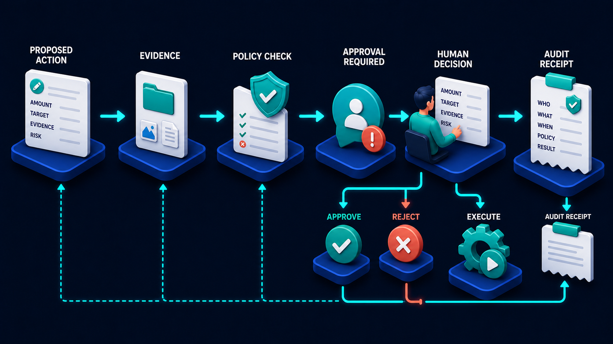

# Diagram 75 — Interrupts, Approval, and Steering

![A flow on dark navy. PLAN shows a checked clipboard with a pencil. CHECK POLICY shows a teal shield with a POLICY OK card. PAUSE shows a large white APPROVAL CARD listing PROPOSED ACTION, EVIDENCE and RISK with a graded bar, a clock reading EXPIRES IN 10 MINUTES, and APPROVE, REJECT and EDIT buttons. To the right, STEERING CONTROLS lists ADD CONTEXT, CHANGE PRIORITY and CANCEL, linked by a double-headed arrow. A card reads NEW INPUT NEVER SILENTLY REWRITES COMPLETED ACTIONS. REVALIDATE, a teal refresh shield, branches to RESUME and to a coral INVALIDATE AND REPLAN.](../diagrams/75-interrupts-approval-and-steering.png)

**Module:** The complete system
**Role in the course:** letting a human intervene without breaking the work
**Layout:** plan and policy into a pause with an approval card, steering controls alongside, and a revalidation branch

---

## At a glance

Work plans, policy is checked, and then it **pauses** — presenting an approval card with a proposed action, evidence, a graded risk bar, an expiry, and three buttons.

Alongside sit **steering controls**: add context, change priority, cancel. And critically, whatever the human does next goes through **REVALIDATE**, which either resumes or invalidates and replans.

The card in the middle states the rule that makes all of this safe: **NEW INPUT NEVER SILENTLY REWRITES COMPLETED ACTIONS.**

---

## What the diagram teaches

### 1. The approval card carries four things, and the risk bar is graded

**PROPOSED ACTION**, **EVIDENCE**, **RISK** with a **teal-amber-red graded bar**, and **EXPIRES IN 10 MINUTES**.

The graded bar is the detail worth noticing. Risk is not a boolean or a label — it is a position on a scale, shown visually.

That lets a reviewer calibrate. An action at the low end of the bar can be approved quickly; one at the high end deserves the evidence being read properly. A binary "high risk" flag on everything above a threshold produces reviewers who stop distinguishing.

### 2. The expiry is on the card, and it is the operational detail teams forget

**EXPIRES IN 10 MINUTES**, with a clock.

An approval that waits forever is an operational leak. Work accumulates in a pending state, resources stay allocated, and eventually somebody approves something whose context has moved on.

Ten minutes is a specific choice and the right kind of choice: short enough that the evidence is still current, long enough for a human to actually look.

The important design question the expiry raises is **what happens when it elapses**. It must be defined — cancel, escalate, or route to a default — and it must not be "nothing," which is what an unexpired card effectively chooses.

### 3. Three buttons, and EDIT is the interesting one

**APPROVE** (teal), **REJECT** (coral), **EDIT** (blue).

Approve and reject are expected. **Edit** is not, and it is the option that reflects how review actually works.

A reviewer frequently agrees with the intent and disagrees with a detail. The amount is slightly wrong. The target should be a different record. A parameter needs adjusting.

Without edit, that reviewer has two bad choices: approve something not quite right, or reject and force a full replan. Edit lets them correct and proceed — and, because of revalidation, the correction is checked rather than trusted.

### 4. Steering controls are separate from approval, and the double-headed arrow says why

**ADD CONTEXT**, **CHANGE PRIORITY**, **CANCEL**, connected to the pause by a **double-headed cyan arrow**.

Approval is a decision about **this specific proposed action**. Steering is intervention in **the work as a whole**.

They are different in kind. A user might not want to approve or reject anything — they want to add a piece of information the agent did not have, or say that this is now urgent, or stop the whole thing.

The double-headed arrow indicates that steering both affects the pause and is informed by it. The user sees what is proposed and steers accordingly.

**CANCEL** being in the steering column rather than as a fourth button is correct: cancelling stops the work, not just this action.

### 5. The rule card is the diagram's safety property

**NEW INPUT NEVER SILENTLY REWRITES COMPLETED ACTIONS.**

Drawn on its own card, with a padlock shield.

The failure it prevents: a user adds context, or changes a parameter, and the system retroactively applies it to steps that have already run — producing a state where what happened and what the record says happened have diverged.

Concretely: an agent has already taken a payment at £340. The user adds context that changes the calculation to £310. The system must not quietly treat the completed payment as though it had been £310.

The word **silently** is the operative one. New input *may* cause completed actions to be revisited — but that must be an explicit, visible operation with its own record, not an implicit rewrite.

### 6. Revalidate is where every intervention lands, and it has two outcomes

Everything the human does — approve, edit, add context, change priority — flows into **REVALIDATE**, a teal refresh shield.

From it, two branches:

**RESUME** (teal play disc) — the intervention did not invalidate the plan. Continue.

**INVALIDATE AND REPLAN** (coral warning triangle) — the intervention changed something fundamental. The existing plan is no longer valid and must be rebuilt.

This is the stage that makes human intervention safe. Without it, a user adding context mid-flow produces an agent continuing with a plan built on different assumptions.

The two branches also mean the system must be able to **detect** which case it is in — to know whether new input affects the remaining steps. That is real work, and it is what the stage exists to do.

### 7. Policy is checked before the pause, not after

**PLAN → CHECK POLICY → PAUSE.**

By the time a human sees the card, policy has already run and returned **POLICY OK**.

That ordering means the reviewer is not being asked to approve something policy would refuse. Their attention goes to judgement calls rather than to things a rule could have caught.

And after an edit, revalidation re-runs policy — an edited action is a new action and gets checked again.

Every path through this diagram terminates in a record:

An approve, a reject, an edit, an expiry and a cancel are five different outcomes, and each needs a receipt naming who caused it. The **EDIT** case is the one that most often escapes recording, because it looks like a modification rather than a decision.

---

## Case study — Ravenscourt Asset Management, the approval that expired at the wrong moment

Ravenscourt manages about £4bn for institutional clients. Their operations assistant handles trade instructions, corporate actions and cash movements, with human approval required above defined thresholds.

### The three problems in their first version

**Approvals never expired.** A card sat until someone acted. During a busy period, 40 cards accumulated. Two were approved eleven hours after being raised, by which time the market context had changed materially.

**There was no edit.** A reviewer who thought a trade size was slightly wrong had to reject, which cancelled the whole instruction and required the originating analyst to start again. This happened often enough that reviewers began approving marginal instructions rather than triggering the rework.

That is the worst possible outcome from an approval control: the friction of rejection made approval the path of least resistance.

**Added context was applied retroactively.** An analyst could add a note or amend a parameter mid-flow, and the system applied it to the whole instruction — including to steps already executed.

### The incident

A cash movement instruction had four steps. Step two — a currency conversion — had executed at a rate of 1.2740.

The analyst, seeing the conversion had happened at a worse rate than expected, added context specifying a limit rate of 1.2800.

The system applied the limit to the whole instruction, **including the completed conversion**. The instruction record was rewritten to show the conversion at 1.2800. The actual executed rate was 1.2740.

The discrepancy — about £18,000 on a £6m movement — was found at reconciliation four days later. It took a week to establish what had happened, because the instruction record and the execution record disagreed and neither carried a history.

### The rebuild

**Expiry with a defined outcome.** Approval cards expire after 10 minutes for time-sensitive instructions and 60 minutes for others. On expiry the instruction is **cancelled**, not silently held, and the originator is notified.

Cancellation rather than escalation was deliberate: in their domain, an instruction nobody approved within the window is an instruction whose context has moved, and re-raising it with fresh evidence is safer than approving stale evidence.

**Edit added, and it changed reviewer behaviour immediately.** A reviewer can amend the size, the limit or the timing and approve the amended version.

The measurable effect: **marginal instructions approved unchanged fell from 91% to 62%**, with the difference going to edits. Reviewers had been approving things they had reservations about because the alternative was rework.

**The no-silent-rewrite rule, enforced.** Completed steps are immutable. New input applies only to steps not yet executed.

Where new input would have affected a completed step, the system says so explicitly:

> Your limit rate of 1.2800 cannot be applied to the completed conversion (executed at 1.2740 at 14:22). It will apply to the remaining steps. To address the completed conversion, raise a correction.

Visible, explicit, and it produces a separate correction instruction with its own approval and its own record.

**Revalidation on every intervention.** Adding a limit rate mid-flow triggers revalidation. If the remaining steps are still valid under the new constraint, the instruction resumes. If not — for instance, if the limit makes a remaining step impossible — the instruction is invalidated and replanned, with the analyst told why.

In the first year, revalidation invalidated about 7% of interventions. Each of those would previously have continued on a plan built under different assumptions.

### The graded risk bar

Their card shows risk as a position rather than a category, computed from the value, the counterparty, the instrument type and the timing.

Their compliance function tracked review time against risk position and found the correlation they wanted: high-risk instructions were being reviewed for a median of 3 minutes 40 seconds, low-risk ones for 25 seconds.

Under the previous binary flag, review time had been flat regardless of risk.

### Results

- **Approvals acted on outside the window:** 2 known incidents → 0, by construction.
- **Marginal instructions approved unchanged:** 91% → 62%, the rest edited.
- **Retroactive rewrites of completed steps:** eliminated structurally.
- **Interventions triggering a replan:** 7%, previously continuing silently on stale plans.
- **Review time correlation with risk:** flat → strongly graded.

### The line in their operations manual

*You can change what happens next. You cannot change what already happened — you can only correct it, visibly.*

---

## Composition

A left-to-right flow with a steering column alongside and a branch at the right.

**PLAN → CHECK POLICY → PAUSE**, connected by cyan arrows.

**PAUSE** holds a large white **APPROVAL CARD**. To its right, a **STEERING CONTROLS** panel connected by a **double-headed cyan arrow**.

Below and right, a cyan arrow leads to **REVALIDATE**, which branches with a cyan arrow to **RESUME** and a **coral arrow** to **INVALIDATE AND REPLAN**.

A white rule card sits at lower centre, with a **dashed cyan line** running from the revalidate area leftward along the base and up into **PLAN**.

## Element by element

**PLAN**
A white clipboard with green-ticked rows and a **teal pencil**.

**CHECK POLICY**
A **teal shield with a white check** beside a white card reading **POLICY OK** with three green ticks.

**APPROVAL CARD**
A large white card headed **APPROVAL CARD**, containing three labelled rows — a teal message tile and **PROPOSED ACTION**, a teal folder tile and **EVIDENCE**, a **coral warning tile** and **RISK** with a **teal-amber-red graded bar** — plus a teal clock reading **EXPIRES IN 10 MINUTES**, and three buttons: **APPROVE** (teal, check), **REJECT** (coral, ✗), **EDIT** (blue, pencil).

**STEERING CONTROLS**
Three white rows: a teal message tile and **ADD CONTEXT**; a teal up-down arrow tile and **CHANGE PRIORITY**; a **red ✗ tile** and **CANCEL**.

**The rule card**
A white card with a **teal padlock shield** reading **NEW INPUT NEVER SILENTLY REWRITES COMPLETED ACTIONS.**

**REVALIDATE**
A **teal shield containing circular refresh arrows**.

**RESUME** — a **teal disc with a white play triangle**.
**INVALIDATE AND REPLAN** — a **coral warning triangle**.

## Colour and flow semantics

- **Cyan arrows** carry the main flow, the steering link, and the resume branch.
- **Coral** marks the reject button, the risk tile, the cancel control, and the invalidate-and-replan outcome.
- **Teal** marks the policy shield, the approve button, the revalidate shield, the resume disc, and the rule card's padlock.
- The **double-headed steering arrow** indicates two-way influence between the pause and the controls.
- The **graded risk bar** is the only continuous scale in the diagram.

## How to present it

**Read the four fields on the approval card.** Proposed action, evidence, risk, expiry. Then ask which their own approval flows carry. Expiry is usually missing.

**Ask what happens to an approval nobody acts on.** If the answer is "it waits," name it as a leak — accumulating work, allocated resources, and eventually someone approving stale evidence. Then give them Ravenscourt's eleven-hour approvals.

**Ask what the expiry should do.** It must be defined. Ravenscourt chose cancel-and-notify rather than escalate, on the reasoning that stale evidence should be re-raised rather than approved late.

**Point at the EDIT button and ask why it exists.** Then describe the reviewer who agrees with the intent and disagrees with a detail. Without edit, they approve something not quite right or force a full rework.

**Give them the behaviour number.** Ravenscourt's marginal instructions approved unchanged fell from 91% to 62%. Reviewers had been approving things they had reservations about because rejection was expensive. That is an approval control quietly failing.

**Separate steering from approval.** Approval is about this action; steering is about the work. Ask why cancel sits in the steering column — because cancelling stops everything, not just this step.

**Read the rule card aloud and dwell on "silently."** New input may cause completed actions to be revisited; it must not do so implicitly. Then tell the Ravenscourt currency incident: a limit rate applied retroactively to a completed conversion, £18,000 of discrepancy, found four days later, a week to explain.

**Ask what a good response looks like.** Ravenscourt's explicit message — the limit cannot apply to the completed conversion, here is what it executed at, raise a correction — is the model. Visible, specific, and it produces a separate record.

**Point at REVALIDATE and its two branches.** Every intervention lands here. Then ask how a system knows whether new input invalidates the plan. That detection is real work, and 7% of Ravenscourt's interventions turned out to need a replan.

**Ask about the graded risk bar.** Position rather than category. Ravenscourt's review time went from flat to strongly correlated with risk once reviewers could distinguish. A binary high-risk flag on everything above a threshold trains people to stop looking.

**Timing.** Thirty minutes. Forty if you design an approval card for one of the room's own actions, which surfaces the expiry question immediately.

---

## Lab and checkpoint

**Lab:** Design an approval card for one action in your system. Include the proposed action, evidence, a graded risk bar, and an expiry. Add approve, reject, and edit buttons. Then define the steering controls (add context, change priority, cancel) and the revalidate rule that decides whether an intervention requires resume or invalidate-and-replan.

**Checkpoint:** Why is new input never allowed to silently rewrite completed actions?

**Answer:** Because new input may invalidate a completed action, and doing it silently makes the change impossible to trace. Completed actions must be revisited explicitly, visibly, and produce a separate record, so the user can understand and correct the impact.

## Glossary

- **Approval card** — the UI element showing the proposed action, evidence, risk, and expiry.
- **Edit** — the option to adjust the proposed action without full rework.
- **Expiry** — the time limit before the approval is no longer valid.
- **Interrupt** — the point where a human can approve, reject, edit, or steer.
- **Invalidate and replan** — the outcome where new input makes the current plan invalid.
- **Revalidate** — the step that checks whether an intervention still allows the plan to resume.
- **Resume** — the outcome where the plan can continue with the same or adjusted input.
- **Risk bar** — the graded visual indicator of risk, not a binary flag.
- **Steering controls** — the actions that let a human add context, change priority, or cancel.

## Sources

- Human-in-the-loop approval and steering design
- Interrupt handling and plan revalidation
- Non-repudiation and completed-action audit
