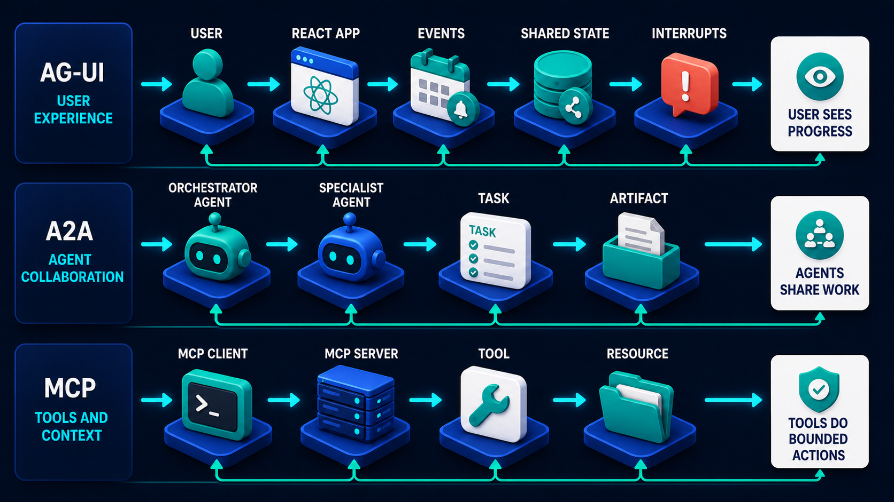

# Diagram 76 — Production Capstone Architecture

![A full system architecture on dark navy headed ACME AGENT DESK. A USER at a laptop connects to a NEXT.JS REACT EXPERIENCE panel listing AG-UI EVENTS, AUTH, APPROVALS and ARTIFACTS. A REQUEST arrow leads to an ORCHESTRATOR node, which delegates tasks to an A2A PAYMENT SPECIALIST panel and connects down to POLICY GATE, DURABLE WORKFLOW and MEMORY AND RAG, which reaches MCP SERVERS listing POLICY, CASES and BANKING with tool schemas. EVALS and OBSERVABILITY sit beneath. Six shared stores run along the bottom — POSTGRES, VECTOR INDEX, QUEUE, ARTIFACT STORE, SECRET MANAGER, AUDIT STORE. A legend distinguishes request, results, denial and human-control paths. Corner tags read PYTHON FASTAPI CORE and VERCEL DEPLOYMENT.](../diagrams/76-production-capstone-architecture.png)

**Module:** The complete system
**Role in the course:** everything in one picture
**Layout:** a named end-to-end architecture with a UI lane, an orchestration core, two capability lanes, and a shared storage tier

---

## At a glance

The whole volume, assembled into one named system: **ACME AGENT DESK**.

A user, a React experience, an orchestrator, a policy gate, a durable workflow, memory and RAG, an A2A specialist, MCP servers, evals, observability, and six shared stores — with a legend distinguishing **request**, **results**, **denial** and **human control** paths.

Every component in this diagram has its own diagram earlier in the volume. This is where they are shown fitting together, with the connections that matter and none that do not.

---

## What the diagram teaches

### 1. The orchestrator is the only component that touches everything

Trace the arrows into and out of the **ORCHESTRATOR** node at the top centre. It receives from the UI, delegates to the A2A specialist, and connects down into the policy gate, the durable workflow and memory/RAG.

Nothing else has that reach. The specialist does not talk to the stores. The UI does not talk to the MCP servers. The workflow does not delegate.

That concentration is deliberate. One component owns routing, which means one place to instrument, one place to change policy about what goes where, and one trace to follow.

### 2. Three components sit between the orchestrator and everything else

**POLICY GATE**, **DURABLE WORKFLOW**, **MEMORY AND RAG** — drawn as a row beneath the orchestrator, connected to each other by double-headed arrows.

They are the middle tier, and each answers a different question:

**Policy gate** — may this happen? The shield, and the source of the **DENY** path.

**Durable workflow** — where has this got to? The gear, holding checkpoints and task state.

**Memory and RAG** — what do we know? The brain, reaching outward to the MCP servers and inward to the stores.

The double-headed arrows between them matter: a workflow step consults policy; policy decisions are recorded in the workflow; retrieval informs both.

### 3. The two capability lanes are on the right, and they are shaped differently

**A2A PAYMENT SPECIALIST** — reached by **DELEGATE TASK** and returning **RESULTS**. Its panel contains **TASKS** and **ARTIFACTS**, which is the A2A object model.

**MCP SERVERS** — three of them, **POLICY**, **CASES**, **BANKING**, each with a `{...}` tool schema beside it.

The shapes are different because the relationships are different. The specialist receives tasks and returns artifacts; the MCP servers expose schemas and are called.

Note that **POLICY appears twice** — as a gate in the middle tier and as an MCP server on the right. Not a duplication: the gate is the decision point, and the server is where policy content is read from. One decides, one supplies.

### 4. Six shared stores, and their spread is the point

Along the bottom: **POSTGRES**, **VECTOR INDEX**, **QUEUE**, **ARTIFACT STORE**, **SECRET MANAGER**, **AUDIT STORE**.

Each is fed from the middle tier, and each corresponds to a concern the volume has covered:

- **Postgres** — business truth.
- **Vector index** — retrievable knowledge, versioned.
- **Queue** — parallel and deferred work.
- **Artifact store** — what has been produced.
- **Secret manager** — short-lived credentials.
- **Audit store** — evidence.

Drawing six rather than one is the same claim the storage map makes at beginner level: these hold different kinds of thing with different lifetimes and different governance.

### 5. Evals and observability are components, not activities

**EVALS** (a pie chart) and **OBSERVABILITY** (a magnifier over a target) sit in the middle tier alongside the workflow, both connected upward and downward.

Their placement as first-class components rather than as tooling on the side is a position: measurement is part of the system, not something bolted to it. They read from the same stores and feed back into the same orchestrator.

The eval component connecting to the **DENY** path is worth noticing — refusals are measured too.

### 6. The legend defines four path types, and the fourth is the unusual one

**REQUEST PATH** (solid cyan) · **RESULTS PATH** (solid teal) · **DENIAL PATH** (dashed coral) · **HUMAN CONTROL** (dashed coral, distinguished).

Most architecture diagrams have two path types. This one has four, and separating denial from human control is the meaningful addition.

A **denial** is the system refusing. A **human control** action is a person intervening. Both are coral because both stop or redirect automated flow, and they are different in origin.

Following the coral path: it runs from the policy gate's **DENY** marker up into the **APPROVALS** row of the React experience. Refusals and approval requests surface to the same place in the UI, which is correct — from the user's perspective both are "this needs your attention."

### 7. The UI panel lists four things, and they are the AG-UI surface

**AG-UI EVENTS**, **AUTH**, **APPROVALS**, **ARTIFACTS**.

Four responsibilities of the front end. Note what is absent: no business logic, no policy, no data access. The React experience streams events, authenticates, surfaces approvals, and presents artifacts.

That is the frontend/backend boundary held at production scale, and it is one of the three lanes:

Map that diagram onto this one and the three lanes are visible: the React experience is AG-UI, the payment specialist is A2A, and the three servers on the right are MCP. The orchestrator is what the lane diagram leaves out, because it is the thing that decides which lane a piece of work belongs in.

### 8. The two corner tags are the only implementation detail in the frame

**PYTHON FASTAPI CORE** and **VERCEL DEPLOYMENT**.

Everything else is architectural. These two say what it is actually built on, and their isolation in the corners is appropriate — the architecture would be the same on a different stack, and naming the stack once prevents the diagram from being read as technology-neutral to the point of uselessness.

---

## Case study — Acme Agent Desk, from prototype to production in seven months

The diagram names a system, so the case study is that system: a customer operations desk for a mid-sized financial services firm, handling case queries, payment issues and account servicing for about 180,000 customers.

It started as a prototype: a chat interface, a model, and three tools. It reached the architecture in the diagram over seven months, and each addition was driven by a specific failure.

### Month 1 — the prototype

Chat UI, model, three tools reading from Postgres. It demonstrated well and it went into a pilot with twelve advisers.

### Month 2 — the policy gate

An adviser asked the assistant to "sort out" a duplicate charge. It issued a refund of £240 with no approval, because there was no approval mechanism.

**Added:** the policy gate, and the approvals surface in the UI. Refunds above £50 route to a supervisor.

### Month 3 — the durable workflow and the queue

A deploy killed 30 in-flight cases. Advisers had to redo them.

**Added:** the durable workflow with checkpoints, and the queue. Deploys stopped being an event.

### Month 3 — the audit store

Their compliance function asked who had approved a particular refund. The answer existed in application logs, sampled at 10%, retained 14 days.

**Added:** the audit store, unsampled, seven-year retention, with the five-field receipt.

### Month 4 — memory and RAG, and the vector index

Advisers were asking policy questions the assistant could not answer, because policy lived in a 400-page document nobody had indexed.

**Added:** memory and RAG, the vector index, and the **POLICY** MCP server. Also index versioning, after an early incident where a superseded policy version was retrieved for six weeks.

### Month 5 — the A2A specialist

Payment investigations require judgement about chargeback eligibility, and those rules belong to their payments team.

**Added:** the A2A payment specialist. The orchestrator delegates a task and receives an artifact — a determination with reasoning. The payments team owns the rules.

### Month 5 — the secret manager

A security review found database credentials in three environment files and one debug log.

**Added:** the secret manager, short-lived per-component handles, and a log-scanning pass that found four more instances.

### Month 6 — observability

A latency complaint took three weeks to diagnose across five services with no shared identifier.

**Added:** trace IDs, spans, and the observability component. The next latency complaint took an afternoon.

### Month 6 — evals

A model upgrade improved answers on the cases the team tested and regressed on a category nobody had tested — questions where the correct answer was a refusal.

**Added:** the golden dataset with abstain cases, and the eval component. No model change ships without it.

### Month 7 — AG-UI events and the artifact store

Advisers could not tell what the assistant was doing during long cases, and outputs appeared only at completion.

**Added:** typed events, the streaming UI, and the artifact store. Artifacts surface as produced.

### What the sequence shows

Every component was added because something failed without it. None was added speculatively.

That is the honest version of how this architecture arrives, and it is worth saying to a room looking at a diagram with sixteen components: **nobody builds this on day one, and nobody should.**

### The order that mattered

Their engineering lead's retrospective identified two sequencing regrets.

**Audit should have come before the policy gate**, not after. They had a gate making decisions for a month with no durable record of them.

**Observability should have come much earlier.** Every diagnosis before month six was slower than it needed to be, and the three weeks lost to the latency complaint would have been an afternoon.

### Results at seven months

- **Cases handled without escalation:** 71%.
- **Approval requests:** ~900/month, 4% declined.
- **Median case time:** 11 minutes → 4.
- **Deploys during business hours:** forbidden → routine.
- **Time to answer "who approved this":** unanswerable → under a minute.

---

## Composition

A full-frame architecture beneath the title **ACME AGENT DESK**.

**Left:** **USER** at a laptop, connecting into a bordered **NEXT.JS REACT EXPERIENCE** panel listing four rows.

**Top centre:** **ORCHESTRATOR**, a blue node-network tile, receiving **REQUEST** and returning **RESULTS** to the UI, and exchanging **DELEGATE TASK** / **RESULTS** with the **A2A PAYMENT SPECIALIST** panel at top right.

**Middle:** three components in a row — **POLICY GATE**, **DURABLE WORKFLOW**, **MEMORY AND RAG** — connected to each other and to the orchestrator. Memory and RAG connects right to the **MCP SERVERS** panel.

**Lower middle:** **EVALS** and **OBSERVABILITY**.

**Bottom:** six stores in a dashed-bordered tier — **POSTGRES**, **VECTOR INDEX**, **QUEUE**, **ARTIFACT STORE**, **SECRET MANAGER**, **AUDIT STORE** — fed by teal arrows from above.

**Lower left:** a legend. **Lower right:** two dashed corner tags.

## Element by element

**NEXT.JS REACT EXPERIENCE**
Four white rows with teal icons: **AG-UI EVENTS** (message bubble), **AUTH** (person), **APPROVALS** (check disc), **ARTIFACTS** (document).

**ORCHESTRATOR**
A blue diamond-shaped tile carrying a white node-network glyph.

**A2A PAYMENT SPECIALIST**
A bordered panel with a **blue robot** and two white cards: **TASKS** (checklist) and **ARTIFACTS** (document).

**POLICY GATE** — a blue tile with a **teal shield and check**.
**DURABLE WORKFLOW** — a blue tile with a **teal gear**.
**MEMORY AND RAG** — a blue tile with a **teal brain**.

**MCP SERVERS**
A bordered panel listing three rows — **POLICY** (shield), **CASES** (folder), **BANKING** (institution) — each with an arrow to a white **`{...}`** schema card under a **TOOLS** heading.

**EVALS** — a blue tile with a teal pie chart.
**OBSERVABILITY** — a blue tile with a magnifier over a target.

**The six stores**
**POSTGRES** (elephant cylinder), **VECTOR INDEX** (teal node cylinder), **QUEUE** (purple stacked blocks), **ARTIFACT STORE** (teal cylinder with a document), **SECRET MANAGER** (teal cube with a padlock), **AUDIT STORE** (blue cylinder with a shield).

**The legend**
Four rows: solid cyan **REQUEST PATH**; solid teal **RESULTS PATH**; dashed coral **DENIAL PATH**; dashed coral **HUMAN CONTROL**.

**Corner tags**
Dashed-bordered: **PYTHON FASTAPI CORE** (Python logo) and **VERCEL DEPLOYMENT** (globe).

## Colour and flow semantics

- **Solid cyan** for requests, **solid teal** for results — the library's grammar at full scale.
- **Dashed coral** for both denial and human control, distinguished in the legend, converging on the UI's approvals row.
- **Teal arrows** feed the storage tier from the middle components.
- The **dashed border** around the storage tier groups it as shared infrastructure rather than as six separate connections.
- The **orchestrator is the only node with connections in four directions**.

## How to present it

**Do not walk all sixteen components.** It is the closing diagram and the temptation is a tour. A tour teaches nothing that the preceding 29 diagrams have not already covered.

**Ask which component they would build first.** Then reveal the Acme sequence: every addition driven by a specific failure, none speculative. Say plainly that nobody builds this on day one.

**Trace one request end to end.** User → UI → orchestrator → policy gate → workflow → MCP server → store → back. One path, out loud, naming each component's question. That is worth more than describing all of them.

**Then trace the coral path.** Policy gate → deny → approvals row in the UI. Ask why refusals and approval requests land in the same place — from the user's perspective both mean "this needs you."

**Ask why the legend has four path types.** Most architectures have two. Separating denial from human control is the meaningful addition, and it is worth asking which of the two their own diagrams show.

**Point at POLICY appearing twice.** Once as a gate, once as an MCP server. One decides, one supplies. This catches people out and the distinction is real.

**Ask why six stores rather than one.** Different kinds of thing, different lifetimes, different governance. Then ask which of the six their system currently has.

**Point at EVALS and OBSERVABILITY being components.** Not tooling on the side. Measurement is part of the system. Then give them Acme's sequencing regret: observability should have come much earlier, and every diagnosis before month six was slower than it needed to be.

**Give them the audit regret too.** A policy gate making decisions for a month with no durable record of them. Audit before the gate, not after.

**Close by counting the diagrams.** Every component here has its own picture earlier in the volume. Ask the room to name which. That recall exercise is the right way to end a course.

**Timing.** Thirty minutes as a closing session. Forty-five if you have each person map their own system onto it and identify what is missing — which is the most useful possible exit from the volume.

---

## Lab and checkpoint

**Lab:** Map your own system onto the production capstone architecture. For each of the sixteen components, write whether it exists today, what failure would drive adding it, and the diagram earlier in the course that explains it. Trace one request end-to-end and one denial/approval path.

**Checkpoint:** Why should audit come before the policy gate, not after?

**Answer:** Because a policy gate that makes decisions without a durable record cannot be reviewed. Audit must record the decision and the evidence as the decision is made, so you can later answer "who approved this" and "why."

## Glossary

- **A2A payment specialist** — the specialist agent handling payment tasks.
- **Artifact store** — the durable store for produced artifacts.
- **Audit store** — the durable record of decisions and actions.
- **Durable workflow** — the component that manages long-running, checkpointed work.
- **Evals** — the component that measures system quality.
- **MCP servers** — the servers exposing tools, resources, and prompts.
- **Memory and RAG** — the component that manages retrieved and recalled knowledge.
- **Next.js React experience** — the user-facing application with events, auth, approvals, and artifacts.
- **Observability** — the component that traces and diagnoses request flows.
- **Orchestrator** — the central agent that routes work through the components.
- **Policy gate** — the component that decides whether actions are allowed.
- **Postgres** — the relational store for business records.
- **Queue** — the store for pending work and fan-out/fan-in.
- **Secret manager** — the component that issues short-lived handles.
- **Storage tier** — the dashed group of durable stores at the bottom.
- **Vector index** — the searchable vector store for RAG.

## Sources

- Production agent architecture with MCP, A2A, and AG-UI
- Policy gate, audit, durable workflow, and observability design
- Vercel, Next.js, and Python FastAPI deployment patterns
