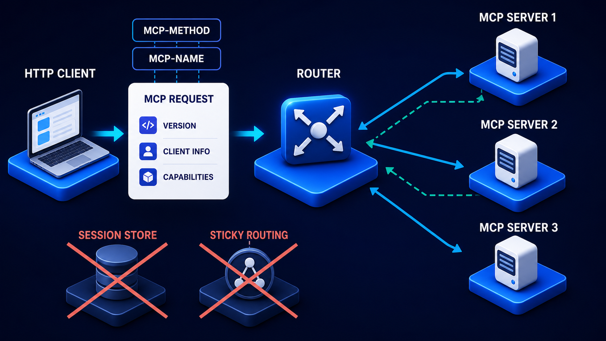

# Diagram 78 — Version, Capability, and Extension Negotiation

![A client laptop on the left and a server stack on the right, exchanging three stacked white cards on dark navy — VERSION with a layers icon, CAPABILITIES with a shield check, EXTENSIONS with a puzzle piece — each with blue arrows running in both directions. From the extensions card, a green path labelled COMPATIBLE PATH descends left to a hexagon reading USE SHARED FEATURES with a green check, and a red path labelled NO COMMON VERSION descends right to a hexagon reading CLEAR ERROR with a red exclamation.](../diagrams/78-version-capability-extension-negotiation.png)

**Module:** Reading a specification
**Role in the course:** agreeing what two parties can do together
**Layout:** three exchanged cards between two parties, resolving to one of two outcomes

---

## At a glance

Three cards travel in both directions between a client and a server, in order: **VERSION**, **CAPABILITIES**, **EXTENSIONS**. The exchange resolves either to **USE SHARED FEATURES** along a green compatible path, or to **CLEAR ERROR** along a red one.

Two things are notably absent. There is **no session box** anywhere in the frame. And the failure outcome is not "fall back to something" — it is a **clear error**.

---

## What the diagram teaches

### 1. Three layers, in a required order

**VERSION** first, carrying a layers icon. Which revision of the protocol both parties speak. Everything below depends on it, because the meaning of a capability name is defined by the version that defines it.

**CAPABILITIES** second, carrying a shield with a check. What core features each side supports within that version. Not optional add-ons — the parts of the protocol itself that an implementation may or may not offer.

**EXTENSIONS** third, carrying a puzzle piece. Optional additions beyond the core, typically identified by reverse-domain names, typically from third parties.

The ordering is not stylistic. You cannot meaningfully compare capabilities until you agree what version's vocabulary you are using, and you cannot layer extensions onto a core you have not established.

### 2. The arrows run both ways, and that makes it negotiation rather than declaration

Each card has arrows pointing **toward the server and back toward the client**.

That bidirectionality is what distinguishes negotiation from announcement. The client says what it supports; the server says what it supports; the outcome is the **intersection**.

A one-way exchange gives you a different and worse thing. If only the server declares, the client must guess whether its own limitations matter. If only the client declares, the server cannot tell it about features it could have used.

### 3. The outcome is the intersection, and the label says so

**USE SHARED FEATURES.** Not "use the client's features," not "use the server's," and not "use the union."

Only what both sides support is available. A capability the server offers and the client cannot handle is not usable. An extension the client wants and the server does not implement is not usable.

This sounds obvious and is routinely violated by implementations that assume the other side supports whatever they support.

### 4. NO COMMON VERSION leads to a clear error, not a fallback

The red path is labelled **NO COMMON VERSION** and terminates at **CLEAR ERROR**.

Two design positions in that.

**Version incompatibility is not recoverable by guessing.** If there is no shared version, there is no shared vocabulary, and proceeding means both sides interpreting the same bytes differently. The correct response is to stop.

**The error must be clear.** Not a generic failure, not a timeout, not an obscure parse error twelve calls later. An error that names the problem: these are the versions I support, these are the versions you support, there is no overlap.

The distinction matters enormously in practice. A clear version error is diagnosed in seconds. A silent proceed-and-hope produces failures that surface much later, in an unrelated place, as data that does not make sense.

### 5. Capability and extension mismatches are not the same as version mismatch

Only the version failure gets the red path. That asymmetry is deliberate.

**No common version** — fatal. Nothing can proceed.

**A capability one side lacks** — not fatal. That capability is unavailable; everything else works. The compatible path still applies, with a smaller feature set.

**An extension one side lacks** — not fatal, and expected. Extensions are optional by definition.

An implementation that errors on an unknown extension has misunderstood what optional means. The correct behaviour is to note that it is not shared and proceed without it.

### 6. There is no session box, and that is stated in the specification prompt

The absence is deliberate and it is the point at which this diagram connects to everything else in the volume.

Negotiation establishes what is *possible* between two parties. It does not establish a **session** — a stateful connection that both sides then rely on.

The distinction: the outcome of negotiation is knowledge the client holds and can apply to each subsequent self-contained request. It is not a handshake that creates a connection with memory.

That is what allows a negotiated relationship to survive load balancing, restarts and deploys — and it is why the modern MCP request carries its version on every message rather than agreeing it once:

---

## Case study — Wrenhurst Systems, the error that took nine days

Wrenhurst builds an agent orchestration platform used by about 40 enterprise customers, each of whom connects their own capability servers.

A customer onboarding a new server reported that "it just doesn't work." The investigation took nine days.

### The symptom

The customer's server connected. The orchestrator listed its capabilities. Calls were made. Some worked. Some returned results that were structurally valid and semantically wrong — a tool returning a list where the orchestrator expected a single object, an identifier field containing something that was not an identifier.

No errors were raised. Everything parsed.

### What was actually happening

The customer's server implemented protocol revision **2026-03-14**. Wrenhurst's orchestrator implemented **2026-07-28**.

Between the two revisions, the shape of one commonly-used response had changed — a field that had been a single object became a list of objects, and a field that had held an identifier had been renamed.

Neither side had checked.

Wrenhurst's orchestrator sent its version on every request, correctly. The customer's server **ignored the version header entirely** and responded in its own revision's shape.

The orchestrator, receiving structurally-plausible JSON, parsed it and proceeded.

### Why it took nine days

Because nothing failed. The wrong-shaped responses were absorbed. A list where an object was expected produced the list's first element in some code paths and an empty value in others. The renamed identifier field produced nulls that were treated as absent optional values.

The symptoms appeared far downstream — a case with no assignee, a policy check that passed because the field it examined was empty, a report with missing rows.

Nine days of tracing symptoms backwards, and the cause was a header nobody was reading.

### The rebuild

**Version negotiation became mandatory and enforced.** The orchestrator now refuses to proceed with a server that does not declare a version. Not a warning — a refusal.

**The intersection is computed and recorded.** For each connected server, the orchestrator records the agreed version, the shared capabilities, and the shared extensions. This is now visible in their admin interface, which turned out to be the most useful diagnostic they added.

**The error message names both sides.** The clear-error requirement was taken literally:

> Cannot negotiate with server `acme-billing`. Client supports revisions [2026-07-28, 2026-03-14]. Server declares revision [2025-11-05]. No common revision. Server must support at least 2026-03-14.

A customer receiving that fixes it themselves. The previous behaviour produced a support ticket.

**Capability and extension mismatches degrade rather than fail.** A server lacking a capability means that capability is unavailable for that server; everything else works. An unknown extension is noted and ignored.

This distinction had also been wrong in the original implementation — it had been erroring on unknown extensions, which meant a customer adding a proprietary extension broke their own integration.

### What the visible intersection found

Within a month of exposing the negotiated intersection in the admin interface, three customers discovered they had been running on a smaller feature set than they believed.

In each case a capability they thought they were using was not in the intersection — their server declared it, the orchestrator's version did not include it, and calls had been silently falling back to a slower path.

None of them had a bug report open. They had assumed the slower behaviour was normal.

### Results

- **Silent version mismatches:** 1 known incident over nine days, 0 since.
- **Onboarding support tickets citing "doesn't work":** down about 70%, replaced by customers self-resolving from the error message.
- **Customers discovering a reduced feature set:** 3 in the first month of visibility.
- **Time to diagnose a negotiation problem:** nine days → the error message.

### The line in their integration guide

*If you ignore the version header, you are not implementing the protocol. You are implementing something that happens to parse.*

---

## Composition

A horizontal exchange between two parties with a two-way branch below.

**CLIENT** (left) — a laptop with a person on screen, on a blue platform.
**SERVER** (right) — a dark server stack on a blue platform.

**Centre:** three white rounded cards stacked vertically — **VERSION** (blue layers icon), **CAPABILITIES** (blue shield with check), **EXTENSIONS** (blue puzzle piece). Blue arrows run from the client into each card and from each card to the server, with return arrows beneath.

**Below:** from the extensions card, a **green line** descends left through a dark green label reading **COMPATIBLE PATH** to a blue hexagon containing a **green check disc** and **USE SHARED FEATURES**. A **red line** descends right through a dark red label reading **NO COMMON VERSION** to a blue hexagon containing a **red exclamation disc** and **CLEAR ERROR**.

## Element by element

**VERSION** — a white card with a blue stacked-layers icon. Which protocol revision.
**CAPABILITIES** — a white card with a blue shield containing a check. Core features supported.
**EXTENSIONS** — a white card with a blue puzzle piece. Optional additions.

**USE SHARED FEATURES** — a blue hexagonal platform with a large green check disc. The intersection.

**CLEAR ERROR** — a blue hexagonal platform with a large red exclamation disc. The terminal failure.

**No session box** — the absence is a specified feature of the diagram.

## Colour and flow semantics

- **Blue arrows** run in both directions through all three cards, marking this as negotiation rather than declaration.
- **Green** marks the compatible path and its outcome — unusually, green rather than teal, distinguishing a successful negotiation from a returned result.
- **Red** marks the version-failure path and its outcome.
- Only **version failure** gets the red path; capability and extension gaps are absorbed by the compatible path.
- The three cards are **stacked vertically in order**, encoding the required sequence.

## How to present it

**Ask what two parties need to agree before they can work together.** Most rooms name version. Fewer name capabilities. Almost nobody separates extensions.

**Ask why the order matters.** You cannot compare capabilities without agreeing whose vocabulary defines them. Version first is not a convention; it is a dependency.

**Point at the two-way arrows.** Negotiation, not declaration. Then ask what a one-way exchange gives you — a client guessing whether its limitations matter, or a server unable to offer features the client could have used.

**Read the outcome label carefully.** *Use shared features.* Not the union. Ask what an implementation that assumes the other side supports what it supports produces.

**Ask why only version failure is fatal.** Push toward the answer: no shared version means no shared vocabulary, so proceeding means both sides interpreting the same bytes differently. A missing capability just means a smaller feature set.

**Then ask about unknown extensions.** An implementation that errors on one has misunderstood optional. Wrenhurst had this bug — a customer adding a proprietary extension broke their own integration.

**Tell the nine-day story.** No errors, everything parsed, wrong-shaped responses absorbed, symptoms appearing far downstream. Then reveal the cause: a version header the server never read.

**Read the clear error aloud.** Client supports these, server declares that, no overlap, minimum required. Ask how long a customer needs to fix that themselves. Then contrast with a support ticket.

**Point at the absent session box.** Negotiation establishes what is possible; it does not create a stateful connection. That is what lets the result survive load balancing and restarts.

**Mention the visibility finding.** Three Wrenhurst customers discovered they had been running on a reduced feature set with no bug report open, because the intersection had never been shown to them. Ask whether the room could state their own negotiated intersection with any integration.

**Timing.** Twenty minutes. Twenty-five if you draft the clear-error message for one of the room's own integrations.

---

## Lab and checkpoint

**Lab:** Pick one integration your system has with an external party. List the versions each side supports, the shared capabilities, and any optional extensions. Compute the intersection and write the clear error message for the case where there is no common version. Then identify one capability mismatch that is silently producing a reduced feature set.

**Checkpoint:** Why is a missing capability not the same as a version mismatch?

**Answer:** Because a missing capability just means the parties use a smaller feature set. A version mismatch means they do not share the same vocabulary, so the same bytes can be interpreted differently. Proceeding with a version mismatch is dangerous; proceeding with a missing capability is safe if both sides agree on the intersection.

## Glossary

- **Capability** — a feature or function a party supports.
- **Clear error** — the explicit message when there is no common version.
- **Client** — the party that initiates the negotiation.
- **Extension** — an optional addition to the protocol or capability.
- **Intersection** — the set of versions, capabilities, and extensions both parties share.
- **Negotiation** — the two-way exchange that establishes what both parties can use.
- **Server** — the party that responds to the negotiation.
- **Version** — the protocol revision that defines the shared vocabulary.

## Sources

- MCP and A2A protocol version negotiation
- Capability and extension negotiation patterns
- RFC and protocol interoperability documentation
