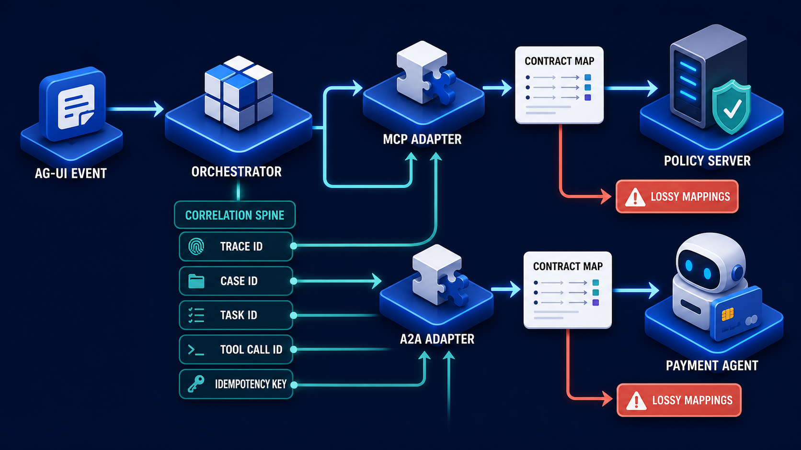

# Diagram 79 — Requests, Results, Errors, and Correlation

![A four-stage row on dark navy — CLIENT laptop, GATEWAY, WORKER gear, DATABASE — connected by blue arrows. Above, four white cards travel from client to gateway: JSONRPC 2.0 with braces, ID 2048 with a hash, METHOD with an fx glyph, PARAMS with a list. A dotted teal line labelled TRACE ID spans the full width above all four stages. Below, teal return arrows carry two alternatives separated by the word OR: an ID 2048 card with a red ERROR card, and a RESULT card with a teal check beside another ID 2048 card.](../diagrams/79-request-result-error-correlation.png)

**Module:** Reading a specification
**Role in the course:** two kinds of identifier, doing two different jobs
**Layout:** an exploded JSON-RPC envelope across four stages, with a separate trace line spanning all of them

---

## At a glance

A JSON-RPC request pulled apart into four cards — **JSONRPC 2.0**, **ID 2048**, **METHOD**, **PARAMS** — travelling from a client toward a server. It returns as either a **RESULT** or an **ERROR**, and **both carry ID 2048**.

Above all of it, a **dotted teal line labelled TRACE ID** spans the entire frame, crossing gateway, worker and database.

Two identifiers, two scopes. The protocol ID pairs one request with one response. The trace ID follows the whole distributed operation. Conflating them is one of the most common mistakes in protocol implementation.

---

## What the diagram teaches

### 1. The four request cards are the complete JSON-RPC envelope

**JSONRPC 2.0** with `{ }` — the protocol version marker. Present on every message. It tells the receiver which framing rules apply, before anything else is interpreted.

**ID 2048** with `#` — the request identifier, chosen by the client. Its only job is to let the client match a response to the request that produced it.

**METHOD** with `fx` — what operation is being invoked. The function-notation glyph is apt: a method name plus params is a function call.

**PARAMS** with a list — the arguments.

Four fields, and every JSON-RPC request has exactly these. There is nothing else at this layer.

### 2. ID 2048 appears three times, and the repetition is the mechanism

Count the cards bearing **ID 2048**: once on the request, once on the error return, once on the result return.

That repetition is the whole correlation mechanism at the protocol layer. A client that has ten requests in flight distinguishes their responses by matching IDs.

Two consequences worth stating.

**The ID is chosen by the client.** The server echoes it; it does not assign it. A server that generates its own response ID has broken correlation entirely.

**The ID is meaningless outside the pair.** It has no significance to the gateway, the worker, or the database. It is not a business identifier and it should never be used as one.

### 3. Error and result are alternatives, and both are responses

The **OR** between them is doing real work.

A JSON-RPC response contains **either** a result **or** an error. Never both, never neither. This is a structural rule of the protocol, not a convention.

The implication for client implementations: a response is not "the result." It is a container that holds one of two things, and reading it means checking which.

Note also that **the error carries the ID**. An error is a response to a specific request, and a client with ten in flight needs to know which one failed. An error without an ID is unattributable.

### 4. The trace ID is dotted, spans everything, and is a different kind of thing

The **dotted teal line** at the top runs from before the client to past the database, above all four stages.

Three differences from the protocol ID.

**Scope.** The protocol ID covers one request/response pair. The trace ID covers the entire operation, including hops that are not JSON-RPC at all — the gateway's internal routing, the worker's database query.

**Lifetime.** The protocol ID is meaningful for milliseconds to seconds. The trace ID persists in logs, metrics and audit records for as long as those are retained.

**Ownership.** The protocol ID belongs to the protocol. The trace ID belongs to your observability system and travels in metadata alongside the protocol, not inside it.

The dotting is the right rendering. It is not a message; it is a thread running through messages.

At system scale that thread becomes one of five, each with its own scope:

The **TOOL CALL ID** on that spine is this diagram's protocol ID, and the **TRACE ID** is this diagram's dotted line. Keeping five identifiers distinct is the same discipline as keeping two.

### 5. The line crosses components that do not speak JSON-RPC

Follow the dotted line: it passes over **GATEWAY**, **WORKER** and **DATABASE**.

The gateway may route on headers. The worker may pull from a queue. The database speaks SQL. None of them has a JSON-RPC ID to work with.

The trace ID is what makes them correlatable anyway. It is carried in whatever metadata each hop supports — a header, a queue message attribute, a query comment — and it is what allows a single operation to be reconstructed across a heterogeneous stack.

### 6. Using one for the other's job is the failure this prevents

Two symmetric mistakes.

**Using the protocol ID as a trace ID.** It does not survive past the response. It has no meaning at the database. Two unrelated clients can use the same ID simultaneously. Logs keyed on it cannot distinguish them.

**Using the trace ID as the protocol ID.** It is shared across many requests in one operation. A client with three concurrent calls in one trace cannot tell their responses apart, because all three carry the same value.

The second is the more damaging and the less obvious. It produces responses matched to the wrong requests, which is a correctness failure rather than an observability one.

---

## Case study — Pelham Digital, the responses that went to the wrong callers

Pelham builds a multi-tenant agent platform. Their gateway fronts about 30 capability servers and handles roughly 400 requests per second at peak.

They had good distributed tracing. They had recently added it, and in adding it they broke correlation.

### What they changed

Their platform had been generating JSON-RPC request IDs as incrementing integers per connection. When they introduced distributed tracing, an engineer noticed that they now had a perfectly good unique identifier available on every request — the trace ID — and that using it as the JSON-RPC ID would make log correlation trivial.

It was a reasonable-sounding simplification. It shipped.

### What broke

Their orchestrator frequently issues **several capability calls concurrently** as part of one operation — a policy lookup, a case fetch, and an entitlement check, fired in parallel.

All three are part of one trace. All three now carried the **same JSON-RPC ID**.

Three responses came back. The client matched them by ID. All three matched all three.

Their client library resolved the first arriving response against the first waiting promise, the second against the second, and so on — in arrival order, not in correspondence order.

Under low load, the three tended to arrive in issue order and the behaviour was accidentally correct. Under load, they did not.

### The symptom

Intermittent, load-correlated, and bizarre. A policy result appearing where a case record was expected. An entitlement check returning a policy document. Roughly 0.3% of concurrent operations, rising to about 2% at peak.

Because the responses were all structurally valid JSON, most were parsed without error. The values were simply wrong.

One incident: a policy check received a case record instead of a policy, found no denial rules in it, and returned permitted. An action was allowed that should have been refused.

### The diagnosis

Six days. The breakthrough was an engineer noticing that failures clustered on operations with three or more concurrent calls, and never occurred on single-call operations.

### The rebuild

**The two identifiers were separated, permanently.**

*JSON-RPC ID* — generated per request, unique within the client's in-flight set. Their implementation uses a monotonic counter per client instance. It is never reused while a request is outstanding, and it has no meaning outside the pair.

*Trace ID* — generated per operation, carried in a metadata header, propagated to every component including the queue and the database.

**They added a client-side assertion.** The client library now refuses to issue a request whose ID matches an outstanding one. In development this raises immediately; in production it logs and regenerates.

That assertion has fired twice since — both times a bug in a new client implementation that would previously have produced silent mis-correlation.

**They added a span attribute rather than an ID substitution.** The thing the original engineer wanted — easy correlation between a JSON-RPC exchange and a trace — was achieved by recording the JSON-RPC ID *as an attribute on the span*, not by making them the same value.

That gives the correlation without the collision, and it is the fix they wish they had reached for first.

### The audit that followed

They checked whether any actions had been permitted incorrectly during the affected period. They found **four**, of which three were harmless and one had allowed a data export that should have been refused.

The export was to an authorised user within the correct tenant, so no data crossed a boundary. It was still reported to the customer.

### Results

- **Mis-correlated responses:** ~2% of concurrent operations at peak → 0.
- **Time to diagnose:** six days.
- **Client implementations caught by the duplicate-ID assertion:** 2.
- **Correlation between JSON-RPC exchanges and traces:** retained, via a span attribute.

### The line in their protocol implementation guide

*The JSON-RPC ID matches a response to a request. The trace ID follows an operation across a system. They are never the same value, and one is never derived from the other.*

---

## Composition

A horizontal four-stage row with an exploded envelope above and return paths below.

**CLIENT → GATEWAY → WORKER → DATABASE**, connected by blue arrows.

**Above, between client and gateway:** four white cards in a row — **JSONRPC 2.0** (blue `{ }`), **ID 2048** (blue `#`), **METHOD** (blue `fx`), **PARAMS** (blue list).

**Spanning the full width above everything:** a **dotted teal line** with a teal rounded label at its centre reading **TRACE ID**, descending at both ends to enclose all four stages.

**Below:** two groups separated by the word **OR**. Left: a white **ID 2048** card with a teal `#`, beside a white card with a **red warning triangle** and **ERROR**, with a teal arrow running left to the client and a teal arrow up to the gateway. Right: a white **RESULT** card with a **teal check disc**, beside a white **ID 2048** card, with teal arrows up to the worker and left from the database.

## Element by element

**JSONRPC 2.0** — protocol version marker with `{ }`. Framing rules.
**ID 2048** — client-chosen correlation identifier with `#`.
**METHOD** — operation name with the `fx` function glyph.
**PARAMS** — arguments, with a list icon.

**TRACE ID** — a teal rounded label on a dotted line spanning the whole frame.

**ERROR** — a white card with a red warning triangle, paired with the ID.
**RESULT** — a white card with a teal check disc, paired with the ID.

## Colour and flow semantics

- **Blue arrows** carry the request forward through the four stages.
- **Teal arrows** carry both response alternatives back.
- The **dotted teal trace line** is visually distinct from every message arrow — a thread, not a transmission.
- **Red** appears only on the error card.
- **ID 2048 appears three times** in identical form, which is the correlation mechanism made visible.

## How to present it

**Ask how a client with ten requests in flight knows which response is which.** The protocol ID. Then ask who assigns it — the client, not the server.

**Point at ID 2048 appearing three times.** Request, error, result. Ask why the error carries it. Because an error is a response to a specific request, and an unattributable error is useless.

**Ask what OR means between error and result.** One or the other, never both, never neither. Then ask what that implies for client code — a response is a container, and reading it means checking which branch it holds.

**Trace the dotted line with your finger.** Above everything, past the database. Ask what it is for and how it differs from the protocol ID. Build the three differences: scope, lifetime, ownership.

**Ask what the database knows about JSON-RPC.** Nothing. That is why the trace ID exists and why it travels in metadata rather than in the protocol.

**Pose both misuse directions.** Protocol ID as trace ID — does not survive, no meaning downstream, collides across clients. Trace ID as protocol ID — shared across concurrent calls in one operation, so responses cannot be told apart.

**Then tell the Pelham story.** Three concurrent calls, one trace, one ID. Responses matched in arrival order. 0.3% at low load, 2% at peak, and one permitted action that should have been refused.

**Point out why it seemed reasonable.** The engineer wanted easy correlation between exchanges and traces. That is a legitimate want, and the correct answer is a span attribute recording the JSON-RPC ID — not making them the same value.

**Suggest the assertion.** A client that refuses to issue a request whose ID is already outstanding. Pelham's has fired twice, both times catching a new client implementation that would have mis-correlated silently.

**Timing.** Twenty minutes. Twenty-five if you audit what the room's own logs key on, which sometimes finds a protocol ID doing a trace ID's job.

---

## Lab and checkpoint

**Lab:** Look at one of your own logging or tracing setups. Identify what identifier ties a request to its response, and what identifier ties a response to other services or a larger operation. Check whether the same value is being used for both. If it is, write the failure that would result under concurrent requests and the smallest change that separates them.

**Checkpoint:** Why must the JSON-RPC protocol ID and the trace ID not be the same value?

**Answer:** Because the protocol ID is per request and used to match a response to a single call. The trace ID spans multiple calls, services, and a longer lifetime. Using one for the other either causes collisions or loses the ability to attribute responses to specific requests.

## Glossary

- **Error** — a response that reports a request could not be handled.
- **JSON-RPC** — the request/response protocol with ID-based correlation.
- **Metadata** — data outside the protocol body that carries cross-cutting concerns.
- **Protocol ID** — the client-assigned identifier that matches a response to a specific request.
- **Request** — the JSON-RPC envelope sent by the client.
- **Result** — a successful response to a request.
- **Trace ID** — the identifier that spans components and requests for observability.
- **Transaction** — the logical operation that may contain multiple protocol requests.

## Sources

- JSON-RPC 2.0 request/response correlation
- Distributed tracing and trace identifier patterns
- Protocol ID versus trace ID design
