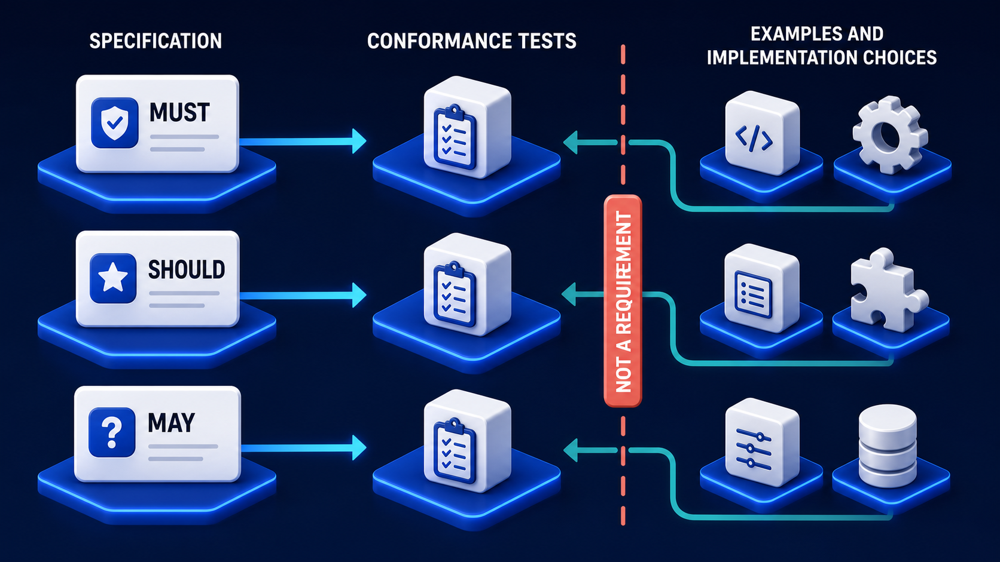

# Diagram 80 — Build a Conformance Matrix

**Module:** Reading a specification
**Role in the course:** turning requirements into evidence
**Layout:** a table with one row per requirement and five columns from spec to status

---

## At a glance

A table. One row per requirement, five columns: **REQUIREMENT → HAPPY PATH → NEGATIVE TEST → EVIDENCE → STATUS**.

Four rows, and the statuses are not two-valued. **PASS**, **PASS**, **FAIL**, and — the one that matters — **NOT TESTED** in amber.

That fourth status is the diagram's argument. A requirement with no test is not passing and it is not failing. It is unknown, and unknown must be visible.

---

## What the diagram teaches

### 1. Every requirement gets a row, and the identifier is the spine

**R-01** through **R-04**, each with its own **SPEC** document icon.

One row per requirement, identified by a stable reference. That identifier is what connects the specification to the tests to the evidence to the status.

The consequence: **you can ask, for any requirement, what its status is** — and you can ask, for any test, which requirement it exists to verify. Traceability runs both ways.

A test suite organised by feature area, or by module, or by whoever wrote it, cannot answer either question.

### 2. Happy path and negative test are separate columns, and both are required

**HAPPY PATH** shows a test suite card with **green ticks**. Does the implementation do the thing when it should?

**NEGATIVE TEST** shows a test suite card with **red crosses**. Does it correctly *refuse* when it should?

Two columns because they verify different halves of a requirement, and passing one says nothing about the other.

A requirement stating that an implementation must reject malformed input has a happy path (valid input is accepted) and a negative test (malformed input is rejected). An implementation that accepts everything passes the first and fails the second.

Negative testing is where most conformance suites are thin, and it is where interoperability failures actually live. An implementation that is permissive where the specification requires strictness will interoperate fine with correct peers and fail unpredictably with incorrect ones.

### 3. The teal return arrow connects negative back to happy, and that is a sequencing claim

Look at the small **teal arrow** running from beneath each negative-test card back to its happy-path card.

The negative test's outcome informs the happy path's interpretation. An implementation that passes the happy path *because it accepts everything* has not really passed it.

Practically: run both, and read them together. A green happy path beside a red negative test is not a partial success — it is a specific and recognisable failure mode.

### 4. Evidence is its own column, and it is not the same as status

**EVIDENCE** shows a **report card with a pie chart**. **STATUS** shows a coloured verdict badge.

Separating them means the verdict is derived from something inspectable.

"R-03 fails" is an assertion. "R-03 fails, here is the report showing which assertions failed, with what inputs, producing what outputs" is evidence.

The distinction matters at three moments: when an implementer disputes a result, when a certification is audited, and when the same test is re-run six months later and the result changes.

A status with no evidence behind it cannot be challenged, reproduced or trusted.

### 5. NOT TESTED is amber, and its presence is the diagram's most important choice

Three colours, three meanings.

**Green PASS** — verified.
**Red FAIL** — verified as non-conformant.
**Amber NOT TESTED** — unknown.

Most conformance reporting has two states, which forces unknown into one of them. Both choices are wrong.

Counting untested requirements as passing produces a certification that overstates conformance — and it does so silently, because nothing looks wrong.

Counting them as failing produces a report full of failures that are not failures, which trains everyone to ignore the failure count.

Amber is neither. It is a third thing, and it is actionable in a way the other two are not: **it tells you where to spend the next unit of effort.**

### 6. The matrix makes coverage measurable

Because every requirement has a row and every row has a status, coverage is a count rather than an impression.

190 requirements, 168 tested, 22 not tested. That is a number you can put in front of a working group, track over time, and set a target against.

Without the matrix, coverage is "we tested it fairly thoroughly," which is not a claim anyone can act on.

The rows also make gaps *specific*. Not "we have some gaps in error handling" but "R-047, R-051 and R-089 are untested."

What fills the requirement column determines whether the whole matrix is meaningful:

Rows come from the left lane. A row derived from the right lane is a test of your reading, and it will fail implementations that are entirely valid.

---

## Case study — Fennick Certification, the programme that certified nothing

Fennick runs a certification programme for an agent-protocol ecosystem. Vendors submit implementations, run the suite, and receive a conformance statement they can show customers.

The programme ran for eight months before a vendor asked a question that stopped it.

### The question

A vendor whose implementation had been certified asked which specific requirements the certification covered.

Fennick could not answer at that granularity. Their suite reported a pass rate — "312 of 318 tests passed" — and produced a certificate.

The vendor's actual question was more pointed: *a customer has asked us whether we conform to requirement 4.3.2. Do we?*

Nobody could tell, because the suite's tests were not traced to requirement identifiers.

### The audit

Fennick spent three weeks mapping their 318 tests back to the specification's 214 requirements.

**141 requirements had at least one test.**
**73 had none.**
**Of the 318 tests, 47 could not be traced to any requirement** — they tested behaviour derived from examples or from the suite author's expectations.

Every certificate issued in eight months had been asserting conformance to a specification of which a third was untested.

Worse: because the pass rate was high, vendors and their customers had reasonably interpreted certification as broad coverage.

### What the untested third contained

The 73 untested requirements were not randomly distributed. They clustered:

**Error handling — 31 requirements.** Almost entirely negative-test territory. What an implementation must do when it receives something invalid.

**Optional feature correctness — 22.** Requirements governing how an optional capability must behave *if offered*.

**Concurrency and ordering — 12.** Requirements about what must happen when operations overlap.

**Security-relevant behaviours — 8.** Including two requirements about rejecting credentials with invalid audiences.

The error-handling cluster is the predictable one. Suites written by working through a specification's happy-path descriptions produce happy-path tests.

### The rebuild as a matrix

**Every requirement got a row.** 214 rows, each with the requirement identifier, its normative class, and the specification section.

**Every test got a requirement reference.** The 47 untraceable tests were reviewed. 19 turned out to test real requirements that had simply not been referenced, and were re-linked. 28 were testing examples and were removed.

**Happy path and negative test became separate columns.** This is what exposed the error-handling gap as a gap rather than as an absence nobody had noticed. A row with a green happy path and an empty negative-test cell is visibly incomplete.

**NOT TESTED became a reportable status.** Their conformance statement now reads, per requirement class:

> MUST: 118 requirements — 118 tested, 116 pass, 2 fail.
> SHOULD: 54 requirements — 51 tested, 49 pass, 2 fail, 3 not tested.
> MAY: 42 requirements — 38 applicable and tested, 4 not offered.

A customer asking about requirement 4.3.2 now gets a specific answer with the evidence attached.

### What happened to the vendors

Re-running the completed suite against the six previously-certified implementations produced uncomfortable results.

**All six passed the MUST requirements they had previously been tested on.**

**Four failed at least one of the newly-covered error-handling requirements.** Three were permissive where the specification required rejection — exactly the pattern negative testing exists to catch.

**One failed a security requirement** — it was not validating the audience claim on incoming credentials, which is precisely the omission that makes a passthrough vulnerability exploitable.

None had been visible under the old suite.

### The programme change

Certification is now **per-requirement-class with published coverage**. A vendor cannot receive a statement while any MUST requirement is untested, and the statement names the SHOULD and MAY coverage explicitly.

Vendors initially resisted. All six re-certified within four months, and two now use the granular statement as a selling point against competitors who cannot produce one.

### Results

- **Requirements with a test:** 141 of 214 → 214 of 214.
- **Untraceable tests:** 47 → 0.
- **Newly-found failures in previously-certified implementations:** 4 vendors, including 1 security requirement.
- **Time to answer "do you conform to 4.3.2":** unanswerable → immediate, with evidence.

### The line Fennick puts on every certificate

*This statement lists what was tested. Anything not listed was not tested and is not asserted.*

---

## Composition

A five-column table with blue gridlines on a dark navy field.

**Column headers:** **REQUIREMENT**, **HAPPY PATH**, **NEGATIVE TEST**, **EVIDENCE**, **STATUS**.

**Four rows**, each containing: a requirement label (**R-01** to **R-04**) beside a white **SPEC** document with a blue check; a white **TEST SUITE** card with three **green tick** rows; a white **TEST SUITE** card with three **red cross** rows; a white **REPORT** card with a blue pie chart and bar chart; and a status badge.

**Cyan arrows** connect the cells left to right within each row. A short **teal arrow** runs from beneath each negative-test card back to its happy-path card.

**Status badges:** **PASS** (green, check disc) on R-01 and R-02; **FAIL** (red, ✗ disc) on R-03; **NOT TESTED** (amber, minus disc) on R-04.

## Element by element

**SPEC** — a white document with a folded corner and a blue check tile. The requirement itself.

**TEST SUITE (happy path)** — a white card listing three rows, each with a **green tick**. Verifying correct behaviour.

**TEST SUITE (negative)** — a white card listing three rows, each with a **red cross**. Verifying correct refusal.

**REPORT** — a white card showing a blue pie chart and bar chart. Inspectable evidence.

**Status badges** — rounded pills: green **PASS**, red **FAIL**, amber **NOT TESTED**.

## Colour and flow semantics

- **Cyan arrows** carry each row left to right from spec to evidence.
- The **teal return arrow** from negative test to happy path marks their outcomes as read together.
- **Green, red and amber** encode three statuses; amber is the diagram's distinctive addition.
- **Green ticks** in the happy-path card and **red crosses** in the negative-test card indicate what each suite asserts, not whether it passed.
- The **table form** — rather than a flow — is itself the argument: conformance is an inventory, not a pipeline.

## How to present it

**Ask how the room reports test results.** Usually pass/fail, often as a percentage. Then point at the amber badge and ask what a requirement with no test is.

**Push on the two-state problem.** Counting untested as passing overstates conformance silently. Counting it as failing trains people to ignore the failure count. Neither is honest.

**Ask what the negative-test column is for.** Then give the example: a requirement to reject malformed input has a happy path and a negative test, and an implementation that accepts everything passes the first.

**Point at the teal return arrow.** Read the two together. A green happy path beside a red negative test is a specific, recognisable failure mode — permissive where the spec requires strict.

**Ask where their own suite is thin.** Fennick's untested third clustered in error handling, optional-feature correctness, concurrency, and security. Ask which of those four the room has covered. Error handling is almost always the gap.

**Separate evidence from status.** A verdict with no report behind it cannot be disputed, reproduced or trusted. Ask what happens when an implementer challenges a failure.

**Tell the Fennick certification story.** Eight months of certificates asserting conformance to a specification of which a third was untested. Then the re-run: four of six previously-certified vendors failed newly-covered requirements, including one security requirement about audience validation.

**Give them the certificate line.** *This statement lists what was tested. Anything not listed was not tested and is not asserted.* That sentence is the honest form of every conformance claim.

**Ask them to count.** Coverage as a number — 168 of 190 — rather than as an impression. Then ask what their number is.

**Timing.** Twenty-five minutes. Thirty-five if you build a matrix for a handful of real requirements, which surfaces the negative-test gap immediately.

---

## Lab and checkpoint

**Lab:** Take five requirements from a specification you work with. Build a conformance matrix with columns for requirement identifier, happy path, negative test, evidence, and status. Mark any requirement you cannot test as NOT TESTED. Then identify whether your current suite counts untested as passing or failing.

**Checkpoint:** Why is NOT TESTED marked as amber rather than green or red?

**Answer:** Because counting untested as green overstates conformance silently, and counting it as red trains people to ignore real failures. Amber keeps the distinction visible and honest: the requirement has not been tested, so no claim is made.

## Glossary

- **Conformance matrix** — a table that maps each requirement to its test coverage and evidence.
- **Evidence** — the report or trace that supports a pass/fail verdict.
- **Happy path** — the test that checks correct input is accepted and handled.
- **Negative test** — the test that checks incorrect or boundary input is rejected.
- **NOT TESTED** — the amber status that indicates no test exists for a requirement.
- **Requirement identifier** — the stable reference that links a test to the specification.
- **Status** — the verdict for the requirement: pass, fail, or not tested.

## Sources

- RFC 2119 and conformance testing frameworks
- Negative and boundary testing in protocol suites
- Coverage measurement and evidence-based certification
