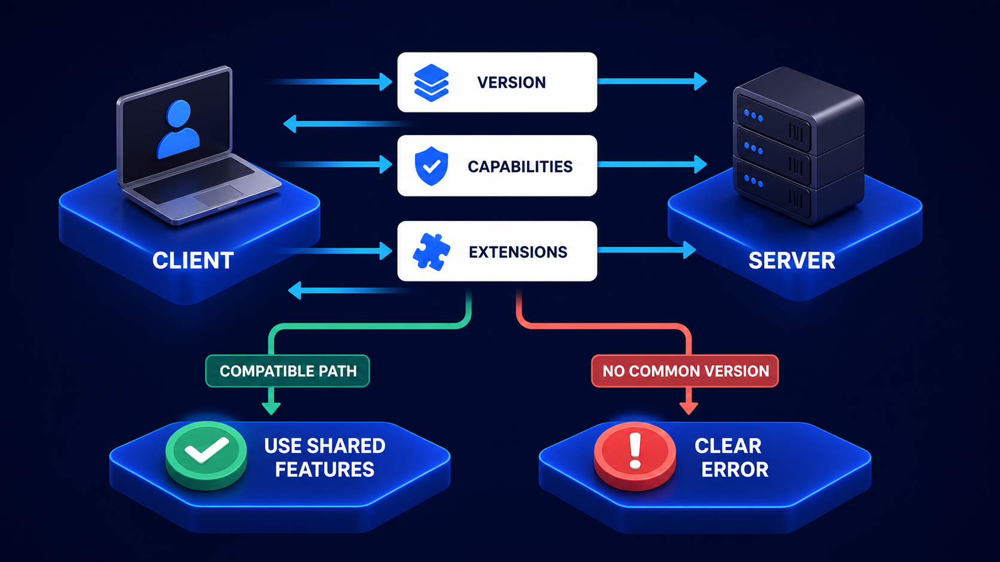

# Diagram 81 — Stateless HTTP Routing

**Module:** MCP at scale
**Role in the course:** why a self-contained request lets any server answer
**Layout:** a request with headers into a router, fanning to three interchangeable servers, with two crossed-out patterns beneath

---

## At a glance

A request carrying **VERSION, CLIENT INFO, CAPABILITIES** in its body and **MCP-METHOD, MCP-NAME** in its headers reaches a router, which sends it to **any of three interchangeable servers**.

Beneath, struck through in red: **SESSION STORE** and **STICKY ROUTING**.

Those two crossed-out boxes are the diagram's subject. Everything above them exists to make them unnecessary.

---

## What the diagram teaches

### 1. Three things in the body make the request self-describing

**VERSION** — which protocol revision this request is written against. Carried per request, not agreed once.

**CLIENT INFO** — who is asking. Identity asserted on this message.

**CAPABILITIES** — what the client can handle. The server needs this to shape its response, and it needs it every time because it remembers nothing.

Together these are the negotiated context from the previous diagram, **re-supplied on every call** rather than established once and held.

That is the trade. You send a few hundred extra bytes per request. You get a fleet that can be scaled, restarted and rebalanced with no request noticing.

The three fields are the negotiation triad, re-supplied rather than remembered:

That diagram deliberately contains no session box. This one shows why: the outcome of negotiation is knowledge the client holds and re-sends, not a connection the server maintains.

### 2. Two things in the headers make the request routable

**MCP-METHOD** and **MCP-NAME** sit above the request card, connected by dashed lines — they belong to the request, and they are outside its body.

That placement is what lets the router work. It can dispatch on two string values without deserialising the payload.

The security consequence is the one worth stating: a router that must parse the body to route is a router that deserialises attacker-controlled input before making any decision about it. Headers keep the cheap decisions cheap and the parser behind the gate.

### 3. Three servers, and their interchangeability is the whole point

**MCP SERVER 1, 2, 3** — drawn identically, on identical platforms, at equal distance from the router.

Nothing distinguishes them. The router's four outward arrows say it can send to any of them.

That interchangeability is what a self-contained request buys. Because the request carries its version, identity and capabilities, no server needs prior knowledge of this client. Server 2 can answer a request whose predecessor was answered by server 1, with no coordination between them.

### 4. The green dashed returns are per-server and independent

Each server sends a **green dashed arrow** back to the router.

Dashed because it is a return path. Green rather than teal here, distinguishing the response from the forward request more strongly than usual.

Independent because each response stands alone. There is no accumulated conversation to be consistent with.

### 5. SESSION STORE is crossed out, and what it would have held is the argument

A session store is where a stateful implementation keeps what it learned about a client: negotiated version, resolved identity, permissions, any mode the client set.

Crossing it out asserts that none of that needs to be kept, because all of it arrives on every request.

The costs it eliminates are worth enumerating:

**A shared dependency.** Every server reads it on every request. It becomes a latency floor and a single point of failure.

**A consistency problem.** Session data written by one server and read by another must be consistent, which means either strong consistency (slow) or a class of bugs where a server reads stale session state.

**A lifecycle problem.** Sessions expire. Expiry is a source of bugs that only appear under specific timing.

**A security problem.** Permissions resolved into a session are permissions that do not reflect a revocation until the session ends.

### 6. STICKY ROUTING is crossed out, and it is the more insidious one

Sticky routing sends a client's requests to the same server every time, so that server-local state remains valid.

It is more insidious than a session store because it looks like an infrastructure setting rather than an architectural decision. Somebody enables session affinity on a load balancer, and the system quietly acquires a dependency on it.

What it costs:

**Uneven load.** A heavy client pins load to one instance.

**Deploy sensitivity.** Removing an instance drops everything affinitised to it.

**Scaling that does not work.** Adding instances does not help existing clients, only new ones.

**Invisible coupling.** Nothing in the code says "this requires affinity." It works until affinity is removed, and then it fails in ways nobody connects to a load balancer change.

That last property is what makes it dangerous. A session store is at least visible in the code.

---

## Case study — Marlborough Data, the load balancer setting nobody remembered

Marlborough provides a document-processing platform with an MCP layer used by about 200 enterprise customers.

Their platform ran on eight instances. It worked. Nobody had thought hard about why.

### The change

A platform engineer, cleaning up infrastructure configuration, found session affinity enabled on the load balancer fronting the MCP servers. There was no comment explaining it, no ticket referencing it, and the engineer who had enabled it had left two years earlier.

It looked like leftover configuration from an older architecture. Testing in staging showed no difference. It was removed on a Tuesday afternoon.

### What happened

Within twenty minutes, roughly 15% of MCP requests began failing with errors indicating an unknown client.

The cause: their server implementation performed identity resolution on the first request from a client and **cached the resolved principal in process memory**, keyed by a client-supplied identifier.

Subsequent requests carried only the identifier. Without affinity, they landed on instances that had never seen the client and had nothing cached.

Nobody had known this. The caching had been added as a performance optimisation, in a pull request titled "reduce auth lookups," reviewed and merged without anyone connecting it to the affinity setting that made it work.

### The wider audit

Restoring affinity took four minutes. The audit that followed took three weeks and found **four** pieces of in-process state that the fleet depended on.

**Resolved identity cache.** The one that broke. Keyed by client identifier, held for the process lifetime.

**Negotiated version.** The server recorded the version a client had declared on its first request and applied it to subsequent requests that omitted it. Their own client always sent it; a third-party client did not, and had been relying on this.

**Capability catalogue per client.** Computed once, cached in process. A permission change did not take effect until the client happened to hit a different instance — which, under affinity, could be never.

**An active-workspace setting.** A client could set a working context and then issue requests against it. Pure session state, added eighteen months earlier, used by one internal tool.

The third one was the serious finding. A revoked permission remained effective indefinitely for as long as a client stayed affinitised to the same instance. They found one case where a contractor's access had been revoked eleven days before it stopped working.

### The rebuild

**Identity resolved per request.** Cost: about 4ms. They measured it and accepted it.

**Version required on every request.** The third-party client was given six weeks' notice and a clear error. It complied in nine days.

**Capabilities computed per request**, from the identity resolved on that request. This is what made revocation immediate.

**The active-workspace feature was removed** and replaced with an explicit workspace parameter on each request. The internal tool was updated in an afternoon.

**Affinity was removed permanently, and a test asserts its absence.** Their staging environment now deliberately round-robins with no affinity, and their integration suite runs against a three-instance fleet. Any new in-process state that requests depend on fails immediately.

### The test that catches it now

The most valuable thing they added was not a fix but a **detector**: a staging configuration where consecutive requests from the same client are guaranteed to land on different instances.

Any dependency on server-local state fails on the second request. It has caught two regressions since, both in-process caches added for performance.

### Results

- **In-process state dependencies:** 4 found, 4 eliminated.
- **Permission revocation latency:** up to indefinite → immediate.
- **Cost of per-request identity resolution:** ~4ms.
- **Affinity-dependent regressions caught in staging since:** 2.
- **Instances:** 8 → 23 over the following year, with no further work.

### The line in their engineering standards

*If a request needs something the server learned from a previous request, the request is broken. Test it by making sure it never lands on the same instance twice.*

---

## Composition

A left-to-right flow with a fan-out on the right and two crossed-out patterns at lower left.

**HTTP CLIENT** (laptop) → **MCP REQUEST** (white card) → **ROUTER** (blue cube) → **MCP SERVER 1 / 2 / 3**.

Above the request card, two outlined boxes — **MCP-METHOD** and **MCP-NAME** — connected downward by short dashed blue lines.

**Blue solid arrows** run from the router to each server; **green dashed arrows** return from each server to the router.

At lower left, two greyed-out platforms — a **database stack** labelled **SESSION STORE** and a **node-network disc** labelled **STICKY ROUTING** — each struck through with a large **red cross**, their labels in coral.

## Element by element

**HTTP CLIENT** — a laptop showing blue content blocks.

**MCP REQUEST** — a large white card headed **MCP REQUEST**, listing three rows with blue square icons: **VERSION** (`</>`), **CLIENT INFO** (person), **CAPABILITIES** (cube).

**MCP-METHOD / MCP-NAME** — two blue-outlined header boxes above the card, joined to it by dashed lines.

**ROUTER** — a blue rounded cube with four white arrows radiating outward.

**MCP SERVER 1 / 2 / 3** — three identical white server units on blue platforms, arranged vertically at the right.

**SESSION STORE** — a desaturated database stack, struck through in red, labelled in coral.

**STICKY ROUTING** — a desaturated node-network disc, struck through in red, labelled in coral.

## Colour and flow semantics

- **Blue arrows** carry the request forward and out to the servers.
- **Green dashed arrows** carry each server's response back, independent of the others.
- **Dashed blue lines** attach the two headers to the request without implying flow.
- **Red crosses and coral labels** mark the two patterns that are not needed — the only coral in the diagram.
- The **three identical servers** are drawn without distinguishing features, which is the interchangeability claim.

## How to present it

**Ask what a server needs to know that it cannot learn from the request.** The honest answer should be nothing. Then ask what their own servers actually hold.

**Read the three body fields and the two headers.** Body carries context; headers carry routing. Then ask why method and name are outside the body — a router that parses the body deserialises attacker-controlled input before deciding anything.

**Point at the three identical servers.** Nothing distinguishes them. Ask what has to be true of a request for that to work.

**Ask which of the two crossed-out boxes is more dangerous.** Most say the session store. Argue for sticky routing: it is an infrastructure setting, not code, so nothing in the codebase declares the dependency. It works until somebody removes it.

**Tell the Marlborough Tuesday.** An engineer removing configuration with no comment and no ticket, and 15% of requests failing twenty minutes later. Then the cause: an in-process identity cache added in a pull request titled "reduce auth lookups."

**Walk the four dependencies the audit found.** Identity cache, negotiated version, capability catalogue, active workspace. Ask which the room would have found in their own system.

**Dwell on the capability cache finding.** A revoked permission that remained effective for eleven days because the client stayed on the same instance. Under affinity, "until they hit a different instance" can mean never.

**Give them the detector, not just the fix.** A staging configuration where consecutive requests never land on the same instance. Any dependency on server-local state fails on request two. Marlborough's has caught two regressions since.

**Close on the standard.** *If a request needs something the server learned from a previous request, the request is broken.*

**Timing.** Twenty minutes. Twenty-five if the room audits what their own servers hold in process, which usually finds a performance cache nobody connected to affinity.

---

## Lab and checkpoint

**Lab:** Audit one server your system uses. List everything it holds in process or in an in-memory cache between requests. For each item, write whether it can be derived from the request instead. If it cannot, write the dependency and the test that would fail if consecutive requests land on different instances.

**Checkpoint:** Why is sticky routing more dangerous than a session store?

**Answer:** Because sticky routing is an infrastructure setting, not code, so no codebase declares the dependency. It works until someone removes the setting. A session store is at least visible as a deliberate architecture choice; sticky routing can be changed by accident.

## Glossary

- **Affinity** — the load-balancer feature that sends a client to the same server repeatedly.
- **Crossed-out boxes** — the session store and sticky routing, both rejected in a stateless design.
- **Headers** — the metadata that lets infrastructure route and authorise a request without reading the body.
- **Request body** — the payload that carries the self-describing context of the call.
- **Routable** — a request that can be directed to any server without prior setup.
- **Self-describing** — a request that contains everything the server needs to handle it.
- **Server-local state** — data held in one server's memory, which breaks interchangeability.
- **Session store** — a server-side cache of previous request state.
- **Sticky routing** — load balancer affinity that hides a server's dependency on previous requests.

## Sources

- Stateless HTTP routing and self-describing requests
- Load balancing and affinity anti-patterns
- Server-side caching and revocation in distributed systems
