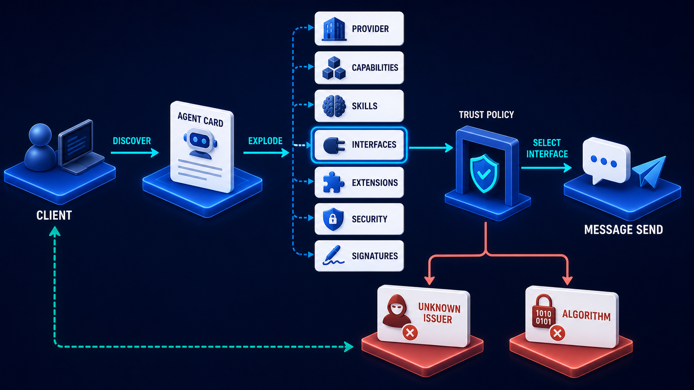

# Diagram 82 — Server Discovery and Negotiation

**Module:** MCP at scale
**Role in the course:** what a client learns once and what it must send every time
**Layout:** two paths from one client converging on one validation stage

---

## At a glance

Two routes from the same client. The upper one **discovers** a server card describing what the server offers. The lower one sends a **direct request** carrying per-request metadata.

Both converge on **VALIDATION**, and a teal line returns to the client.

The two paths answer two different questions. Discovery asks *what can this server do?* A request asks *may I do this, now?* Both are needed, and neither substitutes for the other.

---

## What the diagram teaches

### 1. The server card carries four things, and they are not interchangeable

**VERSION** (tag icon) — which protocol revision this server implements.

**CAPABILITIES** (grid icon) — which core features it offers.

**EXTENSIONS** (puzzle icon) — which optional additions it supports.

**ENDPOINT INFO** (location pin) — where to reach it, and how.

The first three are the negotiation triad from earlier in the volume, now published by the server as a document rather than exchanged message by message. The fourth is new and practical: a card that describes capabilities without saying where to invoke them is incomplete.

### 2. Discovery is episodic; the direct request is per-call

The two paths differ in frequency, and the diagram's parallel arrangement makes that easy to miss.

**Discovery happens occasionally.** On first contact, on a schedule, when a cached card expires, or when something suggests the card is stale. The result is held by the client.

**A direct request happens every time.** It carries the metadata that must accompany this specific call — identity, scope, correlation.

Conflating them produces two errors. A client that re-discovers on every call wastes an enormous amount of traffic. A client that treats a discovered card as permission to skip per-request metadata has built a session.

### 3. Both paths reach the same validation, and that is the structural claim

The upper path and the lower path both terminate at the **VALIDATION** shield.

Discovery is not exempt from validation. A server card is a claim, and a claim must be checked before it is acted on — is the version one we support, are the declared endpoints ones we are willing to reach, is the card signed by an issuer we accept.

A client that validates requests but accepts discovery output uncritically has an unguarded input path.

### 4. Per-request metadata is what makes the discovered card usable safely

The lower card is labelled **PER-REQUEST METADATA** and carries a person icon.

The relationship between the two paths: **discovery tells you what is possible; per-request metadata establishes what is permitted for this caller on this call.**

A capability appearing in a server card does not mean this client may invoke it. The card describes the server's surface, not this caller's entitlements. That determination happens per request, which is why the lower path exists at all.

### 5. The single return path means the client learns from both

One **teal line** runs from validation along the base back to the client.

Both paths produce something the client holds: discovery produces a validated card; a request produces a result. Both flow back through the same route.

The consequence worth drawing out: **a request outcome can invalidate a discovered card.** A capability refused as unknown is evidence the card is stale, and the correct response is to re-discover before continuing.

That is the feedback loop the single return path implies, and it is the mechanism that keeps a cached card honest between scheduled refreshes.

### 6. Endpoint info in the card is a trust decision, not just a convenience

The location pin is easy to skim past and it carries risk.

A server card that says "invoke my tools at this address" is asking the client to send requests somewhere the card specifies. If a client follows that without validation, a compromised or spoofed card redirects traffic.

Validation must therefore include the endpoint: is this address one we expect, within a domain we trust, matching the identity that signed the card.

This is the same reasoning that applies to agent cards in A2A, where the trust policy stage exists for exactly this purpose:

---

## Case study — Thornleigh Platform, the card that pointed somewhere else

Thornleigh operates a marketplace where enterprise customers connect third-party capability servers to their agent workspaces. About 340 servers are registered, from roughly 90 vendors.

Discovery is central to how it works: a customer registers a server URL, Thornleigh fetches its card, and the capabilities appear in the customer's workspace.

### The finding

A security review asked what would happen if a registered server's card declared endpoints on a different host from the card itself.

Nobody had considered it. Thornleigh fetched the card from the registered URL and then invoked capabilities at whatever addresses the card's endpoint info specified.

The reviewer demonstrated the consequence with a test server. Its card was served from a legitimate-looking domain, and its endpoint info pointed at a completely unrelated host.

Thornleigh's platform dutifully sent tool invocations — carrying customer identity and request payloads — to the unrelated host.

No customer had been affected. The capability existed and had never been exercised maliciously.

### Why it had been built that way

Reasonably, as these things usually are. Vendors legitimately serve their card from a documentation domain and their API from an API domain. Requiring them to match would have broken about a third of registered servers.

The mistake was not allowing a difference. It was allowing an **unvalidated** difference.

### The rebuild

**Discovery output became a validated input.** Fetching a card is now followed by a validation stage with four checks:

*Version* — within the range Thornleigh supports. A card declaring an unsupported revision is rejected at registration rather than producing failures later.

*Signature* — the card is signed, and the signature chains to an issuer on Thornleigh's accepted list.

*Endpoint* — every declared endpoint must be within a domain the vendor has verified ownership of, through the same process used to register the server. Cross-domain endpoints are permitted; unverified ones are not.

*Declared surface* — capabilities and extensions must be well-formed and must not exceed what the vendor's registration permits.

**Endpoint verification became part of vendor onboarding.** A vendor registers the domains they will serve from and proves control of each. A card declaring an endpoint outside that set fails validation, and the vendor is notified.

**Card freshness got a policy.** Cards are re-fetched daily and re-validated. A card that changes materially — new capabilities, changed endpoints, changed security posture — suspends the server pending review rather than silently taking effect.

That suspension has fired 23 times in a year. Twenty-one were legitimate vendor updates approved within a day. Two were endpoint changes to unverified domains, both vendor misconfigurations, both caught before any traffic was sent.

**Refusals trigger re-discovery.** A capability invocation returning unknown-capability now causes an immediate card re-fetch before the next attempt. This closed a class of stale-card problems where a vendor had removed a capability and Thornleigh kept offering it for up to a day.

### The per-request half

The review also found that Thornleigh had been relying on discovery for something it should not have.

Their platform had been treating a capability's presence in a validated card as sufficient authority to invoke it on a customer's behalf.

**It is not.** The card says the server offers the capability. Whether *this customer* may invoke it is a separate question, answered by the entitlement attached to the request.

They had a case where a customer on a lower tier could invoke a capability their subscription did not include, because the capability was in the card and nothing checked the entitlement per call.

Per-request metadata now carries the customer's tier and entitlement scope, and the invocation is authorised against it. The card's contents are advisory about what exists; the request's metadata determines what is permitted.

### Results

- **Servers with unverified endpoints:** 11 found at rebuild, all vendor misconfigurations, all corrected.
- **Card changes caught by suspension:** 23 in a year, 2 of them endpoint problems.
- **Stale-card capability offers:** eliminated by refusal-triggered re-discovery.
- **Entitlement bypass:** 1 class found and closed.

### The line in their vendor documentation

*Your card tells us what exists. It does not tell us what any particular customer may use, and we will not treat it as if it did.*

---

## Composition

Two paths from a single client, converging on one validation stage, with a return along the base.

**Upper path:** **CLIENT** → labelled arrow **SERVER DISCOVER** → a blue platform holding a **magnifying glass**, labelled **SERVER DISCOVER** → labelled arrow **RECEIVE SERVER CARD** → a large white **SERVER CARD** → down into **VALIDATION**.

**Lower path:** **CLIENT** → labelled arrow **DIRECT REQUEST** → a white **PER-REQUEST METADATA** card → into **VALIDATION**.

**VALIDATION** — a blue shield with a white check on a blue platform at the right.

**Return:** a **teal line** from validation down and left along the base of the frame, turning up into the client.

## Element by element

**CLIENT** — a blue person figure on a blue platform.

**SERVER DISCOVER** — a blue platform carrying a large blue **magnifying glass**.

**SERVER CARD** — a large white card headed **SERVER CARD**, listing four rows with blue icons: a **tag** and **VERSION**; a **grid** and **CAPABILITIES**; a **puzzle piece** and **EXTENSIONS**; a **location pin** and **ENDPOINT INFO**.

**PER-REQUEST METADATA** — a white card with a blue document-and-person icon and text lines.

**VALIDATION** — a large blue shield containing a white check.

## Colour and flow semantics

- **Cyan arrows** carry both paths forward and into validation.
- A **teal line** carries the outcome back to the client along the base, serving both paths.
- The **two paths are drawn at different heights** but converge, marking them as different in frequency and identical in scrutiny.
- **Blue icons** on the server card distinguish its four sections without colour-coding them by importance.
- No coral appears — this diagram describes structure, and the failures it prevents happen off-picture.

## How to present it

**Ask what a client learns once and what it must send every time.** Most rooms can name the first and are vaguer on the second. The two paths are the answer.

**Read the four card fields and ask which is the risky one.** Version, capabilities, extensions, endpoint. **Endpoint** — because following it means sending traffic where the card says.

**Tell the Thornleigh finding.** A card served from a legitimate domain, endpoints pointing elsewhere, and the platform obligingly sending customer identity and payloads to an unrelated host.

**Make the distinction carefully.** The mistake was not allowing cross-domain endpoints — a third of vendors legitimately need them. It was allowing *unvalidated* ones. Ask the room where else they accept a value that determines where traffic goes.

**Point out that both paths reach validation.** Discovery output is an input like any other. A client that validates requests and trusts discovery has an unguarded path.

**Ask the entitlement question.** Does a capability appearing in a validated card mean this caller may invoke it? No. The card describes the server's surface; the request's metadata determines permission. Thornleigh had a tier-bypass from exactly this conflation.

**Trace the return line and ask what it implies.** A refusal is evidence the card is stale. Thornleigh's refusal-triggered re-discovery closed a class of problems where a removed capability was still being offered for up to a day.

**Ask about card freshness policy.** Daily re-fetch, material change suspends pending review. Thornleigh's fired 23 times in a year, catching two endpoint misconfigurations before traffic was sent.

**Timing.** Twenty minutes. Twenty-five if you work out what validating a server card would require in the room's own system.

---

## Lab and checkpoint

**Lab:** Design a server card validation rule for one of your integrations. The rule must check version, capabilities, extensions, and endpoint for a known good party. Then write the per-request metadata check that decides whether a caller may invoke a discovered capability. Define the card freshness policy and the re-discovery trigger.

**Checkpoint:** Why is the endpoint field the riskiest in a server card?

**Answer:** Because following an endpoint means sending traffic to the address it specifies. A card from a legitimate domain with endpoints pointing elsewhere can cause the client to send identity and payloads to an unrelated or malicious host if the endpoint is not validated.

## Glossary

- **Capability** — a function the server supports.
- **Direct request** — the per-call path where the client already knows the server.
- **Discovery** — the episodic process where the client learns about a server.
- **Endpoint** — the address the client sends traffic to.
- **Entitlement** — the caller-specific permission to invoke a capability.
- **Extension** — an optional addition to the server's surface.
- **Per-request metadata** — the caller identity and context sent with every call.
- **Server card** — the record returned by discovery that describes the server.
- **Validation** — the check that the card and the request are trustworthy and permitted.

## Sources

- MCP and A2A discovery and server card validation
- Endpoint validation and cross-domain security
- Capability entitlement and per-request authorization
