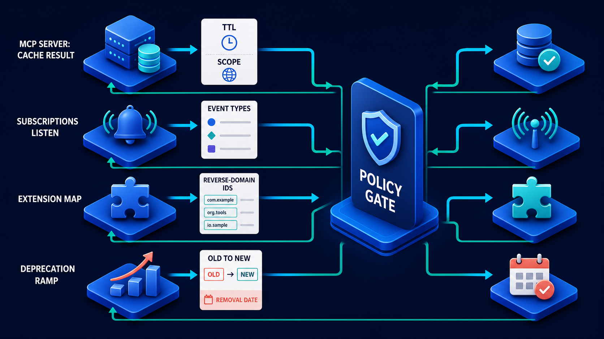

# Diagram 83 — MCP Primitives at Catalogue Scale

![An MCP SERVER on dark navy branches right to three platforms — TOOLS with a toolbox leading to an EXECUTE card, RESOURCES with a folder leading to a READ CONTEXT card, and PROMPTS with speech bubbles leading to a REUSABLE TEMPLATE card — each with teal arrows returning to the server. Along the bottom, a separate row runs CATALOG with a book, SEARCH with a magnifier, FILTER with a funnel, PAGE with a document, and CLIENT with a monitor, connected by teal arrows, with two teal arrows rising into the MCP server.](../diagrams/83-mcp-primitives-catalog-scale.png)

**Module:** MCP at scale
**Role in the course:** three primitives, and how to serve a catalogue too large to list
**Layout:** three primitive branches above, a catalogue access pipeline below

---

## At a glance

The top half restates the three primitives with their verbs: **TOOLS → EXECUTE**, **RESOURCES → READ CONTEXT**, **PROMPTS → REUSABLE TEMPLATE**.

The bottom half is the new material: **CATALOG → SEARCH → FILTER → PAGE → CLIENT**.

That lower pipeline exists because the obvious approach — return everything — stops working somewhere between fifty and a few hundred entries, and every production server crosses that line eventually.

---

## What the diagram teaches

### 1. Three primitives, three verbs, and the verbs are the definitions

**TOOLS → EXECUTE.** Something happens. There may be effects.

**RESOURCES → READ CONTEXT.** Addressable content is fetched. Nothing changes.

**PROMPTS → REUSABLE TEMPLATE.** A pre-built way of asking, supplied by the server because the server knows its own domain.

Pairing each primitive with a verb rather than a description is what makes the distinction operational. Asked whether something is a tool or a resource, the question becomes: does calling it *execute* something, or does it *read context*?

### 2. All three return to the server, and the teal arrows say the server owns them

Each primitive branch has a **teal arrow returning to the MCP SERVER**.

The primitives are not three separate services. They are three faces of one server's catalogue, and the server is what a client talks to.

That matters for the lower pipeline: search, filter and paging apply across the catalogue as a whole, not separately per primitive type.

### 3. The catalogue pipeline exists because listing everything stops working

**CATALOG → SEARCH → FILTER → PAGE → CLIENT.**

Four stages between a catalogue and a client, and each solves a different problem with returning the whole thing.

**SEARCH** — the client does not know what it is looking for by name. It has an intent. Search turns "something that can check a customer's credit" into candidate entries.

**FILTER** — not everything in the catalogue is available to this caller. Filtering applies permission, environment and status.

**PAGE** — even after search and filter, the result may be large. Paging bounds the response.

**CLIENT** — receives a bounded, relevant, permitted subset.

### 4. Filter must come before page, and the ordering is a security requirement

The order in the diagram is search, then filter, then page. The middle position of **FILTER** is not arbitrary.

If paging happened before filtering, a page would be assembled from the unfiltered set and then have entries removed — producing pages of inconsistent size, and, more seriously, letting a caller infer the existence of entries they cannot see by observing the gaps.

This is the same reasoning that puts permission filtering before search rather than after it in a retrieval pipeline. **What a caller may not see should not influence what they receive**, including its shape.

### 5. Paging a catalogue creates a consistency problem the diagram does not draw

Worth naming when teaching, because it bites in production.

A catalogue can change between page one and page three. An entry added, removed, or renamed mid-traversal produces a client that sees an entry twice or misses one entirely.

Two standard resolutions: a stable cursor that snapshots the result set, or a version stamp that lets the client detect that the catalogue changed and restart.

Neither is free, and choosing neither means accepting occasional silent inconsistency in what a client believes the server offers.

### 6. A large catalogue is itself a design smell worth examining

The pipeline solves the symptom. The underlying question is why a server offers hundreds of entries.

Sometimes the answer is legitimate — a resource catalogue over a document corpus is naturally large.

Sometimes it means the server has accreted tools that should have been consolidated, or has exposed one tool per parameter combination, or is serving several unrelated domains from one endpoint.

A catalogue that needs search because a human cannot comprehend it may need splitting rather than searching.

### 7. Search and filter results are cacheable, with the usual caveat

Because catalogue contents change slowly, results are worth caching. Because filtering is per-caller, **the cache key must include the caller**.

A catalogue response cached by server URL and served across callers tells one caller about entries another caller can see. Which is why cache policy carries two values rather than one:

The **SCOPE** half of that cache card is what a catalogue needs. TTL alone tells a client how long to hold a response; scope tells it who the response was for.

---

## Case study — Halvorsen Industrial, the catalogue with 1,400 entries

Halvorsen manufactures process equipment for chemical and food production. Their MCP layer exposes their equipment documentation, parts catalogue, service procedures and diagnostic tools to field engineers' assistants.

The resource catalogue holds about 1,400 entries. The tool catalogue holds 60. The prompt catalogue holds 14.

### What broke first

Their initial implementation returned the full catalogue on a list request.

At 1,400 entries with metadata, the response was roughly 2.3 MB. It took about 4 seconds to generate and 6 to transfer over a field engineer's mobile connection.

Assistants requested it at session start. Field engineers, who typically work in short sessions between jobs, spent ten seconds of every session waiting for a catalogue they would use two entries from.

### The first fix, which was wrong

They added paging. 1,400 entries in pages of 50.

This made the first response fast and the overall experience worse. Clients that needed to know what existed now made 28 requests instead of 1. Total transfer was unchanged and total time increased.

The mistake was solving response size without solving relevance. Paging bounds a response; it does not reduce what a client needs.

### The rebuild as the full pipeline

**SEARCH.** Clients no longer ask for the catalogue. They ask for entries matching an intent — "torque specification for compressor model 4400" — and receive candidates.

This required the catalogue to be searchable, which meant indexing entry names, descriptions and equipment applicability. The index is small; the win was large.

Typical response: 8 entries instead of 1,400.

**FILTER.** Halvorsen's catalogue is not uniformly available. Some procedures apply only to equipment a customer owns. Some diagnostic tools require a service contract. Some documents are export-controlled and unavailable in certain jurisdictions.

Filtering applies the caller's entitlements, their customer's equipment list, and their jurisdiction.

**PAGE.** Applied after filtering, with a stable cursor. Pages of 25. Most searches return one page.

**The ordering incident.** Their first implementation of the full pipeline had filter *after* page, and it produced exactly the inference problem.

A field engineer searching for a procedure received a page with 25 slots, of which 19 were populated. The six gaps corresponded to export-controlled documents they were not permitted to see.

The gaps were consistent and countable. A caller could establish how many controlled documents existed for a given equipment model by counting gaps across pages — which for export-controlled material is itself a disclosure.

Moving filter before page fixed it. Pages are now uniformly full until the last one.

### The consistency problem they hit

Their catalogue is updated nightly. A field engineer paging through results during the update window could see an entry twice or miss one.

They implemented a **stable cursor**: the first page of a search snapshots the result set for fifteen minutes, and subsequent pages read from that snapshot. A cursor older than fifteen minutes returns a specific error telling the client to re-search.

Fifteen minutes was chosen from their actual usage: 98% of paging sessions complete within four minutes.

### The catalogue-size question

Their review also asked whether 60 tools was the right number.

It was not. Auditing the tool catalogue found **19 tools that were parameter variants of each other** — `get_torque_spec_metric`, `get_torque_spec_imperial`, `get_torque_spec_metric_hightemp`, and so on.

Consolidating them into 6 tools with proper parameters reduced the tool catalogue from 60 to 47, and — the effect nobody predicted — measurably improved the assistant's tool selection, because it was no longer choosing between nineteen near-identical options.

### Results

- **Session-start catalogue transfer:** 2.3 MB → none. Clients search instead.
- **Typical search response:** 8 entries.
- **Time to first useful result:** ~10 seconds → under 1.
- **Export-controlled inference:** possible → eliminated by filter-before-page.
- **Tool catalogue:** 60 → 47, with better selection accuracy.

### The line in their server implementation notes

*A client that asks for your whole catalogue is telling you your catalogue is not searchable. Fix the search, not the page size.*

---

## Composition

Two horizontal groups, upper and lower, joined by teal arrows rising from the lower into the upper.

**Upper:** **MCP SERVER** (dark server unit on a blue platform) with three cyan branches to the right:
- **TOOLS** (blue toolbox) → cyan arrow → white card reading **EXECUTE**
- **RESOURCES** (blue folder) → cyan arrow → white card reading **READ CONTEXT**
- **PROMPTS** (blue speech bubbles) → cyan arrow → white card reading **REUSABLE TEMPLATE**

**Teal arrows** return from each primitive platform to the MCP server.

**Lower:** a left-to-right row connected by **teal arrows** — **CATALOG** (blue book), **SEARCH** (magnifier), **FILTER** (funnel), **PAGE** (document), **CLIENT** (monitor with a person).

**Two teal arrows** rise from the lower row into the base of the MCP server platform.

## Element by element

**MCP SERVER** — a dark server unit with blue indicator lights on a blue platform.

**TOOLS** — a blue toolbox with a metal handle. Paired card: **EXECUTE** (document with a blue check).

**RESOURCES** — a blue folder with white document pages. Paired card: **READ CONTEXT** (document with a magnifier).

**PROMPTS** — blue speech bubbles with dots. Paired card: **REUSABLE TEMPLATE** (document with a grid).

**CATALOG** — a blue closed book with a bookmark.
**SEARCH** — a blue magnifying glass.
**FILTER** — a blue funnel.
**PAGE** — a white document.
**CLIENT** — a blue monitor showing a person glyph.

## Colour and flow semantics

- **Cyan arrows** carry the primitive branches outward from the server to their verb cards.
- **Teal arrows** carry returns to the server and drive the entire lower pipeline.
- The **lower row is entirely teal**, marking it as an access path rather than a capability declaration.
- The **two rising teal arrows** connect the catalogue pipeline back into the server, showing it operates over the server's own primitives.
- No coral appears; the failures this diagram prevents are performance and disclosure problems that occur off-picture.

## How to present it

**Read the three verb pairings.** Tools execute, resources read context, prompts supply reusable templates. Then pose the test: does calling it execute something, or read context?

**Ask how big their catalogue is.** Then ask what their list response returns. If the answer is everything, ask what happens at ten times the size.

**Tell the Halvorsen first fix.** Paging alone turned one 6-second response into 28 requests with the same total transfer. Paging bounds a response; it does not reduce what a client needs. Search does.

**Walk the four stages and ask what each solves.** Search solves relevance, filter solves permission, paging solves size. Then ask what happens if you only implement one.

**Ask why filter sits before page.** Push until someone reaches the inference problem. Then give them the export-controlled example: 19 populated slots in a page of 25, gaps that are consistent and countable.

**Raise the consistency problem the diagram omits.** A catalogue that changes between page one and page three. Stable cursor or version stamp — and choosing neither means accepting silent inconsistency.

**Ask the uncomfortable question.** Why does the catalogue have hundreds of entries? Halvorsen found 19 tools that were parameter variants of six. Consolidating them improved tool selection, because the assistant stopped choosing between near-identical options.

**Mention cache scope.** Catalogue results are worth caching and must be keyed by caller, because filtering is per-caller. A catalogue cached by URL tells one caller about another's entries.

**Timing.** Twenty minutes. Thirty if you audit a real tool catalogue for parameter variants, which usually finds several.

---

## Lab and checkpoint

**Lab:** Inventory one real capability catalogue. Count the entries and identify any parameter variants that could be consolidated. Design the catalogue pipeline: search, filter, page, with a stable cursor or version stamp. Define the cache key and why it must include caller identity.

**Checkpoint:** Why must filter come before page?

**Answer:** Because paging a filtered-but-not-searched list can reveal information through gaps. If the server filters by permission after returning pages, the client can count entries and infer what is hidden. Filtering first means only permitted items exist in the result, so page gaps do not leak.

## Glossary

- **Catalogue** — the list of capabilities a server offers.
- **Filter** — the permission-aware step that removes entries the caller may not see.
- **Page** — the step that bounds a large result into smaller responses.
- **Paging cursor** — a stable marker that lets a client fetch the next page consistently.
- **Permission** — the rule that decides which catalogue entries a caller may see.
- **Prompt** — a reusable template for how to ask a question.
- **Resource** — a read-only, addressable context object.
- **Search** — the step that finds relevant entries by query.
- **Stable cursor** — a cursor that remains valid even if the catalogue changes.
- **Tool** — an action that the agent can execute.

## Sources

- MCP primitives and catalogue design
- Pagination, filtering, and cursor stability
- Capability catalogue consolidation and cache scoping
